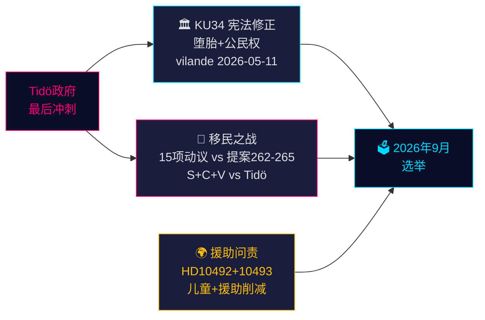

# 瑞典的宪法时刻与选举前政策冲刺 — 晚间情报简报，2026年5月14日

**作者**: James Pether Sörling  
**日期**: 2026-05-14  
**分类**: 公开 | **Admiralty**: B2（可靠；可能属实）  
**可信度**: 事实报道高；选举预测中等  
**选举临近度**: ≤6个月（2026年9月）— DIW乘数1.5×已激活

---

## 摘要

2026年5月14日的瑞典议会记录由三场交叉危机所定义，这些危机将塑造九月大选的格局：一项历史性的宪法修正案套件（*vilande*），保护堕胎权并允许撤销公民身份（KU34）；Tidö联合政府与协调一致的S+C+V反对党集团之间的移民政策对抗，争议四项移民提案；以及一场关于损害儿童的开发援助削减的部长问责危机。这些问题共同构成2026年选举的政治战场——政府今日的选择将在127天后的投票箱中接受检验。

---

## 本文支持的决策

1. **宪法跟踪**：KU34的*vilande*通过能否在选后成分变化后存活？（65%基准情景：是，若当前联合政府存续；20%部分；15%失败）
2. **移民法律风险**：法律/合规团队是否应为HD03267（安全驱逐出境）面临欧洲人权法院挑战以及Lagrådet对第265号提案（拘留儿童）的审查做好准备？
3. **官方发展援助问责风险**：Dousa部长对HD10492（截止日期2026-05-29）的答复将如何影响政府在选前人权方面的公信力？

---

## 60秒情报要点

- 🏛️ **宪法修正**（KU34）：*vilande*于2026年5月11日通过 — 瑞典宪法现正走向保护堕胎权并允许撤销帮派成员公民身份。2026年9月大选后需进行二读。历史性——自2010–2011年以来最重要的宪法变革。
- 🛂 **移民之战**：2026年5月13日，S、C、V提交15项反对政府移民提案262–265的在野动议。政府拥有176/349席——通过可能，但第265号提案（拘留儿童）存在Lagrådet《儿童权利公约》第37条风险及政府可能作出让步。
- 🌍 **官发援助问责**：V质询HD10492–10493要求Dousa解释，为何在瑞典有史以来规模最大的官方发展援助重组前未进行*barnkonsekvensanalys*，该重组关闭了冲突地区营养不良儿童和产妇医疗项目。
- 💻 **政府冲刺**：三项提案（HD03250数字身份证、HD03261 Skatteverket、HD03267安全驱逐出境）构成Tidö政府选前最终治理声明。预计均在九月前颁布。
- 📊 **经济背景**：瑞典GDP增长+1.1%（2025年），据国际货币基金组织2026年4月世界经济展望预测+2.0%（2026年）。公共债务占GDP的35.9% ——财政保守基准，支撑政府的能力叙事。

---

## 最重要的前瞻性触发因素

**⚠️ 关键关注 — 2026-05-29**：Dousa对HD10492关于儿童和发展援助的答复。这一单一部长答复将或：（a）若采取防御姿态，引发选前重大问责危机，或（b）以可信的Sida评估授权化解非政府组织压力。当前实质性承诺的概率：**低（20%）**。

---

## 可信度摘要

| 领域 | 可信度 | 依据 |
|------|--------|------|
| KU34宪法结果 | 中等 | 二读要求；选后不确定性 |
| 移民通过 | 高 | 政府多数席位稳固；SD稳定 |
| 官发援助部长答复 | 低-中 | Dousa此前无承诺 |
| 选举影响 | 中等 | 民调一致但还有127天 |

<!-- source-sha: da8028e83f1cd6c0437e57058cd843114b4719fa -->