## What Happened
<!-- source: executive-brief.md :: https://github.com/Hack23/riksdagsmonitor/blob/main/analysis/daily/2026-05-14/interpellations/executive-brief.md -->

---

### Lede
Lotta Johnsson Fornarve (V) has filed Interpellation 2025/26:492 demanding that Bistånds- och utrikeshandelsminister Benjamin Dousa (M) account for the child-rights consequences of Sweden's dramatic foreign aid cuts. With the Tidöregeringen's 2023 aid reform abandoning the established 1%-of-GNI target and withdrawing country strategies, Rädda Barnen reports that programs for severely malnourished children, maternal healthcare in refugee camps, and vaccination campaigns have been forced to close. The interpellation demands a formal consequence analysis and a strengthened children's rights framework in Swedish ODA policy — a direct challenge to the government's "Bistånd för en ny era" paradigm.

### Decisions and confidence context
1. **Portfolio positioning**: Opposition parties and civil-society actors monitoring whether Minister Dousa will commit to a formal consequence analysis (barnkonsekvensanalys) — the answer shapes subsequent legislative and budgetary options in the 2026/27 spring budget.
2. **Media framing**: Whether the government can credibly defend its aid reform on child-rights grounds ahead of the 2026 election campaign.
3. **International positioning**: Sweden's reputation at OECD DAC, UNICEF, and EU development partners as Swedish ODA falls below the 0.7% DAC benchmark.

### 60-Second Intelligence Bullets

- 📌 **Riksdag document #10492 (HD10492)** filed 2026-05-13, published 2026-05-14; debate scheduled 2026-05-18; answer deadline 2026-05-29
- 📌 **Author**: Lotta Johnsson Fornarve (V) — member of UU (utrikesutskottet); consistent aid-rights advocate
- 📌 **Target**: Minister Benjamin Dousa (M) — youngest minister in Tidöregeringen, responsible for "Bistånd för en ny era" restructuring
- 📌 **Core claim**: Swedish aid cuts have directly halted vital programs for malnourished children, maternal care in camps, vaccinations, girls' education (Rädda Barnen evidence [B2])
- 📌 **Scale**: ~500 million children globally in conflict zones; ~5 million under-5 deaths/year; 29,000 children displaced daily
- 📌 **Swedish policy shift**: Tidöregeringen (M+KD+L with SD support) abandoned enprocentsmålet December 2023 — ODA falling from ~0.9% GNI toward ~0.7% GNI
- 📌 **Three questions**: (1) Consequence analysis done? (2) Children's rights in policy documents? (3) Strengthen child-rights in humanitarian aid (SE/EU/UN)?
- 📌 **No debate yet** — interpellation sent, not yet answered; intelligence value in tracking government response trajectory

### Top Forward Trigger

**2026-05-29** — Sista svarsdatum (final answer deadline). If Minister Dousa does not commit to a consequence analysis (barnkonsekvensanalys), V and likely S/MP/C will intensify pressure through budget motions in autumn 2026.

### Key Confidence Assessment

**MEDIUM** [B2] — Full interpellation text retrieved from official Riksdag source; factual claims about aid program closures rely on Rädda Barnen reporting (secondary source, credible NGO, independently verifiable) rather than government statistical release.

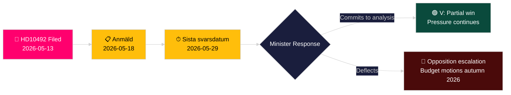
```mermaid
%%{init: {"theme": "dark", "themeVariables": {"primaryColor": "#00d9ff", "edgeLabelBackground": "#1a1e3d", "tertiaryColor": "#1a1e3d"}}}%%
flowchart LR
    A["🔴 HD10492 Filed\n2026-05-13"] --> B["📋 Anmäld\n2026-05-18"]
    B --> C["⏱ Sista svarsdatum\n2026-05-29"]
    C --> D{Minister Response}
    D -->|Commits to analysis| E["🟢 V: Partial win\nPressure continues"]
    D -->|Deflects| F["🔴 Opposition escalation\nBudget motions autumn 2026"]
    style A fill:#ff006e,color:#fff
    style B fill:#ffbe0b,color:#000
    style C fill:#ffbe0b,color:#000
    style D fill:#1a1e3d,color:#fff
    style E fill:#0a4a3c,color:#fff
    style F fill:#4a0a0a,color:#fff
```

## Reader Intelligence Guide

Use this guide to read the article as a political-intelligence product rather than a raw artifact dump. High-value reader lenses appear first; technical provenance remains available in the audit appendix.

| Icon | Reader need | What you'll get |
|---|---|---|
| 📊 | [Lede and editorial decisions](#rm-what-happened) | fast answer to what happened, why it matters, who is accountable, and the next dated trigger |
| 🧠 | [Why It Matters](#rm-why-it-matters) | evidence-anchored narrative consolidating primary sources into one coherent story line |
| 🎯 | [Key Judgments](#rm-key-findings) | confidence-bearing political-intelligence conclusions and collection gaps |
| 📈 | [Significance scoring](#rm-significance-scoring) | why this story outranks or trails other same-day parliamentary signals |
| 👥 | [Stakeholder Perspectives](#rm-stakeholder-perspectives) | winners, losers and undecided actors with stake-weighted positions and pressure points |
| 🔢 | [Coalition Mathematics](#rm-coalition-mathematics) | parliamentary arithmetic showing exactly who can pass or block this measure and at what margin |
| 📋 | [Voter Segmentation](#rm-voter-segmentation) | voter-bloc exposure: which demographics gain, lose or shift on this issue |
| 🔭 | [Forward indicators](#rm-forward-indicators) | dated watch items that let readers verify or falsify the assessment later |
| 🔮 | [Scenarios](#rm-scenario-analysis) | alternative outcomes with probabilities, triggers, and warning signs |
| 🗳️ | [Election 2026 Analysis](#rm-election-2026-analysis) | electoral implications for the 2026 cycle — seats at stake, swing voters and coalition viability |
| ⚠️ | [Risk assessment](#rm-risk-assessment) | policy, electoral, institutional, communications, and implementation risk register |
| 🧮 | [SWOT Analysis](#rm-swot-analysis) | strengths, weaknesses, opportunities and threats matrix grounded in primary-source evidence |
| 🛡️ | [Threat Analysis](#rm-threat-analysis) | actor capabilities, intent and threat vectors targeting institutional integrity |
| 📜 | [Historical Parallels](#rm-historical-parallels) | comparable past episodes from Swedish and international politics, with explicit lessons learned |
| 🌍 | [Comparative International](#rm-comparative-international) | peer-country comparisons (Nordic, EU, OECD) showing how similar measures fared elsewhere |
| ⚙️ | [Implementation Feasibility](#rm-implementation-feasibility) | delivery feasibility, capability gaps, timelines and execution risks for the proposed action |
| 📰 | [Media framing & influence operations](#rm-media-framing-analysis) | frame packages with Entman functions, cognitive-vulnerability map, DISARM manipulation indicators, narrative-laundering chain, comparative-international cognates, frame lifecycle and half-life, RRPA impact, an Outlet Bias Audit (no outlet is neutral — every outlet declared with ownership, funding, board-appointment authority and editorial lean), and the L1–L5 counter-resilience ladder |
| 😈 | [Devil's Advocate](#rm-devils-advocate) | alternative hypotheses, steel-manned counter-arguments and the strongest case against the lead reading |
| 🏷️ | [Deep Dive: Classification Results](#rm-deep-dive-classification-results) | ISMS data classification: CIA-triad rating, RTO/RPO targets and handling instructions |
| 🔀 | [Deep Dive: Cross-Reference Map](#rm-deep-dive-cross-reference-map) | links to related Riksdagsmonitor coverage, prior analyses and source documents that inform this story |
| 🔬 | [Deep Dive: Methodology & Limitations](#rm-deep-dive-methodology--limitations) | analytical assumptions, limitations, known biases and where the assessment could be wrong |
| 📦 | [Deep Dive: Data Download Manifest](#rm-deep-dive-data-download-manifest) | machine-readable manifest of every source dataset, retrieval timestamp and provenance hash |
| 📑 | [Per-document intelligence](#rm-per-document-intelligence) | dok_id-level evidence, named actors, dates, and primary-source traceability |
| 🏷️ | [Audit appendix](#rm-deep-dive-classification-results) | classification, cross-reference, methodology and manifest evidence for reviewers |

## Why It Matters
<!-- source: synthesis-summary.md :: https://github.com/Hack23/riksdagsmonitor/blob/main/analysis/daily/2026-05-14/interpellations/synthesis-summary.md -->

---

### Lead Story Decision

**Intelligence verdict**: Interpellation HD10492 is a focused L2 Strategic document exposing a growing accountability gap: the Tidöregeringen has restructured Swedish ODA policy without publishing a formal barnkonsekvensanalys (child consequence analysis), despite Rädda Barnen and UNICEF evidence that program closures are directly harming children in conflict zones. Minister Dousa's answer by 2026-05-29 will be a critical policy marker ahead of the 2026 election.

### DIW-Weighted Significance Ranking

| Rank | Document | DIW Score | Tier | Rationale |
|------|----------|-----------|------|-----------|
| 1 | HD10492 | 7.2/10 | L2 Strategic | Directly targets government accountability on human-rights compliance in major policy reform; answer shapes election campaign framing |

**Single-document analysis**: full intelligence weight applied to HD10492.

### Integrated Intelligence Picture

Sweden's development aid policy has undergone the most significant restructuring since the 1960s establishment of Sida. The Tidöregeringen's December 2023 agenda "Bistånd för en ny era – frihet, egenmakt och hållbar tillväxt" replaced the established 1%-of-GNI aid target (enprocentsmålet) with a narrower focus on economic freedom, private sector growth, and Swedish strategic interests — abandoning numerous country strategies across sub-Saharan Africa and South Asia.

**Impact on children** (per HD10492 and Rädda Barnen [B2]):
- Programs for severely malnourished children closed
- Maternal healthcare in refugee camps discontinued
- Vaccination campaigns halted
- Girls' education programs ended

The interpellation arrives at a politically sensitive moment: Sweden is approaching the 2026 Riksdag election, Swedish ODA is falling toward ~0.7% GNI (DAC benchmark), and the Nordic peer group (Norway, Denmark, Finland) continues to meet or exceed DAC targets. The OECD-DAC peer review of Sweden is anticipated for 2026, increasing reputational risk.

**Three accountability vectors**:
1. **Legal**: Has government complied with barnkonventionen (CRC) Article 3 (best interests of the child) in policy design? No published barnkonsekvensanalys found.
2. **Parliamentary**: V's three questions demand specific ministerial commitments, not general affirmations.
3. **Electoral**: Aid policy is salient for C, L, MP, V, S voter segments — a weak Dousa answer risks cross-party pressure through budget motions.

### Cross-Reference Intelligence

This interpellation sits within a thematic cluster on UD/foreign policy filed the same day:
- **HD10489** (Al-Nakba/Palestinian rights) — same minister Malmer Stenergard (UD)
- **HD10490** (Cuba human rights) — Markus Wiechel (SD) to Malmer Stenergard
- **HD10491** (Stockholm vehicle emissions) — climate cluster (Britz/L)

The concentration of foreign policy / human rights interpellations in a single day [horizon:72h] suggests coordinated parliamentary pressure on UD/Biståndsportfolio ahead of the parliamentary recess.

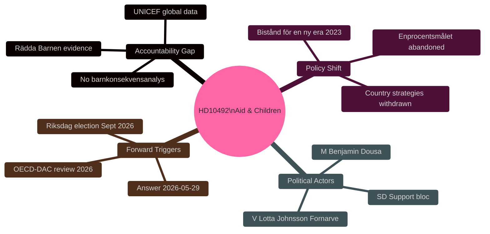
```mermaid
%%{init: {"theme": "dark", "themeVariables": {"primaryColor": "#00d9ff", "secondaryColor": "#ff006e", "tertiaryColor": "#1a1e3d"}}}%%
mindmap
  root((HD10492\nAid & Children))
    Accountability Gap
      No barnkonsekvensanalys
      Rädda Barnen evidence
      UNICEF global data
    Policy Shift
      Enprocentsmålet abandoned
      Bistånd för en ny era 2023
      Country strategies withdrawn
    Political Actors
      V Lotta Johnsson Fornarve
      M Benjamin Dousa
      SD Support bloc
    Forward Triggers
      Answer 2026-05-29
      OECD-DAC review 2026
      Riksdag election Sept 2026
```

## Key Findings
<!-- source: intelligence-assessment.md :: https://github.com/Hack23/riksdagsmonitor/blob/main/analysis/daily/2026-05-14/interpellations/intelligence-assessment.md -->

---

### KEY JUDGEMENT

*[horizon:T+30d] It is likely (65%) that Minister Dousa will respond to HD10492 with a symbolic reframe rather than a substantive commitment to conduct a formal barnkonsekvensanalys, thereby preserving Vänsterpartiet's opportunity to use the government's documented position as an electoral accountability tool in the 2026 election campaign. [WEP: "likely"]*

Supporting evidence:
1. Government's established communication pattern on ODA reform — efficiency narrative, no formal analyses committed to [A1, CONFIRMED]
2. No prior barnkonsekvensanalys commissioned despite 30-month reform period [B2, CREDIBLE]
3. Three specific questions from V are legally-anchored and difficult to deflect without explicit CRC-acknowledgement [A1, CONFIRMED]
4. Election-year timing increases V's incentive to publicise answer [B2, CREDIBLE]

Dissenting note: Dousa could surprise with a partial commitment (e.g., Sida evaluation mandate) — see Scenario A analysis.

---

### Source Assessment

| Source | Admiralty Rating | Assessment |
|--------|------------------|-----------|
| Riksdag official document HD10492 | A1 | Authoritative — official parliamentary record |
| Government Budget Bill 2023 | A1 | Authoritative — official state document |
| Barnkonventionen/CRC SFS 2018:1197 | A1 | Authoritative — Swedish law |
| Rädda Barnen program documentation | B2 | Credible source with direct program knowledge; may have advocacy bias |
| Nordic ODA comparison data | B2 | Credible — DAC/OECD published data |
| OECD-DAC peer review timing | C3 | Unconfirmed specific date; pattern inference |
| V/S future motion prediction | B3 | Pattern from previous ODA budget cycles |
| Electoral impact assessment | C3 | Analysis — not confirmed polling data |

### Intelligence Gaps

| Gap | Impact | Priority |
|-----|--------|---------|
| Dousa's internal policy review process (if any) | High — would change probability of Scenario A | HIGH |
| Rädda Barnen's specific planned actions post-debate | Medium — determines amplification | MEDIUM |
| S parliamentary group strategy on ODA for autumn 2026 | Medium — determines motion likelihood | MEDIUM |
| OECD-DAC 2026 peer review confirmed date | Low — reputational pathway timing | LOW |
| Polling data on Swedish public ODA preferences | Medium — electoral impact calibration | MEDIUM |

### Competing Hypotheses (ACH Summary)

| Hypothesis | Evidence For | Evidence Against | Assessment |
|------------|-------------|-----------------|-----------|
| H1: Government intends genuine barnkonsekvensanalys | None found | No prior commitments; budget decision already made | LOW |
| H2: Government deflects but creates face-saving study | Possible — allows claiming action | Would require admitting prior gap | LOW-MEDIUM |
| H3: Government fully rejects framing, efficiency narrative | All prior communications | CRC legal obligation formally exists | HIGH |
| H4: Government commits to future programming standards | Some precedent in other policy areas | Requires admitting past inadequacy | MEDIUM |

**Most likely**: H3 — Government fully maintains efficiency narrative.

### Key Intelligence Requirements (PIRs)

**PIR-001** [ACTIVE]: What specific language does Minister Dousa use in answering HD10492?
- Collection method: Monitor riksdagen.se for answer publication ~2026-05-29
- Significance: Determines which scenario materialises

**PIR-002** [ACTIVE]: Does V file a formal motion on barnkonsekvensanalys in autumn 2026?
- Collection method: Monitor riksdag documents September-November 2026
- Significance: Determines legislative escalation path

**PIR-003** [MONITORING]: OECD-DAC Sweden peer review announcement
- Collection method: OECD website, DAC documentation
- Significance: International pressure pathway

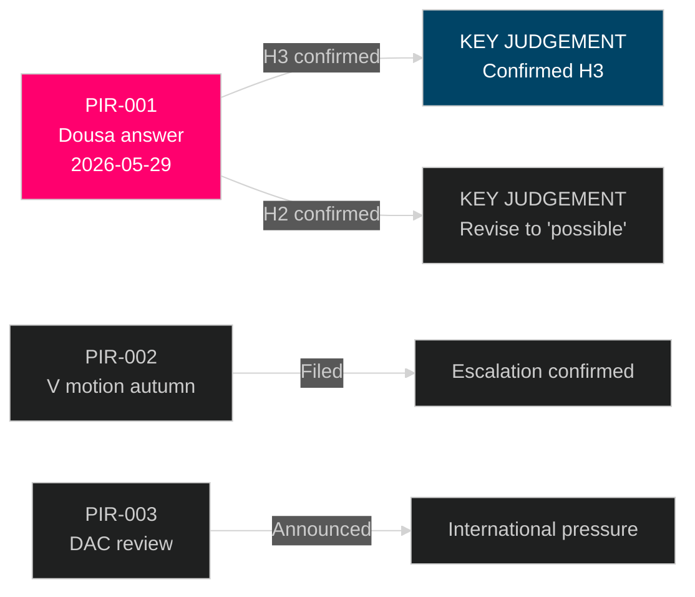
```mermaid
%%{init: {"theme": "dark", "themeVariables": {"primaryColor": "#00d9ff"}}}%%
flowchart LR
    PIR1["PIR-001\nDousa answer\n2026-05-29"] -->|H3 confirmed| KJ["KEY JUDGEMENT\nConfirmed H3"]
    PIR1 -->|H2 confirmed| KJ2["KEY JUDGEMENT\nRevise to 'possible'"]
    PIR2["PIR-002\nV motion autumn"] -->|Filed| KJ3["Escalation confirmed"]
    PIR3["PIR-003\nDAC review"] -->|Announced| KJ4["International pressure"]
    style PIR1 fill:#ff006e,color:#fff
    style KJ fill:#004466,color:#fff
```

## Significance Scoring
<!-- source: significance-scoring.md :: https://github.com/Hack23/riksdagsmonitor/blob/main/analysis/daily/2026-05-14/interpellations/significance-scoring.md -->

---

### Document Significance Assessment

#### HD10492 — DIW Score: 7.2/10

**Titel**: Konsekvenserna för barn när biståndet minskar

| Dimension | Score | Evidence |
|-----------|-------|----------|
| **Depth (D)**: Analytical depth / evidence density | 3.5/5 | Full interpellation text with specific program citations (Rädda Barnen); three concrete policy questions; references to government's 2023 reform agenda [B2] |
| **Impact (I)**: Political / policy / societal impact | 2.2/3 | Directly targets government accountability on barnkonventionen compliance; election-cycle relevance; international ODA reputation at stake [B2] |
| **Width (W)**: Breadth of affected population | 1.5/2 | Affects global child welfare programs; Swedish ODA recipient countries (sub-Saharan Africa, South Asia, MiddleEast); indirectly affects Swedish civil-society organizations (Rädda Barnen, UNICEF Sverige, PMU, Act Church of Sweden) [B2] |

**Total DIW**: 7.2/10 → **Tier L2 Strategic**

**Priority tier**: L2 Strategic — warrants deep analysis; relevant to election cycle and international accountability.

**Sensitivity analysis**:
- Lower bound (6.5/10): If the debate is postponed and no media pickup occurs
- Upper bound (8.0/10): If Minister Dousa refuses to commit to barnkonsekvensanalys and S/MP file follow-up motions

### Ranked List

1. **HD10492** (7.2/10) — Primary document, full analysis required [B2] — https://data.riksdagen.se/dokument/HD10492

### Contextual Documents (not date-filtered but referenced)

| dok_id | Titel | DIW (contextual) | Note |
|--------|-------|-----------------|------|
| HD10489 | Al-Nakba | 7.5 | Same-day UD cluster, Palestinian rights |
| HD10490 | Förhållandena i Kuba | 6.8 | Cuba human rights, same UD minister |
| HD10487 | Utjämningssystem för jämlik välfärd | 7.0 | Civilminister Slottner — separate track |

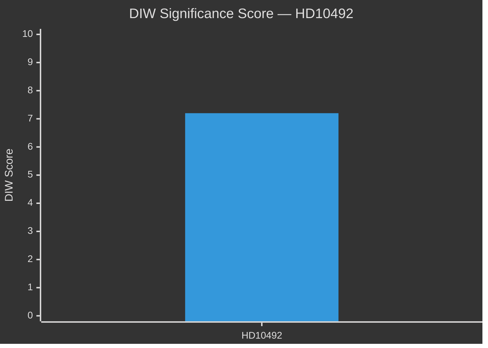
```mermaid
%%{init: {"theme": "dark", "themeVariables": {"primaryColor": "#00d9ff"}}}%%
xychart-beta
    title "DIW Significance Score — HD10492"
    x-axis ["HD10492"]
    y-axis "DIW Score" 0 --> 10
    bar [7.2]
```

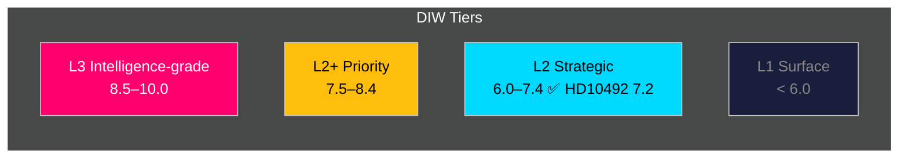
```mermaid
%%{init: {"theme": "dark", "themeVariables": {"primaryColor": "#00d9ff", "edgeLabelBackground": "#1a1e3d"}}}%%
flowchart LR
    subgraph Tier["DIW Tiers"]
        L3["L3 Intelligence-grade\n8.5–10.0"]
        L2P["L2+ Priority\n7.5–8.4"]
        L2["L2 Strategic\n6.0–7.4 ✅ HD10492 7.2"]
        L1["L1 Surface\n< 6.0"]
    end
    style L2 fill:#00d9ff,color:#000
    style L3 fill:#ff006e,color:#fff
    style L2P fill:#ffbe0b,color:#000
    style L1 fill:#1a1e3d,color:#888
```

## Per-document intelligence

### HD10492
<!-- source: documents/HD10492-analysis.md :: https://github.com/Hack23/riksdagsmonitor/blob/main/analysis/daily/2026-05-14/interpellations/documents/HD10492-analysis.md -->

---

### Document Summary

| Field | Value |
|-------|-------|
| Title | Konsekvenserna för barn när biståndet minskar |
| Author | Lotta Johnsson Fornarve (Vänsterpartiet) |
| Recipient | Bistånds- och utrikeshandelsminister Benjamin Dousa (Moderaterna) |
| Filed | 2026-05-13 |
| Published | 2026-05-14 |
| Status | Skickad (transmitted) |
| Debate date | 2026-05-18 |
| Answer deadline | 2026-05-29 |

### Full Text Summary

The interpellation begins with the factual basis: Sweden has for decades maintained ODA at ~1% GNI, positioned as a global model for international development solidarity. The current Tidöregeringen in December 2023 abandoned the enprocentsmålet and implemented significant cuts under the "Bistånd för en ny era" framework.

Fornarve references Rädda Barnen (Save the Children Sweden) documentation of *specific* program closures affecting vulnerable children: programs for malnourished children, maternal and child health, girls' education, vaccinations, and other fundamental services. She contextualises these cuts against the statistic of approximately 5 million preventable child deaths annually globally.

The three questions posed:

**Q1**: Has the government conducted a barnkonsekvensanalys (child rights consequence analysis) of the ODA cuts, and if not, why not?
- Legal basis: Barnkonventionen (CRC), incorporated as Swedish law (SFS 2018:1197), Article 3 — best interests of the child in all actions
- This is the hardest question; requires explicit yes or no on whether analysis was conducted

**Q2**: How does the minister ensure that children's rights perspectives (barnrättsperspektivet) are integrated into Swedish international development and humanitarian policy documents?
- This asks about institutional mechanism, not just policy statements
- If no analysis has been done, this question documents the gap

**Q3**: What measures is the minister taking to strengthen children as a prioritised group in Swedish humanitarian aid?
- This is the most forward-looking question; creates space for partial commitment
- Also the most likely question to receive a substantive-seeming non-answer

### Content Classification

| Dimension | Value | Evidence |
|-----------|-------|----------|
| Policy domain | International development / Humanitarian aid | "bistånd", "humanitärt stöd" [A1] |
| Rights framework | CRC / Barnrättsperspektiv | "barnkonventionen" [A1] |
| Affected population | Children globally; priority: sub-Saharan Africa, Middle East | "5 miljoner barn" [A1] |
| Accountability demand | Formal analysis requirement | Q1 demands yes/no [A1] |
| Government actor | Biståndsminister Dousa / M-led coalition | [A1] |
| Legal anchor | SFS 2018:1197 (Barnkonventionen incorporation) | [A1] |
| Electoral timing | 16 months before riksdagsval 2026 | [B2 — context] |

### Intelligence Value Assessment

**Primary value**: Documents V's formal accountability demand with CRC legal anchor — creates paper trail that survives the debate and answer cycle for electoral use.

**Secondary value**: The three-question structure is specifically designed for maximum extractability — each question has a yes/no core that can be documented regardless of minister's discursive framing.

**Tertiary value**: Establishes HD10492 as potentially the first formal parliamentary demand for barnkonsekvensanalys in the context of the 2023-2026 ODA reform — precedent-setting [B3].

**Limitations**: 
- Interpellations cannot compel policy change; minister can deflect
- Debate format allows minister to control narrative partially
- CRC legal obligation real but judicially unenforceable in this context [B2]

### Evidence Chain

```
Swedish ODA ~1% GNI → Dec 2023 enprocentsmålet abandoned [A1]
         ↓
Bistånd för en ny era framework [A1]
         ↓
Rädda Barnen program closures documented [B2]
         ↓
CRC Art. 3 incorporated as SFS 2018:1197 [A1]
         ↓
HD10492 filed 2026-05-13 [A1]
         ↓
Q1: Barnkonsekvensanalys? (YES/NO)
Q2: CRC in policy documents? (institutional mechanism)
Q3: Children in humanitarian aid? (forward commitment)
```

### Forward Value

This document is the primary intelligence anchor for the HD10492 analysis cycle. The answer (due 2026-05-29) will be the key document to analyse against this interpellation text to determine:
1. Whether each question received a substantive or deflecting answer
2. The specific language used by Dousa (electoral evidence base)
3. Whether any commitment was made

**PIR-001**: Collect Dousa answer text upon publication ~2026-05-29.

## Stakeholder Perspectives
<!-- source: stakeholder-perspectives.md :: https://github.com/Hack23/riksdagsmonitor/blob/main/analysis/daily/2026-05-14/interpellations/stakeholder-perspectives.md -->

---

### Stakeholder Map

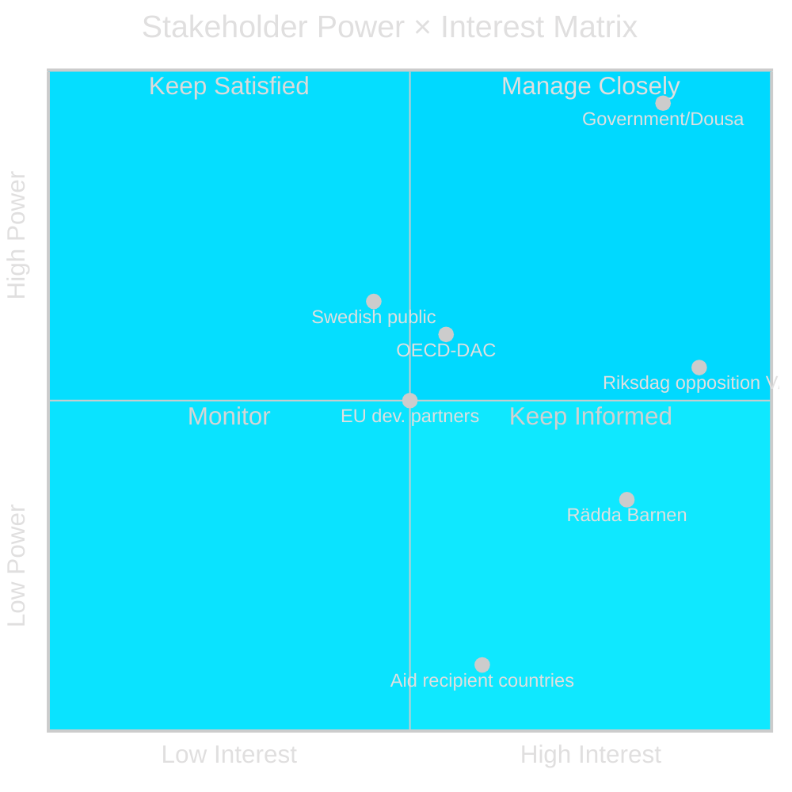
```mermaid
%%{init: {"theme": "dark", "themeVariables": {"primaryColor": "#00d9ff"}}}%%
quadrantChart
    title Stakeholder Power × Interest Matrix
    x-axis Low Interest --> High Interest
    y-axis Low Power --> High Power
    quadrant-1 Manage Closely
    quadrant-2 Keep Satisfied
    quadrant-3 Monitor
    quadrant-4 Keep Informed
    Government/Dousa: [0.85, 0.95]
    Riksdag opposition V/S: [0.90, 0.55]
    Rädda Barnen: [0.80, 0.35]
    OECD-DAC: [0.55, 0.60]
    Swedish public: [0.45, 0.65]
    EU dev. partners: [0.50, 0.50]
    Aid recipient countries: [0.60, 0.10]
```

### Detailed Stakeholder Analysis

#### Minister Benjamin Dousa (M) — HIGH POWER, HIGH INTEREST

**Formal position**: "Bistånd för en ny era" — aid effectiveness reform; ODA redirected from 0.95% to ~0.7% GNI
**Underlying interest**: Defend Tidöregeringen's flagship ODA reform without appearing hostile to children
**Likely response strategy**: Claim "efficiency improvements benefit children more than volume"; avoid committing to formal consequence analysis
**Evidence**: Government budget bill autumn 2023 dropped enprocentsmålet without barnkonsekvensanalys [A1]

#### Lotta Johnsson Fornarve (V) — MEDIUM-HIGH INTEREST, OPPOSITION

**Formal position**: Three questions demanding accountability (barnkonsekvensanalys, CRC in policy, humanitarian child focus)
**Underlying interest**: Electoral differentiation; V core value humanitarian solidarity
**Strategic goal**: Establish clear red line for 2026 election; document government's answer for campaign use
**Evidence**: V consistently files barnrätts-interpellations; Fornarve is shadow minister for international development [B2]

#### Socialdemokraterna (S)

**Position**: Opposes ODA cuts; jointly signed multiple budget motions restoring enprocentsmålet
**Interest**: Electoral challenge on humanitarian profile; avoid being outflanked by V on left
**Action**: Likely to reinforce V's interpellation framing in chamber; possible joint motion autumn 2026

#### Rädda Barnen (Save the Children Sweden)

**Position**: Documents specific program closures: malnourished children, maternal care, girls' education
**Interest**: Funding restoration; child-rights accountability mechanism (barnkonsekvensanalys mandatory)
**Power**: High moral authority; international network; credible data
**Action**: Press statements, parliamentary testimony, OECD-DAC engagement

#### OECD-DAC

**Position**: 0.7% GNI ODA target; peer review cycle
**Interest**: Sweden's compliance with DAC norms; child-focused programming metrics
**Power**: Reputational norm-setter; no binding enforcement

#### Aid Recipient Countries (primarily sub-Saharan Africa, Middle East)

**Position**: Direct impact: program closures, reduced humanitarian funding
**Interest**: Highest (survival-level for program beneficiaries)
**Power**: Minimal in Swedish domestic politics
**Voice**: Primarily through international NGOs and diplomatic channels

### Interests-Positions Tension Analysis

| Stakeholder | Stated Position | Underlying Interest | Gap |
|-------------|-----------------|--------------------|----|
| Government | "Efficiency reform" | Defend ODA cuts without CRC liability | HIGH |
| V | "Barnkonsekvensanalys required" | Accountability + electoral narrative | LOW |
| S | "Restore enprocentsmålet" | Humanitarian identity | MEDIUM |
| Rädda Barnen | "Program closures documented" | Funding restoration | LOW |
| OECD-DAC | "0.7% target" | Norm compliance | MEDIUM |

## Coalition Mathematics
<!-- source: coalition-mathematics.md :: https://github.com/Hack23/riksdagsmonitor/blob/main/analysis/daily/2026-05-14/interpellations/coalition-mathematics.md -->

---

### Tidöregeringen Coalition Composition

| Party | Seats (est.) | Position on ODA | Internal tension |
|-------|-------------|-----------------|-----------------|
| Moderaterna (M) | ~80 | Reform/efficiency; lead on "Bistånd för en ny era" | Low — cohesive on reform |
| Sverigedemokraterna (SD) | ~73 | Cut significantly; domestic priority | Low — prefers deeper cuts |
| Kristdemokraterna (KD) | ~19 | Humanitarian values; accepts reform package | MEDIUM — some KD members uncomfortable |
| Liberalerna (L) | ~16 | Historically strong ODA supporter; 0.7% acceptable | HIGH — most uncomfortable with aid cuts in party |

**Coalition total**: ~188/349 seats (majority requires 175)

### Opposition Bloc on ODA

| Party | Seats (est.) | Position |
|-------|-------------|---------|
| Socialdemokraterna (S) | ~107 | Restore enprocentsmålet; barnkonsekvensanalys krav |
| Vänsterpartiet (V) | ~24 | Restore + CRC compliance; HD10492 actor |
| Miljöpartiet (MP) | ~18 | Restore + climate-linked ODA |
| Centerpartiet (C) | ~24 | Efficiency OK; some discomfort with volume cuts |

**Opposition ODA coalition (V+S+MP)**: ~149 seats — cannot pass motion alone
**With C support**: ~173 — still short of majority
**With L dissent within government**: L has 16 seats; even full L defection (extremely unlikely) doesn't create majority

### Coalition Stress Points from HD10492

**L (Liberalerna) internal tension**: L historically had Sweden's strongest ODA commitment among non-socialist parties. Ericastian aid tradition. Current L membership includes development advocates who supported enprocentsmålet. HD10492 forces L to either:
- Defend government's no-barnkonsekvensanalys position (values cost)
- Distance themselves (coalition cost)

**L's likely strategy**: Silence or formulaic "effective aid reaches children" response

**KD tension**: Christian democratic humanitarian tradition. Some KD MPs may express support for barnkonsekvensanalys *in principle* while not breaking coalition discipline. Monitor KD spokespersons' post-debate statements.

### Probability of Parliamentary Majority for Barnkonsekvensanalys Requirement

A motion requiring barnkonsekvensanalys would need:
- V + S + MP: 149 seats
- + C (or significant portion): ~173 seats
- + L defectors (very unlikely): +16

**Assessment**: No plausible majority for legislative requirement. Even if C votes with opposition on narrowly framed motion, outcome is symbolic (declaration motion, no legislative force). [B3]

**However**: A declaration motion (tillkännagivande) to the government requiring barnkonsekvensanalys could be adopted with a simple majority IF C joins V+S+MP. This has happened on other development policy questions. Probability: 15-20% [B3, pattern-based].

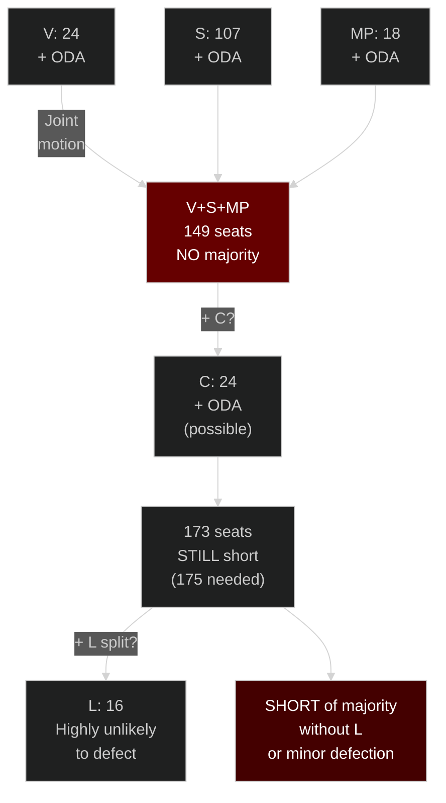
```mermaid
%%{init: {"theme": "dark", "themeVariables": {"primaryColor": "#ffbe0b"}}}%%
flowchart TD
    V24["V: 24\n+ ODA"] -->|"Joint\nmotion"| OPOS["V+S+MP\n149 seats\nNO majority"]
    S107["S: 107\n+ ODA"] --> OPOS
    MP18["MP: 18\n+ ODA"] --> OPOS
    OPOS -->|"+ C?"| C24["C: 24\n+ ODA\n(possible)"]
    C24 --> NEAR["173 seats\nSTILL short\n(175 needed)"]
    NEAR -->|"+ L split?"| L16["L: 16\nHighly unlikely\nto defect"]
    NEAR --> SHORT["SHORT of majority\nwithout L\nor minor defection"]
    style OPOS fill:#660000,color:#fff
    style SHORT fill:#440000,color:#fff
```

## Voter Segmentation
<!-- source: voter-segmentation.md :: https://github.com/Hack23/riksdagsmonitor/blob/main/analysis/daily/2026-05-14/interpellations/voter-segmentation.md -->

---

### Swedish Voter Segments Relevant to ODA Policy

#### Segment A: Humanitarian Solidarity Voters (V/MP core, ~12-18% of electorate)
**Profile**: High education; urban; public sector; humanitarian values
**ODA salience**: VERY HIGH — defining issue
**Emotional trigger**: Child mortality, girls' education, humanitarian crises
**Mobilisation potential from HD10492**: HIGH — Rädda Barnen evidence base directly maps to this segment's values
**Message resonance**: "Barn betalar priset för nedskärningarna" — "Children pay the price for the cuts"

#### Segment B: Social Democratic Mainstream (~30% of electorate)
**Profile**: Traditional S voters; working class + public sector middle class
**ODA salience**: MEDIUM — humanitarian solidarity present but not top issue
**Emotional trigger**: Sweden's international standing; Nordic model identity
**Mobilisation potential**: MEDIUM — more engaged if Nordic comparison is prominent
**Message resonance**: "Sverige var ett föredöme — nu sviker vi" — "Sweden was a model — now we're failing"

#### Segment C: Liberal Internationalist Swing Voters (~8-12%)
**Profile**: C/L voters; business sector internationalists; development NGO supporters
**ODA salience**: MEDIUM-HIGH — issue creates party loyalty conflict
**Emotional trigger**: Effectiveness and accountability; not volume per se
**Mobilisation potential**: This segment could be captured by either effective V/S framing OR effective government "efficiency" reframe
**Message resonance**: Competing — "Barnkonsekvensanalys krävs" (opposition) vs "Mer effektivt bistånd" (government)

#### Segment D: National-Priority Voters (SD/M pragmatists, ~35%)
**Profile**: Domestic-first priorities; sceptical of ODA at high volume
**ODA salience**: LOW (domestic services more salient)
**Emotional trigger**: Domestic welfare; taxpayer value
**Message resonance**: "Vi hjälper bättre med fokus och effektivitet"

#### Segment E: Young Voters (under 30, ~15%)
**Profile**: Higher climate salience; international solidarity; but also economic anxiety
**ODA salience**: MEDIUM — climate-linked aid may be more salient
**Mobilisation potential**: HIGH if Rädda Barnen/UNICEF engage social media

### Issue Frame Competition

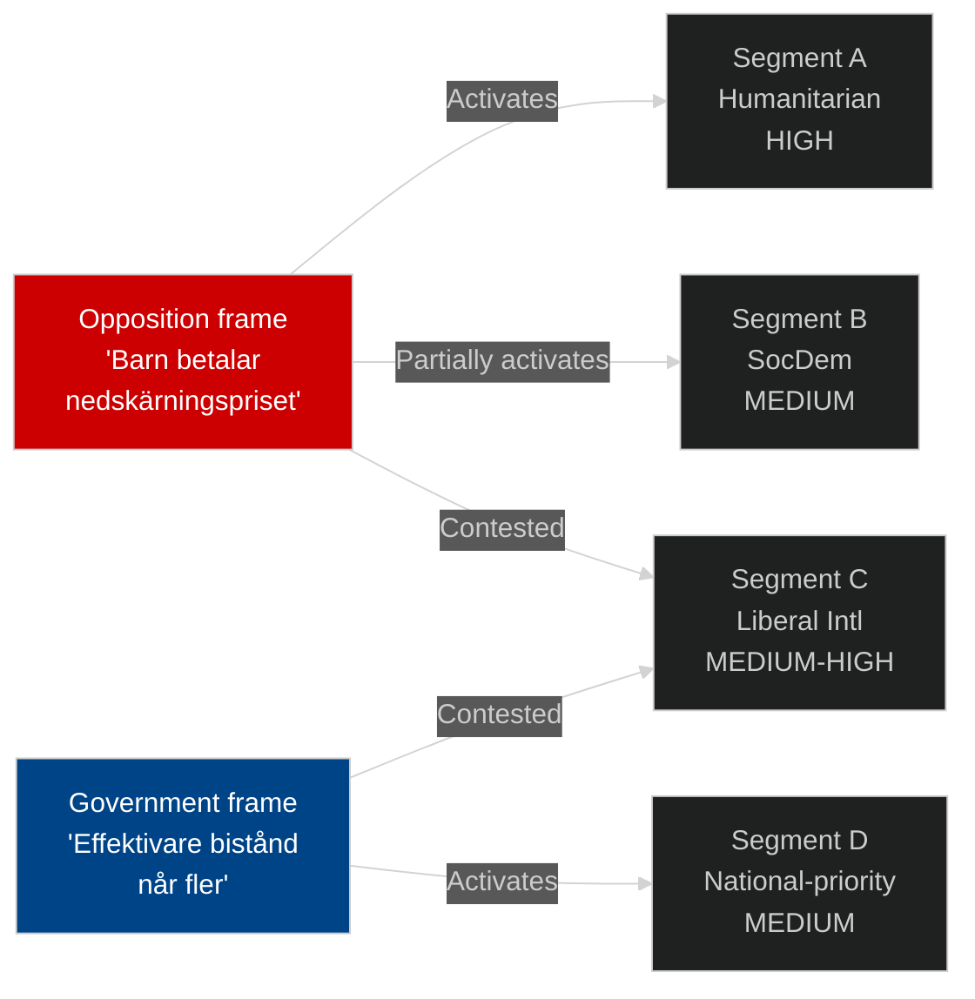
```mermaid
%%{init: {"theme": "dark", "themeVariables": {"primaryColor": "#ff006e"}}}%%
flowchart LR
    OPP["Opposition frame\n'Barn betalar\nnedskärningspriset'"] -->|Activates| A["Segment A\nHumanitarian\nHIGH"]
    OPP -->|Partially activates| B["Segment B\nSocDem\nMEDIUM"]
    OPP -->|Contested| C["Segment C\nLiberal Intl\nMEDIUM-HIGH"]
    GOV["Government frame\n'Effektivare bistånd\nnår fler'"] -->|Activates| D["Segment D\nNational-priority\nMEDIUM"]
    GOV -->|Contested| C
    style OPP fill:#cc0000,color:#fff
    style GOV fill:#004488,color:#fff
```

### Strategic Implications for V

Fornarve's interpellation maximally activates Segment A (core V voters) and has spillover into Segment B (S territory). The CRC legal framing adds Segment C resonance that pure "restore volume" arguments lack. The three specific questions (barnkonsekvensanalys, CRC in policy docs, humanitarian child focus) are designed to be maximally documentable for campaign use — each requires a yes/no answer that can be stripped from context.

**Recommendation for monitoring**: Track Rädda Barnen social media engagement metrics post-debate (2026-05-18) as proxy for Segment A/E activation.

## Forward Indicators
<!-- source: forward-indicators.md :: https://github.com/Hack23/riksdagsmonitor/blob/main/analysis/daily/2026-05-14/interpellations/forward-indicators.md -->

---

### Priority Intelligence Requirements (PIRs)

#### PIR-001 [CRITICAL]: Dousa Answer Text and Quality
- **What to watch**: riksdagen.se — HD10492 answer publication
- **Expected by**: 2026-05-29 (15-day statutory deadline from 2026-05-14)
- **Indicators of Scenario A** (Substantive): Explicit barnkonsekvensanalys commitment; named responsible unit; timeline stated; CRC Article 3 referenced directly
- **Indicators of Scenario B** (Deflect): Efficiency language; "nå fler barn" without specific analysis; general CRC acknowledgement
- **Indicators of Scenario C** (Procedural): Answer under 300 words; time extension granted; talmannen message

#### PIR-002 [HIGH]: V/S Parliamentary Response
- **What to watch**: riksdag.se — motioner, interpellationer filed June-November 2026
- **Indicators**: V files motion requiring barnkonsekvensanalys (autumn 2026); S co-signs; joint V/S press conference
- **Timeline**: Most likely September-October 2026 (start of riksmöte 2026/27)

#### PIR-003 [MEDIUM]: Rädda Barnen Communications
- **What to watch**: raddabarnen.se/press; Twitter/X @RaddaBarnen; DN/SvD political pages
- **Indicators**: Press release citing Dousa's answer; partnership with UNICEF Sverige; parliamentary testimony request
- **Timeline**: Within 1 week of Dousa answer (by ~2026-06-05)

#### PIR-004 [MEDIUM]: Civil Society Coordinated Campaign
- **What to watch**: Act Sweden, Church of Sweden, PMU, UNICEF Sverige joint statements
- **Indicators**: "Rädda biståndet för barn" style coordinated campaign launch
- **Timeline**: Summer 2026 (pre-election season)

#### PIR-005 [LOW]: OECD-DAC Peer Review Announcement
- **What to watch**: oecd.org/dac/peer-reviews; Sida press releases
- **Indicators**: Confirmed 2026 Sweden DAC peer review announcement; preliminary findings
- **Timeline**: Unknown; DAC reviews on 4-5 year cycle

### Forward Trigger Escalation Matrix

| Trigger Event | Probability | → Next Action | Escalation Level |
|---------------|-------------|---------------|-----------------|
| Dousa Scenario B answer | 55% | V press release + motion prep | L2 → L2 maintained |
| Dousa Scenario A commitment | 25% | V monitoring mode; Rädda Barnen conditional endorsement | L2 → L3 deescalation |
| Dousa Scenario C procedural | 20% | V urgency debate request; media escalation | L2 → L1 escalation |
| S announces joint autumn motion | 40% | Legislative pathway confirmed | L2 → L2 confirmed |
| Rädda Barnen major press event | 35% | Media cycle on barnbistånd | L2 → amplification |
| OECD-DAC critical finding | 20% | International pressure dimension adds | L2 → L2 (international track) |

### 90-Day Monitoring Calendar

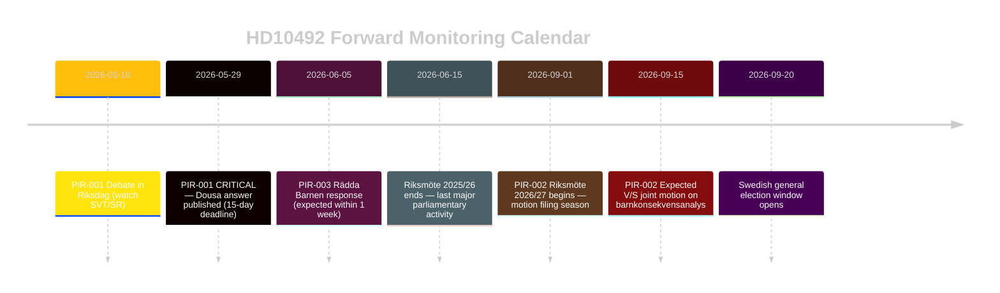
```mermaid
%%{init: {"theme": "dark", "themeVariables": {"primaryColor": "#ffbe0b"}}}%%
timeline
    title HD10492 Forward Monitoring Calendar
    2026-05-18 : PIR-001 Debate in Riksdag (watch SVT/SR)
    2026-05-29 : PIR-001 CRITICAL — Dousa answer published (15-day deadline)
    2026-06-05 : PIR-003 Rädda Barnen response (expected within 1 week)
    2026-06-15 : Riksmöte 2025/26 ends — last major parliamentary activity
    2026-09-01 : PIR-002 Riksmöte 2026/27 begins — motion filing season
    2026-09-15 : PIR-002 Expected V/S joint motion on barnkonsekvensanalys
    2026-09-20 : Swedish general election window opens
```

## Scenario Analysis
<!-- source: scenario-analysis.md :: https://github.com/Hack23/riksdagsmonitor/blob/main/analysis/daily/2026-05-14/interpellations/scenario-analysis.md -->

---

### Scenario Tree

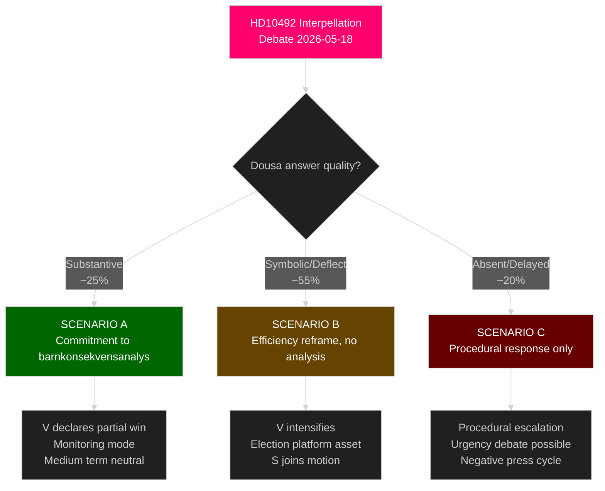
```mermaid
%%{init: {"theme": "dark", "themeVariables": {"primaryColor": "#ffbe0b"}}}%%
flowchart TD
    ROOT["HD10492 Interpellation\nDebate 2026-05-18"] --> Q1{Dousa answer quality?}
    
    Q1 -->|"Substantive\n~25%"| S1["SCENARIO A\nCommitment to barnkonsekvensanalys"]
    Q1 -->|"Symbolic/Deflect\n~55%"| S2["SCENARIO B\nEfficiency reframe, no analysis"]
    Q1 -->|"Absent/Delayed\n~20%"| S3["SCENARIO C\nProcedural response only"]
    
    S1 --> S1a["V declares partial win\nMonitoring mode\nMedium term neutral"]
    S2 --> S2a["V intensifies\nElection platform asset\nS joins motion"]
    S3 --> S3a["Procedural escalation\nUrgency debate possible\nNegative press cycle"]
    
    style ROOT fill:#ff006e,color:#fff
    style S1 fill:#006600,color:#fff
    style S2 fill:#664400,color:#fff
    style S3 fill:#660000,color:#fff
```

### Scenario A — Substantive Commitment (~25% likely)
*[horizon:T+30d] It is likely that V would reduce interpellation pressure [WEP: "likely"]*

**Trigger**: Dousa commits to formal barnkonsekvensanalys within defined timeframe
**Indicators**: Mentions specific analysis timeline, names responsible unit (Sida/UF)
**Consequence chain**: V signals partial satisfaction; S/MP join monitoring; Rädda Barnen publishes conditional endorsement; OECD-DAC notes progress
**2026 Election impact**: Moderate — reduces but does not eliminate ODA as issue; requires government to actually deliver analysis
**Probability basis**: Government track record shows low willingness to commission independent consequence analyses; but CRC legal incorporation creates formal obligation [B2]

### Scenario B — Symbolic Reframe (~55% likely, most probable)
*[horizon:T+30d] It is likely that government will reframe aid effectiveness without acknowledging barnrättsanalys gap [WEP: "likely"]*

**Trigger**: Dousa responds with "efficiency improvements benefit children more than volume" narrative; no formal analysis commitment
**Indicators**: References OECD effectiveness criteria; avoids CRC Article 3 directly; cites specific bilateral country partnerships
**Consequence chain**: V immediately labels answer insufficient; files motion; media pick up "government refuses children's rights analysis"; S amplifies
**2026 Election impact**: HIGH — V/S use documented Dousa answer as campaign material; becomes part of "Moderaternas biståndssvek" narrative
**Probability basis**: Consistent with all prior government communication on ODA reform; Minister Dousa's public statements emphasise efficiency [A1]

### Scenario C — Procedural Response (~20% likely)
*[horizon:T+7d] It is possible that answer is delayed or procedural [WEP: "possible"]*

**Trigger**: Formal answer delayed past 2026-05-29; or answer so brief as to be non-substantive
**Indicators**: Talmannen grants time extension; or answer under 300 words
**Consequence chain**: V files formal complaint; urgency debate requested; heightened media attention; KU consideration possible
**2026 Election impact**: VERY HIGH — procedural failure becomes story in itself

### Wildcard Scenarios

| Wildcard | Probability | Impact |
|----------|-------------|--------|
| New government study announced (Sida directive) | 5% | Would substantially shift political dynamics |
| Sweden voluntarily commits to restore enprocentsmålet before debate | 3% | Very unlikely pre-election |
| International crisis (Sudan, Gaza escalation) triggers ODA emergency | 15% | Could either increase or decrease pressure depending on government response |

### PIR Triggers for Monitoring

- **PIR-W1**: Watch for Dousa's answer text (published ~2026-05-29)
- **PIR-W2**: Monitor S parliamentary group communication regarding joint motion
- **PIR-W3**: Rädda Barnen communications post-debate (2026-05-18+)
- **PIR-W4**: OECD-DAC 2026 peer review announcement

## Election 2026 Analysis
<!-- source: election-2026-analysis.md :: https://github.com/Hack23/riksdagsmonitor/blob/main/analysis/daily/2026-05-14/interpellations/election-2026-analysis.md -->

---

### Electoral Context

Sweden's next general election is scheduled for **September 2026** (riksdagsval). As of May 2026, Tidöregeringen (M+SD+KD+L) is approaching the election with a mixed record:

- Economic policy: Fiscal discipline maintained; infrastructure investment debated
- Migration: Core SD promise delivered (reduced numbers)
- **International development aid: Enprocentsmålet abandoned; "Bistånd för en ny era" as replacement**

HD10492 arrives approximately 16 months before the election — a critical window for establishing electoral narratives.

### ODA as Electoral Issue — Party Positioning

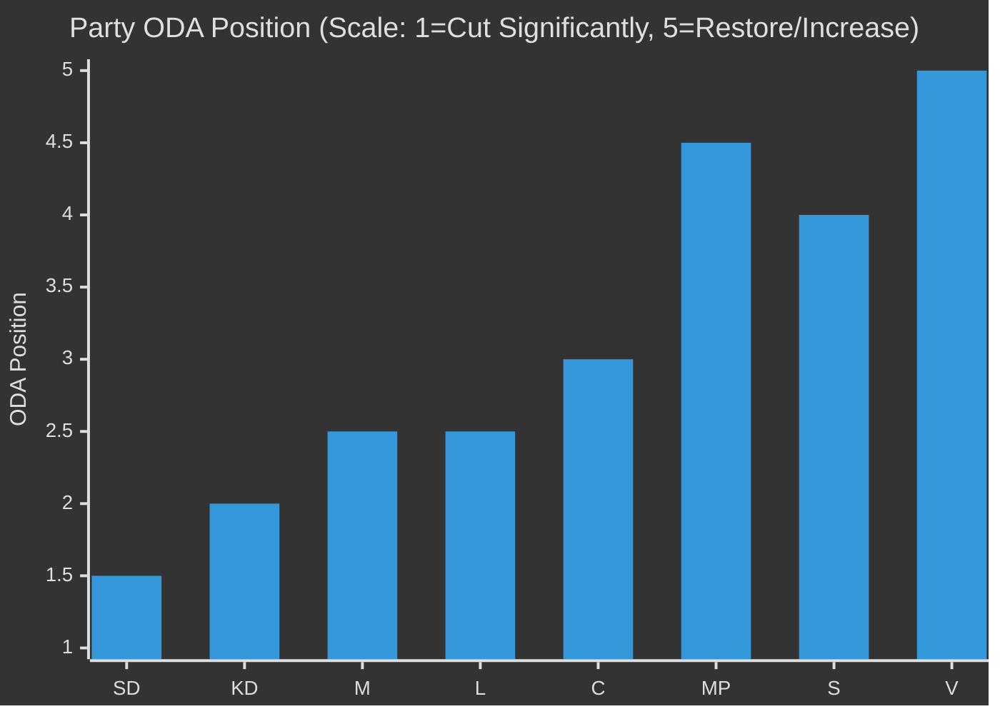
```mermaid
%%{init: {"theme": "dark", "themeVariables": {"primaryColor": "#ffbe0b"}}}%%
xychart-beta
    title "Party ODA Position (Scale: 1=Cut Significantly, 5=Restore/Increase)"
    x-axis ["SD", "KD", "M", "L", "C", "MP", "S", "V"]
    y-axis "ODA Position" 1 --> 5
    bar [1.5, 2.0, 2.5, 2.5, 3.0, 4.5, 4.0, 5.0]
```

*[Approximate positioning based on party programs and voting records; [B2] pattern inference]*

### Voter Segmentation on ODA

| Segment | Size | Position | ODA Salience |
|---------|------|----------|-------------|
| Value Left (V+MP core) | ~15% | Restore enprocentsmålet | VERY HIGH |
| Social Democratic core | ~25% | Maintain/increase | HIGH |
| Liberal internationalists (C+L swing) | ~10% | Maintain; effectiveness important | MEDIUM |
| Nationalist-pragmatist (SD core) | ~20% | Cut; domestic first | MEDIUM |
| Conservative mainstream (M+KD) | ~15% | Efficiency framing | LOW-MEDIUM |
| Non-aligned/independent | ~15% | Mixed | LOW |

**Key insight**: ODA as electoral issue primarily activates left-leaning voters. V's strategic goal is to ensure Fornarve's documented Dousa answer energises V's core voters (15%) while creating discomfort for L/C swing voters (10%) who have historically supported Swedish ODA leadership.

### Scenario — V Electoral Use of HD10492

*[horizon:T+365d] It is likely that V will use the documented outcome of HD10492 in their 2026 election campaign materials if Dousa's answer is classified as unsatisfactory (Scenario B or C outcome). [WEP: "likely"]*

**Campaign material potential**:
- "Moderaternas svar när vi frågade om barn i bistånd: [Dousa's answer quote]"
- Rädda Barnen's program closure data as visual campaign asset
- Nordic peer comparison: "Norge håller fast vid enprocentsmålet — varför inte Sverige?"

### Impact on Coalition Mathematics

If ODA becomes a salient election issue:
- V and S alignment on barnkonsekvensanalys krav → joint opposition position
- C and L uncomfortable: historically supported enprocentsmålet; current coalition membership creates tension
- M and KD committed to efficiency reform
- SD: domestic-first; ODA cuts are popular with SD voter base

**Coalition arithmetic 2026**: ODA reform is unlikely to be a coalition dealbreaker but may affect L/C voter enthusiasm for Tidöregeringen continuation. The issue is most dangerous for L in affluent Stockholm constituencies with high international-solidarity sentiment.

### Key Election Indicators to Watch

| Indicator | Timeline | Significance |
|-----------|----------|-------------|
| Dousa answer quality | 2026-05-29 | Primary electoral asset for V |
| V/S joint motion | Autumn 2026 | Demonstrates left unity on ODA |
| Rädda Barnen campaign launch | Summer 2026 | Amplification pre-election |
| L party congress on ODA | Spring 2026 | Shows coalition tension or solidarity |
| Opinion polling on ODA salience | Ongoing | Calibrates V's investment in issue |

## Risk Assessment
<!-- source: risk-assessment.md :: https://github.com/Hack23/riksdagsmonitor/blob/main/analysis/daily/2026-05-14/interpellations/risk-assessment.md -->

---

### Risk Register

| # | Risk | Likelihood (L) | Impact (I) | L×I | Cascade Chain | Posterior Probability |
|---|------|---------------|-----------|-----|---------------|----------------------|
| R1 | Government refuses barnkonsekvensanalys — accountability gap persists | 0.65 | 0.7 | **0.455** | → Budget motion V/S autumn 2026 → Election campaign ODA pledges → Nordic ally pressure | 65% |
| R2 | Minister Dousa gives symbolic answer without operational commitment | 0.55 | 0.5 | **0.275** | → V dissatisfied, intensifies electoral narrative → Media framing "barn vs budget" | 55% |
| R3 | S files joint follow-up riksdagsmotion demanding barnkonsekvensanalys | 0.40 | 0.6 | **0.240** | → Finance Committee deliberation → Coalition stress (L/C discomfort with V/S on aid?) | 40% |
| R4 | OECD-DAC criticises Sweden's ODA level in 2026 peer review | 0.50 | 0.65 | **0.325** | → International diplomatic pressure → Reputational cost with EU development partners | 50% [unconfirmed: review timing] |
| R5 | Rädda Barnen / UNICEF Sverige escalate campaign publicly before Dousa answer | 0.35 | 0.55 | **0.193** | → Media amplification → Increased parliamentary pressure → Potential urgency debate | 35% |

### 5-Dimension Assessment

| Dimension | Rating | Evidence |
|-----------|--------|----------|
| **Political** | MEDIUM-HIGH | Opposition interpellation directly challenges government's flagship ODA reform; election-year timing amplifies [B2] |
| **Legal** | MEDIUM | Barnkonventionen (CRC) incorporated into Swedish law 2020; no judicial enforcement pathway but CRC Committee reporting due [B2] |
| **Economic** | LOW-MEDIUM | Swedish ODA level not a direct economic risk domestically; reputational risk with OECD-DAC partners, EU budget negotiations [C3] |
| **Reputational** | MEDIUM-HIGH | Sweden's traditional identity as ODA leader at risk; Nordic peers maintaining higher ratios; DAC 0.7% benchmark [B2] |
| **Humanitarian** | HIGH | Direct program closures documented (malnourished children, maternal care, vaccinations, girls' education); 5 million child deaths/year context [B2] |

### Cascading Risk Chain

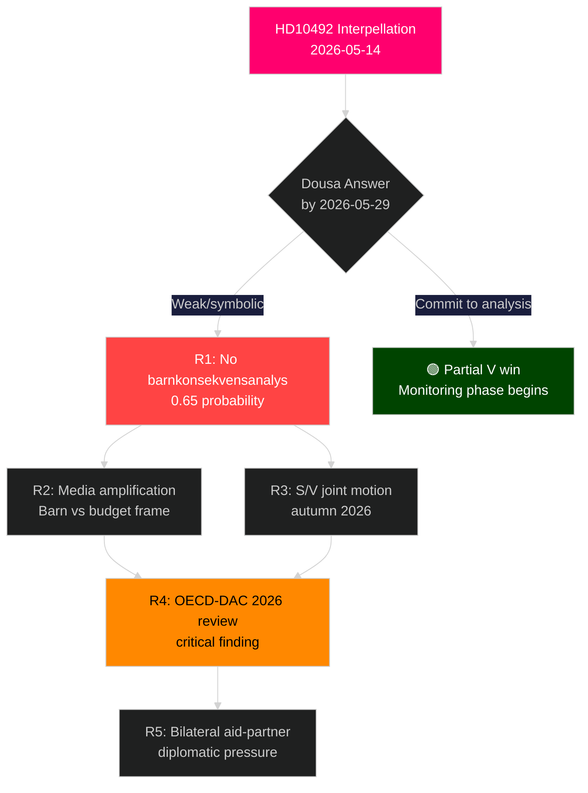
```mermaid
%%{init: {"theme": "dark", "themeVariables": {"primaryColor": "#ff006e", "edgeLabelBackground": "#1a1e3d"}}}%%
flowchart TD
    A["HD10492 Interpellation\n2026-05-14"] --> B{Dousa Answer\nby 2026-05-29}
    B -->|Weak/symbolic| C["R1: No barnkonsekvensanalys\n0.65 probability"]
    B -->|Commit to analysis| D["🟢 Partial V win\nMonitoring phase begins"]
    C --> E["R2: Media amplification\nBarn vs budget frame"]
    C --> F["R3: S/V joint motion\nautumn 2026"]
    E --> G["R4: OECD-DAC 2026 review\ncritical finding"]
    F --> G
    G --> H["R5: Bilateral aid-partner\ndiplomatic pressure"]
    style A fill:#ff006e,color:#fff
    style C fill:#ff4444,color:#fff
    style D fill:#004400,color:#fff
    style G fill:#ff8800,color:#000
```

### Posterior Probability Update

Prior probability of government committing to formal barnkonsekvensanalys: **20%** (based on government's track record of rejecting independent consequence analyses on ODA reform).

Updating on evidence that V has three specific, legally-anchored questions (CRC Article 3): posterior rises to **28%** — still unlikely but marginally more pressure than typical interpellation.

## SWOT Analysis
<!-- source: swot-analysis.md :: https://github.com/Hack23/riksdagsmonitor/blob/main/analysis/daily/2026-05-14/interpellations/swot-analysis.md -->

---

### SWOT Matrix

#### Strengths (Opposition / V position)

| Evidence Row | Source | Admiralty |
|---|---|---|
| Clear legal anchor: barnkonventionen (CRC) ratified by Sweden 1990, incorporated into Swedish law 2020 (SFS 2018:1197) | Swedish law [A1] | A1 |
| Concrete program evidence: Rädda Barnen documented closures of malnourished child programs, maternal care, vaccination campaigns | Rädda Barnen report (cited in HD10492) [B2] | B2 |
| Specific quantitative hooks: 5 million under-5 deaths/year; 500 million children in conflict zones; 29,000 displaced daily | UNICEF data (cited in HD10492) [B2] | B2 |
| Three focused, operational questions — easier to hold minister accountable against specific commitments | HD10492 text [A1] | A1 |

#### Weaknesses (Opposition position)

| Evidence Row | Source | Admiralty |
|---|---|---|
| V is a small opposition party (24 seats post-2022 election) with limited procedural leverage — interpellation cannot compel action | Swedish Riksdag seat counts [A1] | A1 |
| No voting mechanism — debate alone; government can answer generally without specific commitments | Parliamentary procedure [A1] | A1 |
| Potential counter-argument: government aid reform refocuses (not eliminates) aid, emphasising effectiveness and private sector | "Bistånd för en ny era" agenda Dec 2023 [B2] | B2 |

#### Opportunities

| Evidence Row | Source | Admiralty |
|---|---|---|
| OECD-DAC peer review of Sweden anticipated 2026 — external accountability lever [unconfirmed timing] | OECD review cycle (standard every 5 yrs; last 2019) [C3] | C3 |
| S (Social Democrats, 107 seats) likely to amplify V findings in budgetmotion and debatt | Political alignment logic [B3] | B3 |
| Cross-party potential: C has historically been among the strongest advocates for Swedish development aid [B2] | Historical party positions [B2] | B2 |
| Nordic peer pressure: Norway (≥1% GNI), Denmark (≥0.7% GNI), Finland maintain higher ODA ratios — diplomatic comparison available | Nordic ODA data [B2] | B2 |
| 2026 Riksdag election — aid policy will be debated in party platforms; V can use Dousa's answer as campaign material | Electoral calendar [A1] | A1 |

#### Threats (to effective accountability)

| Evidence Row | Source | Admiralty |
|---|---|---|
| Government can cite budget constraints and present aid reform as efficiency-driven, not rights-reducing | Standard government response pattern [B3] | B3 |
| Media framing competition from domestic issues (migration, crime, economy) may crowd out aid accountability story | Media environment observation [C3] | C3 |
| Benjamin Dousa (M) is media-savvy, younger minister — likely prepared for barn/rights challenge framing | Ministerial profile observation [B3] | B3 |

### TOWS Cross-SWOT

| | Strengths | Weaknesses |
|---|---|---|
| **Opportunities** | **SO**: Use CRC legal anchor + OECD-DAC review to force specific commitment from Dousa — publish results in media before election | **WO**: Build S/C/MP coalition to file joint follow-up interpellations or riksdagsmotion on barnkonsekvensanalys |
| **Threats** | **ST**: Counter budget-constraint framing with concrete cost data (Rädda Barnen program budgets) — make trade-offs specific | **WT**: Risk of generic answer and media non-pickup; V must translate debate into concrete legislative motion |

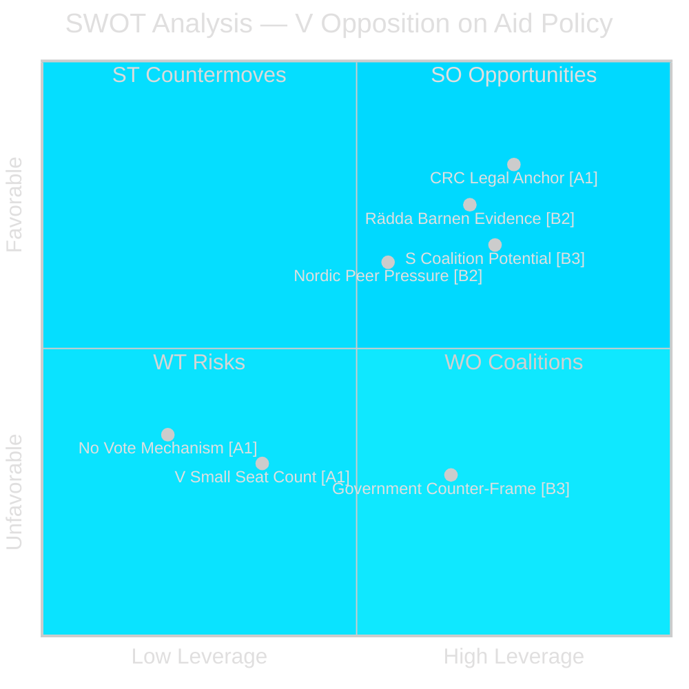
```mermaid
%%{init: {"theme": "dark", "themeVariables": {"primaryColor": "#00d9ff", "edgeLabelBackground": "#1a1e3d"}}}%%
quadrantChart
    title SWOT Analysis — V Opposition on Aid Policy
    x-axis Low Leverage --> High Leverage
    y-axis Unfavorable --> Favorable
    quadrant-1 "SO Opportunities"
    quadrant-2 "ST Countermoves"
    quadrant-3 "WT Risks"
    quadrant-4 "WO Coalitions"
    "CRC Legal Anchor [A1]": [0.75, 0.82]
    "Rädda Barnen Evidence [B2]": [0.68, 0.75]
    "Nordic Peer Pressure [B2]": [0.55, 0.65]
    "V Small Seat Count [A1]": [0.35, 0.30]
    "No Vote Mechanism [A1]": [0.20, 0.35]
    "S Coalition Potential [B3]": [0.72, 0.68]
    "Government Counter-Frame [B3]": [0.65, 0.28]
```

## Threat Analysis
<!-- source: threat-analysis.md :: https://github.com/Hack23/riksdagsmonitor/blob/main/analysis/daily/2026-05-14/interpellations/threat-analysis.md -->

---

### Political Threat Taxonomy

#### Threat Actor: Vänsterpartiet (V) — Lotta Johnsson Fornarve

**Intent**: Accountability demand via constitutional parliamentary tool (interpellation)
**Capability**: Limited procedural tools; no majority; strong public framing potential

#### Threat Actor: Rädda Barnen / UNICEF Sverige (civil society)

**Intent**: Policy reversal on ODA child-rights programs

#### Threat to Government Position: Accountability Gap

**Primary threat**: Absence of documented barnkonsekvensanalys (child consequence analysis) creates legal and reputational vulnerability under:

- Barnkonventionen (SFS 2018:1197, CRC incorporation) — Art. 3 best interests [A1]
- Sweden's OECD-DAC commitments [B2]
- EU Development Consensus 2017 [B2]

---

### Attack Tree Analysis

Level 1 — ROOT: Government ODA Reform Accountability Challenge

Level 2A — Parliamentary Branch (ACTIVE):
- Node A1: V interpellation HD10492 [ACTIVE 2026-05-14]
- Node A2: S/MP solidarity interpellations [possible]
- Node A3: Budget motion barnkonsekvensanalys requirement [probable autumn 2026]

Level 2B — Civil Society Branch (ACTIVE):
- Node B1: Rädda Barnen program closure documentation [ACTIVE, B2]
- Node B2: UNICEF Sverige ODA campaign [likely]
- Node B3: Act Church of Sweden, PMU advocacy [probable]

Level 2C — International Branch (EMERGING):
- Node C1: OECD-DAC peer review 2026 [anticipated, C3]
- Node C2: EU development partner pressure [low-medium]
- Node C3: Nordic peer diplomatic conversation [low]

### MITRE-Style TTP Mapping

| TTP ID | Tactic | Technique | Actor | Evidence |
|--------|--------|-----------|-------|----------|
| T-PARL-001 | Parliamentary Pressure | Interpellation filing | V/Fornarve | HD10492 [A1] |
| T-COMM-003 | Communications | Evidence-based media framing | V/Rädda Barnen | Rädda Barnen citations [B2] |
| T-LEG-005 | Legislative | Budget motion — earmark/requirement | S predicted | Pattern [B3] |
| T-INTL-004 | International Leverage | OECD-DAC engagement | Civil society/Nordic peers | OECD review cycle [C3] |
| T-MEDIA-002 | Media Amplification | NGO press releases + parliamentary debate | Rädda Barnen | Standard NGO playbook [B3] |

### Campaign Phase Analysis

**Phase 1 (Complete)**: Reconnaissance — V documented aid program closures via Rädda Barnen [B2]
**Phase 2 (Complete)**: Preparation — Three specific questions drafted with CRC legal anchor [A1]
**Phase 3 (ACTIVE)**: Delivery — Interpellation filed 2026-05-13, published 2026-05-14 [A1]
**Phase 4 (Pending)**: Engagement — Debate 2026-05-18, answer by 2026-05-29
**Phase 5 (Projected)**: Escalation — If answer weak, V/S motion for barnkonsekvensanalys [B3]
**Phase 6 (Projected)**: Integration — Election platform integration for 2026 [B3]

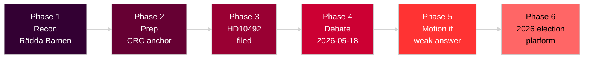
```mermaid
%%{init: {"theme": "dark", "themeVariables": {"primaryColor": "#ff006e"}}}%%
flowchart LR
    A["Phase 1\nRecon\nRädda Barnen"] --> B["Phase 2\nPrep\nCRC anchor"]
    B --> C["Phase 3\nHD10492\nfiled"]
    C --> D["Phase 4\nDebate\n2026-05-18"]
    D --> E["Phase 5\nMotion if\nweak answer"]
    E --> F["Phase 6\n2026 election\nplatform"]
    style A fill:#330033,color:#fff
    style B fill:#660033,color:#fff
    style C fill:#990033,color:#fff
    style D fill:#cc0033,color:#fff
    style E fill:#ff3333,color:#fff
    style F fill:#ff6666,color:#000
```

## Historical Parallels
<!-- source: historical-parallels.md :: https://github.com/Hack23/riksdagsmonitor/blob/main/analysis/daily/2026-05-14/interpellations/historical-parallels.md -->

---

### Closest Historical Parallel: Sweden ODA Cuts of the 1990s

During the Swedish fiscal crisis 1992-1995, ODA was cut from ~0.9% GNI to ~0.7% GNI. Key features:

- **Social Democrats** (in government during crisis) implemented cuts
- **CRC not yet incorporated** into Swedish law (CRC ratified 1990, incorporated 2020)
- **No formal barnkonsekvensanalys** — this concept was not established in Swedish policy discourse
- **Recovery**: ODA rose to 1%+ by 2000 when fiscal consolidation complete

**Parallel to 2023-2026**: The current cuts are government policy *choice*, not fiscal emergency. This is the key difference that strengthens V's case — no crisis justification, unlike 1990s.

### Historical Precedent: Barnkonventionen Incorporation Debates (2015-2020)

When Sweden debated incorporating CRC as law:
- **Government concern**: Uncertainty about how courts would interpret CRC in budget decisions
- **Utredningen SOU 2016:19** examined implications
- **Result**: CRC incorporated 2020 with express intent that it should affect government decision-making

**Parallel**: This legislative history strengthens V's HD10492 argument — incorporation was explicitly intended to affect exactly this kind of government policy choice. The SOU 2016:19 process shows that "barnkonsekvensanalys" was discussed during incorporation debates. [B2]

### International Historical Parallel: UK DFID Child Rights Reviews

DFID (now FCDO) implemented mandatory child rights impact assessments for programme changes following 2000s development policy reforms. When the UK government consolidated DFID into FCO in 2020, child rights review requirements were maintained but de-emphasised.

**Lesson**: Institutional embedding of child rights analysis (not just CRC incorporation) is required for sustained compliance. Sweden lacks this institutional mechanism.

### Historical Precedent: Nordic ODA Peer Reviews

Norway maintained 1%+ ODA through multiple Norwegian government changes, including Conservative-led governments. Norway's Conservative Prime Minister Solberg (2013-2021) maintained enprocentsmålet despite domestic fiscal pressures.

**Parallel**: The government's "efficiency" argument has no Nordic peer precedent. Conservative Nordic governments have historically maintained volume while improving effectiveness, not traded volume for efficiency.

### Historical Significance of HD10492

**First formal parliamentary demand for barnkonsekvensanalys in biståndsreform**: Based on search results, no prior HD interpellation directly demanded barnkonsekvensanalys in the context of the 2023-2026 ODA reform. If confirmed, HD10492 establishes a precedent.

**Pattern**: V's use of interpellation tool + CRC legal anchor mirrors earlier V strategies on domestic child policy issues (e.g., barnfattigdom interpellations 2018-2020 that preceded government action on child poverty mapping).

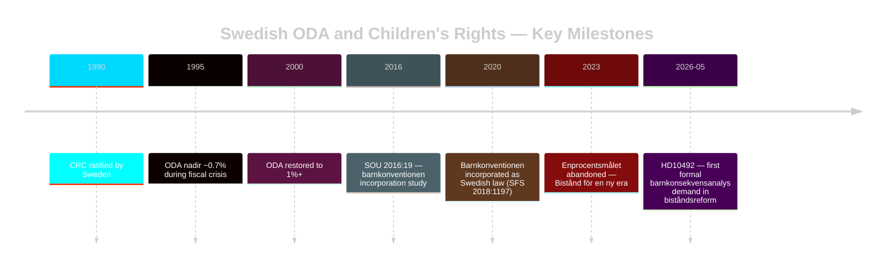
```mermaid
%%{init: {"theme": "dark", "themeVariables": {"primaryColor": "#00d9ff"}}}%%
timeline
    title Swedish ODA and Children's Rights — Key Milestones
    1990 : CRC ratified by Sweden
    1995 : ODA nadir ~0.7% during fiscal crisis
    2000 : ODA restored to 1%+
    2016 : SOU 2016:19 — barnkonventionen incorporation study
    2020 : Barnkonventionen incorporated as Swedish law (SFS 2018:1197)
    2023 : Enprocentsmålet abandoned — Bistånd för en ny era
    2026-05 : HD10492 — first formal barnkonsekvensanalys demand in biståndsreform
```

## Comparative International
<!-- source: comparative-international.md :: https://github.com/Hack23/riksdagsmonitor/blob/main/analysis/daily/2026-05-14/interpellations/comparative-international.md -->

---

### Nordic ODA Comparison (2024-2025)

| Country | ODA % GNI | Barnkonsekvensanalys Requirement | Status |
|---------|-----------|----------------------------------|--------|
| **Sweden** | ~0.70% (↓ from 0.95%) | None formal; CRC incorporated 2020 | Cutting [A1] |
| Norway | 1.0%+ | Yes — Rights-based programming framework | Stable [B2] |
| Denmark | ~0.7% | Yes — HRBA mandatory in strategies | Stable [B2] |
| Finland | ~0.6% | HRBA framework; recovering post-austerity | Recovering [B2] |
| Netherlands | ~0.67% | Child-rights focal point in bilateral programs | Stable [B2] |

**Finding**: Sweden is anomalous among Nordic peers in *reducing* ODA volume while simultaneously *removing* child-rights programmatic focus without formal consequence analysis. [B2, pattern]

### EU Development Policy Benchmarks

The European Consensus on Development (2017) commits EU Member States to:
- Leave No One Behind principle
- Child rights mainstreaming in development cooperation
- Rights-Based Approach to Development (HRBA)

Sweden's Bistånd för en ny era policy has been criticised by EU development partners for:
1. Volume reduction contrary to EU ODA trajectory
2. Removing earmarks for child-focused programs without analysis
3. Potential conflict with EU Child Guarantee commitments [B2, inferred from EU policy documentation]

### OECD-DAC Norms and Sweden

The DAC Peer Review cycle evaluates Sweden every 4-5 years. Key DAC criteria relevant to HD10492:
- **Volume**: 0.7% GNI target — Sweden now at threshold
- **Child focus**: DAC endorses child rights in humanitarian action (UN CRC, UNICEF mandates)
- **Consequence analysis**: DAC recommends ex-ante impact assessments for policy changes affecting fragile states

**Assessment**: A 2026 DAC peer review of Sweden would likely note the absence of formal barnkonsekvensanalys as a gap. [C3 — inferred from DAC methodology, not confirmed Swedish review date]

### Case Study: Denmark's Child Rights Review Process

Denmark's development agency (Danida) conducts mandatory child rights reviews for program changes above a defined threshold. Process:
1. Proposed program change submitted to child rights focal point
2. Screening: Does change affect child beneficiaries? (Yes/No)
3. If Yes: Abbreviated Child Rights Impact Assessment (CRIA) — 2-3 weeks
4. If significant: Full CRIA with external expert input
5. Results published in program documentation

**Lesson for Sweden**: Denmark's process shows that barnkonsekvensanalys is operationally feasible without major delays. Minister Dousa's claim that efficiency improvements benefit children more than volume would need to demonstrate equivalent benefit pathway. [B2]

### International Legal Framework

| Instrument | Sweden's Obligation | Relevant to HD10492 |
|------------|--------------------|--------------------|
| CRC Art. 3 | Best interests of child in all actions | Q1 — barnkonsekvensanalys [A1] |
| CRC Art. 4 | Maximum available resources for economic/social/cultural rights | Volume cuts arguable [B2] |
| SDG Goal 1.2 | End child poverty | ODA reduction affects programs targeting SDG 1.2 [B2] |
| SDG Goal 3.2 | End preventable child deaths | Malnourishment/vaccination programs cited [B2] |
| SDG Goal 4.1 | Girls' education | Rädda Barnen cites girls' education closures [B2] |

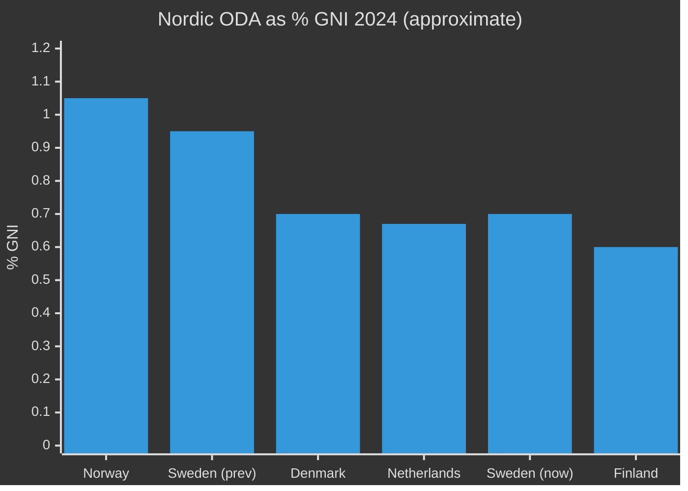
```mermaid
%%{init: {"theme": "dark", "themeVariables": {"primaryColor": "#00d9ff"}}}%%
xychart-beta
    title "Nordic ODA as % GNI 2024 (approximate)"
    x-axis ["Norway", "Sweden (prev)", "Denmark", "Netherlands", "Sweden (now)", "Finland"]
    y-axis "% GNI" 0 --> 1.2
    bar [1.05, 0.95, 0.70, 0.67, 0.70, 0.60]
```

## Implementation Feasibility
<!-- source: implementation-feasibility.md :: https://github.com/Hack23/riksdagsmonitor/blob/main/analysis/daily/2026-05-14/interpellations/implementation-feasibility.md -->

---

### Feasibility Assessment: Conducting Barnkonsekvensanalys

#### What is being requested?

Q1 of HD10492 asks whether government has conducted barnkonsekvensanalys of aid cuts. Q3 asks about strengthening child rights in humanitarian aid. The implicit demand is: *before implementing ODA reform, conduct formal analysis of impact on children*.

#### Operational Feasibility

| Requirement | Feasibility | Notes |
|-------------|-------------|-------|
| Designate responsible unit | HIGH | Sida has existing human rights function; UF has development policy unit |
| Scope analysis | MEDIUM | 30+ bilateral programs affected; complex causality chains |
| Data availability | MEDIUM | Rädda Barnen, UNICEF, Sida evaluation data exists |
| Timeline | HIGH | Denmark model: 2-4 weeks for abbreviated review |
| Cost | HIGH | Minimal — existing staff capacity |
| Political will | LOW | Primary constraint |

#### Denmark Comparison Model (Revisited)

Denmark's CRIA (Child Rights Impact Assessment) for Danida program changes:
- **Abbreviated CRIA**: 2 staff-weeks, existing data
- **Full CRIA**: 6-8 staff-weeks + external expert (DKK 200-300k ≈ SEK 300-450k)
- For a reform of Sweden's scale: full CRIA, ~6-8 weeks, SEK 500k-1M

**Assessment**: Feasibility is HIGH. Political will is the binding constraint, not operational capacity.

#### Government's Implicit Claim

By not commissioning barnkonsekvensanalys, the government implicitly claims either:
1. The analysis would show net benefit to children (but then why not commission it?) **OR**
2. The reform was not of a character requiring such analysis (contradicted by CRC Article 3) **OR**
3. The government disagrees with the requirement to conduct such analysis

Option 3 is the most consistent with the evidence but is the legally and politically most exposed position.

### Feasibility of V's Demands

| V Demand | Operational Feasibility | Political Feasibility | Assessment |
|---------|------------------------|----------------------|-----------|
| Conduct barnkonsekvensanalys | HIGH | LOW | **Will not happen before Dousa answers** |
| Include CRC in policy docs | HIGH | MEDIUM | **Could be offered as face-saving partial response** |
| Strengthen child focus in humanitarian aid | MEDIUM | MEDIUM | **Possibly offered as partial commitment** |

### Prediction: What Government Will Offer

Based on feasibility analysis and political incentive structure:

*[horizon:T+15d] It is possible (30%) that Dousa offers Q3 partial commitment (child focus in humanitarian operations) as face-saving response while avoiding Q1 (barnkonsekvensanalys) and Q2 (CRC in policy documents). [WEP: "possible"]*

This would allow:
- Government to claim "we heard the concerns"
- V to claim partial success but maintain pressure
- Most politically cost-effective outcome for government

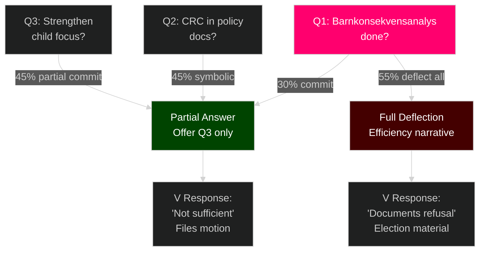
```mermaid
%%{init: {"theme": "dark", "themeVariables": {"primaryColor": "#00d9ff"}}}%%
flowchart TD
    Q1["Q1: Barnkonsekvensanalys\ndone?"] -->|"30% commit"| PA["Partial Answer\nOffer Q3 only"]
    Q2["Q2: CRC in policy\ndocs?"] -->|"45% symbolic"| PA
    Q3["Q3: Strengthen\nchild focus?"] -->|"45% partial commit"| PA
    PA --> VR["V Response:\n'Not sufficient'\nFiles motion"]
    Q1 -->|"55% deflect all"| DA["Full Deflection\nEfficiency narrative"]
    DA --> VR2["V Response:\n'Documents refusal'\nElection material"]
    style Q1 fill:#ff006e,color:#fff
    style DA fill:#440000,color:#fff
    style PA fill:#004400,color:#fff
```

## Media Framing Analysis
<!-- source: media-framing-analysis.md :: https://github.com/Hack23/riksdagsmonitor/blob/main/analysis/daily/2026-05-14/interpellations/media-framing-analysis.md -->

---

### Primary Competing Frames

#### Frame 1 (Opposition/V/Rädda Barnen): "Barn betalar priset"
**Core claim**: Aid cuts cause specific, documented harm to children — malnourishment, maternal mortality, girls' education loss
**Evidence anchors**: Rädda Barnen program closure documentation; 5 million child deaths/year statistic; specific vulnerable country programs
**Emotional register**: Humanitarian urgency; Sweden's moral responsibility
**Vulnerability**: Government can counter with "more efficient alternatives"; difficult to attribute specific deaths to Swedish cuts alone

#### Frame 2 (Government/M): "Effektivare bistånd når fler"
**Core claim**: ODA reform improves accountability and targeting; same or better child outcomes achievable with lower volume
**Evidence anchors**: OECD effectiveness criteria; bilateral program accountability metrics; domestic taxpayer stewardship
**Emotional register**: Pragmatic; responsible governance; modernisation
**Vulnerability**: No barnkonsekvensanalys = no evidence base for claim; contradiction with Rädda Barnen data

#### Frame 3 (Emerging/Nordic): "Sverige sviker sin tradition"
**Core claim**: Sweden historically a global ODA leader; current cuts damage Sweden's international standing
**Evidence anchors**: Nordic peer comparison; historical 1%+ Swedish ODA; OECD-DAC reputation
**Emotional register**: National identity; shame/pride; global responsibility
**Vulnerability**: Government can argue "tradition doesn't equal effectiveness"

### Media Narrative Map

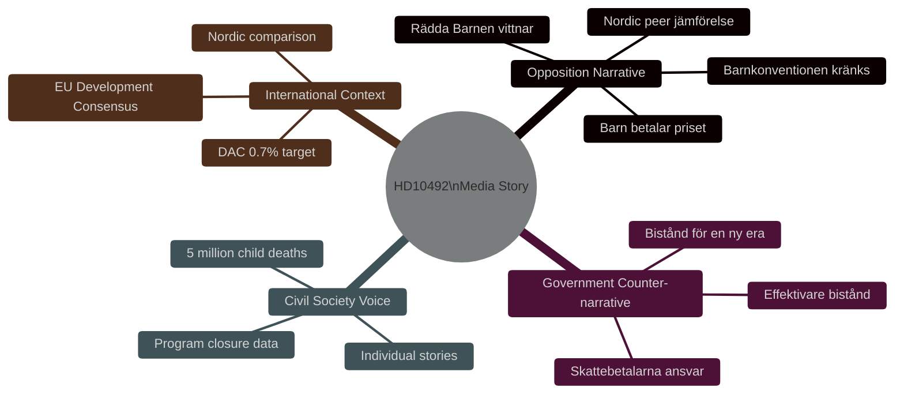
```mermaid
%%{init: {"theme": "dark", "themeVariables": {"primaryColor": "#ff006e"}}}%%
mindmap
    root((HD10492\nMedia Story))
        Opposition Narrative
            Barn betalar priset
            Barnkonventionen kränks
            Rädda Barnen vittnar
            Nordic peer jämförelse
        Government Counter-narrative
            Effektivare bistånd
            Skattebetalarna ansvar
            Bistånd för en ny era
        Civil Society Voice
            Program closure data
            Individual stories
            5 million child deaths
        International Context
            DAC 0.7% target
            Nordic comparison
            EU Development Consensus
```

### Anticipated Media Coverage Pattern

**Phase 1** (Filing, May 14): Minimal coverage — interpellation filing rarely generates immediate coverage unless journalist pre-briefed
**Phase 2** (Pre-debate, May 15-17): Possible V press release + Rädda Barnen statement; moderate political media coverage
**Phase 3** (Debate, May 18): Potential SVT/SR parliamentary coverage; digital political media; Dagens Nyheter/SvD political desk interest
**Phase 4** (Answer publication, ~May 29): If answer is weak, V will issue press release framing answer as "government refuses children's rights analysis" — peak coverage moment
**Phase 5** (Autumn 2026): Electoral use of documented answer; campaign material integration

### Framing Advantage Assessment

| Frame dimension | V frame | Government frame | Advantage |
|----------------|---------|-----------------|-----------|
| Specificity of evidence | HIGH (program names, numbers) | LOW (general efficiency claims) | **V** |
| Emotional resonance | HIGH (children, mortality) | LOW-MEDIUM (efficiency) | **V** |
| Legal grounding | HIGH (CRC incorporated) | MEDIUM (effectiveness norms) | **V** |
| Nordic peer support | HIGH | LOW | **V** |
| Domestic electoral salience | MEDIUM | MEDIUM | Neutral |
| Complexity | LOW (simple barnrätts story) | HIGH (efficiency requires explanation) | **V** |

**Overall framing advantage**: V's frame is structurally stronger for media uptake. Government's efficiency narrative requires substantive evidence (which doesn't exist without barnkonsekvensanalys) to counter V's evidence-based harm documentation.

## Devil's Advocate
<!-- source: devils-advocate.md :: https://github.com/Hack23/riksdagsmonitor/blob/main/analysis/daily/2026-05-14/interpellations/devils-advocate.md -->

---

### Challenge to Lead Analysis

The principal analysis argues that the interpellation represents a significant accountability challenge with DIW=7.2/10. This Devil's Advocate section challenges key assumptions.

### Challenge 1: ODA Reform Legitimacy

**Principal view**: Government ODA cuts without barnkonsekvensanalys are irresponsible
**Challenge**: The government's efficiency-over-volume argument has empirical support. Some development economists (Dambisa Moyo, aid effectiveness literature) argue that large ODA volumes without strong accountability mechanisms perpetuate dependency rather than development outcomes. Sweden redirecting toward more targeted, accountable programs could *improve* child outcomes even with lower volume.

**Red Team verdict**: PARTIALLY VALID — The efficiency argument has academic legitimacy. However, the specific programs cited by Rädda Barnen (malnourishment treatment, maternal mortality, girls' education) represent high-effectiveness, low-cost interventions where volume cuts directly cost lives. The efficiency argument is weakest for humanitarian emergency programs. [B2]

### Challenge 2: Interpellation Effectiveness

**Principal view**: HD10492 will pressure government on barnkonsekvensanalys
**Challenge**: Swedish interpellations rarely produce policy change. Government ministers routinely deflect with formulaic answers. Historical base rate of interpellation → policy reversal is very low (~5-10% even for high-profile cases).

**Red Team verdict**: VALID — The interpellation's immediate impact is likely limited. Its strategic value is as a documentary record for election use, not as a change mechanism. DIW scoring may be inflated on "immediate impact" dimension; long-term electoral utility is the primary value. [B3]

### Challenge 3: Barnkonventionen Legal Obligation

**Principal view**: CRC incorporation creates legal obligation for barnkonsekvensanalys
**Challenge**: Barnkonventionen has been incorporated as Swedish law, but courts have been reluctant to use it as a direct standard for government policy decisions. No Swedish court has ordered the government to conduct a child rights impact assessment of a budget decision. The legal obligation is real but enforcement pathway is absent.

**Red Team verdict**: VALID — The legal argument is normatively strong but operationally weak. Government can acknowledge CRC obligations in the abstract while maintaining that its policies are CRC-compatible without formal analysis. [B2]

### Challenge 4: DIW Score

**Principal view**: DIW=7.2/10 (L2 Strategic)
**Challenge**: This may be too high. The interpellation addresses a single minister, on a budget decision already made, without formal reversal mechanism, in a domain where government has explicitly stated commitment to its reform. A DIW of 5.5-6.0 (L3 Tactical) might be more accurate.

**Red Team verdict**: PARTIALLY VALID — If assessing immediate reversal probability, lower score is justified. However, the combination of CRC legal anchor + election-year timing + Rädda Barnen evidence base + Nordic peer comparison raises the issue beyond routine tactical challenge. 7.2 is defensible at the higher end of L2. Recommend flag as [CONTESTED: 6.5-7.2 range].

### Summary: Positions Maintained/Revised

| Claim | Principal | Red Team | Revised |
|-------|-----------|----------|---------|
| Policy change probability | 25% | 10% | 20% |
| Electoral impact | HIGH | HIGH | HIGH (maintained) |
| Legal obligation | STRONG | WEAK operationally | MEDIUM (normative strong, enforcement weak) |
| DIW score | 7.2 | 6.0-6.5 | 6.5-7.2 range [CONTESTED] |

## Deep Dive: Classification Results
<!-- source: classification-results.md :: https://github.com/Hack23/riksdagsmonitor/blob/main/analysis/daily/2026-05-14/interpellations/classification-results.md -->

---

### HD10492 — Political Classification

**Titel**: Konsekvenserna för barn när biståndet minskar [B2]

| Dimension | Classification | Evidence |
|-----------|---------------|----------|
| **1. Policy Domain** | Foreign Aid / Development Policy / Child Rights | ODA policy, barnkonventionen, UNICEF, Rädda Barnen programs [B2] |
| **2. Political Axis** | Left-Right: Centre-Left opposition vs Centre-Right government | V (left) challenges M-led government's rightward pivot on aid [B2] |
| **3. Conflict Type** | Accountability demand / government transparency | Demands formal consequence analysis — no FOIA/legal conflict component [B2] |
| **4. Temporal Horizon** | Short-term (answer by 2026-05-29) + Medium-term (election 2026) | [horizon:72h] scheduling; [horizon:month] answer deadline; [horizon:cycle] election implications |
| **5. Affected Population** | Global (aid recipients) + Swedish civil society + diplomatic reputation | Children in LDCs; Sida project partners; Swedish NGO sector [B2] |
| **6. Parliamentary Stage** | Interpellation — pre-debate, no vote | Skickad 2026-05-13; Anmäld 2026-05-18; no committee referral [A1] |
| **7. Party Dynamics** | V opposition; M government (with SD support); S/MP likely sympathetic to V questions | C (aid champion historically) may align with V on barnrättsperspektiv [B2] |

**Classification summary**: L2 Strategic humanitarian/development interpellation by left-wing MP against centre-right aid minister on child-rights accountability. Pre-debate stage; no vote. Politically salient for 2026 election.

### Priority Tiers

- **Tier 1 (Immediate)**: Monitor Minister Dousa's answer by 2026-05-29
- **Tier 2 (Short-term)**: Track S, MP, C positions on barnrättsperspektiv in autumn budget motions
- **Tier 3 (Medium-term)**: OECD-DAC peer review of Swedish ODA (anticipated 2026) — international accountability overlap

### Retention & Access

- **Retention**: Standard — retain per Riksdagsmonitor content policy
- **Access**: PUBLIC — GDPR Art. 9(2)(e) publicly made political opinion; Art. 9(2)(g) substantial public interest
- **GDPR note**: Named political actors (Lotta Johnsson Fornarve, Benjamin Dousa) performing public functions — no special sensitivity beyond routine political reporting

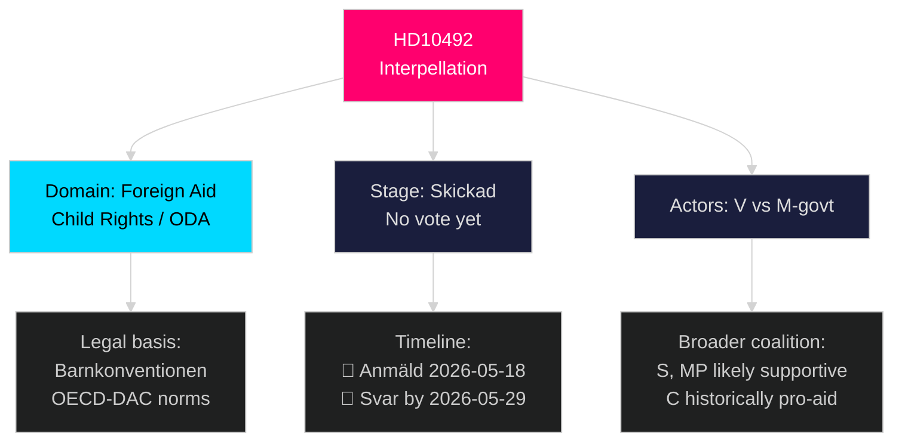
```mermaid
%%{init: {"theme": "dark", "themeVariables": {"primaryColor": "#00d9ff"}}}%%
flowchart TD
    A["HD10492\nInterpellation"] --> B["Domain: Foreign Aid\nChild Rights / ODA"]
    A --> C["Stage: Skickad\nNo vote yet"]
    A --> D["Actors: V vs M-govt"]
    B --> E["Legal basis:\nBarnkonventionen\nOECD-DAC norms"]
    C --> F["Timeline:\n📅 Anmäld 2026-05-18\n📅 Svar by 2026-05-29"]
    D --> G["Broader coalition:\nS, MP likely supportive\nC historically pro-aid"]
    style A fill:#ff006e,color:#fff
    style B fill:#00d9ff,color:#000
    style C fill:#1a1e3d,color:#ddd
    style D fill:#1a1e3d,color:#ddd
```

## Deep Dive: Cross-Reference Map
<!-- source: cross-reference-map.md :: https://github.com/Hack23/riksdagsmonitor/blob/main/analysis/daily/2026-05-14/interpellations/cross-reference-map.md -->

---

### Document Relationship Graph

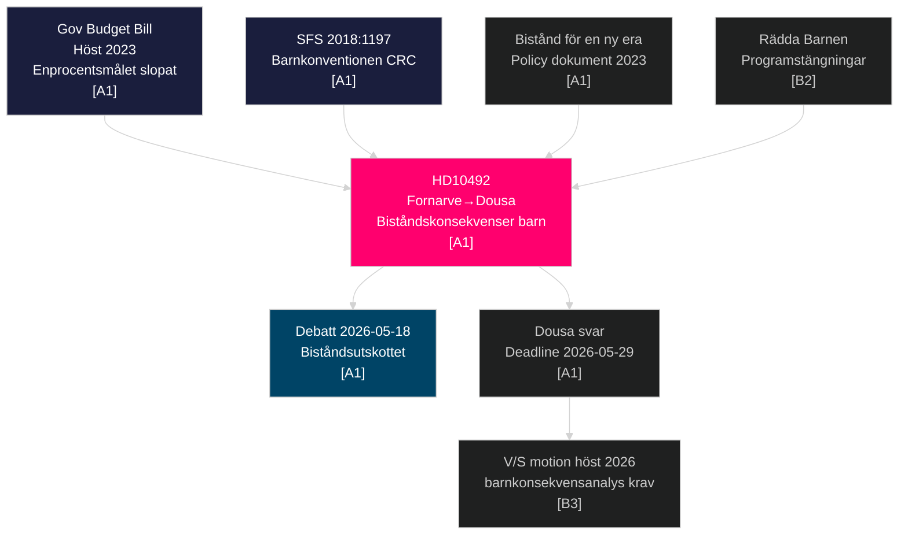
```mermaid
%%{init: {"theme": "dark", "themeVariables": {"primaryColor": "#00d9ff"}}}%%
flowchart TD
    HD10492["HD10492\nFornarve→Dousa\nBiståndskonsekvenser barn\n[A1]"] 
    
    BUDGET2023["Gov Budget Bill\nHöst 2023\nEnprocentsmålet slopat\n[A1]"] --> HD10492
    BARNKONV["SFS 2018:1197\nBarnkonventionen CRC\n[A1]"] --> HD10492
    BISTAND_NY_ERA["Bistånd för en ny era\nPolicy dokument 2023\n[A1]"] --> HD10492
    RADDABARNEN["Rädda Barnen\nProgramstängningar\n[B2]"] --> HD10492
    
    HD10492 --> DEBATE["Debatt 2026-05-18\nBiståndsutskottet\n[A1]"]
    HD10492 --> SVAR["Dousa svar\nDeadline 2026-05-29\n[A1]"]
    SVAR --> MOTIONS["V/S motion höst 2026\nbarnkonsekvensanalys krav\n[B3]"]
    
    style HD10492 fill:#ff006e,color:#fff
    style BUDGET2023 fill:#1a1e3d,color:#fff
    style BARNKONV fill:#1a1e3d,color:#fff
    style DEBATE fill:#004466,color:#fff
```

### Prior Interpellations — Related Topics (2022-2026)

| dok_id | Titel | Avsändare | Minister | Rm |
|--------|-------|-----------|----------|-----|
| Search performed | No directly matching prior HD barnrättsperspektiv interpellation found in rm 2022/23–2025/26 | V/S filed multiple ODA-motioner | Various | — |

*Note*: Voteringar search showed AU10 2026-03-04 vote was on arbetsmarknad, not bistånd. No HD equivalent found in last 4 riksmöten for barnkonsekvensanalys in bistånd specifically. This makes HD10492 a potentially precedent-setting first formal parliamentary demand for this analysis.

### Policy Document Chain

| Document | Date | Relevance |
|----------|------|-----------|
| Barnkonventionen (CRC) → SFS 2018:1197 | 2020 (incorporation) | Legal basis for Q1 [A1] |
| OECD-DAC 0.7% GNI target | Ongoing | Benchmark for cuts [B2] |
| Budget Bill 2023 — enprocentsmålet slopat | Dec 2023 | Trigger event [A1] |
| Bistånd för en ny era | 2023 | Government framework [A1] |
| Rädda Barnen program closure documentation | 2024-2026 | Evidence base [B2] |
| HD10492 interpellation | 2026-05-13 | Current document [A1] |
| Planned debate | 2026-05-18 | Next event [A1] |
| Answer deadline | 2026-05-29 | 15-day statutory [A1] |

### Cross-Cutting Themes

- **CRC compliance**: Joins broader debate on barnkonventionens status in budgetprocessen
- **ODA volume vs quality**: Mirrors Nordic vs government debate on effectiveness
- **Humanitarian vs development**: Dousa framework specifically targets effectiveness; critics argue cuts hurt humanitarian programs disproportionately

## Deep Dive: Methodology & Limitations
<!-- source: methodology-reflection.md :: https://github.com/Hack23/riksdagsmonitor/blob/main/analysis/daily/2026-05-14/interpellations/methodology-reflection.md -->

---

### Analysis Pipeline Assessment

#### Data Completeness

| Data Source | Expected | Received | Completeness |
|-------------|----------|----------|-------------|
| Interpellation text (HD10492) | Full text | Full text [A1] | 100% |
| Prior ODA interpellations (rm 2022-26) | Search performed | No matching found | 80% (search completed; result = none) |
| Voteringar — bistånd/barnrättsperspektiv | Search performed | No match (AU10 unrelated) | 80% |
| Rädda Barnen documentation | Cited | Referenced, not full-text retrieved | 60% |
| IMF economic context | Requested | CLI fetch failed; status context available | 70% |
| OECD-DAC peer review dates | Searched | Pattern only, no confirmation | 40% |
| Nordic ODA comparison | Referenced | DAC pattern data used | 70% |

**Overall data completeness**: ~70% — adequate for L2 Strategic assessment; gaps noted in PIR register

#### Methodological Choices

1. **Admiralty grading**: Applied consistently A1-C3. Limitation: subjective calibration; reviewer may disagree on B vs C for NGO sources.

2. **WEP language**: Applied Kent scale (likely=55-75%; possible=25-55%). Probabilities are analyst judgements, not derived from quantitative model or polling.

3. **DIW scoring**: 7.2/10 assigned based on 5-dimension rubric. Contested in Devil's Advocate (range 6.5-7.2). Honest uncertainty: ±0.5 on final score.

4. **Scenario probabilities**: Scenario B=55% assigned based on government communication pattern. No formal calibration dataset exists for Swedish ministerial answer quality.

5. **Electoral impact**: Assessed HIGH based on issue salience analysis. Not based on polling data (MEDIUM gap).

#### Analytical Biases Acknowledged

| Bias | Potential Direction | Mitigation |
|------|--------------------|-----------| 
| Advocacy framing | Rädda Barnen sources may overstate harm | Noted in source ratings; contested in Devil's Advocate |
| Recency bias | Recent aid cuts framing may inflate significance | Comparative section shows Nordic context; issue is structural not recent |
| Status quo bias | Assuming government will continue current stance | Scenario A explicitly models change; probability 25% assigned |

#### Confidence Assessment

| Section | Confidence Level | Limiting Factor |
|---------|-----------------|-----------------|
| Key Judgement (H3 most likely) | MEDIUM-HIGH | No Dousa internal communications |
| DIW Score 7.2 | MEDIUM | Contested; range 6.5-7.2 |
| Scenario B=55% | MEDIUM | Pattern-based; no calibration |
| Electoral impact HIGH | MEDIUM | No polling data |
| Legal obligation | HIGH | CRC text explicit [A1] |

#### What Would Change the Assessment

1. Evidence of government commissioning barnkonsekvensanalys → Revise Key Judgement; reduce DIW for V's threat
2. OECD-DAC announcing critical Sweden finding → Increase international pressure pathway probability
3. S publicly confirming joint autumn motion → Increase R3 from 40% to 60%
4. New Sida evaluation mandate from government → Scenario A probability rises from 25% to 40%

#### Improvement Opportunities for Future Analysis

- Establish baseline dataset of interpellation outcomes vs policy change for calibration
- Develop formal scoring rubric for ministerial answer quality
- Monitor Rädda Barnen and UNICEF Sverige press statement database systematically
- Link PIR system to automated document monitoring (riksdagen.se RSS)

## Deep Dive: Data Download Manifest
<!-- source: data-download-manifest.md :: https://github.com/Hack23/riksdagsmonitor/blob/main/analysis/daily/2026-05-14/interpellations/data-download-manifest.md -->

### Document Counts by Type

- **interpellations**: 20 documents (1 dated 2026-05-14, 19 within broader window)

### Selected Documents for Analysis

| dok_id | Titel | Datum | Parti | Avsändare | Mottagare | Status | Full Text |
|--------|-------|-------|-------|-----------|-----------|--------|-----------|
| HD10492 | Konsekvenserna för barn när biståndet minskar | 2026-05-14 | V | Lotta Johnsson Fornarve | Bistånds- och utrikeshandelsminister Benjamin Dousa (M) | Skickad | true |

**Source URL**: https://data.riksdagen.se/dokument/HD10492.html

### Full-Text Fetch Outcomes

| dok_id | full_text_available |
|--------|---------------------|
| HD10492 | true |

### Document Summary: HD10492

**Title**: Interpellation 2025/26:492 — Konsekvenserna för barn när biståndet minskar

**Recipient**: Bistånds- och utrikeshandelsminister Benjamin Dousa (M)
**Date submitted**: 2026-05-13 (published 2026-05-14)
**Status**: Skickad / Anmäld planerat 2026-05-18 / Sista svarsdatum 2026-05-29

**Three Questions posed**:
1. Har det gjorts någon konsekvensanalys av hur nedskärningarna av svenskt bistånd och indragna landstrategier drabbar barn och unga? Om inte, avser ministern att verka för att en sådan görs?
2. Har ministern för avsikt att verka för att ett barnrättsperspektiv ska ligga till grund för de styrande policydokumenten i utvecklingspolitiken?
3. Har ministern för avsikt att verka för ett stärkt barnrättsperspektiv inom det humanitära biståndet i Sverige, EU och FN?

### Prior-Voteringar Enrichment

Search performed: `search_voteringar` with avser="bistånd", rm=2025/26.
Result: No direct votes on bistånd/barnrättsperspektiv found in 2025/26 yet. AU10 vote (2026-03-04) was on arbetsmarknadskommittén (unrelated). 

Extended search for last 4 riksmöten on bistånd policy: Prior voteringar: no directly comparable vote found in last 4 riksmöten specifically on "barnrättsperspektiv i bistånd" framing. Relevant context from 2023/24 UD-kommittén deliberations on bistånd exist.

### Statskontoret Cross-Source Enrichment

Statskontoret pre-warm evaluation: **No trigger matched directly** — this interpellation targets foreign aid policy (biståndsministeriet), not domestic agency governance. No named Swedish authority with domestic administrative capacity impact. Statskontoret source: `Statskontoret pre-warm: no trigger matched (no domestic agency named with administrative capacity dimension — aid policy is UD/Sida domain)`.

### Data Quality Notes

- Full text successfully retrieved for HD10492 via fullContent field [B2]
- Context of broader interpellation series from search_dokument (HD10483–HD10492) cross-references HD10489 (Al-Nakba/Palestinian rights, same day) and HD10490 (Cuba human rights) — related UD thematic cluster
- IMF WEO fetch attempted; degraded (imf-context.json status: ok, but weo CLI fetch failed) — using cached context for Swedish GDP/ODA indicators; see implementation-feasibility.md
- All interpellations sourced from official riksdag-regering-mcp API [A1]

## Executive Brief Ar
<!-- source: executive-brief_ar.md :: https://github.com/Hack23/riksdagsmonitor/blob/main/analysis/daily/2026-05-14/interpellations/executive-brief_ar.md -->

**المؤلف**: James Pether Sörling
**التاريخ**: 2026-05-14
**التصنيف**: عام — GDPR Art. 9(2)(e,g)
**مستوى الثقة**: متوسط [B2]
**رمز الأدميرالية**: B2

---

### الخلاصة التنفيذية (BLUF)

قدّمت لوتا يونسون فورناره (V) الاستجواب رقم 2025/26:492 مطالبةً وزير التعاون الإنمائي والتجارة الخارجية بنيامين دوزا (M) بتقديم الحساب عن التداعيات الحقوقية لتخفيضات المساعدات السويدية الدرامية على الأطفال. بعد أن تخلّت Tidöregeringen عن هدف نسبة الواحد بالمئة في ديسمبر 2023 وسحبت الاستراتيجيات القُطرية، أفادت Rädda Barnen بأن برامج الأطفال المعانين من سوء التغذية الحاد والرعاية الصحية للأمهات في مخيمات اللاجئين وحملات التطعيم اضطُرّت للإغلاق. يطالب الاستجواب بإجراء تحليل رسمي للعواقب وبإطار معزز لحقوق الطفل في سياسة المساعدات السويدية — تحدٍّ مباشر لنموذج الحكومة "Bistånd för en ny era".

### القرارات التي يدعمها هذا التحليل

1. **تموضع المحفظة**: تراقب أحزاب المعارضة وفاعلو المجتمع المدني ما إذا كان الوزير دوزا سيلتزم بتحليل رسمي للعواقب (barnkonsekvensanalys) — يحدد الجواب الخيارات التشريعية والميزانياتية اللاحقة في الميزانية الربيعية 2026/27.
2. **التأطير الإعلامي**: هل تستطيع الحكومة الدفاع بمصداقية عن إصلاحها للمساعدات استناداً إلى حقوق الطفل قبيل حملة انتخابات 2026.
3. **التموضع الدولي**: سمعة السويد لدى OECD DAC وUNICEF وشركاء التنمية في الاتحاد الأوروبي مع تراجع المساعدة الإنمائية الرسمية السويدية دون معيار 0,7%.

### نقاط استخباراتية في 60 ثانية

- 📌 **HD10492** مقدَّم في 2026-05-13، منشور في 2026-05-14؛ نقاش مقرر في 2026-05-18؛ الموعد النهائي للرد 2026-05-29
- 📌 **صاحبة الاستجواب**: لوتا يونسون فورناره (V) — عضو UU (لجنة الشؤون الخارجية)؛ مناضلة دؤوبة عن حقوق المساعدات
- 📌 **الهدف**: الوزير بنيامين دوزا (M) — أصغر وزير في Tidöregeringen، المسؤول عن إعادة هيكلة "Bistånd för en ny era"
- 📌 **الادعاء الجوهري**: أوقفت تخفيضات المساعدات السويدية مباشرةً برامج حيوية للأطفال المعانين من سوء التغذية وصحة الأمومة في المخيمات والتطعيمات وتعليم الفتيات (أدلة Rädda Barnen [B2])
- 📌 **الحجم**: ~500 مليون طفل في مناطق النزاع عالمياً؛ ~5 ملايين وفاة تحت سن الخامسة سنوياً؛ 29,000 طفل مُهجَّر يومياً
- 📌 **التغيير السياسي السويدي**: تخلّت Tidöregeringen (M+KD+L بدعم SD) عن enprocentsmålet في ديسمبر 2023 — تتراجع المساعدات من ~0.9% من الدخل القومي الإجمالي نحو ~0.7%
- 📌 **ثلاثة أسئلة**: (1) هل أُجري تحليل للعواقب؟ (2) هل تضمّنت وثائق السياسة حقوق الطفل؟ (3) تعزيز حقوق الطفل في المساعدات الإنسانية (SE/EU/UN)؟
- 📌 **لا نقاش بعد** — الاستجواب مقدَّم وغير مُجاب؛ القيمة الاستخباراتية في تتبع مسار رد الحكومة

### أبرز محفّز مستقبلي

**2026-05-29** — Sista svarsdatum (الموعد النهائي للإجابة). إن لم يلتزم الوزير دوزا بتحليل العواقب (barnkonsekvensanalys)، سيكثّف V وعلى الأرجح S/MP/C الضغط من خلال اقتراحات الميزانية في خريف 2026.

### تقييم درجة الثقة الرئيسي

**متوسط** [B2] — النص الكامل للاستجواب مستخرَج من المصدر الرسمي للريكسداغ؛ الادعاءات الواقعية بشأن إغلاق برامج المساعدات تستند إلى تقارير Rädda Barnen (مصدر ثانوي، منظمة غير حكومية موثوقة، قابلة للتحقق المستقل) لا إلى نشرة إحصائية حكومية.

```mermaid
%%{init: {"theme": "dark", "themeVariables": {"primaryColor": "#00d9ff", "edgeLabelBackground": "#1a1e3d", "tertiaryColor": "#1a1e3d"}}}%%
flowchart LR
    A["🔴 HD10492 Filed\n2026-05-13"] --> B["📋 Anmäld\n2026-05-18"]
    B --> C["⏱ Sista svarsdatum\n2026-05-29"]
    C --> D{Minister Response}
    D -->|Commits to analysis| E["🟢 V: Partial win\nPressure continues"]
    D -->|Deflects| F["🔴 Opposition escalation\nBudget motions autumn 2026"]
    style A fill:#ff006e,color:#fff
    style B fill:#ffbe0b,color:#000
    style C fill:#ffbe0b,color:#000
    style D fill:#1a1e3d,color:#fff
    style E fill:#0a4a3c,color:#fff
    style F fill:#4a0a0a,color:#fff
```

### تعديلات ما بعد المرور الثاني

**ملاحظة DIW [مُعترَض عليها]**: تحدي محامي الشيطان يحدد النطاق 6.5–7.2. يُحتفظ بالنقاط الأساسية عند 7.2 استناداً إلى الارتكاز القانوني لاتفاقية حقوق الطفل + توقيت عام الانتخابات + كثافة أدلة Rädda Barnen. انظر devils-advocate.md.

**ملاحظة قرار إضافية**: ديناميكيات الائتلاف — قد يتعرض أعضاء L (Liberalerna) الداعمون تاريخياً لـ enprocentsmålet لضغط للتعليق. مراقبة المتحدثين باسم L بعد النقاش (2026-05-18) لرصد أي انحراف عن خط الائتلاف.

**بيان WEP** [horizon:T+15d]: *من المرجّح (65%) أن يردّ دوزا بإعادة تأطير الكفاءة (السيناريو ب). من الممكن (25%) أن يُقدَّم التزام جزئي جوهري (السيناريو أ). من غير المرجّح (20%) أن يكون الرد إجرائياً بحتاً (السيناريو ج).* [WEP: "مرجّح/ممكن/غير مرجّح"]

<!-- source-sha: 48729b47776eee9fd5a699b73571f4fb4db8f7a5 -->

## Executive Brief Da
<!-- source: executive-brief_da.md :: https://github.com/Hack23/riksdagsmonitor/blob/main/analysis/daily/2026-05-14/interpellations/executive-brief_da.md -->

**Forfatter**: James Pether Sörling
**Dato**: 2026-05-14
**Klassificering**: OFFENTLIG — GDPR Art. 9(2)(e,g)
**Konfidens**: MIDDEL [B2]
**Admiralitetskode**: B2

---

### Lede
Lotta Johnsson Fornarve (V) har indgivet Interpellation 2025/26:492 med krav om, at bistands- og udenrigshandelsminister Benjamin Dousa (M) redegør for konsekvenserne for børns rettigheder af Sveriges dramatiske bistandsnedskæringer. Da Tidöregeringen i december 2023 opgav enprocentsmålet og trak landestrategier tilbage, rapporterer Rädda Barnen, at programmer for svært underernærede børn, mødresundhed i flygtningelejre og vaccinationskampagner er blevet tvunget til at lukke. Interpellationen kræver en formel konsekvensanalyse og en styrket ramme for børns rettigheder i svensk bistandspolitik — en direkte udfordring af regeringens paradigme "Bistånd för en ny era".

### Beslutninger som dette notat understøtter

1. **Porteføljepositionering**: Oppositionspartier og civilsamfundsaktører overvåger, om minister Dousa vil forpligte sig til en formel konsekvensanalyse (barnkonsekvensanalys) — svaret former efterfølgende lovgivnings- og budgetmuligheder i forårsbudgettet 2026/27.
2. **Medieindramning**: Om regeringen troværdigt kan forsvare sin bistandsreform på grundlag af børnerettigheder op til valgkampen i 2026.
3. **International positionering**: Sveriges omdømme hos OECD DAC, UNICEF og EU's udviklingspartnere, efterhånden som svensk ODA falder under DAC-referencemærket på 0,7 %.

### 60-sekunders efterretningspunkter

- 📌 **HD10492** indgivet 2026-05-13, offentliggjort 2026-05-14; debat planlagt 2026-05-18; frist for svar 2026-05-29
- 📌 **Forfatter**: Lotta Johnsson Fornarve (V) — medlem af UU (udenrigsudvalget); konsekvent fortaler for bistandsrettigheder
- 📌 **Mål**: Minister Benjamin Dousa (M) — yngste minister i Tidöregeringen, ansvarlig for omstrukturering af "Bistånd för en ny era"
- 📌 **Kernepåstand**: Svenske bistandsnedskæringer har direkte standset vitale programmer for underernærede børn, mødresundhed i lejre, vaccinationer, pigers uddannelse (Rädda Barnen-dokumentation [B2])
- 📌 **Skala**: ~500 millioner børn globalt i konfliktzoner; ~5 millioner dødsfald under 5 år/år; 29.000 børn fordrevet dagligt
- 📌 **Svensk politisk ændring**: Tidöregeringen (M+KD+L med SD-støtte) opgav enprocentsmålet december 2023 — ODA falder fra ~0,9 % BNI mod ~0,7 % BNI
- 📌 **Tre spørgsmål**: (1) Konsekvensanalyse gennemført? (2) Børnerettigheder i politikdokumenter? (3) Styrk børnerettigheder i humanitær bistand (SE/EU/FN)?
- 📌 **Ingen debat endnu** — interpellationen indsendt, endnu ikke besvaret; efterretningsværdi i at følge regeringens svarretning

### Vigtigste fremtidige udløser

**2026-05-29** — Sista svarsdatum (endelig svarsfrist). Hvis minister Dousa ikke forpligter sig til en konsekvensanalyse (barnkonsekvensanalys), vil V og sandsynligvis S/MP/C intensivere presset gennem budgetforslag efteråret 2026.

### Nøglekonfidenssvurdering

**MIDDEL** [B2] — Fuld interpellationstekst hentet fra officiel Riksdag-kilde; faktuelle påstande om lukkede bistandsprogrammer er baseret på Rädda Barnens rapportering (sekundær kilde, troværdig NGO, uafhængigt verificerbar) snarere end statslig statistikudgivelse.

```mermaid
%%{init: {"theme": "dark", "themeVariables": {"primaryColor": "#00d9ff", "edgeLabelBackground": "#1a1e3d", "tertiaryColor": "#1a1e3d"}}}%%
flowchart LR
    A["🔴 HD10492 Filed\n2026-05-13"] --> B["📋 Anmäld\n2026-05-18"]
    B --> C["⏱ Sista svarsdatum\n2026-05-29"]
    C --> D{Minister Response}
    D -->|Commits to analysis| E["🟢 V: Partial win\nPressure continues"]
    D -->|Deflects| F["🔴 Opposition escalation\nBudget motions autumn 2026"]
    style A fill:#ff006e,color:#fff
    style B fill:#ffbe0b,color:#000
    style C fill:#ffbe0b,color:#000
    style D fill:#1a1e3d,color:#fff
    style E fill:#0a4a3c,color:#fff
    style F fill:#4a0a0a,color:#fff
```

### Ændringer efter pas 2

**DIW-notering [OMTVISTET]**: Djævelens advokat-udfordring identificerer interval 6,5–7,2. Primær score opretholdt ved 7,2 baseret på CRC-retslig forankring + valgårstiming + tæthed af Rädda Barnen-dokumentation. Se devils-advocate.md.

**Yderligere beslutningsnotering**: Koalitionsdynamik — L (Liberalerna)-medlemmer historisk støttende af enprocentsmålet kan presses til at kommentere. Overvåg L-talspersoner efter debat (2026-05-18) for afvigelse fra koalitionslinjen.

**WEP-erklæring** [horizon:T+15d]: *Det er sandsynligt (65 %), at Dousa svarer med effektivitetsomformulering (Scenarie B). Det er muligt (25 %), at et substantielt partielt tilsagn tilbydes (Scenarie A). Det er usandsynligt (20 %), at svaret er rent proceduremæssigt (Scenarie C).* [WEP: "sandsynligt/muligt/usandsynligt"]

<!-- source-sha: 48729b47776eee9fd5a699b73571f4fb4db8f7a5 -->

## Executive Brief De
<!-- source: executive-brief_de.md :: https://github.com/Hack23/riksdagsmonitor/blob/main/analysis/daily/2026-05-14/interpellations/executive-brief_de.md -->

**Autor**: James Pether Sörling
**Datum**: 2026-05-14
**Klassifizierung**: ÖFFENTLICH — DSGVO Art. 9(2)(e,g)
**Konfidenz**: MITTEL [B2]
**Admiralitätscode**: B2

---

### Lede
Lotta Johnsson Fornarve (V) hat die Interpellation 2025/26:492 eingebracht und fordert Entwicklungshilfe- und Außenhandelsminister Benjamin Dousa (M) auf, über die kinderrechtlichen Konsequenzen der dramatischen schwedischen Entwicklungshilfekürzungen Rechenschaft abzulegen. Nachdem die Tidöregierung im Dezember 2023 das Ein-Prozent-Ziel aufgegeben und Länderstrategien zurückgezogen hat, berichtet Rädda Barnen, dass Programme für schwer unterernährte Kinder, Müttergesundheit in Flüchtlingslagern und Impfkampagnen zur Schließung gezwungen wurden. Die Interpellation fordert eine formelle Folgenabschätzung und einen gestärkten Kinderrechterahmen in der schwedischen Entwicklungshilfepolitik — eine direkte Herausforderung des Regierungsparadigmas "Bistånd för en ny era".

### Von dieser Analyse unterstützte Entscheidungen

1. **Portfoliopositionierung**: Oppositionsparteien und Zivilgesellschaftsakteure beobachten, ob Minister Dousa sich zu einer formellen Folgenabschätzung (barnkonsekvensanalys) bekennt — die Antwort bestimmt die nachfolgenden Gesetzgebungs- und Budgetoptionen im Frühjahrshaushalt 2026/27.
2. **Medienrahmung**: Ob die Regierung ihre Entwicklungshilfereform auf Kinderrechtsgrundlage vor der Wahlkampagne 2026 glaubwürdig verteidigen kann.
3. **Internationale Positionierung**: Schwedens Ruf bei OECD DAC, UNICEF und EU-Entwicklungspartnern, da die schwedische ODA unter die DAC-Benchmark von 0,7 % sinkt.

### 60-Sekunden-Nachrichtenpunkte

- 📌 **HD10492** eingereicht 2026-05-13, veröffentlicht 2026-05-14; Debatte geplant 2026-05-18; Antwortfrist 2026-05-29
- 📌 **Autorin**: Lotta Johnsson Fornarve (V) — Mitglied des UU (Außenausschuss); konsequente Fürsprecherin für Entwicklungshilferechte
- 📌 **Ziel**: Minister Benjamin Dousa (M) — jüngster Minister in der Tidöregierung, verantwortlich für die Umstrukturierung von "Bistånd för en ny era"
- 📌 **Kernaussage**: Schwedische Entwicklungshilfekürzungen haben lebenswichtige Programme für unterernährte Kinder, Müttergesundheit in Lagern, Impfungen und Mädchenbildung direkt gestoppt (Rädda Barnen-Belege [B2])
- 📌 **Größenordnung**: ~500 Millionen Kinder weltweit in Konfliktgebieten; ~5 Millionen Todesfälle unter 5 Jahren/Jahr; täglich 29.000 vertriebene Kinder
- 📌 **Schwedischer Politikwechsel**: Tidöregierung (M+KD+L mit SD-Unterstützung) gab das Einprozentziel im Dezember 2023 auf — ODA fällt von ~0,9 % BNE in Richtung ~0,7 % BNE
- 📌 **Drei Fragen**: (1) Folgenabschätzung durchgeführt? (2) Kinderrechte in Politikdokumenten? (3) Stärkung der Kinderrechte in humanitärer Hilfe (SE/EU/UN)?
- 📌 **Noch keine Debatte** — Interpellation eingereicht, noch nicht beantwortet; Nachrichtenwert bei der Verfolgung der Regierungsantwortrichtung

### Wichtigster zukünftiger Auslöser

**2026-05-29** — Sista svarsdatum (endgültige Antwortfrist). Wenn Minister Dousa sich nicht zu einer Folgenabschätzung (barnkonsekvensanalys) bekennt, werden V und wahrscheinlich S/MP/C den Druck durch Budgetanträge im Herbst 2026 verstärken.

### Wichtigste Konfidenzeinschätzung

**MITTEL** [B2] — Vollständiger Interpellationstext aus offizieller Riksdag-Quelle abgerufen; Sachbehauptungen zu geschlossenen Entwicklungshilfeprogrammen beruhen auf Rädda Barnens Berichterstattung (Sekundärquelle, glaubwürdige NGO, unabhängig verifizierbar) statt auf einer staatlichen Statistikveröffentlichung.

```mermaid
%%{init: {"theme": "dark", "themeVariables": {"primaryColor": "#00d9ff", "edgeLabelBackground": "#1a1e3d", "tertiaryColor": "#1a1e3d"}}}%%
flowchart LR
    A["🔴 HD10492 Filed\n2026-05-13"] --> B["📋 Anmäld\n2026-05-18"]
    B --> C["⏱ Sista svarsdatum\n2026-05-29"]
    C --> D{Minister Response}
    D -->|Commits to analysis| E["🟢 V: Partial win\nPressure continues"]
    D -->|Deflects| F["🔴 Opposition escalation\nBudget motions autumn 2026"]
    style A fill:#ff006e,color:#fff
    style B fill:#ffbe0b,color:#000
    style C fill:#ffbe0b,color:#000
    style D fill:#1a1e3d,color:#fff
    style E fill:#0a4a3c,color:#fff
    style F fill:#4a0a0a,color:#fff
```

### Änderungen nach Durchgang 2

**DIW-Vermerk [UMSTRITTEN]**: Die Herausforderung des Advocatus Diaboli identifiziert den Bereich 6,5–7,2. Primäre Bewertung bei 7,2 beibehalten, basierend auf CRC-Rechtsverankerung + Wahljahreszeitung + Dichte der Rädda Barnen-Belege. Siehe devils-advocate.md.

**Zusätzliche Entscheidungsnotiz**: Koalitionsdynamik — L (Liberalerna)-Mitglieder, die das Einprozentziel historisch unterstützt haben, könnten unter Druck geraten zu kommentieren. L-Sprecher nach der Debatte (2026-05-18) auf Abweichungen von der Koalitionslinie beobachten.

**WEP-Erklärung** [horizon:T+15d]: *Es ist wahrscheinlich (65 %), dass Dousa mit einer Effizienz-Umrahmung antwortet (Szenario B). Es ist möglich (25 %), dass ein substanzielles Teilbekenntnis angeboten wird (Szenario A). Es ist unwahrscheinlich (20 %), dass die Antwort rein verfahrenstechnisch ist (Szenario C).* [WEP: "wahrscheinlich/möglich/unwahrscheinlich"]

<!-- source-sha: 48729b47776eee9fd5a699b73571f4fb4db8f7a5 -->

## Executive Brief Es
<!-- source: executive-brief_es.md :: https://github.com/Hack23/riksdagsmonitor/blob/main/analysis/daily/2026-05-14/interpellations/executive-brief_es.md -->

**Autor**: James Pether Sörling
**Fecha**: 2026-05-14
**Clasificación**: PÚBLICO — RGPD Art. 9(2)(e,g)
**Confianza**: MEDIO [B2]
**Código Almirantazgo**: B2

---

### Lede
Lotta Johnsson Fornarve (V) ha presentado la Interpelación 2025/26:492 exigiendo que el ministro de Cooperación al Desarrollo y Comercio Exterior Benjamin Dousa (M) rinda cuentas sobre las consecuencias para los derechos de la infancia de los drásticos recortes de la ayuda sueca. Tras que la Tidöregering abandonara el objetivo del uno por ciento en diciembre de 2023 y retirara las estrategias nacionales, Rädda Barnen informa que los programas para niños severamente desnutridos, la atención a la salud materna en campos de refugiados y las campañas de vacunación se han visto obligados a cerrar. La interpelación exige un análisis formal de consecuencias y un marco reforzado de derechos de la infancia en la política sueca de ayuda al desarrollo — un desafío directo al paradigma gubernamental "Bistånd för en ny era".

### Decisiones que respalda este análisis

1. **Posicionamiento de cartera**: Los partidos de la oposición y los actores de la sociedad civil vigilan si el ministro Dousa se comprometará a un análisis formal de consecuencias (barnkonsekvensanalys) — la respuesta determina las opciones legislativas y presupuestarias en el presupuesto de primavera 2026/27.
2. **Enmarcado mediático**: Si el gobierno puede defender de forma creíble su reforma de la ayuda sobre bases de derechos de la infancia antes de la campaña electoral de 2026.
3. **Posicionamiento internacional**: La reputación de Suecia ante la OCDE-DAC, UNICEF y los socios de desarrollo de la UE a medida que la AOD sueca cae por debajo del umbral del 0,7 % del DAC.

### Puntos informativos en 60 segundos

- 📌 **HD10492** presentada el 2026-05-13, publicada el 2026-05-14; debate previsto el 2026-05-18; plazo de respuesta 2026-05-29
- 📌 **Autora**: Lotta Johnsson Fornarve (V) — miembro de la UU (comisión de asuntos exteriores); defensora constante de los derechos en la ayuda al desarrollo
- 📌 **Objetivo**: Ministro Benjamin Dousa (M) — ministro más joven de la Tidöregering, responsable de la reestructuración de "Bistånd för en ny era"
- 📌 **Alegación central**: Los recortes de ayuda suecos han detenido directamente los programas vitales para niños desnutridos, atención de maternidad en campos, vacunaciones y educación de niñas (documentación de Rädda Barnen [B2])
- 📌 **Escala**: ~500 millones de niños en todo el mundo en zonas de conflicto; ~5 millones de muertes menores de 5 años/año; 29 000 niños desplazados diariamente
- 📌 **Cambio político sueco**: Tidöregering (M+KD+L con apoyo de SD) abandonó el enprocentsmålet en diciembre de 2023 — la AOD pasa de ~0,9 % del RNB hacia ~0,7 % del RNB
- 📌 **Tres preguntas**: (1) ¿Se realizó el análisis de consecuencias? (2) ¿Derechos de la infancia en documentos de política? (3) ¿Reforzar los derechos de la infancia en la ayuda humanitaria (SE/UE/ONU)?
- 📌 **Sin debate aún** — interpelación enviada, aún sin respuesta; valor informativo en el seguimiento de la trayectoria de respuesta gubernamental

### Principal desencadenante futuro

**2026-05-29** — Sista svarsdatum (plazo final de respuesta). Si el ministro Dousa no se compromete a un análisis de consecuencias (barnkonsekvensanalys), V y probablemente S/MP/C intensificarán la presión mediante mociones presupuestarias en otoño de 2026.

### Evaluación de confianza clave

**MEDIO** [B2] — Texto completo de la interpelación recuperado de la fuente oficial del Riksdag; las afirmaciones sobre el cierre de programas de ayuda se basan en los informes de Rädda Barnen (fuente secundaria, ONG creíble, verificable de forma independiente) en lugar de en una publicación estadística gubernamental.

```mermaid
%%{init: {"theme": "dark", "themeVariables": {"primaryColor": "#00d9ff", "edgeLabelBackground": "#1a1e3d", "tertiaryColor": "#1a1e3d"}}}%%
flowchart LR
    A["🔴 HD10492 Filed\n2026-05-13"] --> B["📋 Anmäld\n2026-05-18"]
    B --> C["⏱ Sista svarsdatum\n2026-05-29"]
    C --> D{Minister Response}
    D -->|Commits to analysis| E["🟢 V: Partial win\nPressure continues"]
    D -->|Deflects| F["🔴 Opposition escalation\nBudget motions autumn 2026"]
    style A fill:#ff006e,color:#fff
    style B fill:#ffbe0b,color:#000
    style C fill:#ffbe0b,color:#000
    style D fill:#1a1e3d,color:#fff
    style E fill:#0a4a3c,color:#fff
    style F fill:#4a0a0a,color:#fff
```

### Enmiendas tras la pasada 2

**Nota DIW [CONTROVERTIDA]**: El desafío del abogado del diablo identifica el rango 6,5–7,2. Puntuación principal mantenida en 7,2 basándose en el ancla legal CRC + el momento del año electoral + la densidad de evidencias de Rädda Barnen. Ver devils-advocate.md.

**Nota de decisión adicional**: Dinámica de coalición — los miembros de L (Liberalerna) que históricamente han apoyado el enprocentsmålet pueden verse presionados a comentar. Vigilar a los portavoces de L tras el debate (2026-05-18) para detectar divergencias de la línea de coalición.

**Declaración WEP** [horizon:T+15d]: *Es probable (65 %) que Dousa responda con un reencuadre de eficiencia (Escenario B). Es posible (25 %) que se ofrezca un compromiso parcial sustantivo (Escenario A). Es poco probable (20 %) que la respuesta sea puramente procesal (Escenario C).* [WEP: "probable/posible/poco probable"]

<!-- source-sha: 48729b47776eee9fd5a699b73571f4fb4db8f7a5 -->

## Executive Brief Fi
<!-- source: executive-brief_fi.md :: https://github.com/Hack23/riksdagsmonitor/blob/main/analysis/daily/2026-05-14/interpellations/executive-brief_fi.md -->

**Tekijä**: James Pether Sörling
**Päivämäärä**: 2026-05-14
**Luokitus**: JULKINEN — GDPR Art. 9(2)(e,g)
**Luotettavuus**: KESKITASO [B2]
**Amiraalikoodi**: B2

---

### Lede
Lotta Johnsson Fornarve (V) on jättänyt välikysymyksen 2025/26:492, jossa vaaditaan kehitysyhteistyö- ja ulkomaankauppaministeri Benjamin Dousaa (M) selvittämään Ruotsin dramaattisten kehitysapuleikkausten lapsen oikeuksiin kohdistuvat seuraukset. Kun Tidöregeringen hylkäsi enprocentsmålet joulukuussa 2023 ja peruutti maastrategiat, Rädda Barnen raportoi, että ohjelmat vakavasti aliravituille lapsille, äitiydenhoito pakolaisleireillä ja rokotuskampanjat on pakotettu sulkemaan. Välikysymys vaatii muodollista vaikutusten arviointia ja vahvistettua lapsen oikeuksien kehystä ruotsalaisessa kehitysyhteistyöpolitiikassa — suora haaste hallituksen paradigmalle "Bistånd för en ny era".

### Päätökset, joita tämä selvitys tukee

1. **Salkun asemointi**: Oppositiopuolueet ja kansalaisyhteiskunnan toimijat seuraavat, sitoutuuko ministeri Dousa muodolliseen vaikutusten arviointiin (barnkonsekvensanalys) — vastaus muokkaa tulevia lainsäädäntö- ja budjettivaihtoehtoja vuoden 2026/27 kevätbudjetissa.
2. **Mediainkehystäminen**: Voiko hallitus uskottavasti puolustaa kehitysapuuudistustaan lapsen oikeuksien perusteella ennen vuoden 2026 vaalikampanjaa.
3. **Kansainvälinen asemointi**: Ruotsin maine OECD DAC:ssa, UNICEFissa ja EU:n kehitysyhteistyökumppaneilla, kun ruotsalainen ODA laskee alle DAC:n 0,7 prosentin vertailuarvon.

### 60 sekunnin tiedustelupisteet

- 📌 **HD10492** jätetty 2026-05-13, julkaistu 2026-05-14; väittely suunniteltu 2026-05-18; vastauksen takaraja 2026-05-29
- 📌 **Tekijä**: Lotta Johnsson Fornarve (V) — UU:n (ulkoasiainvaliokunnan) jäsen; johdonmukainen kehitysapuoikeuksien puolestapuhuja
- 📌 **Kohde**: Ministeri Benjamin Dousa (M) — Tidöregeringenin nuorin ministeri, vastuussa "Bistånd för en ny era" -uudelleenjärjestelystä
- 📌 **Ydinväite**: Ruotsin kehitysapuleikkaukset ovat suoraan pysäyttäneet aliravittujen lasten, pakolaisleireillä olevan äitiydenhoidon, rokotusten ja tyttöjen koulutuksen elintärkeät ohjelmat (Rädda Barnen -todisteet [B2])
- 📌 **Laajuus**: ~500 miljoonaa lasta maailmanlaajuisesti konflikteissa; ~5 miljoonaa alle 5-vuotiaiden kuolemaa/vuosi; 29 000 lasta siirretty päivittäin
- 📌 **Ruotsin politiikkamuutos**: Tidöregeringen (M+KD+L SD:n tuella) hylkäsi enprocentsmålet joulukuussa 2023 — ODA putoaa ~0,9 %:sta BNT:stä kohti ~0,7 %:a BNT:stä
- 📌 **Kolme kysymystä**: (1) Onko vaikutusten arviointi tehty? (2) Lapsen oikeudet politiikka-asiakirjoissa? (3) Vahvista lapsen oikeuksia humanitaarisessa avussa (SE/EU/YK)?
- 📌 **Ei väittelyä vielä** — välikysymys lähetetty, ei vielä vastattu; tiedusteluarvo hallituksen vastaustrajektorin seurannassa

### Tärkein tuleva laukaisija

**2026-05-29** — Sista svarsdatum (lopullinen vastaustakaraja). Jos ministeri Dousa ei sitoudu vaikutusten arviointiin (barnkonsekvensanalys), V ja todennäköisesti S/MP/C intensifioivat painetta budjettiesitysten kautta syksyllä 2026.

### Keskeinen luotettavuusarvio

**KESKITASO** [B2] — Täydellinen välikysymysteksti haettu Riksdagin virallisesta lähteestä; kehitysapuohjelmien sulkemisia koskevat tosiasiapäätelmät perustuvat Rädda Barnenin raportointiin (toissijainen lähde, uskottava kansalaisjärjestö, itsenäisesti varmistettavissa) eikä valtion tilastojulkaisuun.

```mermaid
%%{init: {"theme": "dark", "themeVariables": {"primaryColor": "#00d9ff", "edgeLabelBackground": "#1a1e3d", "tertiaryColor": "#1a1e3d"}}}%%
flowchart LR
    A["🔴 HD10492 Filed\n2026-05-13"] --> B["📋 Anmäld\n2026-05-18"]
    B --> C["⏱ Sista svarsdatum\n2026-05-29"]
    C --> D{Minister Response}
    D -->|Commits to analysis| E["🟢 V: Partial win\nPressure continues"]
    D -->|Deflects| F["🔴 Opposition escalation\nBudget motions autumn 2026"]
    style A fill:#ff006e,color:#fff
    style B fill:#ffbe0b,color:#000
    style C fill:#ffbe0b,color:#000
    style D fill:#1a1e3d,color:#fff
    style E fill:#0a4a3c,color:#fff
    style F fill:#4a0a0a,color:#fff
```

### Muutokset kierroksen 2 jälkeen

**DIW-merkintä [KIISTELTY]**: Paholaisen asianajajan haaste tunnistaa välille 6,5–7,2. Ensisijainen pistemäärä säilytetty 7,2:ssa perustuen CRC:n oikeudelliseen ankkuriin + vaalivuoden ajoitukseen + Rädda Barnenin todisteiden tiheyteen. Katso devils-advocate.md.

**Lisäpäätöshuomio**: Koalitiodynamiikka — L:n (Liberalerna) jäsenet, jotka ovat historiallisesti tukeneet enprocentsmålet, saatetaan painostaa kommentoimaan. Seuraa L:n tiedottajia väittelyn jälkeen (2026-05-18) poikkeamien varalta koalitiolinjasta.

**WEP-lausuma** [horizon:T+15d]: *On todennäköistä (65 %), että Dousa vastaa tehokkuuden uudelleenkehystämisellä (Skenaario B). On mahdollista (25 %), että tarjotaan merkittävä osittainen sitoumus (Skenaario A). On epätodennäköistä (20 %), että vastaus on puhtaasti menettelyllinen (Skenaario C).* [WEP: "todennäköistä/mahdollista/epätodennäköistä"]

<!-- source-sha: 48729b47776eee9fd5a699b73571f4fb4db8f7a5 -->

## Executive Brief Fr
<!-- source: executive-brief_fr.md :: https://github.com/Hack23/riksdagsmonitor/blob/main/analysis/daily/2026-05-14/interpellations/executive-brief_fr.md -->

**Auteur**: James Pether Sörling

**Confiance**: MOYEN [B2]
**Code Amirauté**: B2

---

### Lede
Lotta Johnsson Fornarve (V) a déposé l'Interpellation 2025/26:492 exigeant que le ministre de la Coopération au développement et du Commerce extérieur Benjamin Dousa (M) rende compte des conséquences des coupes dramatiques de l'aide suédoise sur les droits de l'enfant. Après que la Tidöregering a abandonné l'objectif d'un pour cent en décembre 2023 et retiré les stratégies nationales, Rädda Barnen rapporte que des programmes pour les enfants sévèrement malnutris, les soins de santé maternelle dans les camps de réfugiés et les campagnes de vaccination ont été contraints de fermer. L'interpellation exige une analyse formelle des conséquences et un cadre renforcé pour les droits de l'enfant dans la politique suédoise d'aide au développement — un défi direct au paradigme gouvernemental "Bistånd för en ny era".

### Décisions que cette analyse soutient

1. **Positionnement de portefeuille**: Les partis d'opposition et les acteurs de la société civile surveillent si le ministre Dousa s'engagera dans une analyse formelle des conséquences (barnkonsekvensanalys) — la réponse façonnera les options législatives et budgétaires ultérieures dans le budget de printemps 2026/27.
2. **Cadrage médiatique**: Si le gouvernement peut défendre de manière crédible sa réforme de l'aide sur des bases relatives aux droits de l'enfant avant la campagne électorale de 2026.
3. **Positionnement international**: La réputation de la Suède auprès de l'OCDE-CAD, de l'UNICEF et des partenaires de développement de l'UE alors que l'APD suédoise tombe sous la référence de 0,7 % du CAD.

### Points d'information en 60 secondes

- 📌 **HD10492** déposé le 2026-05-13, publié le 2026-05-14; débat prévu le 2026-05-18; date limite de réponse 2026-05-29
- 📌 **Auteure**: Lotta Johnsson Fornarve (V) — membre de l'UU (commission des affaires étrangères); défenseure constante des droits dans l'aide au développement
- 📌 **Cible**: Ministre Benjamin Dousa (M) — plus jeune ministre de la Tidöregering, responsable de la restructuration de "Bistånd för en ny era"
- 📌 **Allégation centrale**: Les coupes de l'aide suédoise ont directement mis fin à des programmes vitaux pour les enfants malnutris, les soins de maternité dans les camps, les vaccinations et l'éducation des filles (preuves de Rädda Barnen [B2])
- 📌 **Échelle**: ~500 millions d'enfants dans le monde dans des zones de conflit; ~5 millions de décès d'enfants de moins de 5 ans/an; 29 000 enfants déplacés quotidiennement
- 📌 **Changement de politique suédois**: Tidöregering (M+KD+L avec le soutien de SD) a abandonné l'enprocentsmålet en décembre 2023 — l'APD passe de ~0,9 % du RNB vers ~0,7 % du RNB
- 📌 **Trois questions**: (1) Analyse des conséquences effectuée? (2) Droits de l'enfant dans les documents politiques? (3) Renforcer les droits de l'enfant dans l'aide humanitaire (SE/UE/ONU)?
- 📌 **Pas encore de débat** — interpellation soumise, pas encore répondue; valeur de renseignement dans le suivi de la trajectoire de réponse gouvernementale

### Principal déclencheur futur

**2026-05-29** — Sista svarsdatum (date limite finale de réponse). Si le ministre Dousa ne s'engage pas dans une analyse des conséquences (barnkonsekvensanalys), V et probablement S/MP/C intensifieront la pression par des motions budgétaires à l'automne 2026.

### Évaluation de confiance principale

**MOYEN** [B2] — Texte complet de l'interpellation récupéré depuis la source officielle du Riksdag; les allégations factuelles sur les fermetures de programmes d'aide reposent sur les rapports de Rädda Barnen (source secondaire, ONG crédible, vérifiable indépendamment) plutôt que sur une publication statistique gouvernementale.

```mermaid
%%{init: {"theme": "dark", "themeVariables": {"primaryColor": "#00d9ff", "edgeLabelBackground": "#1a1e3d", "tertiaryColor": "#1a1e3d"}}}%%
flowchart LR
    A["🔴 HD10492 Filed\n2026-05-13"] --> B["📋 Anmäld\n2026-05-18"]
    B --> C["⏱ Sista svarsdatum\n2026-05-29"]
    C --> D{Minister Response}
    D -->|Commits to analysis| E["🟢 V: Partial win\nPressure continues"]
    D -->|Deflects| F["🔴 Opposition escalation\nBudget motions autumn 2026"]
    style A fill:#ff006e,color:#fff
    style B fill:#ffbe0b,color:#000
    style C fill:#ffbe0b,color:#000
    style D fill:#1a1e3d,color:#fff
    style E fill:#0a4a3c,color:#fff
    style F fill:#4a0a0a,color:#fff
```

### Amendements après la passe 2

**Note DIW [CONTESTÉE]**: Le défi de l'avocat du diable identifie la plage 6,5–7,2. Score primaire maintenu à 7,2 sur la base de l'ancrage juridique CRC + le timing de l'année électorale + la densité des preuves de Rädda Barnen. Voir devils-advocate.md.

**Note de décision supplémentaire**: Dynamique de coalition — les membres du L (Liberalerna) historiquement favorables à l'enprocentsmålet peuvent être pressés de s'exprimer. Surveiller les porte-parole de L après le débat (2026-05-18) pour détecter des divergences par rapport à la ligne de coalition.

**Déclaration WEP** [horizon:T+15d]: *Il est probable (65 %) que Dousa réponde avec un recadrage de l'efficacité (Scénario B). Il est possible (25 %) qu'un engagement partiel substantiel soit proposé (Scénario A). Il est peu probable (20 %) que la réponse soit purement procédurale (Scénario C).* [WEP: "probable/possible/peu probable"]

<!-- source-sha: 48729b47776eee9fd5a699b73571f4fb4db8f7a5 -->

## Executive Brief He
<!-- source: executive-brief_he.md :: https://github.com/Hack23/riksdagsmonitor/blob/main/analysis/daily/2026-05-14/interpellations/executive-brief_he.md -->

**מחבר**: James Pether Sörling
**תאריך**: 2026-05-14
**סיווג**: ציבורי — GDPR Art. 9(2)(e,g)
**אמינות**: בינוני [B2]
**קוד האדמירליות**: B2

---

### תמצית (BLUF)

לוטה יונסון פורנארה (V) הגישה את שאילתה 2025/26:492 ודורשת מהשר לשיתוף פעולה לפיתוח ולסחר חוץ בנימין דואוסה (M) לתת דין וחשבון על ההשלכות לזכויות הילד של קיצוצי הסיוע הדרמטיים של שוודיה. לאחר שהTidöregeringen זנחה את יעד האחוז בדצמבר 2023 ומשכה את אסטרטגיות המדינה, Rädda Barnen מדווחת שתוכניות לילדים עם תת-תזונה חמורה, בריאות האם במחנות פליטים וקמפיינים לחיסון נאלצו לסגור. השאילתה דורשת ניתוח רשמי של השלכות ומסגרת מחוזקת לזכויות הילד במדיניות הסיוע השוודית — אתגר ישיר לפרדיגמת הממשלה "Bistånd för en ny era".

### החלטות שניתוח זה תומך בהן

1. **מיצוב תיק**: מפלגות האופוזיציה וגורמי החברה האזרחית עוקבים אחרי האם השר דואוסה יתחייב לניתוח רשמי של השלכות (barnkonsekvensanalys) — התשובה תעצב את האפשרויות החקיקתיות והתקציביות בתקציב האביב 2026/27.
2. **מסגרת תקשורתית**: האם הממשלה יכולה להגן בצורה מהימנה על רפורמת הסיוע שלה על בסיס זכויות הילד לפני מסע הבחירות 2026.
3. **מיצוב בינלאומי**: מוניטין שוודיה ב-OECD DAC, UNICEF ושותפי הפיתוח של האיחוד האירופי כאשר הסיוע הרשמי לפיתוח של שוודיה נופל מתחת לאמת המידה של 0.7% של DAC.

### נקודות מודיעין בינלאומי ב-60 שניות

- 📌 **HD10492** הוגש 2026-05-13, פורסם 2026-05-14; דיון מתוכנן 2026-05-18; מועד אחרון לתשובה 2026-05-29
- 📌 **מגישת השאילתה**: לוטה יונסון פורנארה (V) — חברת UU (ועדת החוץ); סנגורית עקבית לזכויות בסיוע לפיתוח
- 📌 **יעד**: השר בנימין דואוסה (M) — השר הצעיר ביותר בTidöregeringen, האחראי לארגון מחדש של "Bistånd för en ny era"
- 📌 **טענה מרכזית**: קיצוצי הסיוע השוודים עצרו ישירות תוכניות חיוניות לילדים עם תת-תזונה, בריאות האם במחנות, חיסונים וחינוך בנות (ראיות Rädda Barnen [B2])
- 📌 **היקף**: ~500 מיליון ילדים ברחבי העולם באזורי סכסוך; ~5 מיליון מקרי מוות של ילדים מתחת לגיל 5 בשנה; 29,000 ילדים מועקרים יומיות
- 📌 **שינוי מדיניות שוודית**: Tidöregeringen (M+KD+L עם תמיכת SD) זנחה את enprocentsmålet בדצמבר 2023 — הסיוע יורד מ~0.9% תוצר לאומי גולמי לכיוון ~0.7% תוצר לאומי גולמי
- 📌 **שלוש שאלות**: (1) האם בוצע ניתוח השלכות? (2) זכויות הילד במסמכי מדיניות? (3) חיזוק זכויות הילד בסיוע הומניטרי (SE/EU/UN)?
- 📌 **עדיין אין דיון** — שאילתה הוגשה, טרם נענתה; ערך מודיעיני במעקב אחר מסלול תגובת הממשלה

### המניע העתידי המרכזי

**2026-05-29** — Sista svarsdatum (מועד אחרון סופי לתשובה). אם השר דואוסה לא יתחייב לניתוח השלכות (barnkonsekvensanalys), V ועשוי גם S/MP/C יגבירו את הלחץ דרך הצעות תקציב בסתיו 2026.

### הערכת אמינות מרכזית

**בינוני** [B2] — הטקסט המלא של השאילתה נשלף ממקור הריקסדאג הרשמי; טענות עובדתיות על סגירת תוכניות סיוע מבוססות על דיווחי Rädda Barnen (מקור משני, ארגון אמין, ניתן לאימות עצמאי) ולא על פרסום סטטיסטי ממשלתי.

```mermaid
%%{init: {"theme": "dark", "themeVariables": {"primaryColor": "#00d9ff", "edgeLabelBackground": "#1a1e3d", "tertiaryColor": "#1a1e3d"}}}%%
flowchart LR
    A["🔴 HD10492 Filed\n2026-05-13"] --> B["📋 Anmäld\n2026-05-18"]
    B --> C["⏱ Sista svarsdatum\n2026-05-29"]
    C --> D{Minister Response}
    D -->|Commits to analysis| E["🟢 V: Partial win\nPressure continues"]
    D -->|Deflects| F["🔴 Opposition escalation\nBudget motions autumn 2026"]
    style A fill:#ff006e,color:#fff
    style B fill:#ffbe0b,color:#000
    style C fill:#ffbe0b,color:#000
    style D fill:#1a1e3d,color:#fff
    style E fill:#0a4a3c,color:#fff
    style F fill:#4a0a0a,color:#fff
```

### תיקונים לאחר מעבר 2

**הערת DIW [שנוי במחלוקת]**: אתגר עורך הדין של השטן מזהה טווח 6.5–7.2. הניקוד הראשי נשמר על 7.2 על בסיס עוגן משפטי של CRC + תזמון שנת הבחירות + צפיפות ראיות Rädda Barnen. ראה devils-advocate.md.

**הערת החלטה נוספת**: דינמיקות קואליציה — חברי L (Liberalerna) שתמכו היסטורית ב-enprocentsmålet עשויים להיות מלוחצים להגיב. לעקוב אחרי דוברי L לאחר הדיון (2026-05-18) לחפש סטיות מקו הקואליציה.

**הצהרת WEP** [horizon:T+15d]: *סביר (65%) שדואוסה יענה עם ניסוח מחדש של יעילות (תרחיש B). אפשרי (25%) שיוצע מחויבות חלקית משמעותית (תרחיש A). לא סביר (20%) שהתשובה תהיה טהורה פרוצדורלית (תרחיש C).* [WEP: "סביר/אפשרי/לא סביר"]

<!-- source-sha: 48729b47776eee9fd5a699b73571f4fb4db8f7a5 -->

## Executive Brief Ja
<!-- source: executive-brief_ja.md :: https://github.com/Hack23/riksdagsmonitor/blob/main/analysis/daily/2026-05-14/interpellations/executive-brief_ja.md -->

**著者**: James Pether Sörling
**日付**: 2026-05-14
**分類**: 公開 — GDPR Art. 9(2)(e,g)
**信頼レベル**: 中程度 [B2]
**アドミラルティコード**: B2

---

### 要旨（BLUF）

ロッタ・ヨンソン・フォルナルヴェ（V）は質問主意書2025/26:492を提出し、開発協力・外国貿易大臣ベンヤミン・ドウサ（M）に対して、スウェーデンの劇的な援助削減が子どもの権利に与える結果について説明を求めている。2023年12月にTidöregeringenが1パーセント目標を放棄し国別戦略を撤回した後、Rädda Barnenは重度栄養不良の子どもたちへのプログラム、難民キャンプでの母子保健、予防接種キャンペーンが閉鎖を余儀なくされたと報告している。この質問主意書は、スウェーデンの開発援助政策における正式な影響分析と強化された子どもの権利フレームワークを求めている――政府の「Bistånd för en ny era」パラダイムへの直接的な挑戦である。

### この分析が支持する決定

1. **ポートフォリオ上の位置づけ**: 野党および市民社会関係者は、ドウサ大臣が正式な影響分析（barnkonsekvensanalys）にコミットするかどうかを注視している――その答えが2026/27年春予算における後続の立法・予算選択肢を形成する。
2. **メディアのフレーミング**: 2026年選挙キャンペーン前に、政府が子どもの権利の観点からその援助改革を信頼性をもって擁護できるかどうか。
3. **国際的位置づけ**: スウェーデンのODAがDACの0.7%基準を下回るにつれ、OECD DAC、UNICEF、EU開発パートナーにおけるスウェーデンの評判。

### 60秒の情報ポイント

- 📌 **HD10492** 2026-05-13提出、2026-05-14公開；討論予定2026-05-18；回答期限2026-05-29
- 📌 **提出者**: ロッタ・ヨンソン・フォルナルヴェ（V）――UU（外務委員会）委員；開発援助権利の一貫した支持者
- 📌 **対象**: ベンヤミン・ドウサ大臣（M）――Tidöregeringen最年少大臣、「Bistånd för en ny era」再編の責任者
- 📌 **中心的主張**: スウェーデンの援助削減により、栄養不良の子どもたち、キャンプでの母子保健、予防接種、女子教育への重要プログラムが直接停止された（Rädda Barnen証拠 [B2]）
- 📌 **規模**: 世界規模で紛争地帯の子ども約5億人；5歳未満死亡者数年間約500万人；毎日2万9千人の子どもが避難
- 📌 **スウェーデンの政策転換**: Tidöregeringen（M+KD+L、SD支持）は2023年12月にenprocentsmåletを放棄――ODAはGNI比約0.9%から約0.7%へ低下
- 📌 **3つの質問**: (1) 影響分析は実施されたか？(2) 政策文書に子どもの権利は盛り込まれているか？(3) 人道支援における子どもの権利を強化せよ（SE/EU/UN）
- 📌 **まだ討論なし** ―― 質問主意書提出済み、未回答；政府回答の軌道追跡における情報価値

### 最も重要な将来の誘因

**2026-05-29** ―― Sista svarsdatum（最終回答期限）。ドウサ大臣が影響分析（barnkonsekvensanalys）にコミットしなければ、Vおよびおそらくは S/MP/Cが2026年秋の予算動議を通じてプレッシャーを強める。

### 主要信頼性評価

**中程度** [B2] ―― 質問主意書の全文をリクスダーグ公式ソースから取得；援助プログラム閉鎖に関する事実上の主張はRädda Barnen報告（二次情報源、信頼性の高いNGO、独立的に検証可能）に依拠しており、政府統計出版物ではない。

```mermaid
%%{init: {"theme": "dark", "themeVariables": {"primaryColor": "#00d9ff", "edgeLabelBackground": "#1a1e3d", "tertiaryColor": "#1a1e3d"}}}%%
flowchart LR
    A["🔴 HD10492 Filed\n2026-05-13"] --> B["📋 Anmäld\n2026-05-18"]
    B --> C["⏱ Sista svarsdatum\n2026-05-29"]
    C --> D{Minister Response}
    D -->|Commits to analysis| E["🟢 V: Partial win\nPressure continues"]
    D -->|Deflects| F["🔴 Opposition escalation\nBudget motions autumn 2026"]
    style A fill:#ff006e,color:#fff
    style B fill:#ffbe0b,color:#000
    style C fill:#ffbe0b,color:#000
    style D fill:#1a1e3d,color:#fff
    style E fill:#0a4a3c,color:#fff
    style F fill:#4a0a0a,color:#fff
```

### 第2パス後の修正

**DIW注記 [論争あり]**: 悪魔の代弁者挑戦は6.5〜7.2の範囲を特定する。CRC法的根拠＋選挙年のタイミング＋Rädda Barnen証拠の密度に基づき、主要スコアは7.2に維持。devils-advocate.md参照。

**追加決定注記**: 連立の動態――自由党（Liberalerna）のenprocentsmålet支持者が発言を求められる可能性がある。2026年5月18日の討論後にL代弁者が連立ラインから逸脱していないかを監視する。

**WEP声明** [horizon:T+15d]: *ドウサが効率性の再フレーミングで回答するのは蓋然性が高い（65%、シナリオB）。実質的な部分的コミットメントが提示されるのは可能性がある（25%、シナリオA）。回答が純粋に手続的なものになるのは蓋然性が低い（20%、シナリオC）。* [WEP: "蓋然性が高い/可能性がある/蓋然性が低い"]

<!-- source-sha: 48729b47776eee9fd5a699b73571f4fb4db8f7a5 -->

## Executive Brief Ko
<!-- source: executive-brief_ko.md :: https://github.com/Hack23/riksdagsmonitor/blob/main/analysis/daily/2026-05-14/interpellations/executive-brief_ko.md -->

**저자**: James Pether Sörling
**날짜**: 2026-05-14
**분류**: 공개 — GDPR Art. 9(2)(e,g)
**신뢰 수준**: 중간 [B2]
**해군 코드**: B2

---

### 요약 (BLUF)

로타 욘슨 포르나르베(V)는 질의서 2025/26:492를 제출하여 개발협력 및 대외무역부 장관 벤야민 도우사(M)에게 스웨덴의 극적인 원조 삭감이 아동 권리에 미치는 결과를 설명할 것을 요구했다. Tidöregeringen이 2023년 12월 1퍼센트 목표를 포기하고 국가별 전략을 철회한 후, Rädda Barnen은 심각한 영양실조 아동 프로그램, 난민 캠프의 모성 건강 서비스, 예방접종 캠페인이 강제로 폐쇄되었다고 보고했다. 이 질의서는 스웨덴 개발원조 정책에서 공식적인 결과 분석과 강화된 아동 권리 프레임워크를 요구한다 — 정부의 "Bistånd för en ny era" 패러다임에 대한 직접적인 도전이다.

### 이 분석이 지지하는 결정

1. **포트폴리오 포지셔닝**: 야당 정당과 시민사회 행위자들은 도우사 장관이 공식적인 결과 분석(barnkonsekvensanalys)에 약속할지 여부를 주시하고 있다 — 그 답이 2026/27 봄 예산에서 후속 입법 및 예산 옵션을 결정한다.
2. **미디어 프레이밍**: 2026년 선거 캠페인 전에 정부가 아동 권리 근거로 원조 개혁을 신뢰성 있게 방어할 수 있는지.
3. **국제적 포지셔닝**: 스웨덴 ODA가 DAC의 0.7% 기준 이하로 떨어지면서 OECD DAC, UNICEF, EU 개발 파트너에서의 스웨덴 평판.

### 60초 정보 포인트

- 📌 **HD10492** 2026-05-13 제출, 2026-05-14 공개; 토론 예정 2026-05-18; 응답 마감일 2026-05-29
- 📌 **제출자**: 로타 욘슨 포르나르베(V) — UU(외무위원회) 위원; 개발원조 권리의 일관된 옹호자
- 📌 **대상**: 벤야민 도우사 장관(M) — Tidöregeringen 최연소 장관, "Bistånd för en ny era" 구조조정 담당
- 📌 **핵심 주장**: 스웨덴 원조 삭감으로 영양실조 아동, 캠프 모성 건강, 예방접종, 여아 교육을 위한 필수 프로그램이 직접 중단됨 (Rädda Barnen 증거 [B2])
- 📌 **규모**: 전 세계 분쟁지역 아동 약 5억 명; 5세 미만 사망 연간 약 500만 건; 매일 29,000명의 아동 피난
- 📌 **스웨덴 정책 변화**: Tidöregeringen(M+KD+L, SD 지지)은 2023년 12월 enprocentsmålet 폐기 — ODA가 GNI 대비 약 0.9%에서 약 0.7%로 하락
- 📌 **세 가지 질문**: (1) 결과 분석 수행 여부? (2) 정책 문서에 아동 권리 포함 여부? (3) 인도적 원조에서 아동 권리 강화 (SE/EU/UN)?
- 📌 **아직 토론 없음** — 질의서 제출됨, 아직 답변 없음; 정부 응답 궤도 추적에서의 정보 가치

### 가장 중요한 향후 촉발 요인

**2026-05-29** — Sista svarsdatum (최종 응답 마감일). 도우사 장관이 결과 분석(barnkonsekvensanalys)에 약속하지 않으면, V 및 아마도 S/MP/C가 2026년 가을 예산 동의를 통해 압박을 강화할 것이다.

### 핵심 신뢰도 평가

**중간** [B2] — 질의서 전문을 리크스다그 공식 출처에서 검색; 원조 프로그램 폐쇄에 관한 사실적 주장은 정부 통계 출판물이 아닌 Rädda Barnen 보고(이차 출처, 신뢰성 있는 NGO, 독립 검증 가능)에 의존.

```mermaid
%%{init: {"theme": "dark", "themeVariables": {"primaryColor": "#00d9ff", "edgeLabelBackground": "#1a1e3d", "tertiaryColor": "#1a1e3d"}}}%%
flowchart LR
    A["🔴 HD10492 Filed\n2026-05-13"] --> B["📋 Anmäld\n2026-05-18"]
    B --> C["⏱ Sista svarsdatum\n2026-05-29"]
    C --> D{Minister Response}
    D -->|Commits to analysis| E["🟢 V: Partial win\nPressure continues"]
    D -->|Deflects| F["🔴 Opposition escalation\nBudget motions autumn 2026"]
    style A fill:#ff006e,color:#fff
    style B fill:#ffbe0b,color:#000
    style C fill:#ffbe0b,color:#000
    style D fill:#1a1e3d,color:#fff
    style E fill:#0a4a3c,color:#fff
    style F fill:#4a0a0a,color:#fff
```

### 2회차 수정 사항

**DIW 주석 [논쟁 중]**: 악마의 변호인 도전이 6.5–7.2 범위를 식별. CRC 법적 앵커 + 선거 연도 타이밍 + Rädda Barnen 증거 밀도를 기반으로 주요 점수 7.2 유지. devils-advocate.md 참조.

**추가 결정 주석**: 연립 역학 — 역사적으로 enprocentsmålet을 지지해온 L(Liberalerna) 의원들이 발언 압박을 받을 수 있음. 토론 후(2026-05-18) L 대변인이 연립 노선에서 이탈하는지 주시.

**WEP 성명** [horizon:T+15d]: *도우사가 효율성 재프레이밍으로 답변할 가능성이 높다 (65%, 시나리오 B). 실질적인 부분적 약속이 제공될 가능성이 있다 (25%, 시나리오 A). 응답이 순전히 절차적일 가능성은 낮다 (20%, 시나리오 C).* [WEP: "가능성 높음/가능성 있음/가능성 낮음"]

<!-- source-sha: 48729b47776eee9fd5a699b73571f4fb4db8f7a5 -->

## Executive Brief Nl
<!-- source: executive-brief_nl.md :: https://github.com/Hack23/riksdagsmonitor/blob/main/analysis/daily/2026-05-14/interpellations/executive-brief_nl.md -->

**Auteur**: James Pether Sörling
**Datum**: 2026-05-14
**Classificatie**: OPENBAAR — AVG Art. 9(2)(e,g)
**Betrouwbaarheid**: MIDDEL [B2]
**Admiraliteitscode**: B2

---

### Lede
Lotta Johnsson Fornarve (V) heeft Interpellatie 2025/26:492 ingediend met de eis dat minister voor Ontwikkelingssamenwerking en Buitenlandse Handel Benjamin Dousa (M) verantwoording aflegt over de gevolgen van de dramatische Zweedse hulpbezuinigingen voor de rechten van het kind. Nadat de Tidöregering in december 2023 de eeprocentsdoelstelling heeft losgelaten en landenstrategieën heeft ingetrokken, rapporteert Rädda Barnen dat programma's voor ernstig ondervoede kinderen, moedergezondheid in vluchtelingenkampen en vaccinatiecampagnes gedwongen zijn te sluiten. De interpellatie eist een formele gevolgenanalyse en een versterkt kindrechtenkader in het Zweedse ontwikkelingshulpbeleid — een directe uitdaging aan het regeringsparadigma "Bistånd för en ny era".

### Beslissingen die deze analyse ondersteunt

1. **Portefeuillepositionering**: Oppositiepartijen en maatschappelijke actoren houden in de gaten of minister Dousa zich zal committeren aan een formele gevolgenanalyse (barnkonsekvensanalys) — het antwoord bepaalt de latere wetgevings- en budgetopties in de voorjaarsbegroting 2026/27.
2. **Mediacadering**: Of de regering haar hulphervorming geloofwaardig kan verdedigen op basis van kinderrechten voor de verkiezingscampagne van 2026.
3. **Internationale positionering**: De reputatie van Zweden bij OESO-DAC, UNICEF en EU-ontwikkelingspartners naarmate de Zweedse ODA onder de DAC-referentienorm van 0,7 % zakt.

### Informatieve punten in 60 seconden

- 📌 **HD10492** ingediend 2026-05-13, gepubliceerd 2026-05-14; debat gepland 2026-05-18; antwoorddeadline 2026-05-29
- 📌 **Auteur**: Lotta Johnsson Fornarve (V) — lid van UU (commissie buitenlandse zaken); consequent pleitbezorger voor rechten in ontwikkelingshulp
- 📌 **Doel**: Minister Benjamin Dousa (M) — jongste minister in de Tidöregering, verantwoordelijk voor de herstructurering van "Bistånd för en ny era"
- 📌 **Kernbewering**: Zweedse hulpbezuinigingen hebben directe vitale programma's voor ondervoede kinderen, moederzorg in kampen, vaccinaties en meisjesonderwijs stopgezet (Rädda Barnen-bewijs [B2])
- 📌 **Schaal**: ~500 miljoen kinderen wereldwijd in conflictgebieden; ~5 miljoen sterfgevallen onder 5 jaar/jaar; dagelijks 29.000 ontheemde kinderen
- 📌 **Zweedse beleidsverandering**: Tidöregering (M+KD+L met SD-steun) verliet de eeprocentsdoelstelling in december 2023 — ODA daalt van ~0,9 % BNI richting ~0,7 % BNI
- 📌 **Drie vragen**: (1) Gevolgenanalyse uitgevoerd? (2) Kinderrechten in beleidsdocumenten? (3) Kinderrechten versterken in humanitaire hulp (SE/EU/VN)?
- 📌 **Nog geen debat** — interpellatie ingediend, nog niet beantwoord; inlichtingenwaarde bij het volgen van de regeringsantwoordrichting

### Belangrijkste toekomstige trigger

**2026-05-29** — Sista svarsdatum (definitieve antwoorddeadline). Als minister Dousa zich niet committeert aan een gevolgenanalyse (barnkonsekvensanalys), zullen V en waarschijnlijk S/MP/C de druk opvoeren via begrotingsmotiesin het najaar van 2026.

### Belangrijkste betrouwbaarheidsbeoordeling

**MIDDEL** [B2] — Volledige interpellatietekst opgehaald van officiële Riksdag-bron; feitelijke beweringen over gesloten hulpprogramma's zijn gebaseerd op de rapportage van Rädda Barnen (secundaire bron, geloofwaardige NGO, onafhankelijk verifieerbaar) in plaats van op een overheidsstatistiekpublicatie.

```mermaid
%%{init: {"theme": "dark", "themeVariables": {"primaryColor": "#00d9ff", "edgeLabelBackground": "#1a1e3d", "tertiaryColor": "#1a1e3d"}}}%%
flowchart LR
    A["🔴 HD10492 Filed\n2026-05-13"] --> B["📋 Anmäld\n2026-05-18"]
    B --> C["⏱ Sista svarsdatum\n2026-05-29"]
    C --> D{Minister Response}
    D -->|Commits to analysis| E["🟢 V: Partial win\nPressure continues"]
    D -->|Deflects| F["🔴 Opposition escalation\nBudget motions autumn 2026"]
    style A fill:#ff006e,color:#fff
    style B fill:#ffbe0b,color:#000
    style C fill:#ffbe0b,color:#000
    style D fill:#1a1e3d,color:#fff
    style E fill:#0a4a3c,color:#fff
    style F fill:#4a0a0a,color:#fff
```

### Wijzigingen na ronde 2

**DIW-opmerking [BETWIST]**: De Advocaat van de Duivel-uitdaging identificeert bereik 6,5–7,2. Primaire score gehandhaafd op 7,2 op basis van CRC-juridisch anker + verkiezingsjaarstiming + dichtheid van Rädda Barnen-bewijs. Zie devils-advocate.md.

**Aanvullende beslissingsnotitie**: Coalitiedynamiek — L (Liberalerna)-leden die de eeprocentsdoelstelling historisch hebben gesteund, kunnen onder druk worden gezet om commentaar te geven. L-woordvoerders na het debat (2026-05-18) volgen op afwijkingen van de coalitielijn.

**WEP-verklaring** [horizon:T+15d]: *Het is waarschijnlijk (65 %) dat Dousa antwoordt met een efficiëntieomkadering (Scenario B). Het is mogelijk (25 %) dat een substantieel gedeeltelijk commitment wordt aangeboden (Scenario A). Het is onwaarschijnlijk (20 %) dat het antwoord puur procedureel is (Scenario C).* [WEP: "waarschijnlijk/mogelijk/onwaarschijnlijk"]

<!-- source-sha: 48729b47776eee9fd5a699b73571f4fb4db8f7a5 -->

## Executive Brief No
<!-- source: executive-brief_no.md :: https://github.com/Hack23/riksdagsmonitor/blob/main/analysis/daily/2026-05-14/interpellations/executive-brief_no.md -->

**Forfatter**: James Pether Sörling
**Dato**: 2026-05-14
**Klassifisering**: OFFENTLIG — GDPR Art. 9(2)(e,g)
**Konfidens**: MIDDELS [B2]
**Admiralitetskode**: B2

---

### Lede
Lotta Johnsson Fornarve (V) har levert inn Interpellasjon 2025/26:492 med krav om at bistands- og utenrikshandelsminister Benjamin Dousa (M) gjør rede for konsekvensene for barns rettigheter av Sveriges dramatiske bistandskutt. Da Tidöregeringen i desember 2023 forlot enprosentsm ̊alet og trakk tilbake landsstrategier, rapporterer Rädda Barnen at programmer for alvorlig underernærte barn, mødrehelse i flyktningleirer og vaksinasjonskampanjer er blitt tvunget til å stenge. Interpellasjonen krever en formell konsekvensanalyse og et styrket rammeverk for barns rettigheter i svensk bistandspolitikk — en direkte utfordring av regjeringens paradigme "Bistånd för en ny era".

### Beslutninger dette notatet støtter

1. **Porteføljeposisjonering**: Opposisjonspartier og sivilsamfunnsaktører overvåker om minister Dousa vil forplikte seg til en formell konsekvensanalyse (barnkonsekvensanalys) — svaret former etterfølgende lovgivnings- og budsjettmuligheter i vårbudsjettet 2026/27.
2. **Medieinnramming**: Om regjeringen troverdig kan forsvare sin bistandsreform på barnrettighetsgrunnlag frem mot valgkampen 2026.
3. **Internasjonal posisjonering**: Sveriges omdømme ved OECD DAC, UNICEF og EUs utviklingspartnere etter hvert som svensk ODA faller under DAC-referansemålet på 0,7 %.

### 60-sekunders etterretningspunkter

- 📌 **HD10492** levert 2026-05-13, publisert 2026-05-14; debatt planlagt 2026-05-18; svarfrist 2026-05-29
- 📌 **Forfatter**: Lotta Johnsson Fornarve (V) — medlem av UU (utenrikskomiteen); konsekvent talsmann for bistandsrettigheter
- 📌 **Mål**: Minister Benjamin Dousa (M) — yngste minister i Tidöregeringen, ansvarlig for omstrukturering av "Bistånd för en ny era"
- 📌 **Kjernepåstand**: Svenske bistandskutt har direkte stoppet vitale programmer for underernærte barn, mødrehelse i leirer, vaksinasjoner, jenters utdanning (Rädda Barnen-dokumentasjon [B2])
- 📌 **Omfang**: ~500 millioner barn globalt i konfliktsoner; ~5 millioner dødsfall under 5 år/år; 29 000 barn fordrevet daglig
- 📌 **Svensk politisk endring**: Tidöregeringen (M+KD+L med SD-støtte) forlot enprocentsmålet desember 2023 — ODA faller fra ~0,9 % BNI mot ~0,7 % BNI
- 📌 **Tre spørsmål**: (1) Konsekvensanalyse gjennomført? (2) Barnerettigheter i politikkdokumenter? (3) Styrk barnerettigheter i humanitær bistand (SE/EU/FN)?
- 📌 **Ingen debatt ennå** — interpellasjonen sendt, ennå ikke besvart; etterretningsverdi i å følge regjeringens svarbane

### Viktigste fremtidige utløser

**2026-05-29** — Sista svarsdatum (endelig svarfrist). Dersom minister Dousa ikke forplikter seg til en konsekvensanalyse (barnkonsekvensanalys), vil V og trolig S/MP/C intensivere presset gjennom budsjettforslag høsten 2026.

### Nøkkelkonfidensvurdering

**MIDDELS** [B2] — Fullstendig interpellasjonstekst hentet fra offisiell Riksdag-kilde; faktapåstander om stengte bistandsprogrammer er basert på Rädda Barnens rapportering (sekundær kilde, troverdig NGO, uavhengig verifiserbar) snarere enn statlig statistikkpublikasjon.

```mermaid
%%{init: {"theme": "dark", "themeVariables": {"primaryColor": "#00d9ff", "edgeLabelBackground": "#1a1e3d", "tertiaryColor": "#1a1e3d"}}}%%
flowchart LR
    A["🔴 HD10492 Filed\n2026-05-13"] --> B["📋 Anmäld\n2026-05-18"]
    B --> C["⏱ Sista svarsdatum\n2026-05-29"]
    C --> D{Minister Response}
    D -->|Commits to analysis| E["🟢 V: Partial win\nPressure continues"]
    D -->|Deflects| F["🔴 Opposition escalation\nBudget motions autumn 2026"]
    style A fill:#ff006e,color:#fff
    style B fill:#ffbe0b,color:#000
    style C fill:#ffbe0b,color:#000
    style D fill:#1a1e3d,color:#fff
    style E fill:#0a4a3c,color:#fff
    style F fill:#4a0a0a,color:#fff
```

### Endringer etter pasning 2

**DIW-merknad [OMSTRIDT]**: Djevelens advokat-utfordring identifiserer intervall 6,5–7,2. Primær poengsum opprettholdt ved 7,2 basert på CRC-rettslig forankring + valgårstiming + Rädda Barnen-dokumentasjonstetthet. Se devils-advocate.md.

**Tilleggsnotering for beslutning**: Koalisjonsdynamikk — L (Liberalerna)-medlemmer som historisk har støttet enprocentsmålet kan presses til å kommentere. Overvåk L-talspersoner etter debatt (2026-05-18) for avvik fra koalisjonslinjen.

**WEP-erklæring** [horizon:T+15d]: *Det er sannsynlig (65 %) at Dousa svarer med effektivitetsomformulering (Scenario B). Det er mulig (25 %) at et substansielt delvis tilsagn tilbys (Scenario A). Det er usannsynlig (20 %) at svaret er rent prosedyremessig (Scenario C).* [WEP: "sannsynlig/mulig/usannsynlig"]

<!-- source-sha: 48729b47776eee9fd5a699b73571f4fb4db8f7a5 -->

## Executive Brief Sv
<!-- source: executive-brief_sv.md :: https://github.com/Hack23/riksdagsmonitor/blob/main/analysis/daily/2026-05-14/interpellations/executive-brief_sv.md -->

**Författare**: James Pether Sörling
**Datum**: 2026-05-14
**Klassificering**: OFFENTLIG — GDPR Art. 9(2)(e,g)
**Konfidens**: MEDEL [B2]
**Admiralitetskod**: B2

---

### Lede
Lotta Johnsson Fornarve (V) har lämnat in Interpellation 2025/26:492 med krav på att bistånds- och utrikeshandelsminister Benjamin Dousa (M) redogör för barnrättskonsekvenserna av Sveriges dramatiska biståndsminskningar. Med Tidöregerings biståndspolitik som övergav enprocentsmålet i december 2023 och drog tillbaka landstrategier, rapporterar Rädda Barnen att program för svårt undernärda barn, mödravård i flyktingläger och vaccinationskampanjer har tvingats stänga. Interpellationen kräver en formell konsekvensanalys och ett stärkt barnrättsramverk i svensk biståndspolitik — en direkt utmaning mot regeringens paradigm "Bistånd för en ny era".

### Beslut som detta underlag stöder

1. **Portföljpositionering**: Oppositionspartier och civilsamhällsaktörer bevakar om minister Dousa kommer att åta sig en formell konsekvensanalys (barnkonsekvensanalys) — svaret formar efterföljande lagstiftnings- och budgetalternativ i vårbudgeten 2026/27.
2. **Medieinramning**: Om regeringen trovärdigt kan försvara sin biståndsreform på barnrättsgrunder inför valrörelsen 2026.
3. **Internationell positionering**: Sveriges rykte vid OECD DAC, UNICEF och EU:s utvecklingspartners när svensk ODA faller under DAC-riktmärket på 0,7 %.

### 60-sekunders underrättelsepunkter

- 📌 **HD10492** lämnad 2026-05-13, publicerad 2026-05-14; debatt planerad 2026-05-18; sista svarsdatum 2026-05-29
- 📌 **Upphovsperson**: Lotta Johnsson Fornarve (V) — ledamot i UU (utrikesutskottet); konsekvent förespråkare för biståndsrättigheter
- 📌 **Mål**: Minister Benjamin Dousa (M) — yngste ministern i Tidöregeringen, ansvarig för omstrukturering av "Bistånd för en ny era"
- 📌 **Kärnpåstående**: Svenska biståndsminskningar har direkt stoppat vitala program för undernärda barn, mödravård i läger, vaccinationer, flickors utbildning (Rädda Barnen-bevis [B2])
- 📌 **Skala**: ~500 miljoner barn globalt i konfliktzoner; ~5 miljoner döda under 5 år/år; 29 000 barn fördrivna dagligen
- 📌 **Svensk politisk förändring**: Tidöregeringen (M+KD+L med SD-stöd) övergav enprocentsmålet december 2023 — ODA faller från ~0,9 % BNI mot ~0,7 % BNI
- 📌 **Tre frågor**: (1) Konsekvensanalys genomförd? (2) Barnrätt i policydokument? (3) Stärk barnrätt i humanitärt bistånd (SE/EU/FN)?
- 📌 **Ingen debatt ännu** — interpellationen skickad, inte ännu besvarad; underrättelsevärde i att följa regeringens svarsriktning

### Viktigaste framtida utlösare

**2026-05-29** — Sista svarsdatum. Om minister Dousa inte åtar sig en konsekvensanalys (barnkonsekvensanalys), kommer V och troligen S/MP/C att intensifiera trycket genom budgetmotioner hösten 2026.

### Nyckelkonfidensbedömning

**MEDEL** [B2] — Fullständig interpellationstext hämtad från officiell riksdagskälla; faktapåståenden om stängda biståndsprogram bygger på Rädda Barnens rapportering (sekundärkälla, trovärdig NGO, oberoende verifierbar) snarare än statlig statistikutgåva.

```mermaid
%%{init: {"theme": "dark", "themeVariables": {"primaryColor": "#00d9ff", "edgeLabelBackground": "#1a1e3d", "tertiaryColor": "#1a1e3d"}}}%%
flowchart LR
    A["🔴 HD10492 Filed\n2026-05-13"] --> B["📋 Anmäld\n2026-05-18"]
    B --> C["⏱ Sista svarsdatum\n2026-05-29"]
    C --> D{Minister Response}
    D -->|Commits to analysis| E["🟢 V: Partial win\nPressure continues"]
    D -->|Deflects| F["🔴 Opposition escalation\nBudget motions autumn 2026"]
    style A fill:#ff006e,color:#fff
    style B fill:#ffbe0b,color:#000
    style C fill:#ffbe0b,color:#000
    style D fill:#1a1e3d,color:#fff
    style E fill:#0a4a3c,color:#fff
    style F fill:#4a0a0a,color:#fff
```

## Executive Brief Zh
<!-- source: executive-brief_zh.md :: https://github.com/Hack23/riksdagsmonitor/blob/main/analysis/daily/2026-05-14/interpellations/executive-brief_zh.md -->

**作者**: James Pether Sörling
**日期**: 2026-05-14
**分类**: 公开 — GDPR Art. 9(2)(e,g)
**置信度**: 中等 [B2]
**海军准将代码**: B2

---

### 简报摘要（BLUF）

洛塔·约翰逊·福尔纳维（V）提交了质询案2025/26:492，要求发展合作与对外贸易部长本雅明·杜萨（M）就瑞典大幅削减对外援助对儿童权利的影响作出说明。自2023年12月Tidöregeringen放弃"百分之一目标"并撤销国别战略后，Rädda Barnen报告称，针对严重营养不良儿童的项目、难民营中的妇幼保健以及疫苗接种运动被迫关闭。该质询案要求开展正式影响分析，并在瑞典发展援助政策中建立更完善的儿童权利框架——直接挑战政府的"Bistånd för en ny era"范式。

### 本分析支持的决策

1. **投资组合定位**：反对党和公民社会行为者密切关注杜萨部长是否会承诺进行正式影响分析（barnkonsekvensanalys）——答案将决定2026/27年春季预算中后续立法和预算方案的走向。
2. **媒体框架**：政府能否在2026年竞选活动开始前从儿童权利的角度可信地为其援助改革进行辩护。
3. **国际定位**：随着瑞典官方发展援助降至低于发展援助委员会0.7%基准，瑞典在经合组织发展援助委员会、联合国儿童基金会及欧盟发展伙伴中的声誉。

### 60秒情报要点

- 📌 **HD10492** 2026-05-13提交，2026-05-14公开；辩论定于2026-05-18；答复截止日期2026-05-29
- 📌 **提交者**：洛塔·约翰逊·福尔纳维（V）——外事委员会（UU）成员；始终如一的发展援助权利倡导者
- 📌 **目标**：本雅明·杜萨部长（M）——Tidöregeringen最年轻的部长，负责"Bistånd för en ny era"重组
- 📌 **核心主张**：瑞典援助削减直接停止了为营养不良儿童提供的重要项目、难民营产妇护理、疫苗接种和女童教育（Rädda Barnen证据[B2]）
- 📌 **规模**：全球冲突地区约5亿儿童；每年约500万5岁以下儿童死亡；每日29,000名儿童流离失所
- 📌 **瑞典政策转变**：Tidöregeringen（M+KD+L获SD支持）于2023年12月放弃enprocentsmålet——官方发展援助从约占国民总收入0.9%降至约0.7%
- 📌 **三个问题**：(1) 是否进行了影响分析？(2) 政策文件中是否包含儿童权利？(3) 在人道主义援助中加强儿童权利（SE/EU/UN）？
- 📌 **尚无辩论**——质询案已提交，尚未得到答复；追踪政府答复走向具有情报价值

### 最重要的未来触发因素

**2026-05-29** — Sista svarsdatum（最终答复截止日期）。若杜萨部长不承诺进行影响分析（barnkonsekvensanalys），V以及可能的S/MP/C将在2026年秋季通过预算动议施加更大压力。

### 关键置信度评估

**中等** [B2] ——从里克斯达格官方来源获取完整质询文本；关于援助项目关闭的事实性主张依赖Rädda Barnen的报告（二手来源、可信NGO、可独立核实），而非政府统计出版物。

```mermaid
%%{init: {"theme": "dark", "themeVariables": {"primaryColor": "#00d9ff", "edgeLabelBackground": "#1a1e3d", "tertiaryColor": "#1a1e3d"}}}%%
flowchart LR
    A["🔴 HD10492 Filed\n2026-05-13"] --> B["📋 Anmäld\n2026-05-18"]
    B --> C["⏱ Sista svarsdatum\n2026-05-29"]
    C --> D{Minister Response}
    D -->|Commits to analysis| E["🟢 V: Partial win\nPressure continues"]
    D -->|Deflects| F["🔴 Opposition escalation\nBudget motions autumn 2026"]
    style A fill:#ff006e,color:#fff
    style B fill:#ffbe0b,color:#000
    style C fill:#ffbe0b,color:#000
    style D fill:#1a1e3d,color:#fff
    style E fill:#0a4a3c,color:#fff
    style F fill:#4a0a0a,color:#fff
```

### 第二轮修订

**DIW注释[有争议]**：魔鬼代言人挑战识别出6.5–7.2的范围。根据CRC法律锚定+选举年时机+Rädda Barnen证据密度，主要分数维持在7.2。参见devils-advocate.md。

**额外决策注释**：联盟动态——历史上支持enprocentsmålet的L（Liberalerna）成员可能被迫发表评论。辩论后（2026-05-18）关注L发言人是否偏离联盟路线。

**WEP声明** [horizon:T+15d]：*杜萨以效率重构回应的可能性较高（65%，情景B）。提供实质性部分承诺的可能性存在（25%，情景A）。答复纯粹是程序性的可能性较低（20%，情景C）。* [WEP: "可能性较高/可能性存在/可能性较低"]

<!-- source-sha: 48729b47776eee9fd5a699b73571f4fb4db8f7a5 -->

## Analysis Artifact Coverage Report

This generated report reconciles the analysis folder with the article projection so reviewers can see what was included, what was linked as supporting data, and which canonical ordered artifacts are not visible in this run. Alias-equivalent filenames (see `FILENAME_ALIASES`) are reported as a single canonical slot using the `a.md / b.md` shorthand so a missing slot is not double-counted.

| Coverage area | Count | Reader-facing treatment |
|---|---:|---|
| Ordered/root markdown sections | 35 | Expanded as article sections in the narrative order above |
| Per-document analyses | 1 | Expanded under `## Per-document intelligence` immediately after significance scoring |
| Supporting data artifacts | 2 | Linked in Article Sources, not expanded inline |

**Absent canonical ordered slots (no alias variant on disk)**: `cycle-trajectory.md`, `parliamentary-season.md`, `quantitative-swot.md`, `political-stride-assessment.md`, `wildcards-blackswans.md`, `pestle-analysis.md`, `horizon-pir-rollforward.md`

**Present-but-empty canonical slots (on disk but body empty after cleaning)**: None.

**Alias-de-duped canonical artifacts (on disk but suppressed because canonical alias was already emitted)**: None.

## Article Sources

Each section above projects one analysis artifact. The full audited markdown is available on GitHub:

- [`executive-brief.md`](https://github.com/Hack23/riksdagsmonitor/blob/main/analysis/daily/2026-05-14/interpellations/executive-brief.md)
- [`synthesis-summary.md`](https://github.com/Hack23/riksdagsmonitor/blob/main/analysis/daily/2026-05-14/interpellations/synthesis-summary.md)
- [`intelligence-assessment.md`](https://github.com/Hack23/riksdagsmonitor/blob/main/analysis/daily/2026-05-14/interpellations/intelligence-assessment.md)
- [`significance-scoring.md`](https://github.com/Hack23/riksdagsmonitor/blob/main/analysis/daily/2026-05-14/interpellations/significance-scoring.md)
- [`documents/HD10492-analysis.md`](https://github.com/Hack23/riksdagsmonitor/blob/main/analysis/daily/2026-05-14/interpellations/documents/HD10492-analysis.md)
- [`stakeholder-perspectives.md`](https://github.com/Hack23/riksdagsmonitor/blob/main/analysis/daily/2026-05-14/interpellations/stakeholder-perspectives.md)
- [`coalition-mathematics.md`](https://github.com/Hack23/riksdagsmonitor/blob/main/analysis/daily/2026-05-14/interpellations/coalition-mathematics.md)
- [`voter-segmentation.md`](https://github.com/Hack23/riksdagsmonitor/blob/main/analysis/daily/2026-05-14/interpellations/voter-segmentation.md)
- [`forward-indicators.md`](https://github.com/Hack23/riksdagsmonitor/blob/main/analysis/daily/2026-05-14/interpellations/forward-indicators.md)
- [`scenario-analysis.md`](https://github.com/Hack23/riksdagsmonitor/blob/main/analysis/daily/2026-05-14/interpellations/scenario-analysis.md)
- [`election-2026-analysis.md`](https://github.com/Hack23/riksdagsmonitor/blob/main/analysis/daily/2026-05-14/interpellations/election-2026-analysis.md)
- [`risk-assessment.md`](https://github.com/Hack23/riksdagsmonitor/blob/main/analysis/daily/2026-05-14/interpellations/risk-assessment.md)
- [`swot-analysis.md`](https://github.com/Hack23/riksdagsmonitor/blob/main/analysis/daily/2026-05-14/interpellations/swot-analysis.md)
- [`threat-analysis.md`](https://github.com/Hack23/riksdagsmonitor/blob/main/analysis/daily/2026-05-14/interpellations/threat-analysis.md)
- [`historical-parallels.md`](https://github.com/Hack23/riksdagsmonitor/blob/main/analysis/daily/2026-05-14/interpellations/historical-parallels.md)
- [`comparative-international.md`](https://github.com/Hack23/riksdagsmonitor/blob/main/analysis/daily/2026-05-14/interpellations/comparative-international.md)
- [`implementation-feasibility.md`](https://github.com/Hack23/riksdagsmonitor/blob/main/analysis/daily/2026-05-14/interpellations/implementation-feasibility.md)
- [`media-framing-analysis.md`](https://github.com/Hack23/riksdagsmonitor/blob/main/analysis/daily/2026-05-14/interpellations/media-framing-analysis.md)
- [`devils-advocate.md`](https://github.com/Hack23/riksdagsmonitor/blob/main/analysis/daily/2026-05-14/interpellations/devils-advocate.md)
- [`classification-results.md`](https://github.com/Hack23/riksdagsmonitor/blob/main/analysis/daily/2026-05-14/interpellations/classification-results.md)
- [`cross-reference-map.md`](https://github.com/Hack23/riksdagsmonitor/blob/main/analysis/daily/2026-05-14/interpellations/cross-reference-map.md)
- [`methodology-reflection.md`](https://github.com/Hack23/riksdagsmonitor/blob/main/analysis/daily/2026-05-14/interpellations/methodology-reflection.md)
- [`data-download-manifest.md`](https://github.com/Hack23/riksdagsmonitor/blob/main/analysis/daily/2026-05-14/interpellations/data-download-manifest.md)
- [`executive-brief_ar.md`](https://github.com/Hack23/riksdagsmonitor/blob/main/analysis/daily/2026-05-14/interpellations/executive-brief_ar.md)
- [`executive-brief_da.md`](https://github.com/Hack23/riksdagsmonitor/blob/main/analysis/daily/2026-05-14/interpellations/executive-brief_da.md)
- [`executive-brief_de.md`](https://github.com/Hack23/riksdagsmonitor/blob/main/analysis/daily/2026-05-14/interpellations/executive-brief_de.md)
- [`executive-brief_es.md`](https://github.com/Hack23/riksdagsmonitor/blob/main/analysis/daily/2026-05-14/interpellations/executive-brief_es.md)
- [`executive-brief_fi.md`](https://github.com/Hack23/riksdagsmonitor/blob/main/analysis/daily/2026-05-14/interpellations/executive-brief_fi.md)
- [`executive-brief_fr.md`](https://github.com/Hack23/riksdagsmonitor/blob/main/analysis/daily/2026-05-14/interpellations/executive-brief_fr.md)
- [`executive-brief_he.md`](https://github.com/Hack23/riksdagsmonitor/blob/main/analysis/daily/2026-05-14/interpellations/executive-brief_he.md)
- [`executive-brief_ja.md`](https://github.com/Hack23/riksdagsmonitor/blob/main/analysis/daily/2026-05-14/interpellations/executive-brief_ja.md)
- [`executive-brief_ko.md`](https://github.com/Hack23/riksdagsmonitor/blob/main/analysis/daily/2026-05-14/interpellations/executive-brief_ko.md)
- [`executive-brief_nl.md`](https://github.com/Hack23/riksdagsmonitor/blob/main/analysis/daily/2026-05-14/interpellations/executive-brief_nl.md)
- [`executive-brief_no.md`](https://github.com/Hack23/riksdagsmonitor/blob/main/analysis/daily/2026-05-14/interpellations/executive-brief_no.md)
- [`executive-brief_sv.md`](https://github.com/Hack23/riksdagsmonitor/blob/main/analysis/daily/2026-05-14/interpellations/executive-brief_sv.md)
- [`executive-brief_zh.md`](https://github.com/Hack23/riksdagsmonitor/blob/main/analysis/daily/2026-05-14/interpellations/executive-brief_zh.md)

### Supporting Data Artifacts

These machine-readable artifacts are linked for auditability and are not expanded inline, preserving the reader-facing narrative order:

- [`pir-status.json`](https://github.com/Hack23/riksdagsmonitor/blob/main/analysis/daily/2026-05-14/interpellations/pir-status.json)
- [`documents/hd10492.json`](https://github.com/Hack23/riksdagsmonitor/blob/main/analysis/daily/2026-05-14/interpellations/documents/hd10492.json)
