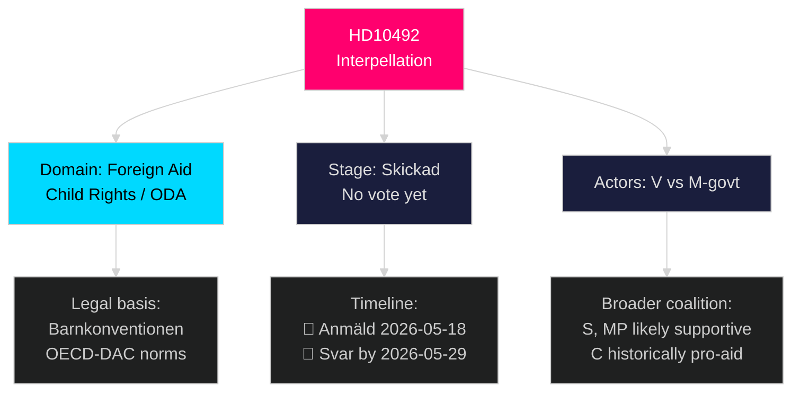

# Classification Results — 2026-05-14 Interpellations

**Date**: 2026-05-14 | **Framework**: 7-Dimension Political Classification

---

## HD10492 — Political Classification

**Titel**: Konsekvenserna för barn när biståndet minskar [B2]

| Dimension | Classification | Evidence |
|-----------|---------------|----------|
| **1. Policy Domain** | Foreign Aid / Development Policy / Child Rights | ODA policy, barnkonventionen, UNICEF, Rädda Barnen programs [B2] |
| **2. Political Axis** | Left-Right: Centre-Left opposition vs Centre-Right government | V (left) challenges M-led government's rightward pivot on aid [B2] |
| **3. Conflict Type** | Accountability demand / government transparency | Demands formal consequence analysis — no FOIA/legal conflict component [B2] |
| **4. Temporal Horizon** | Short-term (answer by 2026-05-29) + Medium-term (election 2026) | [horizon:72h] scheduling; [horizon:month] answer deadline; [horizon:cycle] election implications |
| **5. Affected Population** | Global (aid recipients) + Swedish civil society + diplomatic reputation | Children in LDCs; Sida project partners; Swedish NGO sector [B2] |
| **6. Parliamentary Stage** | Interpellation — pre-debate, no vote | Skickad 2026-05-13; Anmäld 2026-05-18; no committee referral [A1] |
| **7. Party Dynamics** | V opposition; M government (with SD support); S/MP likely sympathetic to V questions | C (aid champion historically) may align with V on barnrättsperspektiv [B2] |

**Classification summary**: L2 Strategic humanitarian/development interpellation by left-wing MP against centre-right aid minister on child-rights accountability. Pre-debate stage; no vote. Politically salient for 2026 election.

## Priority Tiers

- **Tier 1 (Immediate)**: Monitor Minister Dousa's answer by 2026-05-29
- **Tier 2 (Short-term)**: Track S, MP, C positions on barnrättsperspektiv in autumn budget motions
- **Tier 3 (Medium-term)**: OECD-DAC peer review of Swedish ODA (anticipated 2026) — international accountability overlap

## Retention & Access

- **Retention**: Standard — retain per Riksdagsmonitor content policy
- **Access**: PUBLIC — GDPR Art. 9(2)(e) publicly made political opinion; Art. 9(2)(g) substantial public interest
- **GDPR note**: Named political actors (Lotta Johnsson Fornarve, Benjamin Dousa) performing public functions — no special sensitivity beyond routine political reporting

