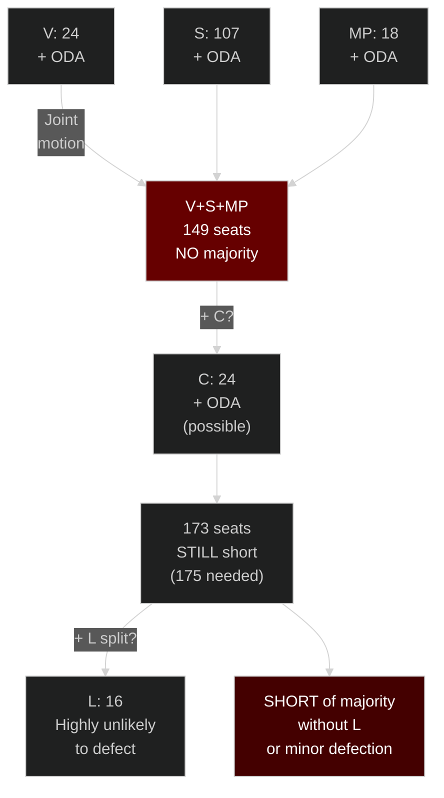

# Coalition Mathematics — ODA Policy in Tidöregeringen

**Date**: 2026-05-14 | **Scope**: Current coalition dynamics + 2026 implications

---

## Tidöregeringen Coalition Composition

| Party | Seats (est.) | Position on ODA | Internal tension |
|-------|-------------|-----------------|-----------------|
| Moderaterna (M) | ~80 | Reform/efficiency; lead on "Bistånd för en ny era" | Low — cohesive on reform |
| Sverigedemokraterna (SD) | ~73 | Cut significantly; domestic priority | Low — prefers deeper cuts |
| Kristdemokraterna (KD) | ~19 | Humanitarian values; accepts reform package | MEDIUM — some KD members uncomfortable |
| Liberalerna (L) | ~16 | Historically strong ODA supporter; 0.7% acceptable | HIGH — most uncomfortable with aid cuts in party |

**Coalition total**: ~188/349 seats (majority requires 175)

## Opposition Bloc on ODA

| Party | Seats (est.) | Position |
|-------|-------------|---------|
| Socialdemokraterna (S) | ~107 | Restore enprocentsmålet; barnkonsekvensanalys krav |
| Vänsterpartiet (V) | ~24 | Restore + CRC compliance; HD10492 actor |
| Miljöpartiet (MP) | ~18 | Restore + climate-linked ODA |
| Centerpartiet (C) | ~24 | Efficiency OK; some discomfort with volume cuts |

**Opposition ODA coalition (V+S+MP)**: ~149 seats — cannot pass motion alone
**With C support**: ~173 — still short of majority
**With L dissent within government**: L has 16 seats; even full L defection (extremely unlikely) doesn't create majority

## Coalition Stress Points from HD10492

**L (Liberalerna) internal tension**: L historically had Sweden's strongest ODA commitment among non-socialist parties. Ericastian aid tradition. Current L membership includes development advocates who supported enprocentsmålet. HD10492 forces L to either:
- Defend government's no-barnkonsekvensanalys position (values cost)
- Distance themselves (coalition cost)

**L's likely strategy**: Silence or formulaic "effective aid reaches children" response

**KD tension**: Christian democratic humanitarian tradition. Some KD MPs may express support for barnkonsekvensanalys *in principle* while not breaking coalition discipline. Monitor KD spokespersons' post-debate statements.

## Probability of Parliamentary Majority for Barnkonsekvensanalys Requirement

A motion requiring barnkonsekvensanalys would need:
- V + S + MP: 149 seats
- + C (or significant portion): ~173 seats
- + L defectors (very unlikely): +16

**Assessment**: No plausible majority for legislative requirement. Even if C votes with opposition on narrowly framed motion, outcome is symbolic (declaration motion, no legislative force). [B3]

**However**: A declaration motion (tillkännagivande) to the government requiring barnkonsekvensanalys could be adopted with a simple majority IF C joins V+S+MP. This has happened on other development policy questions. Probability: 15-20% [B3, pattern-based].

