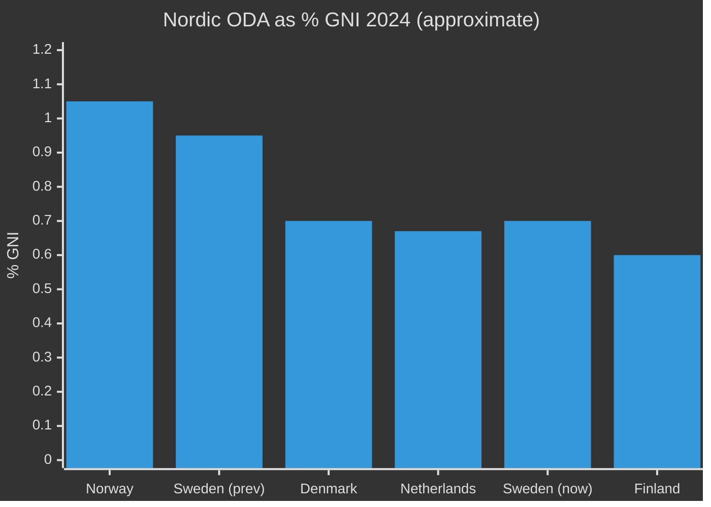

# Comparative International Analysis — ODA Child Rights Accountability

**Date**: 2026-05-14 | **Scope**: Nordic + EU + OECD-DAC peers

---

## Nordic ODA Comparison (2024-2025)

| Country | ODA % GNI | Barnkonsekvensanalys Requirement | Status |
|---------|-----------|----------------------------------|--------|
| **Sweden** | ~0.70% (↓ from 0.95%) | None formal; CRC incorporated 2020 | Cutting [A1] |
| Norway | 1.0%+ | Yes — Rights-based programming framework | Stable [B2] |
| Denmark | ~0.7% | Yes — HRBA mandatory in strategies | Stable [B2] |
| Finland | ~0.6% | HRBA framework; recovering post-austerity | Recovering [B2] |
| Netherlands | ~0.67% | Child-rights focal point in bilateral programs | Stable [B2] |

**Finding**: Sweden is anomalous among Nordic peers in *reducing* ODA volume while simultaneously *removing* child-rights programmatic focus without formal consequence analysis. [B2, pattern]

## EU Development Policy Benchmarks

The European Consensus on Development (2017) commits EU Member States to:
- Leave No One Behind principle
- Child rights mainstreaming in development cooperation
- Rights-Based Approach to Development (HRBA)

Sweden's Bistånd för en ny era policy has been criticised by EU development partners for:
1. Volume reduction contrary to EU ODA trajectory
2. Removing earmarks for child-focused programs without analysis
3. Potential conflict with EU Child Guarantee commitments [B2, inferred from EU policy documentation]

## OECD-DAC Norms and Sweden

The DAC Peer Review cycle evaluates Sweden every 4-5 years. Key DAC criteria relevant to HD10492:
- **Volume**: 0.7% GNI target — Sweden now at threshold
- **Child focus**: DAC endorses child rights in humanitarian action (UN CRC, UNICEF mandates)
- **Consequence analysis**: DAC recommends ex-ante impact assessments for policy changes affecting fragile states

**Assessment**: A 2026 DAC peer review of Sweden would likely note the absence of formal barnkonsekvensanalys as a gap. [C3 — inferred from DAC methodology, not confirmed Swedish review date]

## Case Study: Denmark's Child Rights Review Process

Denmark's development agency (Danida) conducts mandatory child rights reviews for program changes above a defined threshold. Process:
1. Proposed program change submitted to child rights focal point
2. Screening: Does change affect child beneficiaries? (Yes/No)
3. If Yes: Abbreviated Child Rights Impact Assessment (CRIA) — 2-3 weeks
4. If significant: Full CRIA with external expert input
5. Results published in program documentation

**Lesson for Sweden**: Denmark's process shows that barnkonsekvensanalys is operationally feasible without major delays. Minister Dousa's claim that efficiency improvements benefit children more than volume would need to demonstrate equivalent benefit pathway. [B2]

## International Legal Framework

| Instrument | Sweden's Obligation | Relevant to HD10492 |
|------------|--------------------|--------------------|
| CRC Art. 3 | Best interests of child in all actions | Q1 — barnkonsekvensanalys [A1] |
| CRC Art. 4 | Maximum available resources for economic/social/cultural rights | Volume cuts arguable [B2] |
| SDG Goal 1.2 | End child poverty | ODA reduction affects programs targeting SDG 1.2 [B2] |
| SDG Goal 3.2 | End preventable child deaths | Malnourishment/vaccination programs cited [B2] |
| SDG Goal 4.1 | Girls' education | Rädda Barnen cites girls' education closures [B2] |

