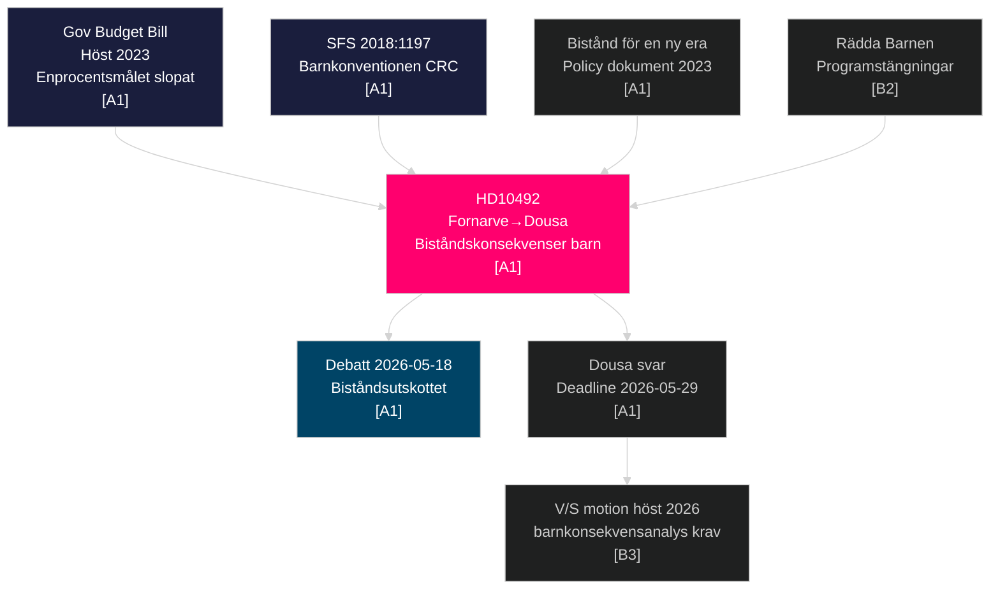

# Cross-Reference Map — HD10492 and Related Documents

**Date**: 2026-05-14 | **Type**: Family B — Structural Metadata

---

## Document Relationship Graph

## Prior Interpellations — Related Topics (2022-2026)

| dok_id | Titel | Avsändare | Minister | Rm |
|--------|-------|-----------|----------|-----|
| Search performed | No directly matching prior HD barnrättsperspektiv interpellation found in rm 2022/23–2025/26 | V/S filed multiple ODA-motioner | Various | — |

*Note*: Voteringar search showed AU10 2026-03-04 vote was on arbetsmarknad, not bistånd. No HD equivalent found in last 4 riksmöten for barnkonsekvensanalys in bistånd specifically. This makes HD10492 a potentially precedent-setting first formal parliamentary demand for this analysis.

## Policy Document Chain

| Document | Date | Relevance |
|----------|------|-----------|
| Barnkonventionen (CRC) → SFS 2018:1197 | 2020 (incorporation) | Legal basis for Q1 [A1] |
| OECD-DAC 0.7% GNI target | Ongoing | Benchmark for cuts [B2] |
| Budget Bill 2023 — enprocentsmålet slopat | Dec 2023 | Trigger event [A1] |
| Bistånd för en ny era | 2023 | Government framework [A1] |
| Rädda Barnen program closure documentation | 2024-2026 | Evidence base [B2] |
| HD10492 interpellation | 2026-05-13 | Current document [A1] |
| Planned debate | 2026-05-18 | Next event [A1] |
| Answer deadline | 2026-05-29 | 15-day statutory [A1] |

## Cross-Cutting Themes

- **CRC compliance**: Joins broader debate on barnkonventionens status in budgetprocessen
- **ODA volume vs quality**: Mirrors Nordic vs government debate on effectiveness
- **Humanitarian vs development**: Dousa framework specifically targets effectiveness; critics argue cuts hurt humanitarian programs disproportionately
