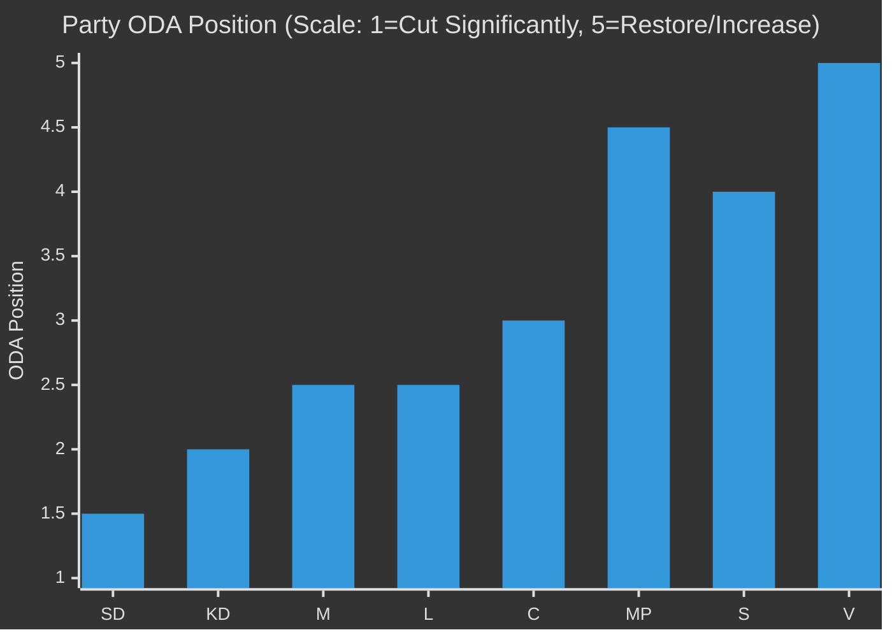

# Election 2026 Analysis — ODA as Campaign Issue

**Date**: 2026-05-14 | **Horizon**: T+365d+ (Election cycle)

---

## Electoral Context

Sweden's next general election is scheduled for **September 2026** (riksdagsval). As of May 2026, Tidöregeringen (M+SD+KD+L) is approaching the election with a mixed record:

- Economic policy: Fiscal discipline maintained; infrastructure investment debated
- Migration: Core SD promise delivered (reduced numbers)
- **International development aid: Enprocentsmålet abandoned; "Bistånd för en ny era" as replacement**

HD10492 arrives approximately 16 months before the election — a critical window for establishing electoral narratives.

## ODA as Electoral Issue — Party Positioning

*[Approximate positioning based on party programs and voting records; [B2] pattern inference]*

## Voter Segmentation on ODA

| Segment | Size | Position | ODA Salience |
|---------|------|----------|-------------|
| Value Left (V+MP core) | ~15% | Restore enprocentsmålet | VERY HIGH |
| Social Democratic core | ~25% | Maintain/increase | HIGH |
| Liberal internationalists (C+L swing) | ~10% | Maintain; effectiveness important | MEDIUM |
| Nationalist-pragmatist (SD core) | ~20% | Cut; domestic first | MEDIUM |
| Conservative mainstream (M+KD) | ~15% | Efficiency framing | LOW-MEDIUM |
| Non-aligned/independent | ~15% | Mixed | LOW |

**Key insight**: ODA as electoral issue primarily activates left-leaning voters. V's strategic goal is to ensure Fornarve's documented Dousa answer energises V's core voters (15%) while creating discomfort for L/C swing voters (10%) who have historically supported Swedish ODA leadership.

## Scenario — V Electoral Use of HD10492

*[horizon:T+365d] It is likely that V will use the documented outcome of HD10492 in their 2026 election campaign materials if Dousa's answer is classified as unsatisfactory (Scenario B or C outcome). [WEP: "likely"]*

**Campaign material potential**:
- "Moderaternas svar när vi frågade om barn i bistånd: [Dousa's answer quote]"
- Rädda Barnen's program closure data as visual campaign asset
- Nordic peer comparison: "Norge håller fast vid enprocentsmålet — varför inte Sverige?"

## Impact on Coalition Mathematics

If ODA becomes a salient election issue:
- V and S alignment on barnkonsekvensanalys krav → joint opposition position
- C and L uncomfortable: historically supported enprocentsmålet; current coalition membership creates tension
- M and KD committed to efficiency reform
- SD: domestic-first; ODA cuts are popular with SD voter base

**Coalition arithmetic 2026**: ODA reform is unlikely to be a coalition dealbreaker but may affect L/C voter enthusiasm for Tidöregeringen continuation. The issue is most dangerous for L in affluent Stockholm constituencies with high international-solidarity sentiment.

## Key Election Indicators to Watch

| Indicator | Timeline | Significance |
|-----------|----------|-------------|
| Dousa answer quality | 2026-05-29 | Primary electoral asset for V |
| V/S joint motion | Autumn 2026 | Demonstrates left unity on ODA |
| Rädda Barnen campaign launch | Summer 2026 | Amplification pre-election |
| L party congress on ODA | Spring 2026 | Shows coalition tension or solidarity |
| Opinion polling on ODA salience | Ongoing | Calibrates V's investment in issue |
