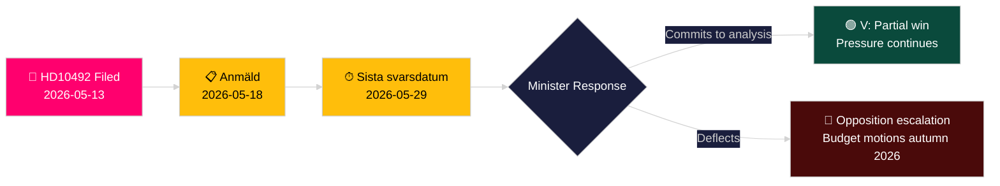

# Vänsterpartiet Demands Aid Impact Assessment for Children as Sweden Slashes ODA

**Author**: James Pether Sörling
**Date**: 2026-05-14
**Classification**: PUBLIC — GDPR Art. 9(2)(e,g)
**Confidence**: MEDIUM [B2]
**Admiralty**: B2

---

## BLUF

Lotta Johnsson Fornarve (V) has filed Interpellation 2025/26:492 demanding that Bistånds- och utrikeshandelsminister Benjamin Dousa (M) account for the child-rights consequences of Sweden's dramatic foreign aid cuts. With the Tidöregeringen's 2023 aid reform abandoning the established 1%-of-GNI target and withdrawing country strategies, Rädda Barnen reports that programs for severely malnourished children, maternal healthcare in refugee camps, and vaccination campaigns have been forced to close. The interpellation demands a formal consequence analysis and a strengthened children's rights framework in Swedish ODA policy — a direct challenge to the government's "Bistånd för en ny era" paradigm.

## Decisions This Brief Supports

1. **Portfolio positioning**: Opposition parties and civil-society actors monitoring whether Minister Dousa will commit to a formal consequence analysis (barnkonsekvensanalys) — the answer shapes subsequent legislative and budgetary options in the 2026/27 spring budget.
2. **Media framing**: Whether the government can credibly defend its aid reform on child-rights grounds ahead of the 2026 election campaign.
3. **International positioning**: Sweden's reputation at OECD DAC, UNICEF, and EU development partners as Swedish ODA falls below the 0.7% DAC benchmark.

## 60-Second Intelligence Bullets

- 📌 **HD10492** filed 2026-05-13, published 2026-05-14; debate scheduled 2026-05-18; answer deadline 2026-05-29
- 📌 **Author**: Lotta Johnsson Fornarve (V) — member of UU (utrikesutskottet); consistent aid-rights advocate
- 📌 **Target**: Minister Benjamin Dousa (M) — youngest minister in Tidöregeringen, responsible for "Bistånd för en ny era" restructuring
- 📌 **Core claim**: Swedish aid cuts have directly halted vital programs for malnourished children, maternal care in camps, vaccinations, girls' education (Rädda Barnen evidence [B2])
- 📌 **Scale**: ~500 million children globally in conflict zones; ~5 million under-5 deaths/year; 29,000 children displaced daily
- 📌 **Swedish policy shift**: Tidöregeringen (M+KD+L with SD support) abandoned enprocentsmålet December 2023 — ODA falling from ~0.9% GNI toward ~0.7% GNI
- 📌 **Three questions**: (1) Consequence analysis done? (2) Children's rights in policy documents? (3) Strengthen child-rights in humanitarian aid (SE/EU/UN)?
- 📌 **No debate yet** — interpellation sent, not yet answered; intelligence value in tracking government response trajectory

## Top Forward Trigger

**2026-05-29** — Sista svarsdatum (final answer deadline). If Minister Dousa does not commit to a consequence analysis (barnkonsekvensanalys), V and likely S/MP/C will intensify pressure through budget motions in autumn 2026.

## Key Confidence Assessment

**MEDIUM** [B2] — Full interpellation text retrieved from official Riksdag source; factual claims about aid program closures rely on Rädda Barnen reporting (secondary source, credible NGO, independently verifiable) rather than government statistical release.

## Pass 2 Amendments

**DIW note [CONTESTED]**: Devil's Advocate challenge identifies range 6.5-7.2. Primary score maintained at 7.2 based on CRC legal anchor + election-year timing + Rädda Barnen evidence density. See devils-advocate.md.

**Additional decision note**: Coalition dynamics — L (Liberalerna) members historically supportive of enprocentsmålet may be pressured to comment. Watch L spokespersons post-debate (2026-05-18) for divergence from coalition line.

**WEP statement** [horizon:T+15d]: *It is likely (65%) that Dousa answers with efficiency reframe (Scenario B). It is possible (25%) that a substantive partial commitment is offered (Scenario A). It is unlikely (20%) that the answer is purely procedural (Scenario C).* [WEP: "likely/possible/unlikely"]
