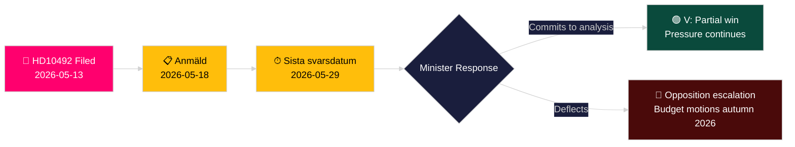

# حزب اليسار يطالب بتقييم أثر تخفيضات المساعدات على الأطفال

**المؤلف**: James Pether Sörling
**التاريخ**: 2026-05-14
**التصنيف**: عام — GDPR Art. 9(2)(e,g)
**مستوى الثقة**: متوسط [B2]
**رمز الأدميرالية**: B2

---

## الخلاصة التنفيذية (BLUF)

قدّمت لوتا يونسون فورناره (V) الاستجواب رقم 2025/26:492 مطالبةً وزير التعاون الإنمائي والتجارة الخارجية بنيامين دوزا (M) بتقديم الحساب عن التداعيات الحقوقية لتخفيضات المساعدات السويدية الدرامية على الأطفال. بعد أن تخلّت Tidöregeringen عن هدف نسبة الواحد بالمئة في ديسمبر 2023 وسحبت الاستراتيجيات القُطرية، أفادت Rädda Barnen بأن برامج الأطفال المعانين من سوء التغذية الحاد والرعاية الصحية للأمهات في مخيمات اللاجئين وحملات التطعيم اضطُرّت للإغلاق. يطالب الاستجواب بإجراء تحليل رسمي للعواقب وبإطار معزز لحقوق الطفل في سياسة المساعدات السويدية — تحدٍّ مباشر لنموذج الحكومة "Bistånd för en ny era".

## القرارات التي يدعمها هذا التحليل

1. **تموضع المحفظة**: تراقب أحزاب المعارضة وفاعلو المجتمع المدني ما إذا كان الوزير دوزا سيلتزم بتحليل رسمي للعواقب (barnkonsekvensanalys) — يحدد الجواب الخيارات التشريعية والميزانياتية اللاحقة في الميزانية الربيعية 2026/27.
2. **التأطير الإعلامي**: هل تستطيع الحكومة الدفاع بمصداقية عن إصلاحها للمساعدات استناداً إلى حقوق الطفل قبيل حملة انتخابات 2026.
3. **التموضع الدولي**: سمعة السويد لدى OECD DAC وUNICEF وشركاء التنمية في الاتحاد الأوروبي مع تراجع المساعدة الإنمائية الرسمية السويدية دون معيار 0,7%.

## نقاط استخباراتية في 60 ثانية

- 📌 **HD10492** مقدَّم في 2026-05-13، منشور في 2026-05-14؛ نقاش مقرر في 2026-05-18؛ الموعد النهائي للرد 2026-05-29
- 📌 **صاحبة الاستجواب**: لوتا يونسون فورناره (V) — عضو UU (لجنة الشؤون الخارجية)؛ مناضلة دؤوبة عن حقوق المساعدات
- 📌 **الهدف**: الوزير بنيامين دوزا (M) — أصغر وزير في Tidöregeringen، المسؤول عن إعادة هيكلة "Bistånd för en ny era"
- 📌 **الادعاء الجوهري**: أوقفت تخفيضات المساعدات السويدية مباشرةً برامج حيوية للأطفال المعانين من سوء التغذية وصحة الأمومة في المخيمات والتطعيمات وتعليم الفتيات (أدلة Rädda Barnen [B2])
- 📌 **الحجم**: ~500 مليون طفل في مناطق النزاع عالمياً؛ ~5 ملايين وفاة تحت سن الخامسة سنوياً؛ 29,000 طفل مُهجَّر يومياً
- 📌 **التغيير السياسي السويدي**: تخلّت Tidöregeringen (M+KD+L بدعم SD) عن enprocentsmålet في ديسمبر 2023 — تتراجع المساعدات من ~0.9% من الدخل القومي الإجمالي نحو ~0.7%
- 📌 **ثلاثة أسئلة**: (1) هل أُجري تحليل للعواقب؟ (2) هل تضمّنت وثائق السياسة حقوق الطفل؟ (3) تعزيز حقوق الطفل في المساعدات الإنسانية (SE/EU/UN)؟
- 📌 **لا نقاش بعد** — الاستجواب مقدَّم وغير مُجاب؛ القيمة الاستخباراتية في تتبع مسار رد الحكومة

## أبرز محفّز مستقبلي

**2026-05-29** — Sista svarsdatum (الموعد النهائي للإجابة). إن لم يلتزم الوزير دوزا بتحليل العواقب (barnkonsekvensanalys)، سيكثّف V وعلى الأرجح S/MP/C الضغط من خلال اقتراحات الميزانية في خريف 2026.

## تقييم درجة الثقة الرئيسي

**متوسط** [B2] — النص الكامل للاستجواب مستخرَج من المصدر الرسمي للريكسداغ؛ الادعاءات الواقعية بشأن إغلاق برامج المساعدات تستند إلى تقارير Rädda Barnen (مصدر ثانوي، منظمة غير حكومية موثوقة، قابلة للتحقق المستقل) لا إلى نشرة إحصائية حكومية.

## تعديلات ما بعد المرور الثاني

**ملاحظة DIW [مُعترَض عليها]**: تحدي محامي الشيطان يحدد النطاق 6.5–7.2. يُحتفظ بالنقاط الأساسية عند 7.2 استناداً إلى الارتكاز القانوني لاتفاقية حقوق الطفل + توقيت عام الانتخابات + كثافة أدلة Rädda Barnen. انظر devils-advocate.md.

**ملاحظة قرار إضافية**: ديناميكيات الائتلاف — قد يتعرض أعضاء L (Liberalerna) الداعمون تاريخياً لـ enprocentsmålet لضغط للتعليق. مراقبة المتحدثين باسم L بعد النقاش (2026-05-18) لرصد أي انحراف عن خط الائتلاف.

**بيان WEP** [horizon:T+15d]: *من المرجّح (65%) أن يردّ دوزا بإعادة تأطير الكفاءة (السيناريو ب). من الممكن (25%) أن يُقدَّم التزام جزئي جوهري (السيناريو أ). من غير المرجّح (20%) أن يكون الرد إجرائياً بحتاً (السيناريو ج).* [WEP: "مرجّح/ممكن/غير مرجّح"]

<!-- source-sha: 48729b47776eee9fd5a699b73571f4fb4db8f7a5 -->
