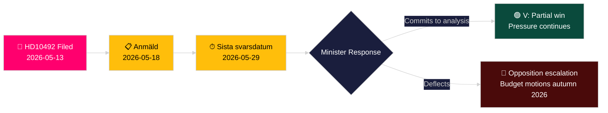

# Venstre kræver konsekvensanalyse af bistandsnedskæringer for børn

**Forfatter**: James Pether Sörling
**Dato**: 2026-05-14
**Klassificering**: OFFENTLIG — GDPR Art. 9(2)(e,g)
**Konfidens**: MIDDEL [B2]
**Admiralitetskode**: B2

---

## BLUF

Lotta Johnsson Fornarve (V) har indgivet Interpellation 2025/26:492 med krav om, at bistands- og udenrigshandelsminister Benjamin Dousa (M) redegør for konsekvenserne for børns rettigheder af Sveriges dramatiske bistandsnedskæringer. Da Tidöregeringen i december 2023 opgav enprocentsmålet og trak landestrategier tilbage, rapporterer Rädda Barnen, at programmer for svært underernærede børn, mødresundhed i flygtningelejre og vaccinationskampagner er blevet tvunget til at lukke. Interpellationen kræver en formel konsekvensanalyse og en styrket ramme for børns rettigheder i svensk bistandspolitik — en direkte udfordring af regeringens paradigme "Bistånd för en ny era".

## Beslutninger som dette notat understøtter

1. **Porteføljepositionering**: Oppositionspartier og civilsamfundsaktører overvåger, om minister Dousa vil forpligte sig til en formel konsekvensanalyse (barnkonsekvensanalys) — svaret former efterfølgende lovgivnings- og budgetmuligheder i forårsbudgettet 2026/27.
2. **Medieindramning**: Om regeringen troværdigt kan forsvare sin bistandsreform på grundlag af børnerettigheder op til valgkampen i 2026.
3. **International positionering**: Sveriges omdømme hos OECD DAC, UNICEF og EU's udviklingspartnere, efterhånden som svensk ODA falder under DAC-referencemærket på 0,7 %.

## 60-sekunders efterretningspunkter

- 📌 **HD10492** indgivet 2026-05-13, offentliggjort 2026-05-14; debat planlagt 2026-05-18; frist for svar 2026-05-29
- 📌 **Forfatter**: Lotta Johnsson Fornarve (V) — medlem af UU (udenrigsudvalget); konsekvent fortaler for bistandsrettigheder
- 📌 **Mål**: Minister Benjamin Dousa (M) — yngste minister i Tidöregeringen, ansvarlig for omstrukturering af "Bistånd för en ny era"
- 📌 **Kernepåstand**: Svenske bistandsnedskæringer har direkte standset vitale programmer for underernærede børn, mødresundhed i lejre, vaccinationer, pigers uddannelse (Rädda Barnen-dokumentation [B2])
- 📌 **Skala**: ~500 millioner børn globalt i konfliktzoner; ~5 millioner dødsfald under 5 år/år; 29.000 børn fordrevet dagligt
- 📌 **Svensk politisk ændring**: Tidöregeringen (M+KD+L med SD-støtte) opgav enprocentsmålet december 2023 — ODA falder fra ~0,9 % BNI mod ~0,7 % BNI
- 📌 **Tre spørgsmål**: (1) Konsekvensanalyse gennemført? (2) Børnerettigheder i politikdokumenter? (3) Styrk børnerettigheder i humanitær bistand (SE/EU/FN)?
- 📌 **Ingen debat endnu** — interpellationen indsendt, endnu ikke besvaret; efterretningsværdi i at følge regeringens svarretning

## Vigtigste fremtidige udløser

**2026-05-29** — Sista svarsdatum (endelig svarsfrist). Hvis minister Dousa ikke forpligter sig til en konsekvensanalyse (barnkonsekvensanalys), vil V og sandsynligvis S/MP/C intensivere presset gennem budgetforslag efteråret 2026.

## Nøglekonfidenssvurdering

**MIDDEL** [B2] — Fuld interpellationstekst hentet fra officiel Riksdag-kilde; faktuelle påstande om lukkede bistandsprogrammer er baseret på Rädda Barnens rapportering (sekundær kilde, troværdig NGO, uafhængigt verificerbar) snarere end statslig statistikudgivelse.

## Ændringer efter pas 2

**DIW-notering [OMTVISTET]**: Djævelens advokat-udfordring identificerer interval 6,5–7,2. Primær score opretholdt ved 7,2 baseret på CRC-retslig forankring + valgårstiming + tæthed af Rädda Barnen-dokumentation. Se devils-advocate.md.

**Yderligere beslutningsnotering**: Koalitionsdynamik — L (Liberalerna)-medlemmer historisk støttende af enprocentsmålet kan presses til at kommentere. Overvåg L-talspersoner efter debat (2026-05-18) for afvigelse fra koalitionslinjen.

**WEP-erklæring** [horizon:T+15d]: *Det er sandsynligt (65 %), at Dousa svarer med effektivitetsomformulering (Scenarie B). Det er muligt (25 %), at et substantielt partielt tilsagn tilbydes (Scenarie A). Det er usandsynligt (20 %), at svaret er rent proceduremæssigt (Scenarie C).* [WEP: "sandsynligt/muligt/usandsynligt"]

<!-- source-sha: 48729b47776eee9fd5a699b73571f4fb4db8f7a5 -->
