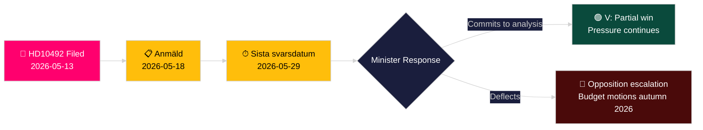

# Die Linkspartei fordert Folgenabschätzung von Entwicklungshilfekürzungen für Kinder

**Autor**: James Pether Sörling
**Datum**: 2026-05-14
**Klassifizierung**: ÖFFENTLICH — DSGVO Art. 9(2)(e,g)
**Konfidenz**: MITTEL [B2]
**Admiralitätscode**: B2

---

## BLUF

Lotta Johnsson Fornarve (V) hat die Interpellation 2025/26:492 eingebracht und fordert Entwicklungshilfe- und Außenhandelsminister Benjamin Dousa (M) auf, über die kinderrechtlichen Konsequenzen der dramatischen schwedischen Entwicklungshilfekürzungen Rechenschaft abzulegen. Nachdem die Tidöregierung im Dezember 2023 das Ein-Prozent-Ziel aufgegeben und Länderstrategien zurückgezogen hat, berichtet Rädda Barnen, dass Programme für schwer unterernährte Kinder, Müttergesundheit in Flüchtlingslagern und Impfkampagnen zur Schließung gezwungen wurden. Die Interpellation fordert eine formelle Folgenabschätzung und einen gestärkten Kinderrechterahmen in der schwedischen Entwicklungshilfepolitik — eine direkte Herausforderung des Regierungsparadigmas "Bistånd för en ny era".

## Von dieser Analyse unterstützte Entscheidungen

1. **Portfoliopositionierung**: Oppositionsparteien und Zivilgesellschaftsakteure beobachten, ob Minister Dousa sich zu einer formellen Folgenabschätzung (barnkonsekvensanalys) bekennt — die Antwort bestimmt die nachfolgenden Gesetzgebungs- und Budgetoptionen im Frühjahrshaushalt 2026/27.
2. **Medienrahmung**: Ob die Regierung ihre Entwicklungshilfereform auf Kinderrechtsgrundlage vor der Wahlkampagne 2026 glaubwürdig verteidigen kann.
3. **Internationale Positionierung**: Schwedens Ruf bei OECD DAC, UNICEF und EU-Entwicklungspartnern, da die schwedische ODA unter die DAC-Benchmark von 0,7 % sinkt.

## 60-Sekunden-Nachrichtenpunkte

- 📌 **HD10492** eingereicht 2026-05-13, veröffentlicht 2026-05-14; Debatte geplant 2026-05-18; Antwortfrist 2026-05-29
- 📌 **Autorin**: Lotta Johnsson Fornarve (V) — Mitglied des UU (Außenausschuss); konsequente Fürsprecherin für Entwicklungshilferechte
- 📌 **Ziel**: Minister Benjamin Dousa (M) — jüngster Minister in der Tidöregierung, verantwortlich für die Umstrukturierung von "Bistånd för en ny era"
- 📌 **Kernaussage**: Schwedische Entwicklungshilfekürzungen haben lebenswichtige Programme für unterernährte Kinder, Müttergesundheit in Lagern, Impfungen und Mädchenbildung direkt gestoppt (Rädda Barnen-Belege [B2])
- 📌 **Größenordnung**: ~500 Millionen Kinder weltweit in Konfliktgebieten; ~5 Millionen Todesfälle unter 5 Jahren/Jahr; täglich 29.000 vertriebene Kinder
- 📌 **Schwedischer Politikwechsel**: Tidöregierung (M+KD+L mit SD-Unterstützung) gab das Einprozentziel im Dezember 2023 auf — ODA fällt von ~0,9 % BNE in Richtung ~0,7 % BNE
- 📌 **Drei Fragen**: (1) Folgenabschätzung durchgeführt? (2) Kinderrechte in Politikdokumenten? (3) Stärkung der Kinderrechte in humanitärer Hilfe (SE/EU/UN)?
- 📌 **Noch keine Debatte** — Interpellation eingereicht, noch nicht beantwortet; Nachrichtenwert bei der Verfolgung der Regierungsantwortrichtung

## Wichtigster zukünftiger Auslöser

**2026-05-29** — Sista svarsdatum (endgültige Antwortfrist). Wenn Minister Dousa sich nicht zu einer Folgenabschätzung (barnkonsekvensanalys) bekennt, werden V und wahrscheinlich S/MP/C den Druck durch Budgetanträge im Herbst 2026 verstärken.

## Wichtigste Konfidenzeinschätzung

**MITTEL** [B2] — Vollständiger Interpellationstext aus offizieller Riksdag-Quelle abgerufen; Sachbehauptungen zu geschlossenen Entwicklungshilfeprogrammen beruhen auf Rädda Barnens Berichterstattung (Sekundärquelle, glaubwürdige NGO, unabhängig verifizierbar) statt auf einer staatlichen Statistikveröffentlichung.

## Änderungen nach Durchgang 2

**DIW-Vermerk [UMSTRITTEN]**: Die Herausforderung des Advocatus Diaboli identifiziert den Bereich 6,5–7,2. Primäre Bewertung bei 7,2 beibehalten, basierend auf CRC-Rechtsverankerung + Wahljahreszeitung + Dichte der Rädda Barnen-Belege. Siehe devils-advocate.md.

**Zusätzliche Entscheidungsnotiz**: Koalitionsdynamik — L (Liberalerna)-Mitglieder, die das Einprozentziel historisch unterstützt haben, könnten unter Druck geraten zu kommentieren. L-Sprecher nach der Debatte (2026-05-18) auf Abweichungen von der Koalitionslinie beobachten.

**WEP-Erklärung** [horizon:T+15d]: *Es ist wahrscheinlich (65 %), dass Dousa mit einer Effizienz-Umrahmung antwortet (Szenario B). Es ist möglich (25 %), dass ein substanzielles Teilbekenntnis angeboten wird (Szenario A). Es ist unwahrscheinlich (20 %), dass die Antwort rein verfahrenstechnisch ist (Szenario C).* [WEP: "wahrscheinlich/möglich/unwahrscheinlich"]

<!-- source-sha: 48729b47776eee9fd5a699b73571f4fb4db8f7a5 -->
