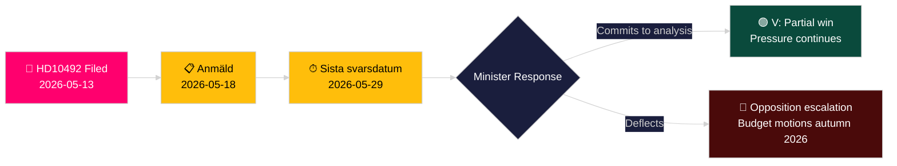

# El partido de izquierda exige una evaluación de impacto de los recortes de ayuda al desarrollo para la infancia

**Autor**: James Pether Sörling
**Fecha**: 2026-05-14
**Clasificación**: PÚBLICO — RGPD Art. 9(2)(e,g)
**Confianza**: MEDIO [B2]
**Código Almirantazgo**: B2

---

## BLUF

Lotta Johnsson Fornarve (V) ha presentado la Interpelación 2025/26:492 exigiendo que el ministro de Cooperación al Desarrollo y Comercio Exterior Benjamin Dousa (M) rinda cuentas sobre las consecuencias para los derechos de la infancia de los drásticos recortes de la ayuda sueca. Tras que la Tidöregering abandonara el objetivo del uno por ciento en diciembre de 2023 y retirara las estrategias nacionales, Rädda Barnen informa que los programas para niños severamente desnutridos, la atención a la salud materna en campos de refugiados y las campañas de vacunación se han visto obligados a cerrar. La interpelación exige un análisis formal de consecuencias y un marco reforzado de derechos de la infancia en la política sueca de ayuda al desarrollo — un desafío directo al paradigma gubernamental "Bistånd för en ny era".

## Decisiones que respalda este análisis

1. **Posicionamiento de cartera**: Los partidos de la oposición y los actores de la sociedad civil vigilan si el ministro Dousa se comprometará a un análisis formal de consecuencias (barnkonsekvensanalys) — la respuesta determina las opciones legislativas y presupuestarias en el presupuesto de primavera 2026/27.
2. **Enmarcado mediático**: Si el gobierno puede defender de forma creíble su reforma de la ayuda sobre bases de derechos de la infancia antes de la campaña electoral de 2026.
3. **Posicionamiento internacional**: La reputación de Suecia ante la OCDE-DAC, UNICEF y los socios de desarrollo de la UE a medida que la AOD sueca cae por debajo del umbral del 0,7 % del DAC.

## Puntos informativos en 60 segundos

- 📌 **HD10492** presentada el 2026-05-13, publicada el 2026-05-14; debate previsto el 2026-05-18; plazo de respuesta 2026-05-29
- 📌 **Autora**: Lotta Johnsson Fornarve (V) — miembro de la UU (comisión de asuntos exteriores); defensora constante de los derechos en la ayuda al desarrollo
- 📌 **Objetivo**: Ministro Benjamin Dousa (M) — ministro más joven de la Tidöregering, responsable de la reestructuración de "Bistånd för en ny era"
- 📌 **Alegación central**: Los recortes de ayuda suecos han detenido directamente los programas vitales para niños desnutridos, atención de maternidad en campos, vacunaciones y educación de niñas (documentación de Rädda Barnen [B2])
- 📌 **Escala**: ~500 millones de niños en todo el mundo en zonas de conflicto; ~5 millones de muertes menores de 5 años/año; 29 000 niños desplazados diariamente
- 📌 **Cambio político sueco**: Tidöregering (M+KD+L con apoyo de SD) abandonó el enprocentsmålet en diciembre de 2023 — la AOD pasa de ~0,9 % del RNB hacia ~0,7 % del RNB
- 📌 **Tres preguntas**: (1) ¿Se realizó el análisis de consecuencias? (2) ¿Derechos de la infancia en documentos de política? (3) ¿Reforzar los derechos de la infancia en la ayuda humanitaria (SE/UE/ONU)?
- 📌 **Sin debate aún** — interpelación enviada, aún sin respuesta; valor informativo en el seguimiento de la trayectoria de respuesta gubernamental

## Principal desencadenante futuro

**2026-05-29** — Sista svarsdatum (plazo final de respuesta). Si el ministro Dousa no se compromete a un análisis de consecuencias (barnkonsekvensanalys), V y probablemente S/MP/C intensificarán la presión mediante mociones presupuestarias en otoño de 2026.

## Evaluación de confianza clave

**MEDIO** [B2] — Texto completo de la interpelación recuperado de la fuente oficial del Riksdag; las afirmaciones sobre el cierre de programas de ayuda se basan en los informes de Rädda Barnen (fuente secundaria, ONG creíble, verificable de forma independiente) en lugar de en una publicación estadística gubernamental.

## Enmiendas tras la pasada 2

**Nota DIW [CONTROVERTIDA]**: El desafío del abogado del diablo identifica el rango 6,5–7,2. Puntuación principal mantenida en 7,2 basándose en el ancla legal CRC + el momento del año electoral + la densidad de evidencias de Rädda Barnen. Ver devils-advocate.md.

**Nota de decisión adicional**: Dinámica de coalición — los miembros de L (Liberalerna) que históricamente han apoyado el enprocentsmålet pueden verse presionados a comentar. Vigilar a los portavoces de L tras el debate (2026-05-18) para detectar divergencias de la línea de coalición.

**Declaración WEP** [horizon:T+15d]: *Es probable (65 %) que Dousa responda con un reencuadre de eficiencia (Escenario B). Es posible (25 %) que se ofrezca un compromiso parcial sustantivo (Escenario A). Es poco probable (20 %) que la respuesta sea puramente procesal (Escenario C).* [WEP: "probable/posible/poco probable"]

<!-- source-sha: 48729b47776eee9fd5a699b73571f4fb4db8f7a5 -->
