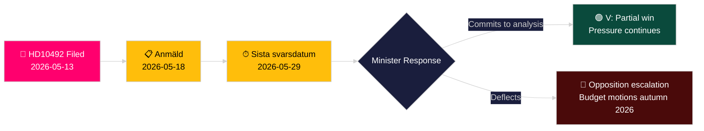

# Vasemmistopuolue vaatii lapsivaikutusten arviointia kehitysapuleikkauksista

**Tekijä**: James Pether Sörling
**Päivämäärä**: 2026-05-14
**Luokitus**: JULKINEN — GDPR Art. 9(2)(e,g)
**Luotettavuus**: KESKITASO [B2]
**Amiraalikoodi**: B2

---

## BLUF

Lotta Johnsson Fornarve (V) on jättänyt välikysymyksen 2025/26:492, jossa vaaditaan kehitysyhteistyö- ja ulkomaankauppaministeri Benjamin Dousaa (M) selvittämään Ruotsin dramaattisten kehitysapuleikkausten lapsen oikeuksiin kohdistuvat seuraukset. Kun Tidöregeringen hylkäsi enprocentsmålet joulukuussa 2023 ja peruutti maastrategiat, Rädda Barnen raportoi, että ohjelmat vakavasti aliravituille lapsille, äitiydenhoito pakolaisleireillä ja rokotuskampanjat on pakotettu sulkemaan. Välikysymys vaatii muodollista vaikutusten arviointia ja vahvistettua lapsen oikeuksien kehystä ruotsalaisessa kehitysyhteistyöpolitiikassa — suora haaste hallituksen paradigmalle "Bistånd för en ny era".

## Päätökset, joita tämä selvitys tukee

1. **Salkun asemointi**: Oppositiopuolueet ja kansalaisyhteiskunnan toimijat seuraavat, sitoutuuko ministeri Dousa muodolliseen vaikutusten arviointiin (barnkonsekvensanalys) — vastaus muokkaa tulevia lainsäädäntö- ja budjettivaihtoehtoja vuoden 2026/27 kevätbudjetissa.
2. **Mediainkehystäminen**: Voiko hallitus uskottavasti puolustaa kehitysapuuudistustaan lapsen oikeuksien perusteella ennen vuoden 2026 vaalikampanjaa.
3. **Kansainvälinen asemointi**: Ruotsin maine OECD DAC:ssa, UNICEFissa ja EU:n kehitysyhteistyökumppaneilla, kun ruotsalainen ODA laskee alle DAC:n 0,7 prosentin vertailuarvon.

## 60 sekunnin tiedustelupisteet

- 📌 **HD10492** jätetty 2026-05-13, julkaistu 2026-05-14; väittely suunniteltu 2026-05-18; vastauksen takaraja 2026-05-29
- 📌 **Tekijä**: Lotta Johnsson Fornarve (V) — UU:n (ulkoasiainvaliokunnan) jäsen; johdonmukainen kehitysapuoikeuksien puolestapuhuja
- 📌 **Kohde**: Ministeri Benjamin Dousa (M) — Tidöregeringenin nuorin ministeri, vastuussa "Bistånd för en ny era" -uudelleenjärjestelystä
- 📌 **Ydinväite**: Ruotsin kehitysapuleikkaukset ovat suoraan pysäyttäneet aliravittujen lasten, pakolaisleireillä olevan äitiydenhoidon, rokotusten ja tyttöjen koulutuksen elintärkeät ohjelmat (Rädda Barnen -todisteet [B2])
- 📌 **Laajuus**: ~500 miljoonaa lasta maailmanlaajuisesti konflikteissa; ~5 miljoonaa alle 5-vuotiaiden kuolemaa/vuosi; 29 000 lasta siirretty päivittäin
- 📌 **Ruotsin politiikkamuutos**: Tidöregeringen (M+KD+L SD:n tuella) hylkäsi enprocentsmålet joulukuussa 2023 — ODA putoaa ~0,9 %:sta BNT:stä kohti ~0,7 %:a BNT:stä
- 📌 **Kolme kysymystä**: (1) Onko vaikutusten arviointi tehty? (2) Lapsen oikeudet politiikka-asiakirjoissa? (3) Vahvista lapsen oikeuksia humanitaarisessa avussa (SE/EU/YK)?
- 📌 **Ei väittelyä vielä** — välikysymys lähetetty, ei vielä vastattu; tiedusteluarvo hallituksen vastaustrajektorin seurannassa

## Tärkein tuleva laukaisija

**2026-05-29** — Sista svarsdatum (lopullinen vastaustakaraja). Jos ministeri Dousa ei sitoudu vaikutusten arviointiin (barnkonsekvensanalys), V ja todennäköisesti S/MP/C intensifioivat painetta budjettiesitysten kautta syksyllä 2026.

## Keskeinen luotettavuusarvio

**KESKITASO** [B2] — Täydellinen välikysymysteksti haettu Riksdagin virallisesta lähteestä; kehitysapuohjelmien sulkemisia koskevat tosiasiapäätelmät perustuvat Rädda Barnenin raportointiin (toissijainen lähde, uskottava kansalaisjärjestö, itsenäisesti varmistettavissa) eikä valtion tilastojulkaisuun.

## Muutokset kierroksen 2 jälkeen

**DIW-merkintä [KIISTELTY]**: Paholaisen asianajajan haaste tunnistaa välille 6,5–7,2. Ensisijainen pistemäärä säilytetty 7,2:ssa perustuen CRC:n oikeudelliseen ankkuriin + vaalivuoden ajoitukseen + Rädda Barnenin todisteiden tiheyteen. Katso devils-advocate.md.

**Lisäpäätöshuomio**: Koalitiodynamiikka — L:n (Liberalerna) jäsenet, jotka ovat historiallisesti tukeneet enprocentsmålet, saatetaan painostaa kommentoimaan. Seuraa L:n tiedottajia väittelyn jälkeen (2026-05-18) poikkeamien varalta koalitiolinjasta.

**WEP-lausuma** [horizon:T+15d]: *On todennäköistä (65 %), että Dousa vastaa tehokkuuden uudelleenkehystämisellä (Skenaario B). On mahdollista (25 %), että tarjotaan merkittävä osittainen sitoumus (Skenaario A). On epätodennäköistä (20 %), että vastaus on puhtaasti menettelyllinen (Skenaario C).* [WEP: "todennäköistä/mahdollista/epätodennäköistä"]

<!-- source-sha: 48729b47776eee9fd5a699b73571f4fb4db8f7a5 -->
