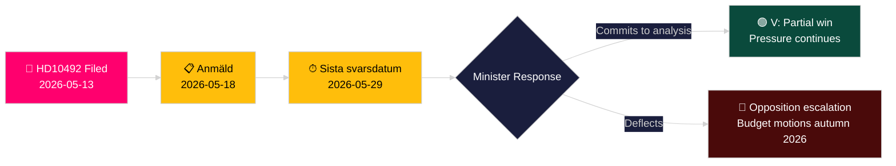

# Le parti de gauche exige une évaluation d'impact des coupes dans l'aide au développement pour les enfants

**Auteur**: James Pether Sörling
**Date**: 2026-05-14
**Classification**: PUBLIC — RGPD Art. 9(2)(e,g)
**Confiance**: MOYEN [B2]
**Code Amirauté**: B2

---

## BLUF

Lotta Johnsson Fornarve (V) a déposé l'Interpellation 2025/26:492 exigeant que le ministre de la Coopération au développement et du Commerce extérieur Benjamin Dousa (M) rende compte des conséquences des coupes dramatiques de l'aide suédoise sur les droits de l'enfant. Après que la Tidöregering a abandonné l'objectif d'un pour cent en décembre 2023 et retiré les stratégies nationales, Rädda Barnen rapporte que des programmes pour les enfants sévèrement malnutris, les soins de santé maternelle dans les camps de réfugiés et les campagnes de vaccination ont été contraints de fermer. L'interpellation exige une analyse formelle des conséquences et un cadre renforcé pour les droits de l'enfant dans la politique suédoise d'aide au développement — un défi direct au paradigme gouvernemental "Bistånd för en ny era".

## Décisions que cette analyse soutient

1. **Positionnement de portefeuille**: Les partis d'opposition et les acteurs de la société civile surveillent si le ministre Dousa s'engagera dans une analyse formelle des conséquences (barnkonsekvensanalys) — la réponse façonnera les options législatives et budgétaires ultérieures dans le budget de printemps 2026/27.
2. **Cadrage médiatique**: Si le gouvernement peut défendre de manière crédible sa réforme de l'aide sur des bases relatives aux droits de l'enfant avant la campagne électorale de 2026.
3. **Positionnement international**: La réputation de la Suède auprès de l'OCDE-CAD, de l'UNICEF et des partenaires de développement de l'UE alors que l'APD suédoise tombe sous la référence de 0,7 % du CAD.

## Points d'information en 60 secondes

- 📌 **HD10492** déposé le 2026-05-13, publié le 2026-05-14; débat prévu le 2026-05-18; date limite de réponse 2026-05-29
- 📌 **Auteure**: Lotta Johnsson Fornarve (V) — membre de l'UU (commission des affaires étrangères); défenseure constante des droits dans l'aide au développement
- 📌 **Cible**: Ministre Benjamin Dousa (M) — plus jeune ministre de la Tidöregering, responsable de la restructuration de "Bistånd för en ny era"
- 📌 **Allégation centrale**: Les coupes de l'aide suédoise ont directement mis fin à des programmes vitaux pour les enfants malnutris, les soins de maternité dans les camps, les vaccinations et l'éducation des filles (preuves de Rädda Barnen [B2])
- 📌 **Échelle**: ~500 millions d'enfants dans le monde dans des zones de conflit; ~5 millions de décès d'enfants de moins de 5 ans/an; 29 000 enfants déplacés quotidiennement
- 📌 **Changement de politique suédois**: Tidöregering (M+KD+L avec le soutien de SD) a abandonné l'enprocentsmålet en décembre 2023 — l'APD passe de ~0,9 % du RNB vers ~0,7 % du RNB
- 📌 **Trois questions**: (1) Analyse des conséquences effectuée? (2) Droits de l'enfant dans les documents politiques? (3) Renforcer les droits de l'enfant dans l'aide humanitaire (SE/UE/ONU)?
- 📌 **Pas encore de débat** — interpellation soumise, pas encore répondue; valeur de renseignement dans le suivi de la trajectoire de réponse gouvernementale

## Principal déclencheur futur

**2026-05-29** — Sista svarsdatum (date limite finale de réponse). Si le ministre Dousa ne s'engage pas dans une analyse des conséquences (barnkonsekvensanalys), V et probablement S/MP/C intensifieront la pression par des motions budgétaires à l'automne 2026.

## Évaluation de confiance principale

**MOYEN** [B2] — Texte complet de l'interpellation récupéré depuis la source officielle du Riksdag; les allégations factuelles sur les fermetures de programmes d'aide reposent sur les rapports de Rädda Barnen (source secondaire, ONG crédible, vérifiable indépendamment) plutôt que sur une publication statistique gouvernementale.

## Amendements après la passe 2

**Note DIW [CONTESTÉE]**: Le défi de l'avocat du diable identifie la plage 6,5–7,2. Score primaire maintenu à 7,2 sur la base de l'ancrage juridique CRC + le timing de l'année électorale + la densité des preuves de Rädda Barnen. Voir devils-advocate.md.

**Note de décision supplémentaire**: Dynamique de coalition — les membres du L (Liberalerna) historiquement favorables à l'enprocentsmålet peuvent être pressés de s'exprimer. Surveiller les porte-parole de L après le débat (2026-05-18) pour détecter des divergences par rapport à la ligne de coalition.

**Déclaration WEP** [horizon:T+15d]: *Il est probable (65 %) que Dousa réponde avec un recadrage de l'efficacité (Scénario B). Il est possible (25 %) qu'un engagement partiel substantiel soit proposé (Scénario A). Il est peu probable (20 %) que la réponse soit purement procédurale (Scénario C).* [WEP: "probable/possible/peu probable"]

<!-- source-sha: 48729b47776eee9fd5a699b73571f4fb4db8f7a5 -->
