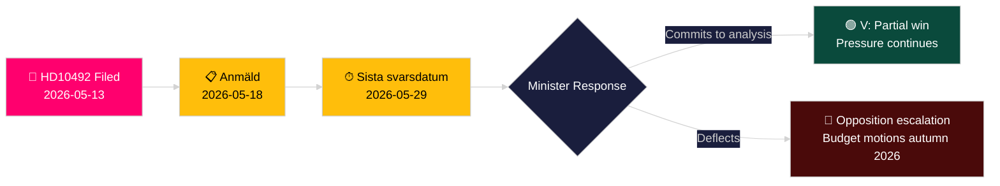

# מפלגת השמאל דורשת הערכת השפעה של קיצוצי הסיוע על ילדים

**מחבר**: James Pether Sörling
**תאריך**: 2026-05-14
**סיווג**: ציבורי — GDPR Art. 9(2)(e,g)
**אמינות**: בינוני [B2]
**קוד האדמירליות**: B2

---

## תמצית (BLUF)

לוטה יונסון פורנארה (V) הגישה את שאילתה 2025/26:492 ודורשת מהשר לשיתוף פעולה לפיתוח ולסחר חוץ בנימין דואוסה (M) לתת דין וחשבון על ההשלכות לזכויות הילד של קיצוצי הסיוע הדרמטיים של שוודיה. לאחר שהTidöregeringen זנחה את יעד האחוז בדצמבר 2023 ומשכה את אסטרטגיות המדינה, Rädda Barnen מדווחת שתוכניות לילדים עם תת-תזונה חמורה, בריאות האם במחנות פליטים וקמפיינים לחיסון נאלצו לסגור. השאילתה דורשת ניתוח רשמי של השלכות ומסגרת מחוזקת לזכויות הילד במדיניות הסיוע השוודית — אתגר ישיר לפרדיגמת הממשלה "Bistånd för en ny era".

## החלטות שניתוח זה תומך בהן

1. **מיצוב תיק**: מפלגות האופוזיציה וגורמי החברה האזרחית עוקבים אחרי האם השר דואוסה יתחייב לניתוח רשמי של השלכות (barnkonsekvensanalys) — התשובה תעצב את האפשרויות החקיקתיות והתקציביות בתקציב האביב 2026/27.
2. **מסגרת תקשורתית**: האם הממשלה יכולה להגן בצורה מהימנה על רפורמת הסיוע שלה על בסיס זכויות הילד לפני מסע הבחירות 2026.
3. **מיצוב בינלאומי**: מוניטין שוודיה ב-OECD DAC, UNICEF ושותפי הפיתוח של האיחוד האירופי כאשר הסיוע הרשמי לפיתוח של שוודיה נופל מתחת לאמת המידה של 0.7% של DAC.

## נקודות מודיעין בינלאומי ב-60 שניות

- 📌 **HD10492** הוגש 2026-05-13, פורסם 2026-05-14; דיון מתוכנן 2026-05-18; מועד אחרון לתשובה 2026-05-29
- 📌 **מגישת השאילתה**: לוטה יונסון פורנארה (V) — חברת UU (ועדת החוץ); סנגורית עקבית לזכויות בסיוע לפיתוח
- 📌 **יעד**: השר בנימין דואוסה (M) — השר הצעיר ביותר בTidöregeringen, האחראי לארגון מחדש של "Bistånd för en ny era"
- 📌 **טענה מרכזית**: קיצוצי הסיוע השוודים עצרו ישירות תוכניות חיוניות לילדים עם תת-תזונה, בריאות האם במחנות, חיסונים וחינוך בנות (ראיות Rädda Barnen [B2])
- 📌 **היקף**: ~500 מיליון ילדים ברחבי העולם באזורי סכסוך; ~5 מיליון מקרי מוות של ילדים מתחת לגיל 5 בשנה; 29,000 ילדים מועקרים יומיות
- 📌 **שינוי מדיניות שוודית**: Tidöregeringen (M+KD+L עם תמיכת SD) זנחה את enprocentsmålet בדצמבר 2023 — הסיוע יורד מ~0.9% תוצר לאומי גולמי לכיוון ~0.7% תוצר לאומי גולמי
- 📌 **שלוש שאלות**: (1) האם בוצע ניתוח השלכות? (2) זכויות הילד במסמכי מדיניות? (3) חיזוק זכויות הילד בסיוע הומניטרי (SE/EU/UN)?
- 📌 **עדיין אין דיון** — שאילתה הוגשה, טרם נענתה; ערך מודיעיני במעקב אחר מסלול תגובת הממשלה

## המניע העתידי המרכזי

**2026-05-29** — Sista svarsdatum (מועד אחרון סופי לתשובה). אם השר דואוסה לא יתחייב לניתוח השלכות (barnkonsekvensanalys), V ועשוי גם S/MP/C יגבירו את הלחץ דרך הצעות תקציב בסתיו 2026.

## הערכת אמינות מרכזית

**בינוני** [B2] — הטקסט המלא של השאילתה נשלף ממקור הריקסדאג הרשמי; טענות עובדתיות על סגירת תוכניות סיוע מבוססות על דיווחי Rädda Barnen (מקור משני, ארגון אמין, ניתן לאימות עצמאי) ולא על פרסום סטטיסטי ממשלתי.

## תיקונים לאחר מעבר 2

**הערת DIW [שנוי במחלוקת]**: אתגר עורך הדין של השטן מזהה טווח 6.5–7.2. הניקוד הראשי נשמר על 7.2 על בסיס עוגן משפטי של CRC + תזמון שנת הבחירות + צפיפות ראיות Rädda Barnen. ראה devils-advocate.md.

**הערת החלטה נוספת**: דינמיקות קואליציה — חברי L (Liberalerna) שתמכו היסטורית ב-enprocentsmålet עשויים להיות מלוחצים להגיב. לעקוב אחרי דוברי L לאחר הדיון (2026-05-18) לחפש סטיות מקו הקואליציה.

**הצהרת WEP** [horizon:T+15d]: *סביר (65%) שדואוסה יענה עם ניסוח מחדש של יעילות (תרחיש B). אפשרי (25%) שיוצע מחויבות חלקית משמעותית (תרחיש A). לא סביר (20%) שהתשובה תהיה טהורה פרוצדורלית (תרחיש C).* [WEP: "סביר/אפשרי/לא סביר"]

<!-- source-sha: 48729b47776eee9fd5a699b73571f4fb4db8f7a5 -->
