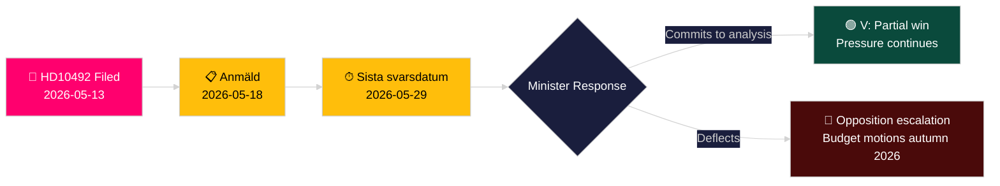

# 左翼党が援助削減の子どもへの影響評価を要求

**著者**: James Pether Sörling
**日付**: 2026-05-14
**分類**: 公開 — GDPR Art. 9(2)(e,g)
**信頼レベル**: 中程度 [B2]
**アドミラルティコード**: B2

---

## 要旨（BLUF）

ロッタ・ヨンソン・フォルナルヴェ（V）は質問主意書2025/26:492を提出し、開発協力・外国貿易大臣ベンヤミン・ドウサ（M）に対して、スウェーデンの劇的な援助削減が子どもの権利に与える結果について説明を求めている。2023年12月にTidöregeringenが1パーセント目標を放棄し国別戦略を撤回した後、Rädda Barnenは重度栄養不良の子どもたちへのプログラム、難民キャンプでの母子保健、予防接種キャンペーンが閉鎖を余儀なくされたと報告している。この質問主意書は、スウェーデンの開発援助政策における正式な影響分析と強化された子どもの権利フレームワークを求めている――政府の「Bistånd för en ny era」パラダイムへの直接的な挑戦である。

## この分析が支持する決定

1. **ポートフォリオ上の位置づけ**: 野党および市民社会関係者は、ドウサ大臣が正式な影響分析（barnkonsekvensanalys）にコミットするかどうかを注視している――その答えが2026/27年春予算における後続の立法・予算選択肢を形成する。
2. **メディアのフレーミング**: 2026年選挙キャンペーン前に、政府が子どもの権利の観点からその援助改革を信頼性をもって擁護できるかどうか。
3. **国際的位置づけ**: スウェーデンのODAがDACの0.7%基準を下回るにつれ、OECD DAC、UNICEF、EU開発パートナーにおけるスウェーデンの評判。

## 60秒の情報ポイント

- 📌 **HD10492** 2026-05-13提出、2026-05-14公開；討論予定2026-05-18；回答期限2026-05-29
- 📌 **提出者**: ロッタ・ヨンソン・フォルナルヴェ（V）――UU（外務委員会）委員；開発援助権利の一貫した支持者
- 📌 **対象**: ベンヤミン・ドウサ大臣（M）――Tidöregeringen最年少大臣、「Bistånd för en ny era」再編の責任者
- 📌 **中心的主張**: スウェーデンの援助削減により、栄養不良の子どもたち、キャンプでの母子保健、予防接種、女子教育への重要プログラムが直接停止された（Rädda Barnen証拠 [B2]）
- 📌 **規模**: 世界規模で紛争地帯の子ども約5億人；5歳未満死亡者数年間約500万人；毎日2万9千人の子どもが避難
- 📌 **スウェーデンの政策転換**: Tidöregeringen（M+KD+L、SD支持）は2023年12月にenprocentsmåletを放棄――ODAはGNI比約0.9%から約0.7%へ低下
- 📌 **3つの質問**: (1) 影響分析は実施されたか？(2) 政策文書に子どもの権利は盛り込まれているか？(3) 人道支援における子どもの権利を強化せよ（SE/EU/UN）
- 📌 **まだ討論なし** ―― 質問主意書提出済み、未回答；政府回答の軌道追跡における情報価値

## 最も重要な将来の誘因

**2026-05-29** ―― Sista svarsdatum（最終回答期限）。ドウサ大臣が影響分析（barnkonsekvensanalys）にコミットしなければ、Vおよびおそらくは S/MP/Cが2026年秋の予算動議を通じてプレッシャーを強める。

## 主要信頼性評価

**中程度** [B2] ―― 質問主意書の全文をリクスダーグ公式ソースから取得；援助プログラム閉鎖に関する事実上の主張はRädda Barnen報告（二次情報源、信頼性の高いNGO、独立的に検証可能）に依拠しており、政府統計出版物ではない。

## 第2パス後の修正

**DIW注記 [論争あり]**: 悪魔の代弁者挑戦は6.5〜7.2の範囲を特定する。CRC法的根拠＋選挙年のタイミング＋Rädda Barnen証拠の密度に基づき、主要スコアは7.2に維持。devils-advocate.md参照。

**追加決定注記**: 連立の動態――自由党（Liberalerna）のenprocentsmålet支持者が発言を求められる可能性がある。2026年5月18日の討論後にL代弁者が連立ラインから逸脱していないかを監視する。

**WEP声明** [horizon:T+15d]: *ドウサが効率性の再フレーミングで回答するのは蓋然性が高い（65%、シナリオB）。実質的な部分的コミットメントが提示されるのは可能性がある（25%、シナリオA）。回答が純粋に手続的なものになるのは蓋然性が低い（20%、シナリオC）。* [WEP: "蓋然性が高い/可能性がある/蓋然性が低い"]

<!-- source-sha: 48729b47776eee9fd5a699b73571f4fb4db8f7a5 -->
