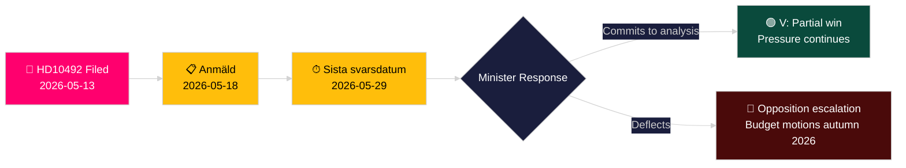

# 좌파당, 아동에 대한 원조 삭감 영향 평가 요구

**저자**: James Pether Sörling
**날짜**: 2026-05-14
**분류**: 공개 — GDPR Art. 9(2)(e,g)
**신뢰 수준**: 중간 [B2]
**해군 코드**: B2

---

## 요약 (BLUF)

로타 욘슨 포르나르베(V)는 질의서 2025/26:492를 제출하여 개발협력 및 대외무역부 장관 벤야민 도우사(M)에게 스웨덴의 극적인 원조 삭감이 아동 권리에 미치는 결과를 설명할 것을 요구했다. Tidöregeringen이 2023년 12월 1퍼센트 목표를 포기하고 국가별 전략을 철회한 후, Rädda Barnen은 심각한 영양실조 아동 프로그램, 난민 캠프의 모성 건강 서비스, 예방접종 캠페인이 강제로 폐쇄되었다고 보고했다. 이 질의서는 스웨덴 개발원조 정책에서 공식적인 결과 분석과 강화된 아동 권리 프레임워크를 요구한다 — 정부의 "Bistånd för en ny era" 패러다임에 대한 직접적인 도전이다.

## 이 분석이 지지하는 결정

1. **포트폴리오 포지셔닝**: 야당 정당과 시민사회 행위자들은 도우사 장관이 공식적인 결과 분석(barnkonsekvensanalys)에 약속할지 여부를 주시하고 있다 — 그 답이 2026/27 봄 예산에서 후속 입법 및 예산 옵션을 결정한다.
2. **미디어 프레이밍**: 2026년 선거 캠페인 전에 정부가 아동 권리 근거로 원조 개혁을 신뢰성 있게 방어할 수 있는지.
3. **국제적 포지셔닝**: 스웨덴 ODA가 DAC의 0.7% 기준 이하로 떨어지면서 OECD DAC, UNICEF, EU 개발 파트너에서의 스웨덴 평판.

## 60초 정보 포인트

- 📌 **HD10492** 2026-05-13 제출, 2026-05-14 공개; 토론 예정 2026-05-18; 응답 마감일 2026-05-29
- 📌 **제출자**: 로타 욘슨 포르나르베(V) — UU(외무위원회) 위원; 개발원조 권리의 일관된 옹호자
- 📌 **대상**: 벤야민 도우사 장관(M) — Tidöregeringen 최연소 장관, "Bistånd för en ny era" 구조조정 담당
- 📌 **핵심 주장**: 스웨덴 원조 삭감으로 영양실조 아동, 캠프 모성 건강, 예방접종, 여아 교육을 위한 필수 프로그램이 직접 중단됨 (Rädda Barnen 증거 [B2])
- 📌 **규모**: 전 세계 분쟁지역 아동 약 5억 명; 5세 미만 사망 연간 약 500만 건; 매일 29,000명의 아동 피난
- 📌 **스웨덴 정책 변화**: Tidöregeringen(M+KD+L, SD 지지)은 2023년 12월 enprocentsmålet 폐기 — ODA가 GNI 대비 약 0.9%에서 약 0.7%로 하락
- 📌 **세 가지 질문**: (1) 결과 분석 수행 여부? (2) 정책 문서에 아동 권리 포함 여부? (3) 인도적 원조에서 아동 권리 강화 (SE/EU/UN)?
- 📌 **아직 토론 없음** — 질의서 제출됨, 아직 답변 없음; 정부 응답 궤도 추적에서의 정보 가치

## 가장 중요한 향후 촉발 요인

**2026-05-29** — Sista svarsdatum (최종 응답 마감일). 도우사 장관이 결과 분석(barnkonsekvensanalys)에 약속하지 않으면, V 및 아마도 S/MP/C가 2026년 가을 예산 동의를 통해 압박을 강화할 것이다.

## 핵심 신뢰도 평가

**중간** [B2] — 질의서 전문을 리크스다그 공식 출처에서 검색; 원조 프로그램 폐쇄에 관한 사실적 주장은 정부 통계 출판물이 아닌 Rädda Barnen 보고(이차 출처, 신뢰성 있는 NGO, 독립 검증 가능)에 의존.

## 2회차 수정 사항

**DIW 주석 [논쟁 중]**: 악마의 변호인 도전이 6.5–7.2 범위를 식별. CRC 법적 앵커 + 선거 연도 타이밍 + Rädda Barnen 증거 밀도를 기반으로 주요 점수 7.2 유지. devils-advocate.md 참조.

**추가 결정 주석**: 연립 역학 — 역사적으로 enprocentsmålet을 지지해온 L(Liberalerna) 의원들이 발언 압박을 받을 수 있음. 토론 후(2026-05-18) L 대변인이 연립 노선에서 이탈하는지 주시.

**WEP 성명** [horizon:T+15d]: *도우사가 효율성 재프레이밍으로 답변할 가능성이 높다 (65%, 시나리오 B). 실질적인 부분적 약속이 제공될 가능성이 있다 (25%, 시나리오 A). 응답이 순전히 절차적일 가능성은 낮다 (20%, 시나리오 C).* [WEP: "가능성 높음/가능성 있음/가능성 낮음"]

<!-- source-sha: 48729b47776eee9fd5a699b73571f4fb4db8f7a5 -->
