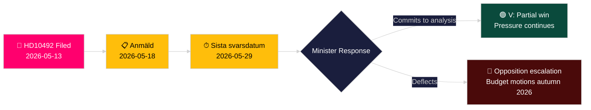

# De linkse partij eist een impactbeoordeling van hulpbezuinigingen voor kinderen

**Auteur**: James Pether Sörling
**Datum**: 2026-05-14
**Classificatie**: OPENBAAR — AVG Art. 9(2)(e,g)
**Betrouwbaarheid**: MIDDEL [B2]
**Admiraliteitscode**: B2

---

## BLUF

Lotta Johnsson Fornarve (V) heeft Interpellatie 2025/26:492 ingediend met de eis dat minister voor Ontwikkelingssamenwerking en Buitenlandse Handel Benjamin Dousa (M) verantwoording aflegt over de gevolgen van de dramatische Zweedse hulpbezuinigingen voor de rechten van het kind. Nadat de Tidöregering in december 2023 de eeprocentsdoelstelling heeft losgelaten en landenstrategieën heeft ingetrokken, rapporteert Rädda Barnen dat programma's voor ernstig ondervoede kinderen, moedergezondheid in vluchtelingenkampen en vaccinatiecampagnes gedwongen zijn te sluiten. De interpellatie eist een formele gevolgenanalyse en een versterkt kindrechtenkader in het Zweedse ontwikkelingshulpbeleid — een directe uitdaging aan het regeringsparadigma "Bistånd för en ny era".

## Beslissingen die deze analyse ondersteunt

1. **Portefeuillepositionering**: Oppositiepartijen en maatschappelijke actoren houden in de gaten of minister Dousa zich zal committeren aan een formele gevolgenanalyse (barnkonsekvensanalys) — het antwoord bepaalt de latere wetgevings- en budgetopties in de voorjaarsbegroting 2026/27.
2. **Mediacadering**: Of de regering haar hulphervorming geloofwaardig kan verdedigen op basis van kinderrechten voor de verkiezingscampagne van 2026.
3. **Internationale positionering**: De reputatie van Zweden bij OESO-DAC, UNICEF en EU-ontwikkelingspartners naarmate de Zweedse ODA onder de DAC-referentienorm van 0,7 % zakt.

## Informatieve punten in 60 seconden

- 📌 **HD10492** ingediend 2026-05-13, gepubliceerd 2026-05-14; debat gepland 2026-05-18; antwoorddeadline 2026-05-29
- 📌 **Auteur**: Lotta Johnsson Fornarve (V) — lid van UU (commissie buitenlandse zaken); consequent pleitbezorger voor rechten in ontwikkelingshulp
- 📌 **Doel**: Minister Benjamin Dousa (M) — jongste minister in de Tidöregering, verantwoordelijk voor de herstructurering van "Bistånd för en ny era"
- 📌 **Kernbewering**: Zweedse hulpbezuinigingen hebben directe vitale programma's voor ondervoede kinderen, moederzorg in kampen, vaccinaties en meisjesonderwijs stopgezet (Rädda Barnen-bewijs [B2])
- 📌 **Schaal**: ~500 miljoen kinderen wereldwijd in conflictgebieden; ~5 miljoen sterfgevallen onder 5 jaar/jaar; dagelijks 29.000 ontheemde kinderen
- 📌 **Zweedse beleidsverandering**: Tidöregering (M+KD+L met SD-steun) verliet de eeprocentsdoelstelling in december 2023 — ODA daalt van ~0,9 % BNI richting ~0,7 % BNI
- 📌 **Drie vragen**: (1) Gevolgenanalyse uitgevoerd? (2) Kinderrechten in beleidsdocumenten? (3) Kinderrechten versterken in humanitaire hulp (SE/EU/VN)?
- 📌 **Nog geen debat** — interpellatie ingediend, nog niet beantwoord; inlichtingenwaarde bij het volgen van de regeringsantwoordrichting

## Belangrijkste toekomstige trigger

**2026-05-29** — Sista svarsdatum (definitieve antwoorddeadline). Als minister Dousa zich niet committeert aan een gevolgenanalyse (barnkonsekvensanalys), zullen V en waarschijnlijk S/MP/C de druk opvoeren via begrotingsmotiesin het najaar van 2026.

## Belangrijkste betrouwbaarheidsbeoordeling

**MIDDEL** [B2] — Volledige interpellatietekst opgehaald van officiële Riksdag-bron; feitelijke beweringen over gesloten hulpprogramma's zijn gebaseerd op de rapportage van Rädda Barnen (secundaire bron, geloofwaardige NGO, onafhankelijk verifieerbaar) in plaats van op een overheidsstatistiekpublicatie.

## Wijzigingen na ronde 2

**DIW-opmerking [BETWIST]**: De Advocaat van de Duivel-uitdaging identificeert bereik 6,5–7,2. Primaire score gehandhaafd op 7,2 op basis van CRC-juridisch anker + verkiezingsjaarstiming + dichtheid van Rädda Barnen-bewijs. Zie devils-advocate.md.

**Aanvullende beslissingsnotitie**: Coalitiedynamiek — L (Liberalerna)-leden die de eeprocentsdoelstelling historisch hebben gesteund, kunnen onder druk worden gezet om commentaar te geven. L-woordvoerders na het debat (2026-05-18) volgen op afwijkingen van de coalitielijn.

**WEP-verklaring** [horizon:T+15d]: *Het is waarschijnlijk (65 %) dat Dousa antwoordt met een efficiëntieomkadering (Scenario B). Het is mogelijk (25 %) dat een substantieel gedeeltelijk commitment wordt aangeboden (Scenario A). Het is onwaarschijnlijk (20 %) dat het antwoord puur procedureel is (Scenario C).* [WEP: "waarschijnlijk/mogelijk/onwaarschijnlijk"]

<!-- source-sha: 48729b47776eee9fd5a699b73571f4fb4db8f7a5 -->
