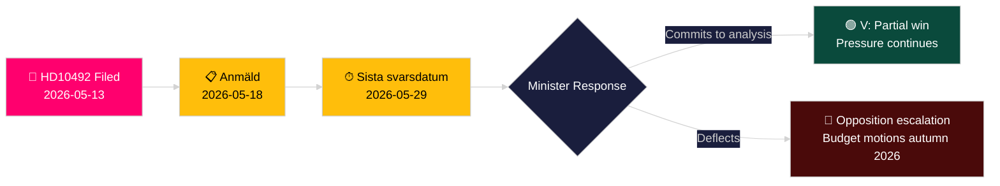

# Venstre krever konsekvensanalyse av bistandskutt for barn

**Forfatter**: James Pether Sörling
**Dato**: 2026-05-14
**Klassifisering**: OFFENTLIG — GDPR Art. 9(2)(e,g)
**Konfidens**: MIDDELS [B2]
**Admiralitetskode**: B2

---

## BLUF

Lotta Johnsson Fornarve (V) har levert inn Interpellasjon 2025/26:492 med krav om at bistands- og utenrikshandelsminister Benjamin Dousa (M) gjør rede for konsekvensene for barns rettigheter av Sveriges dramatiske bistandskutt. Da Tidöregeringen i desember 2023 forlot enprosentsm ̊alet og trakk tilbake landsstrategier, rapporterer Rädda Barnen at programmer for alvorlig underernærte barn, mødrehelse i flyktningleirer og vaksinasjonskampanjer er blitt tvunget til å stenge. Interpellasjonen krever en formell konsekvensanalyse og et styrket rammeverk for barns rettigheter i svensk bistandspolitikk — en direkte utfordring av regjeringens paradigme "Bistånd för en ny era".

## Beslutninger dette notatet støtter

1. **Porteføljeposisjonering**: Opposisjonspartier og sivilsamfunnsaktører overvåker om minister Dousa vil forplikte seg til en formell konsekvensanalyse (barnkonsekvensanalys) — svaret former etterfølgende lovgivnings- og budsjettmuligheter i vårbudsjettet 2026/27.
2. **Medieinnramming**: Om regjeringen troverdig kan forsvare sin bistandsreform på barnrettighetsgrunnlag frem mot valgkampen 2026.
3. **Internasjonal posisjonering**: Sveriges omdømme ved OECD DAC, UNICEF og EUs utviklingspartnere etter hvert som svensk ODA faller under DAC-referansemålet på 0,7 %.

## 60-sekunders etterretningspunkter

- 📌 **HD10492** levert 2026-05-13, publisert 2026-05-14; debatt planlagt 2026-05-18; svarfrist 2026-05-29
- 📌 **Forfatter**: Lotta Johnsson Fornarve (V) — medlem av UU (utenrikskomiteen); konsekvent talsmann for bistandsrettigheter
- 📌 **Mål**: Minister Benjamin Dousa (M) — yngste minister i Tidöregeringen, ansvarlig for omstrukturering av "Bistånd för en ny era"
- 📌 **Kjernepåstand**: Svenske bistandskutt har direkte stoppet vitale programmer for underernærte barn, mødrehelse i leirer, vaksinasjoner, jenters utdanning (Rädda Barnen-dokumentasjon [B2])
- 📌 **Omfang**: ~500 millioner barn globalt i konfliktsoner; ~5 millioner dødsfall under 5 år/år; 29 000 barn fordrevet daglig
- 📌 **Svensk politisk endring**: Tidöregeringen (M+KD+L med SD-støtte) forlot enprocentsmålet desember 2023 — ODA faller fra ~0,9 % BNI mot ~0,7 % BNI
- 📌 **Tre spørsmål**: (1) Konsekvensanalyse gjennomført? (2) Barnerettigheter i politikkdokumenter? (3) Styrk barnerettigheter i humanitær bistand (SE/EU/FN)?
- 📌 **Ingen debatt ennå** — interpellasjonen sendt, ennå ikke besvart; etterretningsverdi i å følge regjeringens svarbane

## Viktigste fremtidige utløser

**2026-05-29** — Sista svarsdatum (endelig svarfrist). Dersom minister Dousa ikke forplikter seg til en konsekvensanalyse (barnkonsekvensanalys), vil V og trolig S/MP/C intensivere presset gjennom budsjettforslag høsten 2026.

## Nøkkelkonfidensvurdering

**MIDDELS** [B2] — Fullstendig interpellasjonstekst hentet fra offisiell Riksdag-kilde; faktapåstander om stengte bistandsprogrammer er basert på Rädda Barnens rapportering (sekundær kilde, troverdig NGO, uavhengig verifiserbar) snarere enn statlig statistikkpublikasjon.

## Endringer etter pasning 2

**DIW-merknad [OMSTRIDT]**: Djevelens advokat-utfordring identifiserer intervall 6,5–7,2. Primær poengsum opprettholdt ved 7,2 basert på CRC-rettslig forankring + valgårstiming + Rädda Barnen-dokumentasjonstetthet. Se devils-advocate.md.

**Tilleggsnotering for beslutning**: Koalisjonsdynamikk — L (Liberalerna)-medlemmer som historisk har støttet enprocentsmålet kan presses til å kommentere. Overvåk L-talspersoner etter debatt (2026-05-18) for avvik fra koalisjonslinjen.

**WEP-erklæring** [horizon:T+15d]: *Det er sannsynlig (65 %) at Dousa svarer med effektivitetsomformulering (Scenario B). Det er mulig (25 %) at et substansielt delvis tilsagn tilbys (Scenario A). Det er usannsynlig (20 %) at svaret er rent prosedyremessig (Scenario C).* [WEP: "sannsynlig/mulig/usannsynlig"]

<!-- source-sha: 48729b47776eee9fd5a699b73571f4fb4db8f7a5 -->
