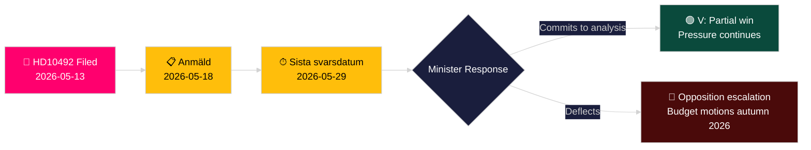

# Vänsterpartiet kräver konsekvensanalys av biståndsminskningar för barn

**Författare**: James Pether Sörling
**Datum**: 2026-05-14
**Klassificering**: OFFENTLIG — GDPR Art. 9(2)(e,g)
**Konfidens**: MEDEL [B2]
**Admiralitetskod**: B2

---

## BLUF

Lotta Johnsson Fornarve (V) har lämnat in Interpellation 2025/26:492 med krav på att bistånds- och utrikeshandelsminister Benjamin Dousa (M) redogör för barnrättskonsekvenserna av Sveriges dramatiska biståndsminskningar. Med Tidöregerings biståndspolitik som övergav enprocentsmålet i december 2023 och drog tillbaka landstrategier, rapporterar Rädda Barnen att program för svårt undernärda barn, mödravård i flyktingläger och vaccinationskampanjer har tvingats stänga. Interpellationen kräver en formell konsekvensanalys och ett stärkt barnrättsramverk i svensk biståndspolitik — en direkt utmaning mot regeringens paradigm "Bistånd för en ny era".

## Beslut som detta underlag stöder

1. **Portföljpositionering**: Oppositionspartier och civilsamhällsaktörer bevakar om minister Dousa kommer att åta sig en formell konsekvensanalys (barnkonsekvensanalys) — svaret formar efterföljande lagstiftnings- och budgetalternativ i vårbudgeten 2026/27.
2. **Medieinramning**: Om regeringen trovärdigt kan försvara sin biståndsreform på barnrättsgrunder inför valrörelsen 2026.
3. **Internationell positionering**: Sveriges rykte vid OECD DAC, UNICEF och EU:s utvecklingspartners när svensk ODA faller under DAC-riktmärket på 0,7 %.

## 60-sekunders underrättelsepunkter

- 📌 **HD10492** lämnad 2026-05-13, publicerad 2026-05-14; debatt planerad 2026-05-18; sista svarsdatum 2026-05-29
- 📌 **Upphovsperson**: Lotta Johnsson Fornarve (V) — ledamot i UU (utrikesutskottet); konsekvent förespråkare för biståndsrättigheter
- 📌 **Mål**: Minister Benjamin Dousa (M) — yngste ministern i Tidöregeringen, ansvarig för omstrukturering av "Bistånd för en ny era"
- 📌 **Kärnpåstående**: Svenska biståndsminskningar har direkt stoppat vitala program för undernärda barn, mödravård i läger, vaccinationer, flickors utbildning (Rädda Barnen-bevis [B2])
- 📌 **Skala**: ~500 miljoner barn globalt i konfliktzoner; ~5 miljoner döda under 5 år/år; 29 000 barn fördrivna dagligen
- 📌 **Svensk politisk förändring**: Tidöregeringen (M+KD+L med SD-stöd) övergav enprocentsmålet december 2023 — ODA faller från ~0,9 % BNI mot ~0,7 % BNI
- 📌 **Tre frågor**: (1) Konsekvensanalys genomförd? (2) Barnrätt i policydokument? (3) Stärk barnrätt i humanitärt bistånd (SE/EU/FN)?
- 📌 **Ingen debatt ännu** — interpellationen skickad, inte ännu besvarad; underrättelsevärde i att följa regeringens svarsriktning

## Viktigaste framtida utlösare

**2026-05-29** — Sista svarsdatum. Om minister Dousa inte åtar sig en konsekvensanalys (barnkonsekvensanalys), kommer V och troligen S/MP/C att intensifiera trycket genom budgetmotioner hösten 2026.

## Nyckelkonfidensbedömning

**MEDEL** [B2] — Fullständig interpellationstext hämtad från officiell riksdagskälla; faktapåståenden om stängda biståndsprogram bygger på Rädda Barnens rapportering (sekundärkälla, trovärdig NGO, oberoende verifierbar) snarare än statlig statistikutgåva.

## Ändringar efter pass 2

**DIW-notering [OMTVISTAT]**: Djävulens advokat-utmaning identifierar intervallet 6,5–7,2. Primär poäng bibehållen vid 7,2 baserat på CRC-rättslig förankring + valårstiming + Rädda Barnen-bevisens densitet. Se devils-advocate.md.

**Ytterligare beslutnotering**: Koalitionsdynamik — L (Liberalerna)-ledamöter historiskt stödjande av enprocentsmålet kan komma att pressas att kommentera. Bevaka L-talespersoner efter debatt (2026-05-18) för avvikelse från koalitionslinjen.

**WEP-uttalande** [horizon:T+15d]: *Det är troligt (65 %) att Dousa svarar med effektivitetsomformulering (Scenario B). Det är möjligt (25 %) att ett substantiellt partiellt åtagande erbjuds (Scenario A). Det är osannolikt (20 %) att svaret är rent procedurellt (Scenario C).* [WEP: "troligt/möjligt/osannolikt"]

<!-- source-sha: 48729b47776eee9fd5a699b73571f4fb4db8f7a5 -->
