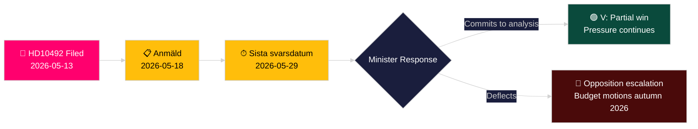

# 左翼党要求评估援助削减对儿童的影响

**作者**: James Pether Sörling
**日期**: 2026-05-14
**分类**: 公开 — GDPR Art. 9(2)(e,g)
**置信度**: 中等 [B2]
**海军准将代码**: B2

---

## 简报摘要（BLUF）

洛塔·约翰逊·福尔纳维（V）提交了质询案2025/26:492，要求发展合作与对外贸易部长本雅明·杜萨（M）就瑞典大幅削减对外援助对儿童权利的影响作出说明。自2023年12月Tidöregeringen放弃"百分之一目标"并撤销国别战略后，Rädda Barnen报告称，针对严重营养不良儿童的项目、难民营中的妇幼保健以及疫苗接种运动被迫关闭。该质询案要求开展正式影响分析，并在瑞典发展援助政策中建立更完善的儿童权利框架——直接挑战政府的"Bistånd för en ny era"范式。

## 本分析支持的决策

1. **投资组合定位**：反对党和公民社会行为者密切关注杜萨部长是否会承诺进行正式影响分析（barnkonsekvensanalys）——答案将决定2026/27年春季预算中后续立法和预算方案的走向。
2. **媒体框架**：政府能否在2026年竞选活动开始前从儿童权利的角度可信地为其援助改革进行辩护。
3. **国际定位**：随着瑞典官方发展援助降至低于发展援助委员会0.7%基准，瑞典在经合组织发展援助委员会、联合国儿童基金会及欧盟发展伙伴中的声誉。

## 60秒情报要点

- 📌 **HD10492** 2026-05-13提交，2026-05-14公开；辩论定于2026-05-18；答复截止日期2026-05-29
- 📌 **提交者**：洛塔·约翰逊·福尔纳维（V）——外事委员会（UU）成员；始终如一的发展援助权利倡导者
- 📌 **目标**：本雅明·杜萨部长（M）——Tidöregeringen最年轻的部长，负责"Bistånd för en ny era"重组
- 📌 **核心主张**：瑞典援助削减直接停止了为营养不良儿童提供的重要项目、难民营产妇护理、疫苗接种和女童教育（Rädda Barnen证据[B2]）
- 📌 **规模**：全球冲突地区约5亿儿童；每年约500万5岁以下儿童死亡；每日29,000名儿童流离失所
- 📌 **瑞典政策转变**：Tidöregeringen（M+KD+L获SD支持）于2023年12月放弃enprocentsmålet——官方发展援助从约占国民总收入0.9%降至约0.7%
- 📌 **三个问题**：(1) 是否进行了影响分析？(2) 政策文件中是否包含儿童权利？(3) 在人道主义援助中加强儿童权利（SE/EU/UN）？
- 📌 **尚无辩论**——质询案已提交，尚未得到答复；追踪政府答复走向具有情报价值

## 最重要的未来触发因素

**2026-05-29** — Sista svarsdatum（最终答复截止日期）。若杜萨部长不承诺进行影响分析（barnkonsekvensanalys），V以及可能的S/MP/C将在2026年秋季通过预算动议施加更大压力。

## 关键置信度评估

**中等** [B2] ——从里克斯达格官方来源获取完整质询文本；关于援助项目关闭的事实性主张依赖Rädda Barnen的报告（二手来源、可信NGO、可独立核实），而非政府统计出版物。

## 第二轮修订

**DIW注释[有争议]**：魔鬼代言人挑战识别出6.5–7.2的范围。根据CRC法律锚定+选举年时机+Rädda Barnen证据密度，主要分数维持在7.2。参见devils-advocate.md。

**额外决策注释**：联盟动态——历史上支持enprocentsmålet的L（Liberalerna）成员可能被迫发表评论。辩论后（2026-05-18）关注L发言人是否偏离联盟路线。

**WEP声明** [horizon:T+15d]：*杜萨以效率重构回应的可能性较高（65%，情景B）。提供实质性部分承诺的可能性存在（25%，情景A）。答复纯粹是程序性的可能性较低（20%，情景C）。* [WEP: "可能性较高/可能性存在/可能性较低"]

<!-- source-sha: 48729b47776eee9fd5a699b73571f4fb4db8f7a5 -->
