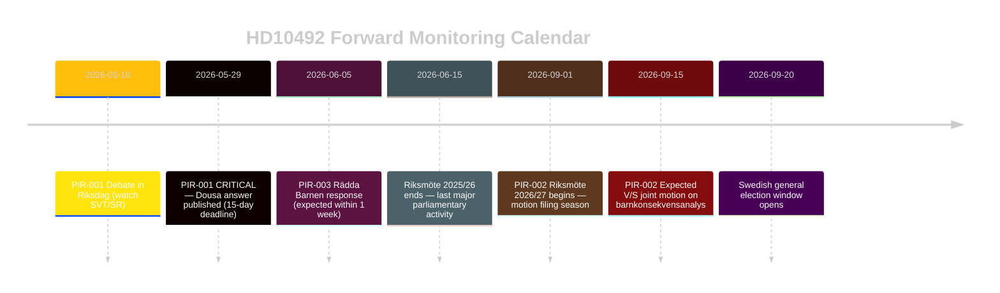

# Forward Indicators — PIR-Linked Monitoring

**Date**: 2026-05-14 | **Horizon**: T+15d to T+90d

---

## Priority Intelligence Requirements (PIRs)

### PIR-001 [CRITICAL]: Dousa Answer Text and Quality
- **What to watch**: riksdagen.se — HD10492 answer publication
- **Expected by**: 2026-05-29 (15-day statutory deadline from 2026-05-14)
- **Indicators of Scenario A** (Substantive): Explicit barnkonsekvensanalys commitment; named responsible unit; timeline stated; CRC Article 3 referenced directly
- **Indicators of Scenario B** (Deflect): Efficiency language; "nå fler barn" without specific analysis; general CRC acknowledgement
- **Indicators of Scenario C** (Procedural): Answer under 300 words; time extension granted; talmannen message

### PIR-002 [HIGH]: V/S Parliamentary Response
- **What to watch**: riksdag.se — motioner, interpellationer filed June-November 2026
- **Indicators**: V files motion requiring barnkonsekvensanalys (autumn 2026); S co-signs; joint V/S press conference
- **Timeline**: Most likely September-October 2026 (start of riksmöte 2026/27)

### PIR-003 [MEDIUM]: Rädda Barnen Communications
- **What to watch**: raddabarnen.se/press; Twitter/X @RaddaBarnen; DN/SvD political pages
- **Indicators**: Press release citing Dousa's answer; partnership with UNICEF Sverige; parliamentary testimony request
- **Timeline**: Within 1 week of Dousa answer (by ~2026-06-05)

### PIR-004 [MEDIUM]: Civil Society Coordinated Campaign
- **What to watch**: Act Sweden, Church of Sweden, PMU, UNICEF Sverige joint statements
- **Indicators**: "Rädda biståndet för barn" style coordinated campaign launch
- **Timeline**: Summer 2026 (pre-election season)

### PIR-005 [LOW]: OECD-DAC Peer Review Announcement
- **What to watch**: oecd.org/dac/peer-reviews; Sida press releases
- **Indicators**: Confirmed 2026 Sweden DAC peer review announcement; preliminary findings
- **Timeline**: Unknown; DAC reviews on 4-5 year cycle

## Forward Trigger Escalation Matrix

| Trigger Event | Probability | → Next Action | Escalation Level |
|---------------|-------------|---------------|-----------------|
| Dousa Scenario B answer | 55% | V press release + motion prep | L2 → L2 maintained |
| Dousa Scenario A commitment | 25% | V monitoring mode; Rädda Barnen conditional endorsement | L2 → L3 deescalation |
| Dousa Scenario C procedural | 20% | V urgency debate request; media escalation | L2 → L1 escalation |
| S announces joint autumn motion | 40% | Legislative pathway confirmed | L2 → L2 confirmed |
| Rädda Barnen major press event | 35% | Media cycle on barnbistånd | L2 → amplification |
| OECD-DAC critical finding | 20% | International pressure dimension adds | L2 → L2 (international track) |

## 90-Day Monitoring Calendar

