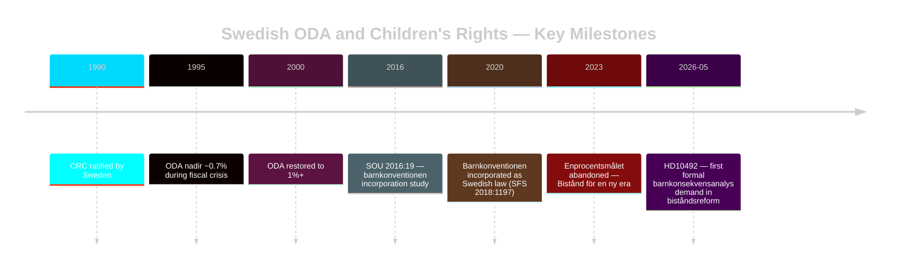

# Historical Parallels — Swedish ODA and Children's Rights

**Date**: 2026-05-14

---

## Closest Historical Parallel: Sweden ODA Cuts of the 1990s

During the Swedish fiscal crisis 1992-1995, ODA was cut from ~0.9% GNI to ~0.7% GNI. Key features:

- **Social Democrats** (in government during crisis) implemented cuts
- **CRC not yet incorporated** into Swedish law (CRC ratified 1990, incorporated 2020)
- **No formal barnkonsekvensanalys** — this concept was not established in Swedish policy discourse
- **Recovery**: ODA rose to 1%+ by 2000 when fiscal consolidation complete

**Parallel to 2023-2026**: The current cuts are government policy *choice*, not fiscal emergency. This is the key difference that strengthens V's case — no crisis justification, unlike 1990s.

## Historical Precedent: Barnkonventionen Incorporation Debates (2015-2020)

When Sweden debated incorporating CRC as law:
- **Government concern**: Uncertainty about how courts would interpret CRC in budget decisions
- **Utredningen SOU 2016:19** examined implications
- **Result**: CRC incorporated 2020 with express intent that it should affect government decision-making

**Parallel**: This legislative history strengthens V's HD10492 argument — incorporation was explicitly intended to affect exactly this kind of government policy choice. The SOU 2016:19 process shows that "barnkonsekvensanalys" was discussed during incorporation debates. [B2]

## International Historical Parallel: UK DFID Child Rights Reviews

DFID (now FCDO) implemented mandatory child rights impact assessments for programme changes following 2000s development policy reforms. When the UK government consolidated DFID into FCO in 2020, child rights review requirements were maintained but de-emphasised.

**Lesson**: Institutional embedding of child rights analysis (not just CRC incorporation) is required for sustained compliance. Sweden lacks this institutional mechanism.

## Historical Precedent: Nordic ODA Peer Reviews

Norway maintained 1%+ ODA through multiple Norwegian government changes, including Conservative-led governments. Norway's Conservative Prime Minister Solberg (2013-2021) maintained enprocentsmålet despite domestic fiscal pressures.

**Parallel**: The government's "efficiency" argument has no Nordic peer precedent. Conservative Nordic governments have historically maintained volume while improving effectiveness, not traded volume for efficiency.

## Historical Significance of HD10492

**First formal parliamentary demand for barnkonsekvensanalys in biståndsreform**: Based on search results, no prior HD interpellation directly demanded barnkonsekvensanalys in the context of the 2023-2026 ODA reform. If confirmed, HD10492 establishes a precedent.

**Pattern**: V's use of interpellation tool + CRC legal anchor mirrors earlier V strategies on domestic child policy issues (e.g., barnfattigdom interpellations 2018-2020 that preceded government action on child poverty mapping).

