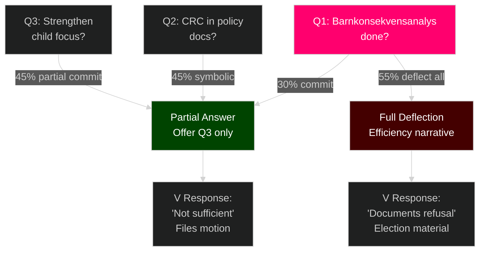

# Implementation Feasibility — Barnkonsekvensanalys Requirement

**Date**: 2026-05-14 | **Scope**: Practical assessment of V's demand

---

## Feasibility Assessment: Conducting Barnkonsekvensanalys

### What is being requested?

Q1 of HD10492 asks whether government has conducted barnkonsekvensanalys of aid cuts. Q3 asks about strengthening child rights in humanitarian aid. The implicit demand is: *before implementing ODA reform, conduct formal analysis of impact on children*.

### Operational Feasibility

| Requirement | Feasibility | Notes |
|-------------|-------------|-------|
| Designate responsible unit | HIGH | Sida has existing human rights function; UF has development policy unit |
| Scope analysis | MEDIUM | 30+ bilateral programs affected; complex causality chains |
| Data availability | MEDIUM | Rädda Barnen, UNICEF, Sida evaluation data exists |
| Timeline | HIGH | Denmark model: 2-4 weeks for abbreviated review |
| Cost | HIGH | Minimal — existing staff capacity |
| Political will | LOW | Primary constraint |

### Denmark Comparison Model (Revisited)

Denmark's CRIA (Child Rights Impact Assessment) for Danida program changes:
- **Abbreviated CRIA**: 2 staff-weeks, existing data
- **Full CRIA**: 6-8 staff-weeks + external expert (DKK 200-300k ≈ SEK 300-450k)
- For a reform of Sweden's scale: full CRIA, ~6-8 weeks, SEK 500k-1M

**Assessment**: Feasibility is HIGH. Political will is the binding constraint, not operational capacity.

### Government's Implicit Claim

By not commissioning barnkonsekvensanalys, the government implicitly claims either:
1. The analysis would show net benefit to children (but then why not commission it?) **OR**
2. The reform was not of a character requiring such analysis (contradicted by CRC Article 3) **OR**
3. The government disagrees with the requirement to conduct such analysis

Option 3 is the most consistent with the evidence but is the legally and politically most exposed position.

## Feasibility of V's Demands

| V Demand | Operational Feasibility | Political Feasibility | Assessment |
|---------|------------------------|----------------------|-----------|
| Conduct barnkonsekvensanalys | HIGH | LOW | **Will not happen before Dousa answers** |
| Include CRC in policy docs | HIGH | MEDIUM | **Could be offered as face-saving partial response** |
| Strengthen child focus in humanitarian aid | MEDIUM | MEDIUM | **Possibly offered as partial commitment** |

## Prediction: What Government Will Offer

Based on feasibility analysis and political incentive structure:

*[horizon:T+15d] It is possible (30%) that Dousa offers Q3 partial commitment (child focus in humanitarian operations) as face-saving response while avoiding Q1 (barnkonsekvensanalys) and Q2 (CRC in policy documents). [WEP: "possible"]*

This would allow:
- Government to claim "we heard the concerns"
- V to claim partial success but maintain pressure
- Most politically cost-effective outcome for government

