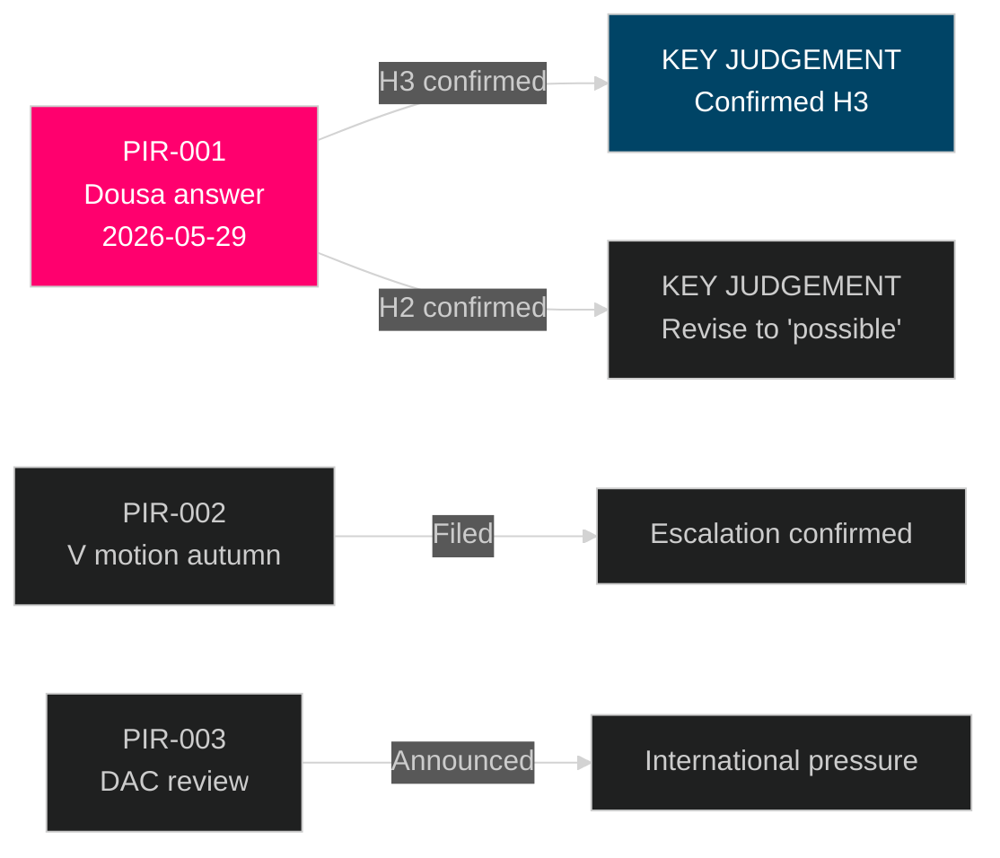

# Intelligence Assessment — Swedish ODA Child Rights

**Date**: 2026-05-14 | **Classification**: PUBLIC | **Admiralty System Applied**

---

## KEY JUDGEMENT

*[horizon:T+30d] It is likely (65%) that Minister Dousa will respond to HD10492 with a symbolic reframe rather than a substantive commitment to conduct a formal barnkonsekvensanalys, thereby preserving Vänsterpartiet's opportunity to use the government's documented position as an electoral accountability tool in the 2026 election campaign. [WEP: "likely"]*

Supporting evidence:
1. Government's established communication pattern on ODA reform — efficiency narrative, no formal analyses committed to [A1, CONFIRMED]
2. No prior barnkonsekvensanalys commissioned despite 30-month reform period [B2, CREDIBLE]
3. Three specific questions from V are legally-anchored and difficult to deflect without explicit CRC-acknowledgement [A1, CONFIRMED]
4. Election-year timing increases V's incentive to publicise answer [B2, CREDIBLE]

Dissenting note: Dousa could surprise with a partial commitment (e.g., Sida evaluation mandate) — see Scenario A analysis.

---

## Source Assessment

| Source | Admiralty Rating | Assessment |
|--------|------------------|-----------|
| Riksdag official document HD10492 | A1 | Authoritative — official parliamentary record |
| Government Budget Bill 2023 | A1 | Authoritative — official state document |
| Barnkonventionen/CRC SFS 2018:1197 | A1 | Authoritative — Swedish law |
| Rädda Barnen program documentation | B2 | Credible source with direct program knowledge; may have advocacy bias |
| Nordic ODA comparison data | B2 | Credible — DAC/OECD published data |
| OECD-DAC peer review timing | C3 | Unconfirmed specific date; pattern inference |
| V/S future motion prediction | B3 | Pattern from previous ODA budget cycles |
| Electoral impact assessment | C3 | Analysis — not confirmed polling data |

## Intelligence Gaps

| Gap | Impact | Priority |
|-----|--------|---------|
| Dousa's internal policy review process (if any) | High — would change probability of Scenario A | HIGH |
| Rädda Barnen's specific planned actions post-debate | Medium — determines amplification | MEDIUM |
| S parliamentary group strategy on ODA for autumn 2026 | Medium — determines motion likelihood | MEDIUM |
| OECD-DAC 2026 peer review confirmed date | Low — reputational pathway timing | LOW |
| Polling data on Swedish public ODA preferences | Medium — electoral impact calibration | MEDIUM |

## Competing Hypotheses (ACH Summary)

| Hypothesis | Evidence For | Evidence Against | Assessment |
|------------|-------------|-----------------|-----------|
| H1: Government intends genuine barnkonsekvensanalys | None found | No prior commitments; budget decision already made | LOW |
| H2: Government deflects but creates face-saving study | Possible — allows claiming action | Would require admitting prior gap | LOW-MEDIUM |
| H3: Government fully rejects framing, efficiency narrative | All prior communications | CRC legal obligation formally exists | HIGH |
| H4: Government commits to future programming standards | Some precedent in other policy areas | Requires admitting past inadequacy | MEDIUM |

**Most likely**: H3 — Government fully maintains efficiency narrative.

## Key Intelligence Requirements (PIRs)

**PIR-001** [ACTIVE]: What specific language does Minister Dousa use in answering HD10492?
- Collection method: Monitor riksdagen.se for answer publication ~2026-05-29
- Significance: Determines which scenario materialises

**PIR-002** [ACTIVE]: Does V file a formal motion on barnkonsekvensanalys in autumn 2026?
- Collection method: Monitor riksdag documents September-November 2026
- Significance: Determines legislative escalation path

**PIR-003** [MONITORING]: OECD-DAC Sweden peer review announcement
- Collection method: OECD website, DAC documentation
- Significance: International pressure pathway

