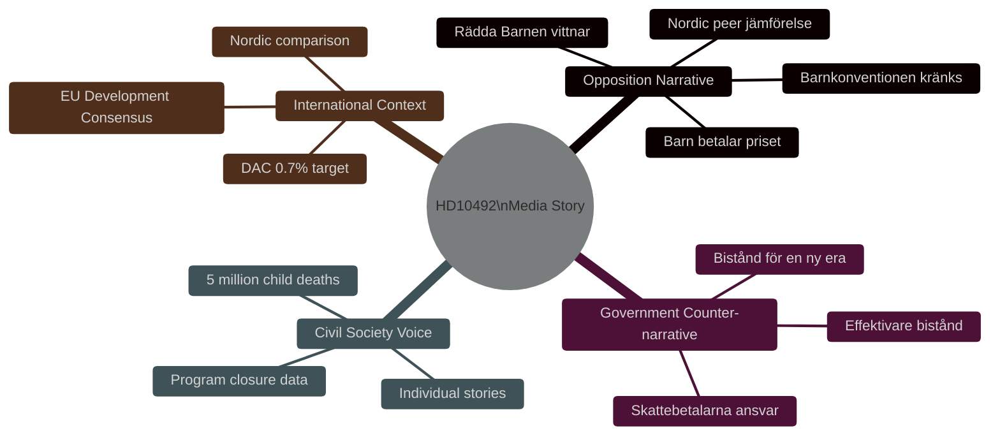

# Media Framing Analysis — HD10492

**Date**: 2026-05-14 | **Method**: Frame analysis + narrative mapping

---

## Primary Competing Frames

### Frame 1 (Opposition/V/Rädda Barnen): "Barn betalar priset"
**Core claim**: Aid cuts cause specific, documented harm to children — malnourishment, maternal mortality, girls' education loss
**Evidence anchors**: Rädda Barnen program closure documentation; 5 million child deaths/year statistic; specific vulnerable country programs
**Emotional register**: Humanitarian urgency; Sweden's moral responsibility
**Vulnerability**: Government can counter with "more efficient alternatives"; difficult to attribute specific deaths to Swedish cuts alone

### Frame 2 (Government/M): "Effektivare bistånd når fler"
**Core claim**: ODA reform improves accountability and targeting; same or better child outcomes achievable with lower volume
**Evidence anchors**: OECD effectiveness criteria; bilateral program accountability metrics; domestic taxpayer stewardship
**Emotional register**: Pragmatic; responsible governance; modernisation
**Vulnerability**: No barnkonsekvensanalys = no evidence base for claim; contradiction with Rädda Barnen data

### Frame 3 (Emerging/Nordic): "Sverige sviker sin tradition"
**Core claim**: Sweden historically a global ODA leader; current cuts damage Sweden's international standing
**Evidence anchors**: Nordic peer comparison; historical 1%+ Swedish ODA; OECD-DAC reputation
**Emotional register**: National identity; shame/pride; global responsibility
**Vulnerability**: Government can argue "tradition doesn't equal effectiveness"

## Media Narrative Map

## Anticipated Media Coverage Pattern

**Phase 1** (Filing, May 14): Minimal coverage — interpellation filing rarely generates immediate coverage unless journalist pre-briefed
**Phase 2** (Pre-debate, May 15-17): Possible V press release + Rädda Barnen statement; moderate political media coverage
**Phase 3** (Debate, May 18): Potential SVT/SR parliamentary coverage; digital political media; Dagens Nyheter/SvD political desk interest
**Phase 4** (Answer publication, ~May 29): If answer is weak, V will issue press release framing answer as "government refuses children's rights analysis" — peak coverage moment
**Phase 5** (Autumn 2026): Electoral use of documented answer; campaign material integration

## Framing Advantage Assessment

| Frame dimension | V frame | Government frame | Advantage |
|----------------|---------|-----------------|-----------|
| Specificity of evidence | HIGH (program names, numbers) | LOW (general efficiency claims) | **V** |
| Emotional resonance | HIGH (children, mortality) | LOW-MEDIUM (efficiency) | **V** |
| Legal grounding | HIGH (CRC incorporated) | MEDIUM (effectiveness norms) | **V** |
| Nordic peer support | HIGH | LOW | **V** |
| Domestic electoral salience | MEDIUM | MEDIUM | Neutral |
| Complexity | LOW (simple barnrätts story) | HIGH (efficiency requires explanation) | **V** |

**Overall framing advantage**: V's frame is structurally stronger for media uptake. Government's efficiency narrative requires substantive evidence (which doesn't exist without barnkonsekvensanalys) to counter V's evidence-based harm documentation.
