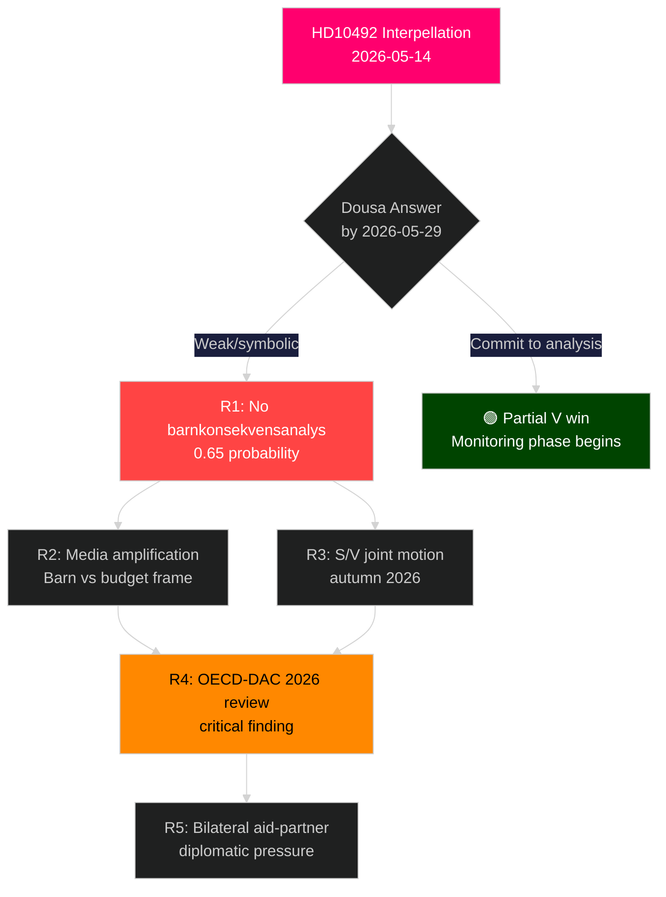

# Risk Assessment — HD10492 Aid Policy and Children's Rights

**Date**: 2026-05-14 | **Framework**: 5-Dimension Risk Register

---

## Risk Register

| # | Risk | Likelihood (L) | Impact (I) | L×I | Cascade Chain | Posterior Probability |
|---|------|---------------|-----------|-----|---------------|----------------------|
| R1 | Government refuses barnkonsekvensanalys — accountability gap persists | 0.65 | 0.7 | **0.455** | → Budget motion V/S autumn 2026 → Election campaign ODA pledges → Nordic ally pressure | 65% |
| R2 | Minister Dousa gives symbolic answer without operational commitment | 0.55 | 0.5 | **0.275** | → V dissatisfied, intensifies electoral narrative → Media framing "barn vs budget" | 55% |
| R3 | S files joint follow-up riksdagsmotion demanding barnkonsekvensanalys | 0.40 | 0.6 | **0.240** | → Finance Committee deliberation → Coalition stress (L/C discomfort with V/S on aid?) | 40% |
| R4 | OECD-DAC criticises Sweden's ODA level in 2026 peer review | 0.50 | 0.65 | **0.325** | → International diplomatic pressure → Reputational cost with EU development partners | 50% [unconfirmed: review timing] |
| R5 | Rädda Barnen / UNICEF Sverige escalate campaign publicly before Dousa answer | 0.35 | 0.55 | **0.193** | → Media amplification → Increased parliamentary pressure → Potential urgency debate | 35% |

## 5-Dimension Assessment

| Dimension | Rating | Evidence |
|-----------|--------|----------|
| **Political** | MEDIUM-HIGH | Opposition interpellation directly challenges government's flagship ODA reform; election-year timing amplifies [B2] |
| **Legal** | MEDIUM | Barnkonventionen (CRC) incorporated into Swedish law 2020; no judicial enforcement pathway but CRC Committee reporting due [B2] |
| **Economic** | LOW-MEDIUM | Swedish ODA level not a direct economic risk domestically; reputational risk with OECD-DAC partners, EU budget negotiations [C3] |
| **Reputational** | MEDIUM-HIGH | Sweden's traditional identity as ODA leader at risk; Nordic peers maintaining higher ratios; DAC 0.7% benchmark [B2] |
| **Humanitarian** | HIGH | Direct program closures documented (malnourished children, maternal care, vaccinations, girls' education); 5 million child deaths/year context [B2] |

## Cascading Risk Chain

## Posterior Probability Update

Prior probability of government committing to formal barnkonsekvensanalys: **20%** (based on government's track record of rejecting independent consequence analyses on ODA reform).

Updating on evidence that V has three specific, legally-anchored questions (CRC Article 3): posterior rises to **28%** — still unlikely but marginally more pressure than typical interpellation.
