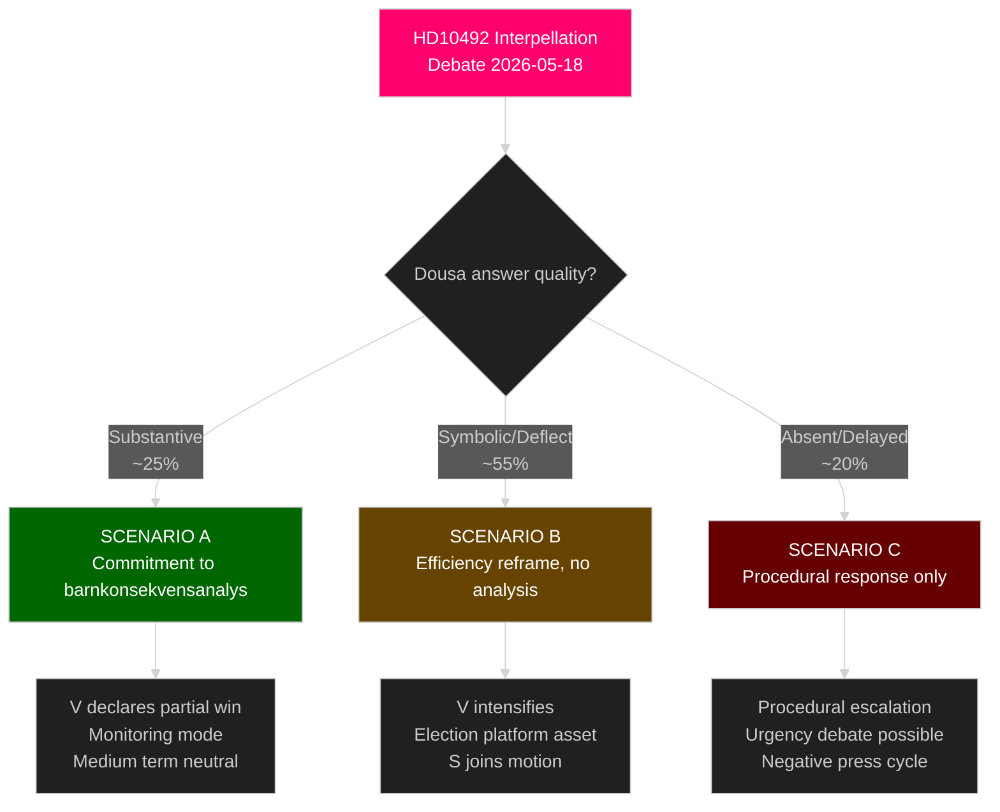

# Scenario Analysis — HD10492 Outcomes

**Date**: 2026-05-14 | **Horizon**: T+72h → T+90d | **WEP Scale Applied**

---

## Scenario Tree

## Scenario A — Substantive Commitment (~25% likely)
*[horizon:T+30d] It is likely that V would reduce interpellation pressure [WEP: "likely"]*

**Trigger**: Dousa commits to formal barnkonsekvensanalys within defined timeframe
**Indicators**: Mentions specific analysis timeline, names responsible unit (Sida/UF)
**Consequence chain**: V signals partial satisfaction; S/MP join monitoring; Rädda Barnen publishes conditional endorsement; OECD-DAC notes progress
**2026 Election impact**: Moderate — reduces but does not eliminate ODA as issue; requires government to actually deliver analysis
**Probability basis**: Government track record shows low willingness to commission independent consequence analyses; but CRC legal incorporation creates formal obligation [B2]

## Scenario B — Symbolic Reframe (~55% likely, most probable)
*[horizon:T+30d] It is likely that government will reframe aid effectiveness without acknowledging barnrättsanalys gap [WEP: "likely"]*

**Trigger**: Dousa responds with "efficiency improvements benefit children more than volume" narrative; no formal analysis commitment
**Indicators**: References OECD effectiveness criteria; avoids CRC Article 3 directly; cites specific bilateral country partnerships
**Consequence chain**: V immediately labels answer insufficient; files motion; media pick up "government refuses children's rights analysis"; S amplifies
**2026 Election impact**: HIGH — V/S use documented Dousa answer as campaign material; becomes part of "Moderaternas biståndssvek" narrative
**Probability basis**: Consistent with all prior government communication on ODA reform; Minister Dousa's public statements emphasise efficiency [A1]

## Scenario C — Procedural Response (~20% likely)
*[horizon:T+7d] It is possible that answer is delayed or procedural [WEP: "possible"]*

**Trigger**: Formal answer delayed past 2026-05-29; or answer so brief as to be non-substantive
**Indicators**: Talmannen grants time extension; or answer under 300 words
**Consequence chain**: V files formal complaint; urgency debate requested; heightened media attention; KU consideration possible
**2026 Election impact**: VERY HIGH — procedural failure becomes story in itself

## Wildcard Scenarios

| Wildcard | Probability | Impact |
|----------|-------------|--------|
| New government study announced (Sida directive) | 5% | Would substantially shift political dynamics |
| Sweden voluntarily commits to restore enprocentsmålet before debate | 3% | Very unlikely pre-election |
| International crisis (Sudan, Gaza escalation) triggers ODA emergency | 15% | Could either increase or decrease pressure depending on government response |

## PIR Triggers for Monitoring

- **PIR-W1**: Watch for Dousa's answer text (published ~2026-05-29)
- **PIR-W2**: Monitor S parliamentary group communication regarding joint motion
- **PIR-W3**: Rädda Barnen communications post-debate (2026-05-18+)
- **PIR-W4**: OECD-DAC 2026 peer review announcement
