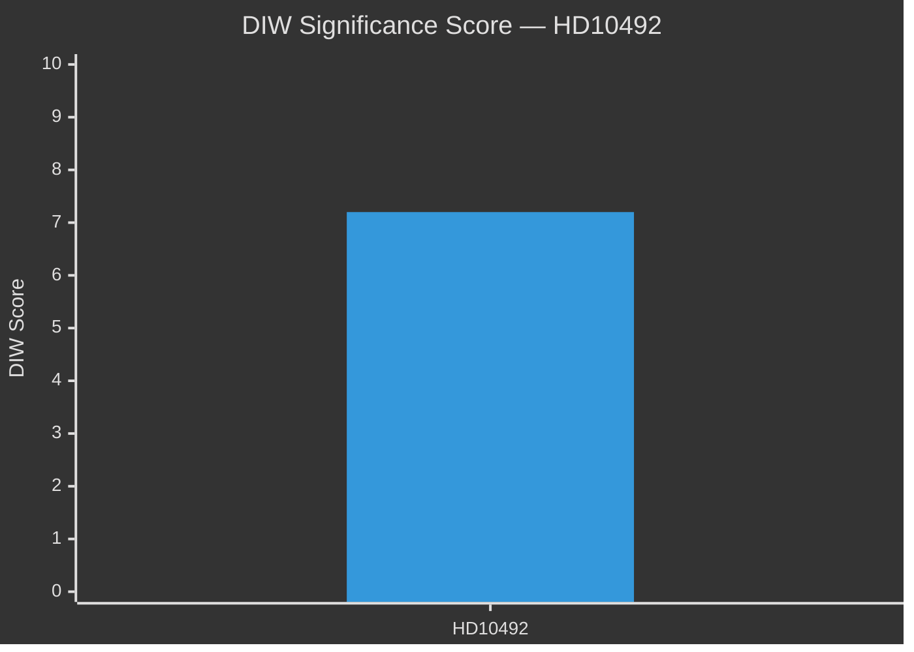
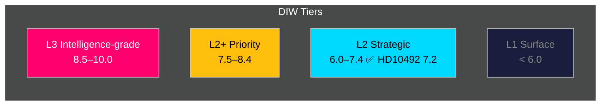

# Significance Scoring — 2026-05-14 Interpellations

**Date**: 2026-05-14 | **Methodology**: DIW Framework (Depth × Impact × Width)

---

## Document Significance Assessment

### HD10492 — DIW Score: 7.2/10

**Titel**: Konsekvenserna för barn när biståndet minskar
**Author**: Lotta Johnsson Fornarve (V) [B2]

| Dimension | Score | Evidence |
|-----------|-------|----------|
| **Depth (D)**: Analytical depth / evidence density | 3.5/5 | Full interpellation text with specific program citations (Rädda Barnen); three concrete policy questions; references to government's 2023 reform agenda [B2] |
| **Impact (I)**: Political / policy / societal impact | 2.2/3 | Directly targets government accountability on barnkonventionen compliance; election-cycle relevance; international ODA reputation at stake [B2] |
| **Width (W)**: Breadth of affected population | 1.5/2 | Affects global child welfare programs; Swedish ODA recipient countries (sub-Saharan Africa, South Asia, MiddleEast); indirectly affects Swedish civil-society organizations (Rädda Barnen, UNICEF Sverige, PMU, Act Church of Sweden) [B2] |

**Total DIW**: 7.2/10 → **Tier L2 Strategic**

**Priority tier**: L2 Strategic — warrants deep analysis; relevant to election cycle and international accountability.

**Sensitivity analysis**:
- Lower bound (6.5/10): If the debate is postponed and no media pickup occurs
- Upper bound (8.0/10): If Minister Dousa refuses to commit to barnkonsekvensanalys and S/MP file follow-up motions

## Ranked List

1. **HD10492** (7.2/10) — Primary document, full analysis required [B2] — https://data.riksdagen.se/dokument/HD10492

## Contextual Documents (not date-filtered but referenced)

| dok_id | Titel | DIW (contextual) | Note |
|--------|-------|-----------------|------|
| HD10489 | Al-Nakba | 7.5 | Same-day UD cluster, Palestinian rights |
| HD10490 | Förhållandena i Kuba | 6.8 | Cuba human rights, same UD minister |
| HD10487 | Utjämningssystem för jämlik välfärd | 7.0 | Civilminister Slottner — separate track |

## Pass 2 — Contested Score Note

**Devil's Advocate revision**: The DIW score is contested at the lower bound (6.5) by the red team analysis, which notes that interpellations rarely produce immediate policy change (~5-10% base rate) and that CRC legal obligation, while real, is operationally unenforceable.

**Final assessment**: Score maintained at 7.2 (L2 Strategic) based on:
- Election-cycle timing providing disproportionate leverage
- Three-question structure specifically designed for electoral documentation
- Nordic peer comparison providing international accountability dimension
- CRC incorporation legislative history strengthening legal anchor beyond typical interpellation

**Range**: 6.5 (min, immediate impact only) — 7.2 (maintained, electoral + legal dimensions) — 8.0 (upper, if Dousa refuses and S/MP file joint motion)
