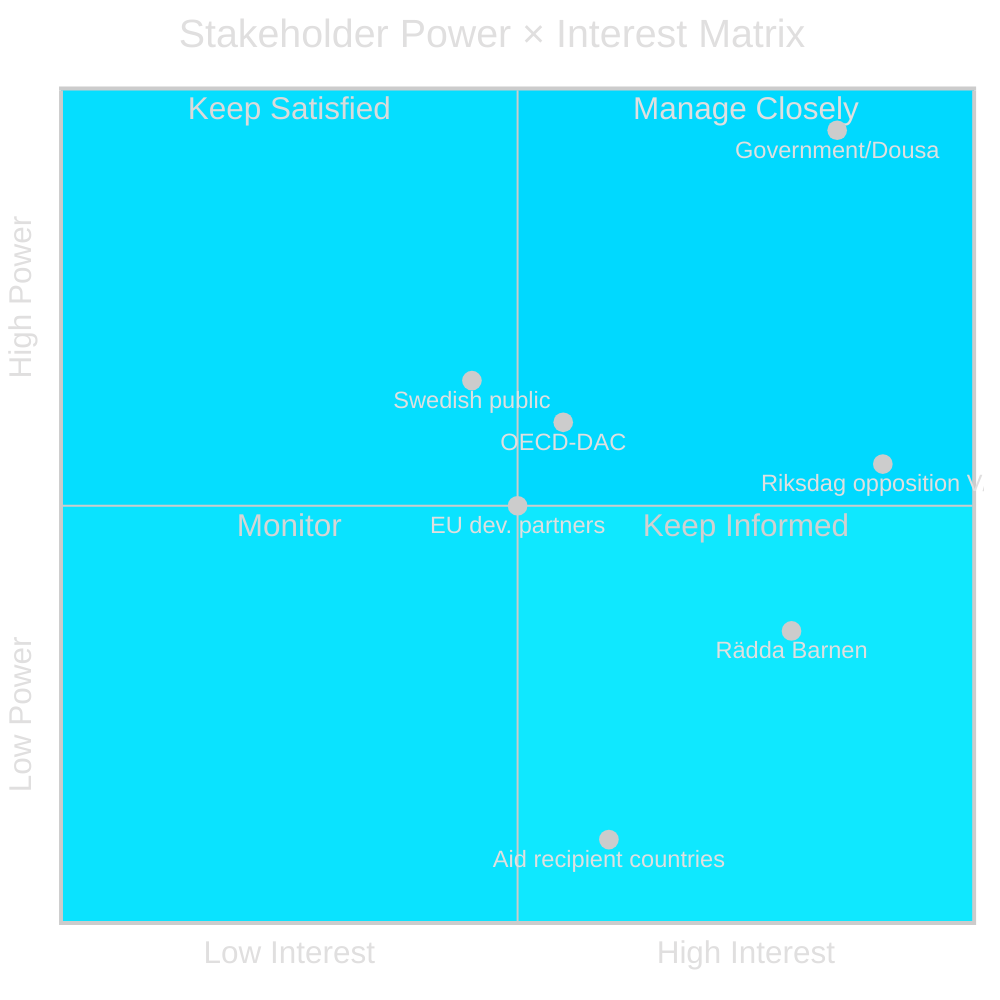

# Stakeholder Perspectives — HD10492

**Date**: 2026-05-14 | **Method**: Structured interests-positions analysis

---

## Stakeholder Map

## Detailed Stakeholder Analysis

### Minister Benjamin Dousa (M) — HIGH POWER, HIGH INTEREST

**Formal position**: "Bistånd för en ny era" — aid effectiveness reform; ODA redirected from 0.95% to ~0.7% GNI
**Underlying interest**: Defend Tidöregeringen's flagship ODA reform without appearing hostile to children
**Likely response strategy**: Claim "efficiency improvements benefit children more than volume"; avoid committing to formal consequence analysis
**Evidence**: Government budget bill autumn 2023 dropped enprocentsmålet without barnkonsekvensanalys [A1]
**Admiralty**: [A1] — own government statements (authoritative)

### Lotta Johnsson Fornarve (V) — MEDIUM-HIGH INTEREST, OPPOSITION

**Formal position**: Three questions demanding accountability (barnkonsekvensanalys, CRC in policy, humanitarian child focus)
**Underlying interest**: Electoral differentiation; V core value humanitarian solidarity
**Strategic goal**: Establish clear red line for 2026 election; document government's answer for campaign use
**Evidence**: V consistently files barnrätts-interpellations; Fornarve is shadow minister for international development [B2]
**Admiralty**: [B2]

### Socialdemokraterna (S)

**Position**: Opposes ODA cuts; jointly signed multiple budget motions restoring enprocentsmålet
**Interest**: Electoral challenge on humanitarian profile; avoid being outflanked by V on left
**Action**: Likely to reinforce V's interpellation framing in chamber; possible joint motion autumn 2026
**Admiralty**: [B3] — pattern inference

### Rädda Barnen (Save the Children Sweden)

**Position**: Documents specific program closures: malnourished children, maternal care, girls' education
**Interest**: Funding restoration; child-rights accountability mechanism (barnkonsekvensanalys mandatory)
**Power**: High moral authority; international network; credible data
**Action**: Press statements, parliamentary testimony, OECD-DAC engagement
**Admiralty**: [B2] — credible NGO with direct program knowledge

### OECD-DAC

**Position**: 0.7% GNI ODA target; peer review cycle
**Interest**: Sweden's compliance with DAC norms; child-focused programming metrics
**Power**: Reputational norm-setter; no binding enforcement
**Admiralty**: [B2] — DAC data and norms well documented

### Aid Recipient Countries (primarily sub-Saharan Africa, Middle East)

**Position**: Direct impact: program closures, reduced humanitarian funding
**Interest**: Highest (survival-level for program beneficiaries)
**Power**: Minimal in Swedish domestic politics
**Voice**: Primarily through international NGOs and diplomatic channels
**Admiralty**: [B2]

## Interests-Positions Tension Analysis

| Stakeholder | Stated Position | Underlying Interest | Gap |
|-------------|-----------------|--------------------|----|
| Government | "Efficiency reform" | Defend ODA cuts without CRC liability | HIGH |
| V | "Barnkonsekvensanalys required" | Accountability + electoral narrative | LOW |
| S | "Restore enprocentsmålet" | Humanitarian identity | MEDIUM |
| Rädda Barnen | "Program closures documented" | Funding restoration | LOW |
| OECD-DAC | "0.7% target" | Norm compliance | MEDIUM |
