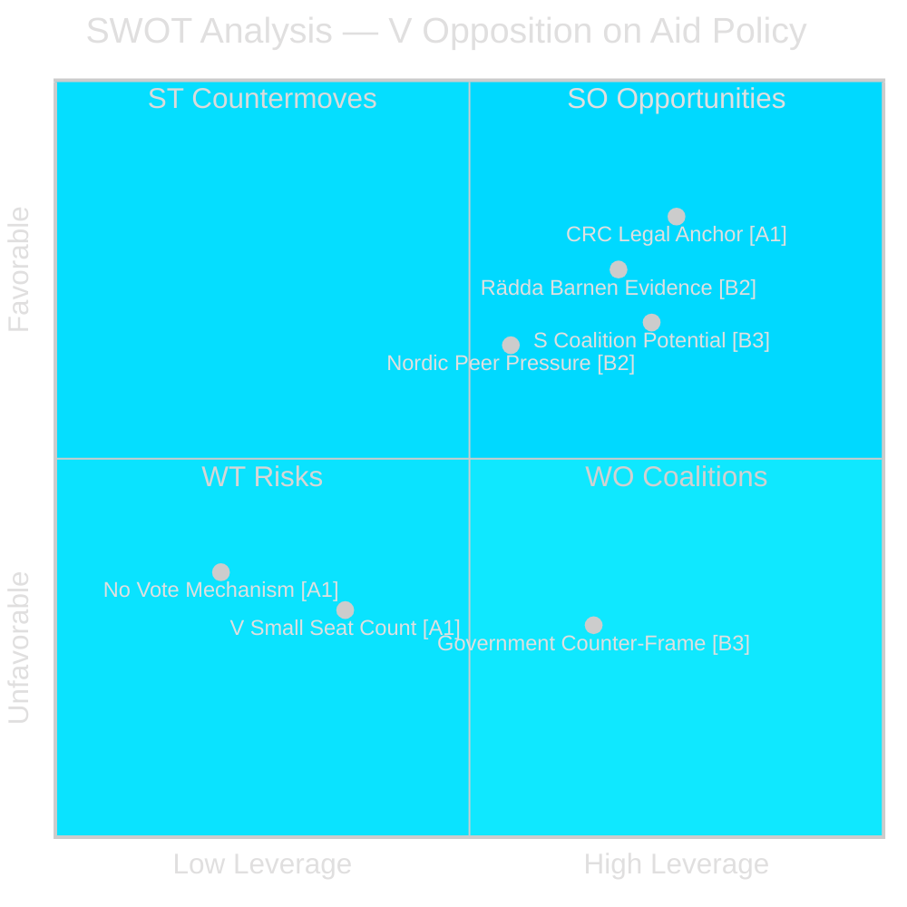

# SWOT Analysis — Swedish Aid Cuts and Children's Rights

**Date**: 2026-05-14 | **Focus**: HD10492 — Aid Policy & Child Rights

---

## SWOT Matrix

### Strengths (Opposition / V position)

| Evidence Row | Source | Admiralty |
|---|---|---|
| Clear legal anchor: barnkonventionen (CRC) ratified by Sweden 1990, incorporated into Swedish law 2020 (SFS 2018:1197) | Swedish law [A1] | A1 |
| Concrete program evidence: Rädda Barnen documented closures of malnourished child programs, maternal care, vaccination campaigns | Rädda Barnen report (cited in HD10492) [B2] | B2 |
| Specific quantitative hooks: 5 million under-5 deaths/year; 500 million children in conflict zones; 29,000 displaced daily | UNICEF data (cited in HD10492) [B2] | B2 |
| Three focused, operational questions — easier to hold minister accountable against specific commitments | HD10492 text [A1] | A1 |

### Weaknesses (Opposition position)

| Evidence Row | Source | Admiralty |
|---|---|---|
| V is a small opposition party (24 seats post-2022 election) with limited procedural leverage — interpellation cannot compel action | Swedish Riksdag seat counts [A1] | A1 |
| No voting mechanism — debate alone; government can answer generally without specific commitments | Parliamentary procedure [A1] | A1 |
| Potential counter-argument: government aid reform refocuses (not eliminates) aid, emphasising effectiveness and private sector | "Bistånd för en ny era" agenda Dec 2023 [B2] | B2 |

### Opportunities

| Evidence Row | Source | Admiralty |
|---|---|---|
| OECD-DAC peer review of Sweden anticipated 2026 — external accountability lever [unconfirmed timing] | OECD review cycle (standard every 5 yrs; last 2019) [C3] | C3 |
| S (Social Democrats, 107 seats) likely to amplify V findings in budgetmotion and debatt | Political alignment logic [B3] | B3 |
| Cross-party potential: C has historically been among the strongest advocates for Swedish development aid [B2] | Historical party positions [B2] | B2 |
| Nordic peer pressure: Norway (≥1% GNI), Denmark (≥0.7% GNI), Finland maintain higher ODA ratios — diplomatic comparison available | Nordic ODA data [B2] | B2 |
| 2026 Riksdag election — aid policy will be debated in party platforms; V can use Dousa's answer as campaign material | Electoral calendar [A1] | A1 |

### Threats (to effective accountability)

| Evidence Row | Source | Admiralty |
|---|---|---|
| Government can cite budget constraints and present aid reform as efficiency-driven, not rights-reducing | Standard government response pattern [B3] | B3 |
| Media framing competition from domestic issues (migration, crime, economy) may crowd out aid accountability story | Media environment observation [C3] | C3 |
| Benjamin Dousa (M) is media-savvy, younger minister — likely prepared for barn/rights challenge framing | Ministerial profile observation [B3] | B3 |

## TOWS Cross-SWOT

| | Strengths | Weaknesses |
|---|---|---|
| **Opportunities** | **SO**: Use CRC legal anchor + OECD-DAC review to force specific commitment from Dousa — publish results in media before election | **WO**: Build S/C/MP coalition to file joint follow-up interpellations or riksdagsmotion on barnkonsekvensanalys |
| **Threats** | **ST**: Counter budget-constraint framing with concrete cost data (Rädda Barnen program budgets) — make trade-offs specific | **WT**: Risk of generic answer and media non-pickup; V must translate debate into concrete legislative motion |

