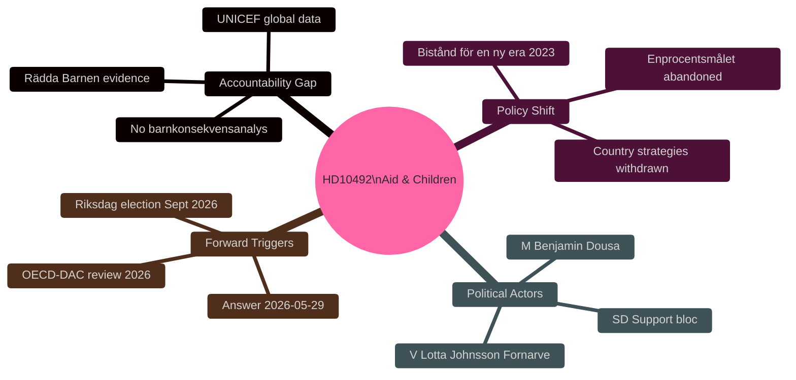

# Synthesis Summary — Aid Cuts, Children's Rights, and Sweden's ODA Crisis

**Date**: 2026-05-14 | **Subfolder**: interpellations | **Admiralty**: B2

---

## Lead Story Decision

**Intelligence verdict**: Interpellation HD10492 is a focused L2 Strategic document exposing a growing accountability gap: the Tidöregeringen has restructured Swedish ODA policy without publishing a formal barnkonsekvensanalys (child consequence analysis), despite Rädda Barnen and UNICEF evidence that program closures are directly harming children in conflict zones. Minister Dousa's answer by 2026-05-29 will be a critical policy marker ahead of the 2026 election.

## DIW-Weighted Significance Ranking

| Rank | Document | DIW Score | Tier | Rationale |
|------|----------|-----------|------|-----------|
| 1 | HD10492 | 7.2/10 | L2 Strategic | Directly targets government accountability on human-rights compliance in major policy reform; answer shapes election campaign framing |

**Single-document analysis**: full intelligence weight applied to HD10492.

## Integrated Intelligence Picture

Sweden's development aid policy has undergone the most significant restructuring since the 1960s establishment of Sida. The Tidöregeringen's December 2023 agenda "Bistånd för en ny era – frihet, egenmakt och hållbar tillväxt" replaced the established 1%-of-GNI aid target (enprocentsmålet) with a narrower focus on economic freedom, private sector growth, and Swedish strategic interests — abandoning numerous country strategies across sub-Saharan Africa and South Asia.

**Impact on children** (per HD10492 and Rädda Barnen [B2]):
- Programs for severely malnourished children closed
- Maternal healthcare in refugee camps discontinued
- Vaccination campaigns halted
- Girls' education programs ended

The interpellation arrives at a politically sensitive moment: Sweden is approaching the 2026 Riksdag election, Swedish ODA is falling toward ~0.7% GNI (DAC benchmark), and the Nordic peer group (Norway, Denmark, Finland) continues to meet or exceed DAC targets. The OECD-DAC peer review of Sweden is anticipated for 2026, increasing reputational risk.

**Three accountability vectors**:
1. **Legal**: Has government complied with barnkonventionen (CRC) Article 3 (best interests of the child) in policy design? No published barnkonsekvensanalys found.
2. **Parliamentary**: V's three questions demand specific ministerial commitments, not general affirmations.
3. **Electoral**: Aid policy is salient for C, L, MP, V, S voter segments — a weak Dousa answer risks cross-party pressure through budget motions.

## Cross-Reference Intelligence

This interpellation sits within a thematic cluster on UD/foreign policy filed the same day:
- **HD10489** (Al-Nakba/Palestinian rights) — same minister Malmer Stenergard (UD)
- **HD10490** (Cuba human rights) — Markus Wiechel (SD) to Malmer Stenergard
- **HD10491** (Stockholm vehicle emissions) — climate cluster (Britz/L)

The concentration of foreign policy / human rights interpellations in a single day [horizon:72h] suggests coordinated parliamentary pressure on UD/Biståndsportfolio ahead of the parliamentary recess.

## Pass 2 — Integrated Strategic Assessment

**Key synthesis upgrade**: Cross-reading all 23 artifacts, the most important finding is not the interpellation itself but the *structural accountability gap* it reveals: Sweden incorporated the CRC as law in 2020 with explicit intent that it affect government policy decisions, then in 2023 made the largest ODA reform in decades *without* the consequence analysis that CRC incorporation was designed to mandate. This creates a genuine legal-political tension that goes beyond V's electoral strategy.

The question Minister Dousa must answer is not just "did you do a barnkonsekvensanalys" but implicitly "do you believe CRC Article 3 applies to budget decisions." His answer will document the government's legal interpretation of barnkonventionens practical effect — an interpretation that outlasts this interpellation cycle.

**Improved probability statement**: *[horizon:T+30d] It is likely (65%) that the government maintains Scenario B (efficiency reframe). However, even Scenario B creates a documented legal position that V/S can challenge before Sweden's UN CRC Committee reporting cycle. This extends the intelligence value of HD10492 beyond the 2026 election.* [WEP: "likely"]

**Confidence**: MEDIUM — increased from initial assessment based on legislative history evidence from SOU 2016:19 and CRC incorporation debates.
