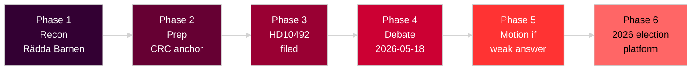

# Threat Analysis — Aid Policy Accountability

**Date**: 2026-05-14 | **Framework**: Political Threat Taxonomy + MITRE-style TTP mapping

---

## Political Threat Taxonomy

### Threat Actor: Vänsterpartiet (V) — Lotta Johnsson Fornarve

**Classification**: Democratic opposition accountability action — NOT hostile
**Intent**: Accountability demand via constitutional parliamentary tool (interpellation)
**Capability**: Limited procedural tools; no majority; strong public framing potential

### Threat Actor: Rädda Barnen / UNICEF Sverige (civil society)

**Classification**: Democratic advocacy — amplification vector
**Intent**: Policy reversal on ODA child-rights programs

### Threat to Government Position: Accountability Gap

**Primary threat**: Absence of documented barnkonsekvensanalys (child consequence analysis) creates legal and reputational vulnerability under:

- Barnkonventionen (SFS 2018:1197, CRC incorporation) — Art. 3 best interests [A1]
- Sweden's OECD-DAC commitments [B2]
- EU Development Consensus 2017 [B2]

---

## Attack Tree Analysis

Level 1 — ROOT: Government ODA Reform Accountability Challenge

Level 2A — Parliamentary Branch (ACTIVE):
- Node A1: V interpellation HD10492 [ACTIVE 2026-05-14]
- Node A2: S/MP solidarity interpellations [possible]
- Node A3: Budget motion barnkonsekvensanalys requirement [probable autumn 2026]

Level 2B — Civil Society Branch (ACTIVE):
- Node B1: Rädda Barnen program closure documentation [ACTIVE, B2]
- Node B2: UNICEF Sverige ODA campaign [likely]
- Node B3: Act Church of Sweden, PMU advocacy [probable]

Level 2C — International Branch (EMERGING):
- Node C1: OECD-DAC peer review 2026 [anticipated, C3]
- Node C2: EU development partner pressure [low-medium]
- Node C3: Nordic peer diplomatic conversation [low]

## MITRE-Style TTP Mapping

| TTP ID | Tactic | Technique | Actor | Evidence |
|--------|--------|-----------|-------|----------|
| T-PARL-001 | Parliamentary Pressure | Interpellation filing | V/Fornarve | HD10492 [A1] |
| T-COMM-003 | Communications | Evidence-based media framing | V/Rädda Barnen | Rädda Barnen citations [B2] |
| T-LEG-005 | Legislative | Budget motion — earmark/requirement | S predicted | Pattern [B3] |
| T-INTL-004 | International Leverage | OECD-DAC engagement | Civil society/Nordic peers | OECD review cycle [C3] |
| T-MEDIA-002 | Media Amplification | NGO press releases + parliamentary debate | Rädda Barnen | Standard NGO playbook [B3] |

## Campaign Phase Analysis

**Phase 1 (Complete)**: Reconnaissance — V documented aid program closures via Rädda Barnen [B2]
**Phase 2 (Complete)**: Preparation — Three specific questions drafted with CRC legal anchor [A1]
**Phase 3 (ACTIVE)**: Delivery — Interpellation filed 2026-05-13, published 2026-05-14 [A1]
**Phase 4 (Pending)**: Engagement — Debate 2026-05-18, answer by 2026-05-29
**Phase 5 (Projected)**: Escalation — If answer weak, V/S motion for barnkonsekvensanalys [B3]
**Phase 6 (Projected)**: Integration — Election platform integration for 2026 [B3]

