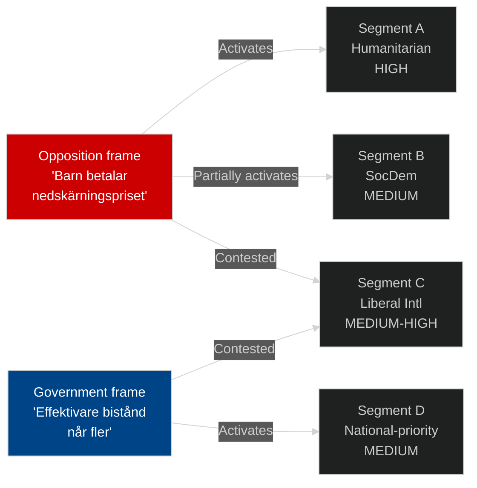

# Voter Segmentation — ODA and Children's Rights Issue

**Date**: 2026-05-14 | **Method**: Issue salience segmentation

---

## Swedish Voter Segments Relevant to ODA Policy

### Segment A: Humanitarian Solidarity Voters (V/MP core, ~12-18% of electorate)
**Profile**: High education; urban; public sector; humanitarian values
**ODA salience**: VERY HIGH — defining issue
**Emotional trigger**: Child mortality, girls' education, humanitarian crises
**Mobilisation potential from HD10492**: HIGH — Rädda Barnen evidence base directly maps to this segment's values
**Message resonance**: "Barn betalar priset för nedskärningarna" — "Children pay the price for the cuts"

### Segment B: Social Democratic Mainstream (~30% of electorate)
**Profile**: Traditional S voters; working class + public sector middle class
**ODA salience**: MEDIUM — humanitarian solidarity present but not top issue
**Emotional trigger**: Sweden's international standing; Nordic model identity
**Mobilisation potential**: MEDIUM — more engaged if Nordic comparison is prominent
**Message resonance**: "Sverige var ett föredöme — nu sviker vi" — "Sweden was a model — now we're failing"

### Segment C: Liberal Internationalist Swing Voters (~8-12%)
**Profile**: C/L voters; business sector internationalists; development NGO supporters
**ODA salience**: MEDIUM-HIGH — issue creates party loyalty conflict
**Emotional trigger**: Effectiveness and accountability; not volume per se
**Mobilisation potential**: This segment could be captured by either effective V/S framing OR effective government "efficiency" reframe
**Message resonance**: Competing — "Barnkonsekvensanalys krävs" (opposition) vs "Mer effektivt bistånd" (government)

### Segment D: National-Priority Voters (SD/M pragmatists, ~35%)
**Profile**: Domestic-first priorities; sceptical of ODA at high volume
**ODA salience**: LOW (domestic services more salient)
**Emotional trigger**: Domestic welfare; taxpayer value
**Message resonance**: "Vi hjälper bättre med fokus och effektivitet"

### Segment E: Young Voters (under 30, ~15%)
**Profile**: Higher climate salience; international solidarity; but also economic anxiety
**ODA salience**: MEDIUM — climate-linked aid may be more salient
**Mobilisation potential**: HIGH if Rädda Barnen/UNICEF engage social media

## Issue Frame Competition

## Strategic Implications for V

Fornarve's interpellation maximally activates Segment A (core V voters) and has spillover into Segment B (S territory). The CRC legal framing adds Segment C resonance that pure "restore volume" arguments lack. The three specific questions (barnkonsekvensanalys, CRC in policy docs, humanitarian child focus) are designed to be maximally documentable for campaign use — each requires a yes/no answer that can be stripped from context.

**Recommendation for monitoring**: Track Rädda Barnen social media engagement metrics post-debate (2026-05-18) as proxy for Segment A/E activation.
