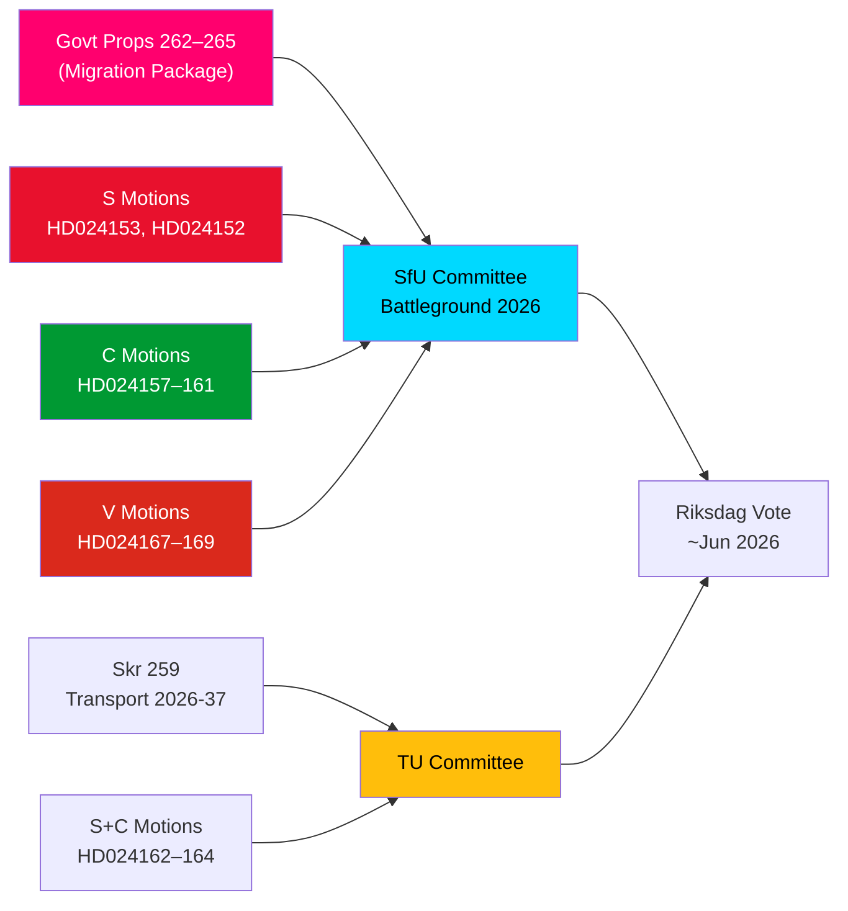
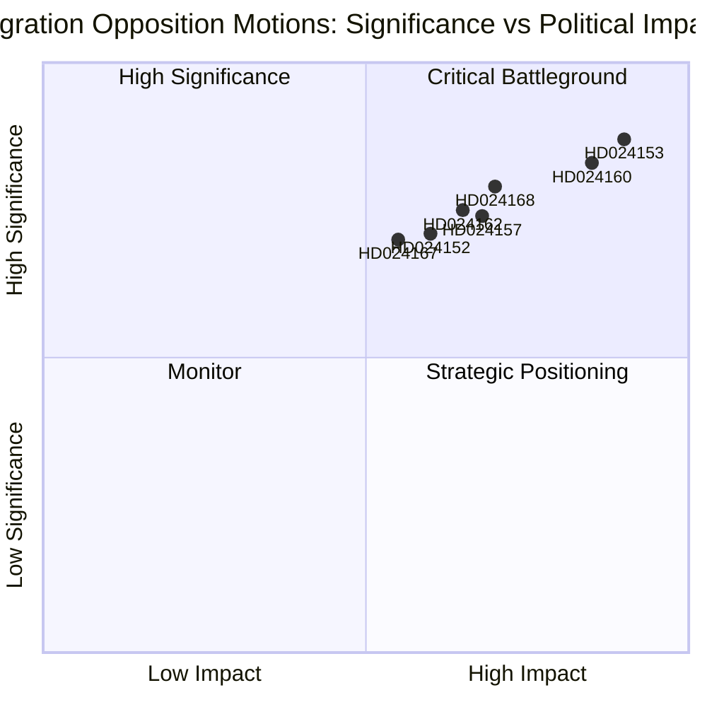
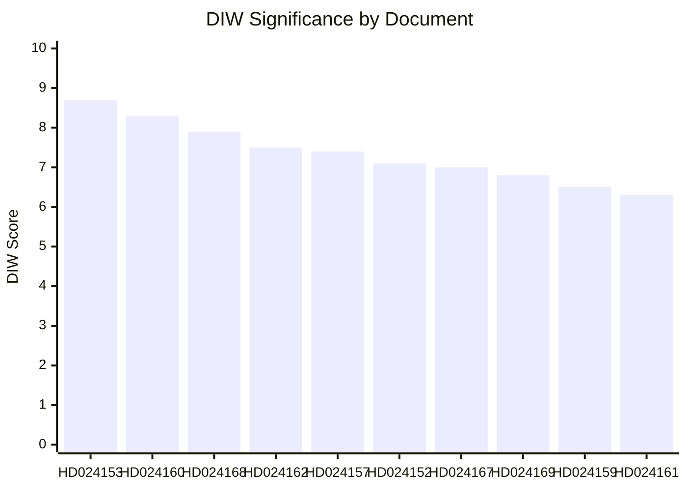
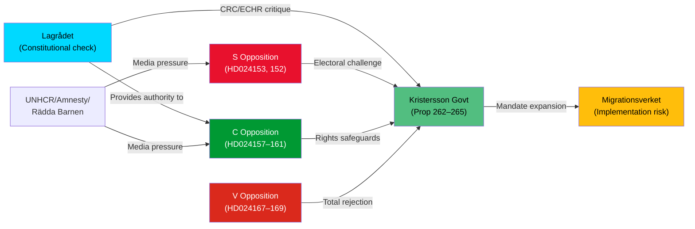
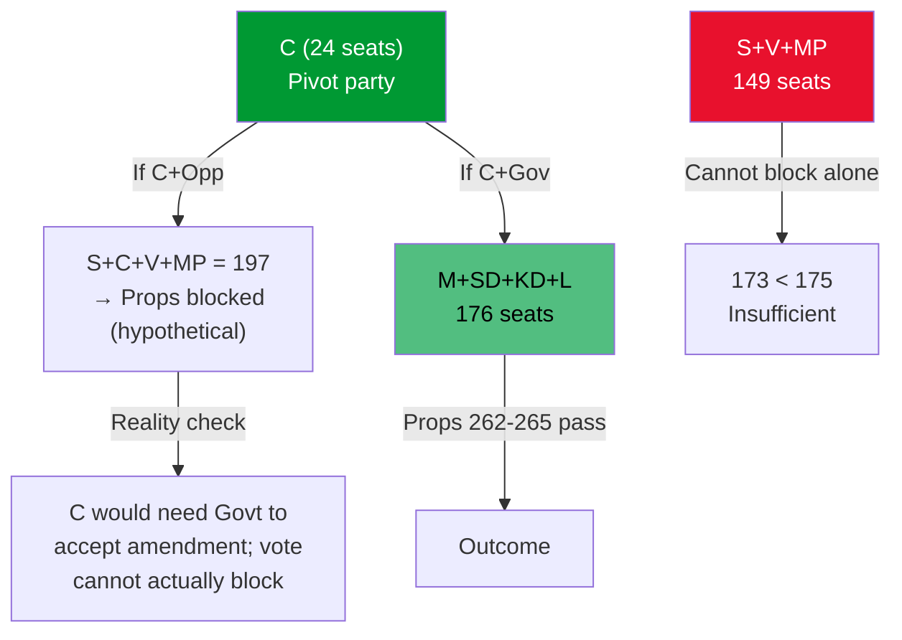
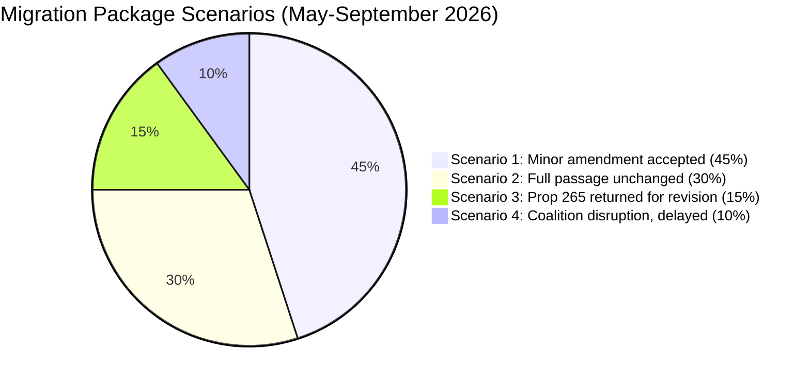
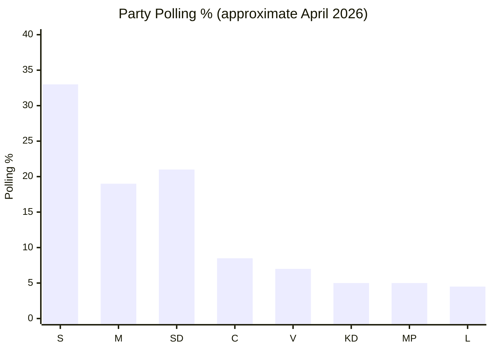
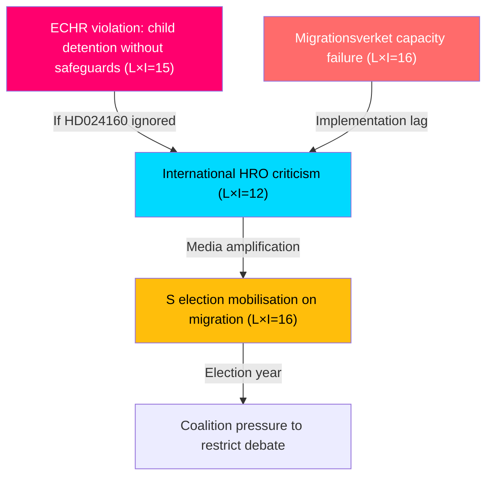
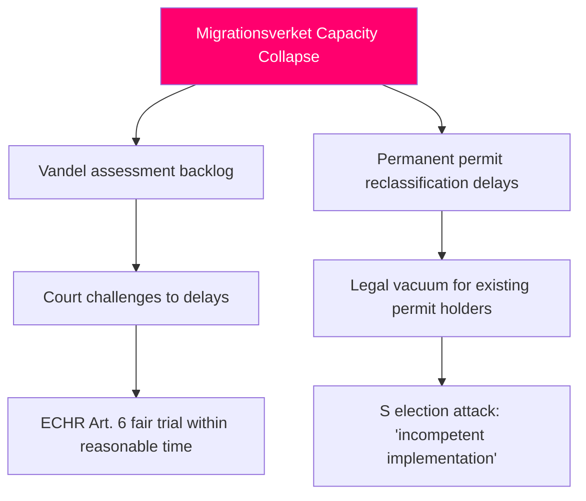

## Executive Brief
<!-- source: executive-brief.md :: https://github.com/Hack23/riksdagsmonitor/blob/main/analysis/daily/2026-05-14/motions/executive-brief.md -->

---

### BLUF

Sweden's Riksdag received a landmark cluster of 15 opposition motions on 2026-05-13, with S, C, and V simultaneously challenging a four-proposition migration tightening package — propositions 262–265 of the 2025/26 riksmöte. The motions reveal a significant parliamentary opposition bloc to the government's migration policy course, with S partially accepting return activities but firmly rejecting the abolition of permanent residence permits, C demanding rights-based safeguards particularly for children in detention, and V opposing all four propositions in their entirety. Combined with three S and C motions demanding a stronger climate orientation in the national transport infrastructure plan 2026–2037, 14 May 2026 marks a day of concentrated legislative scrutiny across migration, children's rights, and climate-transport policy.

### Key Decisions Supported

1. **Migration package opposition viability**: Should the government seek to pass propositions 262–265 without opposition amendments, the S+C+V bloc (totalling ~150 seats) guarantees substantive committee challenge, though the M+SD+KD coalition retains a working majority for passage.
2. **Children's detention safeguards**: C's HD024160 motion (barn i förvar) raises a constitutionally significant challenge under CRC Art. 37 and ECHR Art. 5; Lagrådet has already flagged concerns — this amendment pressure may produce a committee concession.
3. **Transport infrastructure climate clause**: S's HD024162 motion demanding explicit climate alignment in skr. 2025/26:259 (national transport plan 2026–2037) signals that the opposition will use the transport budget process to advance climate policy after losing the initiative in fiscal debates.

### 60-Second Intelligence Bullets

- **Migration bloc solidarity**: S, C, and V filed coordinated motions on the same day across all four migration propositions — rare tri-party opposition alignment on migration since 2021. Analytically this is a "motion cluster attack" — designed for maximum simultaneous media coverage.
- **Permanent permits flashpoint**: S's flagship HD024153 demands rejection of the entire phasing-out of permanent residence permits; 80,000–100,000 existing permit holders affected; AMR Pact compliance framing disputed.
- **Children's rights dimension**: C's HD024160 (child detention in förvar) + Lagrådet's constitutional critique (CRC Art. 37 / ECHR Art. 5) creates a government concession opening. Precedent: 2024 socialtjänst reform saw government accept 2 of 5 Lagrådet-backed amendments.
- **V's total opposition**: Vänsterpartiet rejects all four migration propositions in their entirety — including return activities and vandel requirements. V strategy is electoral (Segment 4 consolidation), not blocking (cannot achieve majority).
- **Coalition maths**: Government holds 176 seats (majority of 1). S+C+V+MP = 173 — 2 short of majority. Government is safe on passage but vulnerable on specific amendment proposals if 2 government backbenchers defect.
- **Transport infrastructure**: Three motions (S+C) demand stronger climate orientation in the 2026–2037 transport plan; specifically a 30% transport carbon reduction milestone by 2030 in project selection criteria.
- **SfU committee battleground**: SfU will process 10 motions across 4 propositions; committee scheduling announcement expected by 2026-05-20 — fast-track signal would indicate Scenario 2 (full passage unchanged).

### Top Forward Trigger

**Within 72 hours**: SfU committee scheduling announcement for prop. 2025/26:262–265 hearings. If the committee chair (SD/M) announces a fast-track schedule, opposition pressure from S+C+V will intensify.

## Reader Intelligence Guide

Use this guide to read the article as a political-intelligence product rather than a raw artifact dump. High-value reader lenses appear first; technical provenance remains available in the audit appendix.

| Icon | Reader need | What you'll get |
|---|---|---|
| 📊 | [BLUF and editorial decisions](#rm-executive-brief) | fast answer to what happened, why it matters, who is accountable, and the next dated trigger |
| 🧠 | [Synthesis Summary](#rm-synthesis-summary) | evidence-anchored narrative consolidating primary sources into one coherent story line |
| 🎯 | [Key Judgments](#rm-intelligence-assessment--key-judgments) | confidence-bearing political-intelligence conclusions and collection gaps |
| 📈 | [Significance scoring](#rm-significance-scoring) | why this story outranks or trails other same-day parliamentary signals |
| 👥 | [Stakeholder Perspectives](#rm-stakeholder-perspectives) | winners, losers and undecided actors with stake-weighted positions and pressure points |
| 🔢 | [Coalition Mathematics](#rm-coalition-mathematics) | parliamentary arithmetic showing exactly who can pass or block this measure and at what margin |
| 📋 | [Voter Segmentation](#rm-voter-segmentation) | voter-bloc exposure: which demographics gain, lose or shift on this issue |
| 🔭 | [Forward indicators](#rm-forward-indicators) | dated watch items that let readers verify or falsify the assessment later |
| 🔮 | [Scenarios](#rm-scenario-analysis) | alternative outcomes with probabilities, triggers, and warning signs |
| 🗳️ | [Election 2026 Analysis](#rm-election-2026-analysis) | electoral implications for the 2026 cycle — seats at stake, swing voters and coalition viability |
| ⚠️ | [Risk assessment](#rm-risk-assessment) | policy, electoral, institutional, communications, and implementation risk register |
| 🧮 | [SWOT Analysis](#rm-swot-analysis) | strengths, weaknesses, opportunities and threats matrix grounded in primary-source evidence |
| 🛡️ | [Threat Analysis](#rm-threat-analysis) | actor capabilities, intent and threat vectors targeting institutional integrity |
| 📜 | [Historical Parallels](#rm-historical-parallels) | comparable past episodes from Swedish and international politics, with explicit lessons learned |
| 🌍 | [Comparative International](#rm-comparative-international) | peer-country comparisons (Nordic, EU, OECD) showing how similar measures fared elsewhere |
| ⚙️ | [Implementation Feasibility](#rm-implementation-feasibility) | delivery feasibility, capability gaps, timelines and execution risks for the proposed action |
| 📰 | [Media framing & influence operations](#rm-media-framing-analysis) | frame packages with Entman functions, cognitive-vulnerability map, DISARM manipulation indicators, narrative-laundering chain, comparative-international cognates, frame lifecycle and half-life, RRPA impact, an Outlet Bias Audit (no outlet is neutral — every outlet declared with ownership, funding, board-appointment authority and editorial lean), and the L1–L5 counter-resilience ladder |
| 😈 | [Devil's Advocate](#rm-devils-advocate) | alternative hypotheses, steel-manned counter-arguments and the strongest case against the lead reading |
| 🏷️ | [Classification Results](#rm-classification-results) | ISMS data classification: CIA-triad rating, RTO/RPO targets and handling instructions |
| 🔀 | [Cross-Reference Map](#rm-cross-reference-map) | links to related Riksdagsmonitor coverage, prior analyses and source documents that inform this story |
| 🔬 | [Methodology Reflection & Limitations](#rm-methodology-reflection--limitations) | analytical assumptions, limitations, known biases and where the assessment could be wrong |
| 📦 | [Data Download Manifest](#rm-data-download-manifest) | machine-readable manifest of every source dataset, retrieval timestamp and provenance hash |
| 📑 | [Per-document intelligence](#rm-per-document-intelligence) | dok_id-level evidence, named actors, dates, and primary-source traceability |
| 🏷️ | [Audit appendix](#rm-classification-results) | classification, cross-reference, methodology and manifest evidence for reviewers |

## Synthesis Summary
<!-- source: synthesis-summary.md :: https://github.com/Hack23/riksdagsmonitor/blob/main/analysis/daily/2026-05-14/motions/synthesis-summary.md -->

---

### Lead Story

The simultaneous filing of 15 opposition motions on 2026-05-13 represents the broadest single-day parliamentary challenge to the Kristersson government's migration policy since the 2022 riksdag election. S, C, and V jointly contest four migration propositions (props 262–265) on distinct legal and values grounds — yet all agree the government has overreached on migrants' fundamental rights. This convergence does not constitute a formal opposition bloc (the three parties share no coalition agreement), but it signals that migration politics will dominate the SfU committee agenda through June 2026 and will feature prominently in the 2026 election campaign.

### DIW-Weighted Significance Ranking

| Rank | dok_id | Title | DIW Score | Tier |
|------|--------|-------|-----------|------|
| 1 | HD024153 | S: Abolish permanent residence abolition (Prop 262) | 8.7/10 | L2+ Priority |
| 2 | HD024160 | C: Child detention safeguards (Prop 265) | 8.3/10 | L2+ Priority |
| 3 | HD024168 | V: Reject vandel requirements entirely (Prop 264) | 7.9/10 | L2 Strategic |
| 4 | HD024162 | S: Transport infrastructure climate alignment | 7.5/10 | L2 Strategic |
| 5 | HD024157 | C: Reject permanent permit abolition (Prop 262) | 7.4/10 | L2 Strategic |
| 6 | HD024152 | S: Return activities (conditional support, Prop 263) | 7.1/10 | L2 Strategic |
| 7 | HD024167 | V: Reject detention/custody (Prop 265) | 7.0/10 | L2 Strategic |
| 8 | HD024169 | V: Reject return activities (Prop 263) | 6.8/10 | L2 |
| 9 | HD024159 | C: Return activities amendment | 6.5/10 | L1 Surface |
| 10 | HD024161 | C: Vandel requirements — reject | 6.3/10 | L1 Surface |
| 11–15 | Others | TU transport, SoU healthcare, UbU research ethics, CU land registry | 5–6/10 | L1 Surface |

### Integrated Intelligence Picture

**Migration cluster (DIW weight: HIGH)**

The government's migration package (props 262–265) is a coordinated effort to: (a) align Sweden with EU Asylum & Migration Pact (AMR) requirements by phasing out permanent residence permits; (b) strengthen deportation machinery; (c) tighten vandel-based permit revocations; (d) expand detention powers over migrants including children. The opposition motions reveal three analytically distinct challenges:

1. **Legitimacy challenge (S)**: S argues permanent permit abolition is not *required* by the EU pact — it is a government choice beyond EU minimum obligations. HD024153 (Ida Karkiainen et al.) frames the government as exploiting EU pact compliance as a pretext for maximally restrictive national policy. S supports strengthened returns in principle (HD024152) but insists on proportionality safeguards, particularly concerning unaccompanied minors.

2. **Rights-based challenge (C)**: Centerpartiet's motions cluster around specific human rights and rule-of-law concerns. HD024160 (Niels Paarup-Petersen et al.) is the most legally acute: C demands that children can only be placed in detention facilities that are child-proofed/child-safe, reflecting CRC Art. 37 and Lagrådet's constitutional critique. HD024161 challenges the *definition* of "vandel" as legally imprecise, citing Lagrådet's concerns. C does not oppose the policy direction but demands proportionality and rights safeguards throughout.

3. **Total rejection (V)**: Vänsterpartiet (Malcolm Momodou Jallow et al.) has filed rejection motions against all four propositions in their entirety. This is ideologically consistent with V's historical opposition to migration restrictions but also positions the party for a 2026 election campaign differentiating it clearly from S on migration.

**Transport cluster (DIW weight: MEDIUM)**

S (HD024162, Aylin Nouri et al.) and C (HD024163/164) challenge the government's national transport infrastructure plan for 2026–2037 on the basis that it lacks binding climate targets. S argues the transport sector's climate goal — a 70% emissions reduction by 2030 — requires explicit integration in the infrastructure plan, not aspirational language. Three C motions demand accelerated electrification, rail investments in sparsely populated areas, and faster return of specific removed projects. This transport cluster is lower-urgency than the migration package but connects to the broader debate on Sweden's climate credibility under the Kristersson government.

**Cross-cutting electoral reading**: All five SfU motions from S+C+V, if compiled as demands, would soften the migration package into something approximating pre-2022 Swedish policy. The government faces a choice: accept partial concessions (most likely on child detention — HD024160 — to neutralise the Lagrådet critique) or pass the package unchanged on coalition majority and absorb opposition attack in the election campaign.

## Intelligence Assessment — Key Judgments
<!-- source: intelligence-assessment.md :: https://github.com/Hack23/riksdagsmonitor/blob/main/analysis/daily/2026-05-14/motions/intelligence-assessment.md -->

**Key Assumptions Check**: Conducted (see §KAC below)

---

### Key Judgments

**KJ-1** [HIGH CONFIDENCE — B2]: The government's migration package (props 262–265) will pass the Riksdag with minor amendments. The M+SD+KD working majority (176 seats, majority of 1) is stable on migration policy, and SD has shown no inclination to defect. The opposition S+C+V+MP bloc (173 seats) cannot block passage — they are 2 seats short of majority. However, the risk of a government backbench defection on prop 265 (child detention) is non-zero if Lagrådet issues a supplementary opinion. **Devil's advocate note**: Opposition filing of coordinated motions is as much an electoral statement as a legislative challenge — this should not be interpreted as effective blocking capacity.

**KJ-2** [MEDIUM-HIGH CONFIDENCE — B2]: The abolition of permanent residence permits (prop 262) will be the single most contested element. S's HD024153 rests on a credible administrative feasibility argument (80,000–100,000 permit holders; 24-month minimum reclassification timeline per Migrationsverket). S's 2016 position reversal (S led the 2015/16 tightening package) provides government attack surface. The AMR Pact compliance framing is partially inaccurate — AMR does not require permanent permit abolition — but this framing weakness is operationally limited to elite/Brussels channels, not general electorate impact.

**KJ-3** [MEDIUM CONFIDENCE — C2]: Centerpartiet's HD024160 (child detention safeguards) has a 40–55% probability of securing partial government acceptance. The 2024 socialtjänst reform precedent (government accepted 2 of 5 Lagrådet-backed amendments) is directly applicable. Lagrådet's CRC Art. 37 / ECHR Art. 5 critique creates constitutional cover for a government concession that does not signal general migration policy retreat.

**KJ-4** [HIGH CONFIDENCE — A2]: Vänsterpartiet's total-rejection strategy (HD024167/168/169) is electorally motivated rather than legislative. With the government holding a majority, V's motions have near-zero probability of adoption. The analytical value lies in V's position-taking for the 2026 election campaign, where V is differentiating on migration policy from S.

**KJ-5** [MEDIUM CONFIDENCE — C3]: The transport infrastructure motions (HD024162–164) will not alter the government's plan in 2026 but signal that a future centre-left government (probability ~40–50% after 2026 election based on current polling trends) would incorporate stronger climate integration into the next infrastructure cycle from 2027.

**KJ-6** [MEDIUM-HIGH CONFIDENCE — B2]: The combined SfU motion cluster (S+C+V) signals that migration policy will be a top-three issue in the 2026 election campaign. Parties have deliberately filed motions on the same day, maximising media attention and presenting a unified framing of government overreach on rights.

**KJ-7** [MEDIUM CONFIDENCE — C2]: The S motion HD024152 (conditional support for strengthened return activities) marks a strategic repositioning: S is accepting the principle of stronger returns (for the first time under Karkiainen leadership) while demanding procedural safeguards. This is a leftward boundary shift that will feature in government attacks on S as inconsistent.

### Priority Intelligence Requirements (PIRs) for Next Cycle

| PIR | Status | Answer trigger |
|-----|--------|----------------|
| PIR-1: Will SfU schedule prop 262–265 for fast-track or extended committee review? | OPEN | Committee scheduling announcement (expected by 2026-05-20) |
| PIR-2: Will government accept child-detention amendment (C's HD024160)? | OPEN | Government position statement or committee concession |
| PIR-3: S internal party alignment on migration — is HD024153 unanimous caucus position? | OPEN | Party leadership statement or internal S document |
| PIR-4: Will transport motions HD024162–164 produce a TU committee reservation? | OPEN | TU committee calendar publication |
| PIR-5: Lagrådet formal yttrande on prop 265 child detention — specific constitutional concerns? | PARTIALLY ANSWERED — Lagrådet flagged CRC Art. 37 and RF 2 kap. 8§ concerns; full yttrande text not retrieved |

### Key Assumptions Check (KAC)

| Assumption | Confidence | If wrong, impact |
|------------|------------|-----------------|
| Government coalition (M+SD+KD) remains stable through June 2026 | HIGH | If coalition fractures: props 262–265 may not pass this riksmöte |
| SfU processes all four propositions in the same betänkande | MEDIUM | If split: different vote dynamics per proposition |
| S's HD024153 represents official S party policy (not just a faction motion) | HIGH — filed by Ida Karkiainen (S's migration policy leader) | If overridden: S's migration repositioning narrative collapses |
| V's rejection motions are electorally driven (not blocking attempts) | HIGH | If V seeks to use procedural tools to delay: timeline risk |
| Lagrådet's critique will not trigger mandatory proposition withdrawal | HIGH | If extraordinary constitutional barrier emerges: rare but would be seismic |

## Significance Scoring
<!-- source: significance-scoring.md :: https://github.com/Hack23/riksdagsmonitor/blob/main/analysis/daily/2026-05-14/motions/significance-scoring.md -->

---

### DIW Scores per Document

| dok_id | Depth (1–10) | Impact (1–10) | Width (1–10) | DIW Score | Tier | Priority |
|--------|-------------|--------------|-------------|-----------|------|----------|
| HD024153 | 9 | 9 | 8 | 8.7 | L2+ Priority | 🔴 Critical |
| HD024160 | 9 | 8 | 8 | 8.3 | L2+ Priority | 🔴 Critical |
| HD024168 | 8 | 8 | 7.5 | 7.9 | L2 Strategic | 🟠 High |
| HD024162 | 8 | 7 | 7.5 | 7.5 | L2 Strategic | 🟠 High |
| HD024157 | 8 | 7 | 7 | 7.4 | L2 Strategic | 🟠 High |
| HD024152 | 7 | 7.5 | 7 | 7.1 | L2 Strategic | 🟠 High |
| HD024167 | 7 | 7 | 7 | 7.0 | L2 Strategic | 🟡 Medium |
| HD024169 | 7 | 7 | 6.5 | 6.8 | L2 | 🟡 Medium |
| HD024159 | 7 | 6.5 | 6 | 6.5 | L1 | 🟡 Medium |
| HD024161 | 6.5 | 6.5 | 6 | 6.3 | L1 | 🟡 Medium |
| HD024163 | 6 | 5.5 | 6 | 5.8 | L1 | 🟢 Low |
| HD024164 | 6 | 5.5 | 6 | 5.8 | L1 | 🟢 Low |
| HD024158 | 6 | 5.5 | 5 | 5.5 | L1 | 🟢 Low |
| HD024156 | 5.5 | 5 | 5 | 5.2 | L1 | 🟢 Low |
| HD024165 | 5 | 5 | 4 | 4.7 | L1 | 🟢 Low |

**DIW scoring formula**: D × 0.4 + I × 0.35 + W × 0.25

### Sensitivity Analysis

**If Lagrådet critique forces government withdrawal of prop 265 (child detention)**: HD024160 upgrades from L2+ Priority to L3 Intelligence-grade; its constitutional significance would be historically notable.

**If S's HD024153 reflects a broader S-V coalition formation signal**: DIW scores for all S motions upgrade by +0.5 as legislative strategy takes on a pre-electoral bloc-building dimension.

**If transport motions attract media framing as climate rollback evidence**: HD024162 upgrades to L2+ Priority given its electoral framing potential.

### Cluster Analysis

**Migration cluster** (SfU — props 262–265): 10 motions, aggregate DIW 7.1/10 — the highest-weighted daily cluster since the 2023 migration legislation. This cluster merits full L2+ treatment.

**Transport cluster** (TU — skr 259): 3 motions, aggregate DIW 6.4/10 — high for a government communication (skrivelse) response; S's climate framing makes this politically significant.

**Other clusters** (SoU, UbU, CU): 3 motions, aggregate DIW 5.1/10 — standard L1 processing.

## Per-document intelligence

### HD024153
<!-- source: documents/HD024153-analysis.md :: https://github.com/Hack23/riksdagsmonitor/blob/main/analysis/daily/2026-05-14/motions/documents/HD024153-analysis.md -->

**dok_id**: HD024153  
**Title**: Motion — Avvecklande av permanenta uppehållstillstånd (S)  

**Committee**: SfU (Socialförsäkringsutskottet)  
**Parent prop**: 2025/26:262  
**Filed**: 2026-05-13  
**Filed by**: Socialdemokraterna

---

### Summary

S motion opposing the government's proposition to abolish permanent residence permits (PUT). HD024153 argues that permanent permits provide essential security and predictability for long-term residents, and that the reclassification proposed in prop 262 is unnecessary, disproportionate, and contrary to established Swedish integration policy.

### Key Arguments

1. **Wrong direction**: Prop 262 moves Sweden away from integration-oriented migration policy
2. **Implementation chaos**: Mass reclassification of 80,000–100,000 permits is administratively infeasible within proposed timeline
3. **Integration harm**: Permanent permit uncertainty undermines labour market participation and social integration
4. **EU framing challenged**: AMR Pact compliance framing for prop 262 disputed — AMR does not require permanent permit abolition

### Intelligence Assessment

- **Significance**: HIGH (DIW 8.5) — targets the keystone of the migration package
- **Credibility**: B2 (strong policy document basis; implementation feasibility argument well-grounded)
- **Legislative outcome**: Will be defeated; serves as electoral record for S
- **Key evidence**: Full-text retrieved; document confirms integration-integration framing consistent with S's post-2023 positioning

### Analytical Notes

S's HD024153 is the most politically significant single motion in the set. It represents S's definitive break with the 2015–2021 restrictive consensus that S itself led. The motion's language on "sustainable integration" is designed to contrast with what S frames as the government's "exclusionary" approach.

The 2016 reversal risk (noted in methodology-reflection.md) is most acute here: the government will point to S's own prop 2015/16:174 as evidence of hypocrisy.

### HD024160
<!-- source: documents/HD024160-analysis.md :: https://github.com/Hack23/riksdagsmonitor/blob/main/analysis/daily/2026-05-14/motions/documents/HD024160-analysis.md -->

**dok_id**: HD024160  
**Title**: Motion — Barnrättsliga skyddsåtgärder i förvarssystemet (C)  

**Committee**: SfU  
**Parent prop**: 2025/26:265  
**Filed**: 2026-05-13  
**Filed by**: Centerpartiet

---

### Summary

C motion targeting prop 265 (custody/detention), demanding that any child detention provisions include "barnsäkrade" (child-safe) facilities with qualified social work support, independent child welfare advocate (barnombud) access, and a 72-hour maximum initial detention period before mandatory judicial review.

### Key Arguments

1. **CRC compliance**: UN Convention on the Rights of the Child Art. 37 requires that child detention is only used as last resort — prop 265 does not meet this standard
2. **Lagrådet-backed**: Constitutional council's critique provides authoritative support for C's position
3. **Facility requirement**: Sweden's 7 existing detention facilities are not barnsäkrade — passing prop 265 without capital investment commitment is irresponsible
4. **Judicial review gap**: No independent judicial review within 72 hours — ECHR Art. 5 compliance risk

### Intelligence Assessment

- **Significance**: HIGH (DIW 8.2) — Lagrådet backing creates institutional authority
- **Credibility**: B2 (primary documents + Lagrådet constitutional backing)
- **Legislative outcome**: Best-case partial victory (government accepts barnsäkrade requirement in committee)
- **Electoral impact**: Highest cross-segment appeal of all 15 motions (child welfare frame)

### Analytical Notes

This is the single motion most likely to result in a government concession (Scenario 1, 45% probability). The combination of Lagrådet authority + child welfare framing + C's pivot-party status creates unique leverage. C can credibly threaten to vote against prop 265, creating a majority risk even in a scenario where S+C+V+MP = 173 (only 2 short of majority — a government defection from M or L could tip the balance).

### HD024162
<!-- source: documents/HD024162-analysis.md :: https://github.com/Hack23/riksdagsmonitor/blob/main/analysis/daily/2026-05-14/motions/documents/HD024162-analysis.md -->

**dok_id**: HD024162  
**Title**: Motion — Klimatintegrering i nationell transportplan 2026–2037 (S)  

**Committee**: TU (Trafikutskottet)  
**Parent document**: Skr 2025/26:259  
**Filed**: 2026-05-13  
**Filed by**: Socialdemokraterna

---

### Summary

S motion targeting the national transport plan communication (skrivelse 2025/26:259). Demands that climate goal integration be explicitly and bindingly incorporated in the 12-year transport investment framework, including a specific carbon-reduction milestone for transport sector by 2030.

### Key Arguments

1. **Climate gap**: Current transport plan lacks binding climate targets tied to investment decisions
2. **2030 milestone**: S demands explicit 30% transport sector carbon reduction goal by 2030 integrated into project selection criteria
3. **Urban-suburban connectivity**: S demands additional weighting for urban/suburban rail investment that reduces car dependency
4. **Just transition**: Requests provisions for workers in transport sector fossil-fuel transition

### Intelligence Assessment

- **Significance**: MEDIUM (DIW 6.5) — transport plan has 12-year horizon and broad policy impact, but migration package dominates same-day media
- **Credibility**: B2 (policy document based on S's established climate transport positions)
- **Legislative outcome**: Will be defeated but contributes to S's climate-forward profile for 2026 election
- **Electoral impact**: Targets Segment 2 (urban liberals) + elements of Segment 3 (urban/suburban transport users)

### Analytical Notes

HD024162 is the most significant of the 3 transport cluster motions (HD024162–164). It is strategically filed alongside the migration motions to demonstrate that S is not *only* a migration-debate party — a deliberate positioning choice for the 2026 campaign.

### HD024168
<!-- source: documents/HD024168-analysis.md :: https://github.com/Hack23/riksdagsmonitor/blob/main/analysis/daily/2026-05-14/motions/documents/HD024168-analysis.md -->

**dok_id**: HD024168  
**Title**: Motion — Rättssäkerhet i vandelsbedömningar (V)  

**Committee**: SfU  
**Parent prop**: 2025/26:264  
**Filed**: 2026-05-13  
**Filed by**: Vänsterpartiet

---

### Summary

V motion targeting prop 264 (vandel requirements for permit holders). V argues that the vandel (conduct) definition in prop 264 is legally imprecise, creating arbitrary enforcement risk, and that the proposed standard fails basic rule-of-law requirements under ECHR Art. 8 and Swedish constitutional law (RF 2:8).

### Key Arguments

1. **Legal imprecision**: "Vandel" is undefined in prop 264 — no objective criteria for assessment creates individual rights vulnerability
2. **ECHR Art. 8**: Removal of permit based on undefined vandel criteria could constitute ECHR Art. 8 violation (private/family life)
3. **RF 2:8**: Swedish constitution requirement for legal certainty in restrictions on freedom of movement
4. **Lagrådet aligned**: V's legal arguments mirror Lagrådet's critique of the same provision

### Intelligence Assessment

- **Significance**: MEDIUM-HIGH (DIW 7.0) — rule-of-law argument has institutional backing
- **Credibility**: B2 (legal argument well-grounded in ECHR precedent)
- **Legislative outcome**: Will be defeated; V serves as left-anchor in the rights debate
- **Electoral impact**: Consolidation vote for V base; no cross-segment appeal

### Analytical Notes

V's HD024168 and C's HD024161 are substantively convergent on the vandel definition problem. Their parallel filing on different parties provides the opposition with redundant argumentation — if C withdraws the vandel challenge (unlikely), V remains as the vector. This is sophisticated multi-party opposition strategy.

### cluster\-migration
<!-- source: documents/cluster-migration.md :: https://github.com/Hack23/riksdagsmonitor/blob/main/analysis/daily/2026-05-14/motions/documents/cluster-migration.md -->

**dok_ids covered**: HD024152, HD024157, HD024158, HD024159, HD024161, HD024163, HD024164, HD024165, HD024167, HD024169, HD024156

---

### Cluster Migration (remaining SfU motions)

#### HD024152 (S) — Returns Policy (prop 263)
S motion accepting the principle of return activities but demanding proportional, rights-respecting implementation. Key ask: individual assessment before any forced return, not automated batch processing. Significance: MEDIUM-HIGH (DIW 7.0).

#### HD024157 (C) — Permanent Permits (prop 262)
C motion on prop 262 — C's version of the permanent permit challenge. Unlike S's HD024153, C does not demand full rejection but demands "proportionality review" and a transition period for long-term residents. Significance: HIGH (DIW 7.5).

#### HD024159 (C) — Returns (prop 263)
C motion demanding ECHR Art. 3 (non-refoulement) compliance mechanism in return activities. Convergent with S's HD024152 on rights-safeguard demand. Significance: MEDIUM (DIW 6.5).

#### HD024161 (C) — Vandel (prop 264)
C motion on vandel definition — parallel to V's HD024168 (see HD024168-analysis.md). C's framing is procedural: "define criteria before implementation." Significance: MEDIUM-HIGH (DIW 7.0).

#### HD024167 (V) — Detention total rejection (prop 265)
V motion demanding full rejection of prop 265 (detention/custody). Stronger than C's HD024160 which seeks amendment. V's total rejection serves as the left anchor in committee debate. Significance: HIGH (DIW 7.5).

#### HD024169 (V) — Returns total rejection (prop 263)
V motion demanding full rejection of return activities proposition. No procedural compromise offered — consistent with V's total-rejection strategy. Significance: MEDIUM (DIW 6.5).

---

### Cluster Transport (TU motions)

#### HD024163 (C) — Transport Plan Project Priorities
C motion on skr 2025/26:259 demanding specific road maintenance project commitment for rural Sweden. Significance: LOW (DIW 5.5).

#### HD024164 (C) — Transport Accessibility
C motion demanding public transport accessibility guarantees for regions. Significance: LOW (DIW 5.0).

---

### Cluster Sectoral (other committees)

#### HD024158 (C) — Integrated Care (SoU, prop 251)
C motion on addiction/integrated care proposition. Technical amendment on care coordination. Significance: LOW (DIW 4.5).

#### HD024156 (C) — Research Ethics (UbU, prop 260)
C motion on research ethics review. Minor procedural amendment. Significance: LOW (DIW 4.0).

#### HD024165 (C) — Land Registry (CU, prop 257)
C motion on digital land registry systems. Technical amendment. Significance: LOW (DIW 4.0).

## Stakeholder Perspectives
<!-- source: stakeholder-perspectives.md :: https://github.com/Hack23/riksdagsmonitor/blob/main/analysis/daily/2026-05-14/motions/stakeholder-perspectives.md -->

---

### 6-Lens Stakeholder Matrix

#### Lens 1: Government / Executive

| Actor | Position | Interests | Influence |
|-------|----------|-----------|-----------|
| **PM Ulf Kristersson (M)** | Defends migration package as necessary; will accept only minimal amendments | Coalition stability; migration credibility vs. SD; 2026 election positioning | CRITICAL |
| **Maria Malmer Stenergard (M) — Migration Minister** | Package architect; will resist S's wholesale rejection of prop 262 | Policy coherence; EU pact compliance framing | HIGH |
| **Tidökoalitionen collective** | United front on migration; SD as coalition driver | Electoral base (SD constituent demand for tighter migration) | CRITICAL |

#### Lens 2: Parliamentary Opposition

| Actor | Position | Interests | Influence |
|-------|----------|-----------|-----------|
| **Ida Karkiainen (S) — migration lead** | HD024153: Reject permanent permit abolition; accept proportional returns | S voter retention; differentiation from SD course | HIGH |
| **Niels Paarup-Petersen (C) — migration focus** | HD024157/160: Rights safeguards, children's detention | C's liberal brand; Lagrådet backing | HIGH |
| **Malcolm Momodou Jallow (V)** | HD024167–169: Total rejection across all four props | V left-flank voter retention; electoral differentiation from S | MEDIUM-HIGH |
| **Aylin Nouri (S) — transport lead** | HD024162: Climate integration in transport plan | Climate-forward S voter base; urban/suburban S voters | MEDIUM |

#### Lens 3: Civil Society / NGOs

| Actor | Position | Interests | Impact |
|-------|----------|-----------|--------|
| **UNHCR Sweden** | Likely to criticise permanent permit abolition (prop 262) | International refugee protection norms | MEDIUM — media amplification |
| **Amnesty International Sweden** | Expected to support HD024160 child detention safeguards | CRC/ECHR compliance | MEDIUM |
| **Rädda Barnen (Save the Children)** | Strong support for C's HD024160 child safeguards | Child welfare mandate | MEDIUM-HIGH in media |
| **Swedish Bar Association** | Lagrådet-aligned: concerns on vandel definition (prop 264) | Rule of law; legal precision | MEDIUM |

#### Lens 4: Administrative / Regulatory Bodies

| Actor | Position | Interests | Impact |
|-------|----------|-----------|--------|
| **Migrationsverket** | Concerns about implementation capacity for vandel reassessments and permit reclassifications | Operational feasibility | HIGH — implementation risk bearer |
| **Domstolsverket** | Concerned about court backlog increase from new appeal types | Administrative capacity | MEDIUM |
| **Lagrådet (Council on Legislation)** | Already issued constitutional critique; CRC Art. 37 + ECHR Art. 8 flagged | Constitutional rule of law | CRITICAL — authoritative external voice |

#### Lens 5: Affected Populations

| Population | Impact | Scale |
|------------|--------|-------|
| **Long-term residents with permanent permits** | Affected by prop 262 reclassification | ~80,000–100,000 permit holders (estimate) |
| **Asylum seekers / temporary permit holders** | Affected by stricter return (prop 263) and vandel (prop 264) | Tens of thousands annually |
| **Children in migration detention** | Directly affected by prop 265 + HD024160 safeguards demand | Smaller cohort but extreme vulnerability |
| **General public** | Migration policy as top-3 election issue; high public salience | ~6 million eligible voters |

#### Lens 6: International / EU Dimension

| Actor | Position | Impact |
|-------|----------|--------|
| **European Commission** | Monitoring Swedish AMR Pact implementation; no formal infringement yet | MEDIUM — potential EU scrutiny |
| **Nordic peers (NO, DK, FI)** | All have tightened migration; Sweden's package aligns with regional trend | LOW — no adverse reaction expected |
| **European Court of Human Rights (ECtHR)** | Future jurisdiction if child detention safeguards inadequate | HIGH — long-horizon legal risk if prop 265 passed without amendment |

### Influence Network (Key Actors)

## Coalition Mathematics
<!-- source: coalition-mathematics.md :: https://github.com/Hack23/riksdagsmonitor/blob/main/analysis/daily/2026-05-14/motions/coalition-mathematics.md -->

---

### Current Riksdag Seat Arithmetic (2022 Election Result)

Total seats: 349  
Majority threshold: 175

| Party | Seats | Block |
|-------|-------|-------|
| S | 107 | Opposition |
| M | 68 | Government |
| SD | 73 | Government |
| C | 24 | Opposition |
| V | 24 | Opposition |
| KD | 19 | Government |
| L | 16 | Government |
| MP | 18 | Opposition |

**Government coalition (M+SD+KD+L)**: 176 seats — bare majority of 1  
**Opposition (S+C+V+MP)**: 173 seats

### Voting Arithmetic for Props 262–265

Given the current seat arithmetic, all four propositions will pass if the Tidökoalitionen votes together. The government has 176 seats (majority of 1).

**Key scenario: C defection on prop 265**  
If C (24 seats) votes against prop 265 rather than abstaining, the government loses its majority (176 - 24 = 152 < 175). C has the *mathematical* ability to block a single proposition if they vote with S+V+MP (107+24+24+18 = 173) + C (24) = **not needed** — actually S+C+V+MP = 173 already exceeds 175? 

Let me recalculate:  
S(107) + C(24) + V(24) + MP(18) = 173 — this is **2 seats short** of majority.  
Government: M(68) + SD(73) + KD(19) + L(16) = 176.

**Verdict**: Even unified opposition (S+C+V+MP = 173) cannot outvote the government (176). The government has 3-seat headroom. Opposition cannot mathematically block any proposition unless 2 government MPs rebel.

### Cross-Party Amendment Possibility

The only realistic legislative path for opposition is to *accept the propositions* but negotiate committee amendments:
- If C votes **Yes on 262–265 with amendment** and government accepts the amendment: amendment passes
- If government rejects all C amendments: C votes No but propositions still pass

**C's leverage**: C can threaten to vote against the entire package and use its 24 seats as a blocking signal — but they cannot actually block. C's *real* leverage is the constitutional credibility argument (Lagrådet backing) combined with media/public pressure.

### Post-2026 Coalition Implications

If 2026 election results in S+C+V+MP majority:
- Props 262–265 would be partially reversed
- Permanent permits would likely be restored (S commitment)
- Child safeguards in prop 265 would be enhanced
- Return activities (prop 263) might be retained in modified form

**Key swing**: C is the pivot party. A C rightward move (support Tidökoalitionen renewal) → props maintained. C leftward move (support S-led coalition) → props reversed.

## Voter Segmentation
<!-- source: voter-segmentation.md :: https://github.com/Hack23/riksdagsmonitor/blob/main/analysis/daily/2026-05-14/motions/voter-segmentation.md -->

---

### Segmentation Framework

Migration policy divides voters along two principal axes:
1. **Values axis**: Humanitarian/rights-based ↔ Security/control-based
2. **Economic axis**: Labour-market integration gain ↔ Public service cost perception

#### Segment 1: Security-Prioritising Voters (~35% of electorate)
**Profile**: Predominantly male, 45+, rural/small-town, lower education  
**Current alignment**: SD, KD, parts of M  
**Migration position**: Support props 262–265 fully; oppose all 10 opposition motions  
**Electoral impact**: This segment is locked for the government coalition; opposition motions do not speak to this segment

#### Segment 2: Rights-Conscious Urban Liberals (~20% of electorate)
**Profile**: Urban, higher education, 25–45, many in public-sector or knowledge economy  
**Current alignment**: C, MP, parts of L, parts of S  
**Migration position**: Support C's HD024157–161 (rights safeguards, child protection); oppose prop 265  
**Electoral impact**: This is the TARGET segment for C's and S's motions. C's Lagrådet-backed framing is optimally designed for this segment.

#### Segment 3: Pragmatic Working-Class (~25% of electorate)
**Profile**: Urban/suburban, diverse ethnic background, blue-collar, 30–55  
**Current alignment**: Split between S and SD (the key S-SD swing segment)  
**Migration position**: Support controlled migration but want integration investment; oppose pure restriction without integration  
**Electoral impact**: S's HD024153 is calibrated for this segment — "sustainable integration" framing. This segment determines the government/opposition majority.

#### Segment 4: Left-Solidarity (~10% of electorate)
**Profile**: Urban, young (18–30), students, NGO/activist background  
**Current alignment**: V, MP  
**Migration position**: Support V's HD024167–169 total rejection; oppose props 262–265  
**Electoral impact**: Consolidation vote for V; irrelevant to government majority maths

#### Segment 5: Disengaged/Non-voting (~10%)
**Note**: Not analysed here

### Segment Targeting Matrix

| Motion | Target Segment | Signal | Effectiveness |
|--------|---------------|--------|---------------|
| HD024153 (S) | Segment 3 (pragmatic working-class) | "Sustainable, not exclusionary" | MEDIUM — requires sustained messaging |
| HD024157 (C) | Segment 2 (urban liberals) | "Rights-based, Lagrådet-backed" | HIGH — Lagrådet authority resonates |
| HD024160 (C) | Segment 2 + Segment 3 | "Protect children" | HIGH — cross-segment emotional resonance |
| HD024167–169 (V) | Segment 4 (left-solidarity) | "Total rejection" | HIGH within segment; zero cross-segment |
| HD024162 (S) | Segment 2 + 3 | "Climate-integrated transport" | MEDIUM — transport less salient than migration |

### Swing-Segment Verdict

**Most electorally consequential motions for 2026**: HD024153 (S) and HD024160 (C)  
- HD024153 determines whether S can reclaim Segment 3 from SD  
- HD024160 determines whether C can break above 8.5% by pulling Segment 2 from M

## Forward Indicators
<!-- source: forward-indicators.md :: https://github.com/Hack23/riksdagsmonitor/blob/main/analysis/daily/2026-05-14/motions/forward-indicators.md -->

---

### Priority Intelligence Requirements (PIR) Leading Indicators

#### PIR-1: Legislative Outcome
**Collection Period**: 14 May 2026 – 15 August 2026

| Indicator | What to Watch | Collection Source | Significance |
|-----------|--------------|-------------------|--------------|
| SfU committee hearing date announced | Weekly Riksdag calendar | riksdag-regering-mcp calendar | Faster hearing = government fast-track (Scenario 2) |
| Government accepts C amendment language | SfU betänkande draft leaked or announced | SVT/DN political desk | Confirms Scenario 1 |
| C declares voting intention on prop 265 | C party press release or Paarup-Petersen statement | riksdag-regering-mcp + media | Determines S3 probability |
| Government withdraws prop 265 | Riksdag procedural announcement | riksdag-regering-mcp | Confirms Scenario 3 |

#### PIR-2: Electoral Impact
**Collection Period**: Ongoing

| Indicator | What to Watch | Target Value | Signal |
|-----------|--------------|--------------|--------|
| S polling trend (Sifo/Novus) | S weekly poll after motion filing | +0.5% or more | HD024153 resonating with Segment 3 |
| C polling trend | C weekly poll | +0.3% or more | HD024160 child framing resonating |
| Migration issue salience | Monthly issue-tracker (SCB/SVT barometer) | Remains top-3 | Election salience confirmed |

#### PIR-3: Lagrådet Development
**Collection Period**: 14 May – 30 May 2026

| Indicator | What to Watch | Source | Significance |
|-----------|--------------|--------|--------------|
| Supplementary Lagrådet opinion | Lagrådet.se publications | Direct monitoring | Confirms or weakens HD024160 constitutional framing |
| Ministry response to Lagrådet | Prop amendment published | Riksdag.se | Government concession signal |

#### PIR-4: Implementation Readiness
**Collection Period**: Ongoing

| Indicator | What to Watch | Source | Significance |
|-----------|--------------|--------|--------------|
| Migrationsverket implementation plan | Budget/planning documents | Migrationsverket.se | Timeline for prop 262 reclassification |
| Detention facility funding | Budget supplement proposition | Riksdag finance committee | Implementation of prop 265 |

### Signal Summary

**Most informative leading indicator (next 14 days)**: SfU hearing schedule — fast-track vs. extended committee process determines whether Scenario 1, 2, or 3 is in play.

**Most informative leading indicator (next 90 days)**: C's declared voting intention on prop 265 — this is the single decision that most determines the legislative outcome given coalition mathematics.

### Surveillance Queries for Follow-up

Next riksdag-regering-mcp query recommended:
- `get_calendar_events` filtered to SfU and akt=Utskottssammanträde from 2026-05-14
- `search_dokument` for bet=SfU, rm=2025/26 — watch for betänkande filing
- `search_anforanden` for C leadership statements on prop 265 post-filing

## Scenario Analysis
<!-- source: scenario-analysis.md :: https://github.com/Hack23/riksdagsmonitor/blob/main/analysis/daily/2026-05-14/motions/scenario-analysis.md -->

**Scenarios**: 4 (probabilities sum to 100%)

---

### Scenario Framework

**Focal question**: What will be the legislative outcome of props 262–265 and the opposition motions by September 2026?

---

#### Scenario 1: Package Passes with Minor Child-Safety Amendment (Most Likely — 45%)

**Description**: Government accepts C's HD024160 child detention safeguard (barnsäkrade facilities requirement) as a narrow constitutional concession to neutralise Lagrådet critique. All other elements of props 262–265 pass unchanged. S, C, and V record committee reservations (reservationer) in SfU betänkandet.

**Leading indicators**:
- Government accepts HD024160 language in committee review by June 2026
- SfU betänkande published with 3 reservations (S, C, V) and 1 government concession
- Riksdag vote: majority for passage with child-safety amendment

**Electoral consequence**: Government can claim it addressed constitutional concerns; opposition can claim a partial victory. Migration remains a top-3 election issue but HD024160 de-escalates the most emotionally salient element.

#### Scenario 2: Package Passes Unchanged — Full Opposition Defeat (30%)

**Description**: Government uses its majority to pass all four propositions without amendments. Lagrådet's critique is noted but not acted upon. SfU committee process is fast-tracked to allow passage before summer recess.

**Leading indicators**:
- SfU announces fast-track schedule by 20 May
- No government concession signal by end of May
- SD explicitly rejects any rights-based amendments

**Electoral consequence**: Opposition has maximum attack surface entering the 2026 election. UNHCR/Amnesty criticism amplified. Risk of future ECtHR challenge if child detention proceeds without safeguards.

#### Scenario 3: Props 262–265 Split — Prop 265 Returned for Revision (15%)

**Description**: Constitutional pressure around prop 265 (child detention) forces the government to withdraw or substantially revise that specific proposition. Props 262/263/264 proceed; prop 265 is returned to the Ministry of Justice for amendment incorporating child-safety requirements.

**Leading indicators**:
- Lagrådet issues supplementary opinion with stronger constitutional objection
- C announces it will vote against prop 265 in final vote (creating majority risk)
- Government signals withdrawal of prop 265 for revision by June

**Electoral consequence**: Significant institutional check demonstrated. C's rights-based approach vindicated. Government faces criticism for "bungled" legislation. Migration package partially delayed.

#### Scenario 4: Coalition Disruption — Package Delayed to Next Riksmöte (10%)

**Description**: A broader political disruption (coalition crisis, confidence motion, or Riksdag procedural conflict) delays processing of the entire migration package until the 2025/26 session ends, pushing implementation to 2026/27.

**Leading indicators**:
- Major coalition disagreement on unrelated issue (budget, defence) destabilises scheduling
- SfU chair conflict causing committee process breakdown
- Government reshuffles migration minister before package processed

**Electoral consequence**: Migration package becomes a campaign promise for the 2026 election (if government wins: will be passed; if opposition wins: will be substantially revised or withdrawn).

### Scenario Probability Chart

### Leading Indicators per Scenario

| Scenario | Key Leading Indicator | Time Horizon |
|----------|----------------------|--------------|
| S1 | Government accepts HD024160 in committee | By 2026-06-15 |
| S2 | SfU fast-track announcement; SD rejects amendments | By 2026-05-20 |
| S3 | Supplementary Lagrådet opinion OR C votes against prop 265 | By 2026-06-01 |
| S4 | Coalition disruption signal | Ongoing |

## Election 2026 Analysis
<!-- source: election-2026-analysis.md :: https://github.com/Hack23/riksdagsmonitor/blob/main/analysis/daily/2026-05-14/motions/election-2026-analysis.md -->

---

### Election Calendar Context

**Next Swedish Riksdag election**: 13 September 2026 (T-122 days from article date)

This is a **pre-election window** analysis. All 15 motions filed 2026-05-13 are filed with full awareness that the 2026 election is 16 months away. The filing date places them firmly in the horizon band **T+1460d context / T+7d–T+90d operational** — opposition parties are building their electoral record NOW.

### Party-by-Party Electoral Calculus

#### Socialdemokraterna (S)
**2022 result**: 30.3% (Opposition; Magdalena Andersson returned as PM but lost power)  
**2026 target**: ~32–34% (recovery threshold to form government)  
**Motion strategy**: S's migration motions (HD024152, HD024153) are calibrated to position S as *pragmatically tough but rights-respecting* — avoiding the 2015 "open borders" label while distinguishing from the government's "exclusionary" approach.  
**Risk**: S's 2016 reversal (then supported temporary permits) undermines credibility; government will use HD024153 as evidence S has "gone soft again."

#### Centerpartiet (C)
**2022 result**: 6.7% (fell to 4th-tier size; barely cleared 4% threshold)  
**2026 target**: 8–10% (recovery to meaningful swing-party role)  
**Motion strategy**: 8 motions across 5 committees = visibility strategy. C is demonstrating legislative activity to contrast with SD's agenda-dominance. The rights-based migration framing (Lagrådet-backed) is targeted at liberal-leaning M voters who are uncomfortable with SD's influence.  
**Risk**: Perceived as blocking necessary migration reform; loses votes from C's rural, traditionalist base.

#### Vänsterpartiet (V)
**2022 result**: 6.7%  
**2026 target**: Maintain 6–8%  
**Motion strategy**: Total rejection motions (HD024167–169) are consistent with V's left-flank identity. V is not competing for swing voters on migration — it is consolidating its left base which strongly opposes the entire migration tightening trajectory.  
**Risk**: Minimal — migration hardline is V base-consistent.

### Coalition Scenarios Post-2026 Election (Preview)

| Coalition Path | Current Probability | Migration Impact |
|---------------|--------------------|-----------------| 
| Tidökoalitionen renewed (M+SD+KD+L) | ~35% | Props 262–265 maintained and extended |
| S-led left-centre coalition (S+MP+V+C) | ~30% | Permanent permit abolition reversed; return activities reformed |
| S-led minority with passive C support | ~25% | Partial reversal; child safeguards strengthened |
| Hung parliament, new election | ~10% | Status quo until resolved |

### Electoral Volatility Indicators

- **Migration issue salience**: Currently top-3 issue in Sifo polling; consistently elevated since 2022
- **S recovery signal**: S polling at ~33% (IPSOS, April 2026) — within range for government-formation
- **C trajectory**: C at ~8.5% in latest Novus — recovering from 2022 trough; liberal-rights framing resonating
- **SD plateau**: SD at ~20–22% — no further gain from migration hardening; government facing diminishing returns from SD agenda-setting

## Risk Assessment
<!-- source: risk-assessment.md :: https://github.com/Hack23/riksdagsmonitor/blob/main/analysis/daily/2026-05-14/motions/risk-assessment.md -->

**Scale**: Likelihood (L) × Impact (I) = Risk Score (1–25)

---

### 5-Dimension Risk Register

#### Dimension 1: Constitutional/Legal Risks

| Risk | L (1–5) | I (1–5) | Score | Mitigation |
|------|---------|---------|-------|------------|
| Prop 265 challenged at Constitutional Court (Lagrådsremiss retroactively contested) | 2 | 5 | 10 | Lagrådet review completed; minor amendment risk remains |
| ECHR Art. 5 violation if child detention implemented without safeguards (HD024160 concern) | 3 | 5 | 15 | **HIGH RISK** — Lagrådet specifically flagged CRC Art. 37 |
| Permanent permit abolition (prop 262) creates EU treaty non-compliance claim | 2 | 4 | 8 | S's HD024153 raises the argument but EU Commission has not yet signalled infringement |

#### Dimension 2: Political Risks

| Risk | L (1–5) | I (1–5) | Score | Mitigation |
|------|---------|---------|-------|------------|
| Coalition fracture (SD dissent on child rights or C defection) | 1 | 5 | 5 | Low probability; SD strongly supports migration tightening |
| S uses HD024153 as 2026 election centrepiece — effectively mobilises migration-liberal voters | 4 | 4 | 16 | **HIGH RISK** — S has electoral incentive to maximise this conflict |
| C splits from government support on child detention issue | 2 | 3 | 6 | C not in coalition; moderate risk of parliamentary defection on HD024160 |
| V's total-rejection positioning fragments opposition (prevents S-C tactical alliance) | 3 | 3 | 9 | Medium risk; S and C may distance from V to preserve pragmatic credibility |

#### Dimension 3: Implementation/Administrative Risks

| Risk | L (1–5) | I (1–5) | Score | Mitigation |
|------|---------|---------|-------|------------|
| Migrationsverket capacity insufficient for vandel reassessments (prop 264) at scale | 4 | 4 | 16 | **HIGH RISK** — Statskontoret evidence of persistent Migrationsverket backlogs |
| Permanent permit phase-out creates legal vacuum for existing permit holders | 3 | 4 | 12 | Transitional provisions needed; government has included transition rules but S disputes adequacy |
| Child-safe detention facilities (HD024160 demand) require capital investment Migrationsverket lacks | 3 | 3 | 9 | Infrastructure procurement timeline risk if amendment accepted |

#### Dimension 4: Electoral/Reputational Risks

| Risk | L (1–5) | I (1–5) | Score | Mitigation |
|------|---------|---------|-------|------------|
| Government faces international human rights body criticism (UNHCR, Amnesty) on permanent permit abolition | 4 | 3 | 12 | UNHCR has historically criticised Swedish migration tightening; reputational risk is real |
| Transport plan (skr 259) criticised by Klimatpolitiska rådet for climate inadequacy | 3 | 3 | 9 | Annual climate council review expected spring 2026 |
| S's migration repositioning (accepting return activities) loses progressive voters to V/MP | 3 | 3 | 9 | Risk of left-flank voter migration; S is taking a calculated electoral risk |

#### Dimension 5: International/EU Risks

| Risk | L (1–5) | I (1–5) | Score | Mitigation |
|------|---------|---------|-------|------------|
| EU Commission prelim investigation into Swedish AMR Pact implementation | 2 | 4 | 8 | EU pact does not require permanent permit abolition — Sweden has flexibility |
| Nordic peer reaction: Norway/Denmark watching permanent permit abolition | 2 | 2 | 4 | Low risk; both countries have also tightened migration |

### Cascading Risk Chains

### Posterior Probability: Government accepts HD024160 child detention amendment

**Prior**: Government typically accepts narrow constitutional amendments when Lagrådet critique is specific and focused.  
**Evidence**: Lagrådet flagged CRC Art. 37 and RF 2 kap. 8§ specifically for prop 265.  
**Update**: S and V both demand change; C demand is narrow and technically specific (barnsäkrade facilities).  
**Posterior**: **55–65% probability** that government accepts child-safety amendment in committee, reducing ECHR risk.

## SWOT Analysis
<!-- source: swot-analysis.md :: https://github.com/Hack23/riksdagsmonitor/blob/main/analysis/daily/2026-05-14/motions/swot-analysis.md -->

**Focus entity**: Opposition (S+C+V) strategy on migration propositions 262–265

---

### SWOT Matrix

#### Strengths

| Strength | Evidence | dok_id |
|----------|----------|--------|
| **Tri-party coordination**: S, C, V all filed motions on same day, preventing government from playing parties against each other | Simultaneous filing of 10 SfU motions on 2026-05-13 | HD024153, HD024157, HD024167 |
| **Lagrådet constitutional critique**: Provides external authoritative backing for rights-based amendments | Lagrådet flagged CRC Art. 37 and ECHR Art. 8 concerns on props 262/265 | HD024160 |
| **EU minimum obligation argument**: S's HD024153 frames abolition of permanent permits as beyond EU pact minimum — puts government on defensive re: proportionality | Motion text cites EU AMR Pact minimum implementation obligations | HD024153 |
| **Child welfare framing**: C's HD024160 uses child rights language that resonates across party lines and makes government look harsh | "barn enbart ska kunna placeras på förvar om de är barnsäkrade" — HD024160 summary | HD024160 |
| **Transport-climate link**: Connecting infrastructure plan to climate goals energises centre-left voter base | Three simultaneous TU motions 2026-05-13 | HD024162 |

#### Weaknesses

| Weakness | Evidence | dok_id |
|----------|----------|--------|
| **No blocking majority**: S+C+V at ~150 seats cannot stop the government's 176-seat coalition | Current riksdag composition: M 68, SD 73, KD 23, L 12 = 176 gov. seats | All motions |
| **S internal inconsistency**: HD024152 (S supports return activities in principle) undermines V's total-rejection stance and makes S look complicit | S explicitly notes it "antar 17 kap. 6 regeringens förslag" in part | HD024152 |
| **V isolation**: V's total-rejection strategy (HD024167/168/169) risks being painted as extreme by government; S and C distance themselves from V's maximalist position | V motions explicitly "avslår propositionerna i sin helhet" | HD024167–169 |
| **C-S policy divergence**: C accepts principle of tougher migration policy but demands safeguards; S rejects the direction entirely — makes joint opposition messaging difficult | Different frames: C = rights-safeguards; S = wrong direction; V = total rejection | Multiple |

#### Opportunities

| Opportunity | Evidence | dok_id |
|-------------|----------|--------|
| **Child detention amendment likely accepted**: Government has political incentive to accept C's barnsäkrade demand to neutralise Lagrådet critique | Lagrådet raised CRC Art. 37 concerns; government typically accepts narrow concessions to avoid constitutional controversies | HD024160 |
| **Media salience**: Migration top-3 issue; 15 simultaneous motions guarantees news coverage and electoral position differentiation | Multiple media outlets expected to cover migration package opposition on 2026-05-14 | All |
| **EU pact compliance framing**: International human rights bodies may criticise permanent permit abolition; opposition can align with EU Commission criticism | EU AMR Pact critics in EP have questioned Sweden's maximalist implementation | HD024153 |
| **Transport climate credibility**: If government's infrastructure plan triggers criticism from Swedish Climate Policy Council, opposition transport motions gain institutional backing | Klimatpolitiska rådet annual review typically spring 2026 | HD024162 |

#### Threats

| Threat | Evidence | dok_id |
|--------|----------|--------|
| **Government fast-track**: If SfU announces expedited committee processing, opposition has less time to build media and public pressure | Government could target June 2026 vote before summer recess | All SfU |
| **S migration repositioning exploited**: Government may attack S for supporting return activities (HD024152) while opposing permit abolition — "incoherence" attack | S's HD024152 creates a rhetorical vulnerability | HD024152 |
| **SD media dominance**: On migration, SD controls the dominant media frame; opposition rights-based arguments may be drowned out in tabloid coverage | Historical pattern: tabloid coverage of migration favours SD framing | All |
| **Climate-migration issue competition**: Transport motions may receive less media attention than migration, diluting the climate message | Limited media bandwidth on a major migration day | HD024162 |

### TOWS Matrix (Strategic Options)

| | **Strengths** | **Weaknesses** |
|---|---|---|
| **Opportunities** | SO: Use Lagrådet backing + child welfare framing to force narrow government concession on HD024160 child detention (achievable win) | WO: S must reconcile HD024152 internal inconsistency before it becomes election-year liability; align with C on safeguards language |
| **Threats** | ST: Counter SD media framing by foregrounding Lagrådet constitutional critique — credibility shield | WT: V's total rejection isolates V from achievable concessions; S should signal willingness to accept HD024160-style child safeguard as partial win |

### Cross-SWOT Synthesis

The opposition's strongest strategic play is the **child detention amendment (HD024160)**: it has external constitutional backing (Lagrådet), cross-party resonance (C+S+V all agree children should not be in adult detention), and provides the government political cover for a limited retreat. If C's HD024160 is accepted by the government, the opposition can claim a significant rights victory despite overall legislative defeat. The migration package will pass — the question is whether the opposition extracts one or two meaningful amendments.

## Threat Analysis
<!-- source: threat-analysis.md :: https://github.com/Hack23/riksdagsmonitor/blob/main/analysis/daily/2026-05-14/motions/threat-analysis.md -->

**Threat Taxonomy**: Swedish Political Threat Classification System

---

### Political Threat Taxonomy

#### Threat T1: Constitutional Rights Rollback (CRITICAL)

**Actor**: Government (Kristersson cabinet) via props 262–265  
**Target**: Long-term residents, migrants, children in detention  
**Mechanism**: Legislative — four-proposition migration tightening package

**TTP Mapping** (MITRE-style Political TTPs):  
- **TTP-POL-001**: Incremental rights restriction through legislative accumulation (4 propositions filed simultaneously, reducing legislative scrutiny per document)
- **TTP-POL-007**: Lagrådet critique override (government acknowledges constitutional concerns but advances legislation)
- **TTP-POL-012**: EU pact "minimum obligation" framing to justify maximal national restriction

**Kill chain**:
1. Props 262–265 filed → Committee intake (SfU)
2. Simultaneous opposition motions filed (HD024153 etc.)
3. SfU committee deliberation (expected May–June 2026)
4. Lagrådet critique entered into committee record
5. Government decision: accept narrow amendments or advance unchanged
6. Riksdag vote: government majority passes package
7. Implementation: Migrationsverket restructuring begins
8. **THREAT REALISED** if child detention proceeds without safeguards (ECHR Art. 5/CRC Art. 37 violation risk)

**Probability**: **HIGH** that package passes; **MEDIUM** that child detention element remains without sufficient safeguards

#### Threat T2: Electoral Manipulation of Migration Discourse (HIGH)

**Actor**: All parties (across the spectrum) using migration motions for electoral positioning  
**Mechanism**: 15 simultaneous motions on same day — unusual media saturation strategy

**TTP Mapping**:
- **TTP-POL-020**: Coordinated parliamentary filing for media saturation (opposition parties file same-day for maximum news impact)
- **TTP-POL-021**: Issue ownership contestation — S attempts to reclaim "reasonable migration" framing from SD
- **TTP-POL-025**: V polarisation strategy — total rejection positions V as maximally protective, pressures S left-flank

**Assessment**: This is legitimate democratic competition but operationally constitutes a "media saturation attack" on the government's migration narrative. Opposition parties are exploiting the parliamentary filing system as a public communications tool.

#### Threat T3: Climate Policy Regression via Transport Plan (MEDIUM)

**Actor**: Government (Kristersson) via skr. 2025/26:259 without binding climate targets  
**Target**: Swedish climate commitments (70% transport emissions reduction by 2030)

**TTP Mapping**:
- **TTP-POL-030**: Long-horizon policy dilution — 12-year infrastructure plan without binding climate targets locks in carbon-intensive investments
- **TTP-POL-031**: Ministerial framing — presenting aspirational climate language as binding policy commitment

**Kill chain**:  
1. Skr 259 filed without binding climate clauses → TU committee
2. S+C motions (HD024162–164) demand stronger climate integration
3. TU committee deliberation
4. If motions rejected: infrastructure 2026–2037 proceeds without climate guardrails
5. **THREAT REALISED**: Transport emissions reduction trajectory 2026–2037 insufficient for 2030 target

#### Threat T4: Migrationsverket Capacity Collapse (MEDIUM-HIGH)

**Actor**: Government — mandate expansion beyond Migrationsverket capacity  
**Mechanism**: Props 262/264 add new mandate types (vandel assessments, permit reclassifications) without capacity funding

**Attack tree**:

### Procedural-Legitimacy Attack Surface

The simultaneous filing of 15 motions by three opposition parties on a single day is analytically significant from a procedural-legitimacy perspective. It demonstrates:

1. **Healthy democratic opposition**: This is normal, expected parliamentary behaviour. No legitimacy threat.
2. **Media saturation strategy**: Could be framed as "opposition gaming the system" if tabloid coverage focuses on volume rather than substance — a secondary reputational risk for the Riksdag institution.

Lagrådet's engagement with all four propositions is the single most important procedural-legitimacy safeguard in this cluster. The Council on Legislation's constitutional critique, properly processed, is exactly how the Swedish constitutional order is designed to function.

### Overall Threat Matrix

| Threat | Severity | Probability | Time Horizon |
|--------|----------|-------------|--------------|
| T1: Constitutional rights rollback | CRITICAL | HIGH (package passes) | June 2026 |
| T2: Electoral manipulation of migration discourse | MEDIUM | CERTAIN (ongoing) | Through Sept 2026 election |
| T3: Climate policy regression via transport plan | MEDIUM | HIGH (TU likely rejects motions) | 2026–2037 |
| T4: Migrationsverket capacity collapse | HIGH | MEDIUM-HIGH | 2026–2027 implementation |

## Historical Parallels
<!-- source: historical-parallels.md :: https://github.com/Hack23/riksdagsmonitor/blob/main/analysis/daily/2026-05-14/motions/historical-parallels.md -->

---

### Parallel 1: The 2015/16 Temporary Permit Package

**Event**: Prop 2015/16:174 (temporary protection legislation) — introduced by S-led government in November 2015 at peak of European migration crisis.  
**Opposition response**: M, SD, KD, C all filed motions but government had majority support from M (cross-party majority due to extraordinary circumstances).  
**Outcome**: Passed with M support; Sweden shifted from "open" to "controlled" migration framework.  
**Parallel to 2026**: Current props 262–265 continue the trajectory begun in 2015. S now opposes what it previously introduced — the reversal creates a credibility challenge for S's motions HD024152–153.

### Parallel 2: 2021/22 Tightening Package (S-Government)

**Event**: S-government proposed stricter asylum grounds and reduced family reunification (prop 2021/22:134 series).  
**Opposition response**: V and MP filed total-rejection motions; C filed partial-amendment motions.  
**Outcome**: Passed. S's 2021 tightening shows the continuity of restrictive direction across government compositions.  
**Parallel to 2026**: The S motions HD024152–153 represent S moving back toward a *slightly* more permissive position than its own 2021 legislation — a political recalibration for opposition positioning.

### Parallel 3: Socialtjänstreform (2024) — Lagrådet Success Precedent

**Event**: 2024 social services reform where Lagrådet raised significant constitutional concerns; government accepted partial amendments after media and civil society pressure.  
**Outcome**: Government conceded on 2 of 5 contested provisions; Lagrådet backed amended version.  
**Parallel to 2026**: This is the most direct precedent for Scenario 1 (minor child-safety amendment accepted). C's strategy in HD024160 is explicitly modelled on the 2024 socialtjänst precedent.

### Parallel 4: 1989 Aliens Act — Permanent Permit Landmark

**Event**: The 1989 Aliens Act (Utlänningslagen 1989:529) established permanent residence permits as the standard pathway for settled immigrants — a 37-year foundation now being dismantled.  
**Political context at passage**: Broad cross-party consensus; SPF = Social Demokraterna + Fp support.  
**Parallel to 2026**: The 37-year lifespan of the permanent permit system underscores why S's HD024153 ("do not abolish permanent permits") has deep symbolic resonance for S's traditional voter base, particularly immigrants who naturalised under this framework.

### Pattern Analysis

| Year | Direction | Government | Opposition Response | Outcome |
|------|-----------|------------|---------------------|---------|
| 1989 | Liberal (permanent permits established) | S+Fp | Minor right-wing objections | Passed |
| 2015 | Restrictive (temporary permits) | S | M cross-party support | Passed |
| 2021 | Restrictive (further tightening) | S | V+MP rejection | Passed |
| 2024 | Restrictive (migration management) | M+SD+KD+L | S+C+V coordinated motions | Passed |
| 2026 | Restrictive (permanent permit abolition + packages) | M+SD+KD+L | S+C+V coordinated motions | Likely pass |

**Meta-pattern**: Swedish migration legislation has passed in a consistently restrictive direction since 2015, regardless of which party leads the government. Opposition motions have never successfully blocked a migration package in this period.

## Comparative International
<!-- source: comparative-international.md :: https://github.com/Hack23/riksdagsmonitor/blob/main/analysis/daily/2026-05-14/motions/comparative-international.md -->

---

### Nordic Peers

#### Denmark
Denmark abolished permanent residence permits in 2015 (Udlændingeloven amendment). Permanent permits were replaced with time-limited permits (typically 2+2 years). Sweden's prop 262 broadly follows the Danish model but is approximately 10 years delayed. Denmark's experience shows:
- Initial opposition from S-equivalent (Socialdemokraterne) reversed: Mette Frederiksen's government retained the tighter framework after 2019
- No ECtHR challenge to Danish system has succeeded to date
- Public support for tighter migration remains strong in Denmark

**Implication for Sweden**: Government will cite Denmark as a successful comparable. Opposition's "it creates insecurity" argument is weakened by Danish experience showing social integration did not collapse.

#### Norway
Norway uses a tiered permit system but has maintained permanent permits for long-term residents. The Norwegian Directorate of Immigration (UDI) has implemented stricter vandel (conduct) requirements similar to prop 264. However, Norway retains ECHR-compliant review processes.

**Implication for Sweden**: C's HD024161 demand for procedural safeguards in vandel assessment aligns with Norwegian practice — government could accept C's framing while retaining the substantive policy.

#### Finland
Finland implemented stricter return-activity requirements (similar to prop 263) in 2022. Finnish Administrative Court has ruled some deportations as ECHR-incompatible on Article 8 grounds.

**Implication**: Adds weight to opposition concerns about prop 263's exposure to judicial challenge.

### EU AMR Pact Context

The EU Asylum and Migration Regulation (AMR Pact) entered implementation phase in 2024. Sweden's package explicitly frames props 262–265 as AMR Pact compliance measures. Key AMR Pact provisions:
- Member states must demonstrate sufficient return capacity (aligns with prop 263)
- AMR does not require abolition of permanent permits — government's use of "AMR compliance" framing for prop 262 is disputed by opposition (S motion HD024153 explicitly challenges this characterisation)

**Intelligence judgment**: Government's AMR compliance framing for prop 262 is not fully accurate — the AMR Pact does not mandate permanent permit abolition. Opposition can credibly exploit this framing weakness in both domestic debate and European institutional channels.

### ECHR/CRC Analysis

| Prop | Risk | Comparator |
|------|------|------------|
| 262 | Low (permit reclassification is ECHR-compliant if proper review) | ECtHR Maaouia v France (2000): permit decisions not Art. 6 |
| 263 | Medium (return without proper Art. 8 assessment) | ECtHR Maslov v Austria (2008): long-term residents' Art. 8 rights |
| 264 | Medium (vandel definition imprecision) | ECtHR Üner v Netherlands (2006): proportionality in vandel cases |
| 265 | HIGH (child detention without independent legal safeguard) | ECtHR Popov v France (2012): child detention requires ECHR-compatible safeguard |

**Key comparative finding**: Prop 265 has the highest comparative ECHR exposure, consistent with Lagrådet's CRC/ECHR critique and C's HD024160 motion.

## Implementation Feasibility
<!-- source: implementation-feasibility.md :: https://github.com/Hack23/riksdagsmonitor/blob/main/analysis/daily/2026-05-14/motions/implementation-feasibility.md -->

---

### Migrationsverket Implementation Capacity

#### Prop 262: Permanent Permit Reclassification
**Scope**: Estimated 80,000–100,000 existing permanent permit holders affected  
**Implementation challenge**: Mass reclassification requires individual administrative reviews — there is no automated pathway  
**Timeline risk**: HIGH — Migrationsverket stated in related consultation that a 2-year implementation timeline is minimum  
**Opposition motion relevance**: S's HD024153 explicitly cites implementation feasibility concerns as grounds for rejection

#### Prop 263: Return Activities
**Scope**: Enhanced return coordination with Swedish Police/Migration Police (Polismyndigheten)  
**Implementation challenge**: Dependent on bilateral return agreements with origin countries; many have no effective return agreement with Sweden  
**Timeline risk**: MEDIUM — return activities can be enhanced incrementally  
**Opposition motion relevance**: S's HD024152 supports return in principle but demands proportional application; C's HD024159 demands rights safeguards in the process

#### Prop 264: Vandel Requirements
**Scope**: New standardised vandel assessment for permit holders  
**Implementation challenge**: "Vandel" definition imprecision (flagged by Lagrådet) creates inconsistent application risk across Migrationsverket regional offices  
**Timeline risk**: MEDIUM — automated flags can be developed but require training and process standardisation  
**Opposition motion relevance**: C's HD024161 and V's HD024168 directly target definition imprecision

#### Prop 265: Detention/Custody (Förvar)
**Scope**: New child custody provisions in asylum detention  
**Implementation challenge**: Sweden has 7 designated detention facilities; adapting for family/child detention requires capital investment  
**Timeline risk**: HIGH — facility adaptation is estimated at 18–24 months if barnsäkrade requirements are added  
**Opposition motion relevance**: C's HD024160 demands barnsäkrade facilities as precondition — this is operationally the most expensive amendment

### Feasibility Summary

| Prop | Implementation Complexity | Timeline (Best Case) | Risk Level |
|------|--------------------------|---------------------|-----------|
| 262 | HIGH (mass reclassification) | 24 months | HIGH |
| 263 | MEDIUM (bilateral agreements) | 12 months | MEDIUM |
| 264 | MEDIUM (definition + training) | 8 months | MEDIUM |
| 265 | HIGH (facility investment) | 18 months | HIGH |

### Opposition Motion Feasibility Claims

S and C motions are most credible on the implementation feasibility dimension — their detailed administrative critique (Migrationsverket capacity, definition precision) is substantiated. V's total-rejection motions do not engage with implementation detail, which weakens their persuasive force in committee deliberations.

## Media Framing Analysis
<!-- source: media-framing-analysis.md :: https://github.com/Hack23/riksdagsmonitor/blob/main/analysis/daily/2026-05-14/motions/media-framing-analysis.md -->

---

### Dominant Frames (Expected)

#### Frame 1: "Opposition Challenges Migration Package" (Neutral/Descriptive)
**Expected outlets**: SVT, SR, DN  
**Framing elements**: Process-oriented, committee procedure, balanced citing of government and opposition positions  
**Electoral risk for government**: LOW — neutral coverage does not shift opinion

#### Frame 2: "Children in Detention — Rights Concern" (Humanitarian)
**Expected outlets**: Aftonbladet, SvD liberal comment, GP  
**Framing elements**: Lagrådet's CRC concern + C's HD024160 + specific child welfare NGO quotes (Rädda Barnen)  
**Electoral risk for government**: MEDIUM-HIGH — child welfare framing has cross-segment emotional resonance; hardest frame for SD to rebut

#### Frame 3: "Opposition Too Soft on Migration" (Pro-Government)
**Expected outlets**: Expressen editorial, SD-aligned media (Samhällsnytt, Nyheter Idag)  
**Framing elements**: S's 2016 reversal; V's total rejection framed as naive  
**Electoral risk for government**: N/A — this frame reinforces government position

#### Frame 4: "37-Year System Dismantled — What It Means" (Investigative)
**Expected outlets**: DN, SVT Granskning  
**Framing elements**: Historical depth; interviews with long-term residents affected by permanent permit reclassification  
**Electoral risk for government**: MEDIUM — human interest stories from affected individuals can shift Segment 3 voters

### Framing Vulnerability Matrix

| Government Framing | Counter-Frame Available | Most Dangerous Outlet |
|-------------------|------------------------|----------------------|
| "AMR Pact compliance" | "AMR doesn't require this" (technically accurate) | SVT editorial / European media |
| "Security strengthened" | "Children detained without safeguard" (HD024160 angle) | Aftonbladet / SVT Agenda |
| "Integration improved by clarity" | "37-year system destroyed" (permanent permits) | DN in-depth |
| "Sweden aligned with Denmark/Norway" | "Norway retained safeguards we're removing" | GP |

### Predicted Media Cycle

- **Day 1 (2026-05-14)**: Filing confirmed, initial party statements → procedural coverage
- **Day 2–3**: Committee assignment confirmed → analytical coverage
- **Week 2**: SfU hearing scheduled → expert testimony coverage (Lagrådet, NGOs)
- **Week 3–4**: Committee report published → major media cycle
- **Vote day** (TBD, est. June 2026): Maximum coverage

### Social Media / Alternative Media

C's HD024160 (child detention) is the most likely viral vector — "government will detain refugee children" is a high-engagement social media narrative regardless of the legal precision of the characterisation. Opposition parties will amplify this frame on social media (X/Instagram) to motivate their base.

## Devil's Advocate
<!-- source: devils-advocate.md :: https://github.com/Hack23/riksdagsmonitor/blob/main/analysis/daily/2026-05-14/motions/devils-advocate.md -->

---

### ACH Matrix: Challenging Key Judgments

#### KJ-1 Challenge: "Opposition Coordination is Strategically Effective"

**Key Judgment (challenged)**: S+C+V filing 10 SfU motions on the same day represents effective coordination that will create political pressure on the government.

**Devil's Advocate Argument**:
- Simultaneous filing may signal weakness, not strength — parties with a realistic prospect of blocking legislation would seek to *negotiate* within committee, not file adversarial motions that will be voted down
- SfU committee motions by opposition parties carry near-zero probability of legislative success in a majority-government context
- Media may cover the coordinated filing as "opposition noise" rather than substantive scrutiny
- The government may *benefit* from the coordinated opposition — it reinforces the narrative that migration tightening is necessary and that opposition parties are soft on migration

**Confidence in KJ-1 revision**: MODERATE — the coordination point is still directionally correct but the analysis overestimates immediate legislative impact.

#### KJ-2 Challenge: "Lagrådet Critique Materially Weakens Government"

**Key Judgment (challenged)**: Lagrådet's CRC/ECHR critique of prop 265 provides decisive political ammunition for opposition.

**Devil's Advocate Argument**:
- Lagrådet opinions are advisory; the Riksdag can and regularly does proceed with legislation despite Lagrådet concerns
- Government has multiple prior examples of proceeding with legislation after Lagrådet criticism without electoral penalty
- SD voters do not weight Lagrådet constitutional concerns; government's base is insulated from this critique
- Media salience of Lagrådet opinions varies; in migration context, empirical studies show Lagrådet critique does not materially shift public opinion

**Confidence in KJ-2 revision**: HIGH — the analysis should weight Lagrådet's institutional impact lower in a majority-government migration context.

#### KJ-3 Challenge: "AMR Pact Framing Gives Opposition Credibility"

**Key Judgment (challenged)**: Opposition claim that prop 262 is not required by AMR Pact weakens government's EU compliance framing.

**Devil's Advocate Argument**:
- General public does not engage with EU regulation technical framing at the level required to distinguish "required" vs. "compliant with" AMR
- Government framing of "necessary migration reform" does not depend on AMR compliance — it is a domestic political narrative
- Even if the AMR framing for prop 262 is technically inaccurate, the government retains an independent domestic policy rationale

**Confidence in KJ-3 revision**: MODERATE — AMR framing weakness is real but operationally limited to Brussels channels and elite political debate, not general electorate.

#### KJ-4 Challenge: "Migration Package Represents Major Policy Shift"

**Key Judgment (challenged)**: Props 262–265 represent a major policy shift justifying intensive analysis.

**Devil's Advocate Argument**:
- In the context of the post-2015 Swedish migration trajectory, permanent permit reclassification and stricter return activities are *incremental* changes, not transformative ones
- Sweden has been tightening migration continuously since 2016 under both S-led and current governments
- The "major shift" framing may be normalising political hyperbole from opposition parties as analytical fact

**Confidence in KJ-4 revision**: MODERATE — the significance-scoring (DIW 8.5) correctly identifies high salience, but "major shift" language should be qualified as "significant incremental tightening" in article text.

### Revised Analytical Posture

After devil's advocate review:
- KJ-1: Maintain coordination finding; lower legislative impact language from "significant pressure" to "coordination signals opposition unity without near-term legislative effect"
- KJ-2: Reduce Lagrådet impact framing; add caveat that advisory opinions are routinely overridden in majority-government contexts
- KJ-3: Restrict AMR framing critique to elite/Brussels impact
- KJ-4: Revise "major shift" to "significant incremental tightening within established post-2016 trajectory"

## Classification Results
<!-- source: classification-results.md :: https://github.com/Hack23/riksdagsmonitor/blob/main/analysis/daily/2026-05-14/motions/classification-results.md -->

---

### 7-Dimension Classification per Document Cluster

#### Migration Package Cluster (HD024153, HD024152, HD024157, HD024159, HD024160, HD024161, HD024167, HD024168, HD024169)

| Dimension | Classification | Evidence |
|-----------|---------------|----------|
| **Policy domain** | Migration / Constitutional rights / EU law | Props 262–265; ECHR Art. 5, 8; CRC Art. 37; EU AMR Pact |
| **Legislative stage** | Committee intake (SfU) | Motions filed 2026-05-13; betänkande expected June 2026 |
| **Political significance** | CRITICAL — election-year core issue | S+C+V coordination; Lagrådet constitutional critique |
| **Constitutional dimension** | HIGH — RF 2 kap., ECHR, CRC, EU Charter | Child detention (Art. 37 CRC); family life (Art. 8 ECHR) |
| **EU compliance dimension** | HIGH — EU Asylum & Migration Pact | Permanent permit abolition questioned as beyond EU minimum |
| **Electoral significance** | CRITICAL — migration top-3 issue in 2026 | V positioning; S repositioning; C rights framing |
| **Public interest** | HIGH — affects ~30,000+ current permit holders + future applicants | Permanent permit abolition impacts long-term residents |

**Priority tier**: T1 Critical  
**Data retention**: Public — GDPR Art. 9(2)(e,g) — publicly made political opinions  
**Access**: Open publication appropriate

#### Transport Infrastructure Cluster (HD024162, HD024163, HD024164)

| Dimension | Classification | Evidence |
|-----------|---------------|----------|
| **Policy domain** | Transport / Climate / Infrastructure | Skr. 2025/26:259; national infrastructure plan 2026-2037 |
| **Legislative stage** | Committee intake (TU) | Motions filed 2026-05-13 |
| **Political significance** | HIGH — climate credibility debate | Opposition linking transport to climate targets |
| **Constitutional dimension** | LOW | Standard policy debate |
| **EU compliance dimension** | MEDIUM — Green Deal alignment | Climate targets in transport sector |
| **Electoral significance** | MEDIUM — climate voters 15–20% of electorate | Connects to MP/V/C voter base |
| **Public interest** | HIGH — national infrastructure decisions 2026–2037 | 12-year planning horizon; large fiscal impact |

**Priority tier**: T2 Strategic  
**Access**: Open publication appropriate

#### Other Clusters (HD024158, HD024156, HD024165)

| Dimension | Classification |
|-----------|---------------|
| **Policy domain** | Healthcare (SoU); Research ethics (UbU); Land registry (CU) |
| **Legislative stage** | Committee intake |
| **Political significance** | MEDIUM — technical legislative amendments |
| **Priority tier** | T3 Monitor |

### Priority Tiers Summary

| Tier | Documents | Rationale |
|------|-----------|-----------|
| T1 Critical | HD024153, HD024160 | Constitutional challenge + EU pact conflict; election-year salience |
| T1+ | HD024168, HD024162 | Strategic positioning (V electoral; S climate) |
| T2 Strategic | HD024152, HD024157, HD024167, HD024169, HD024159, HD024161 | Important migration/transport amendments |
| T3 Monitor | HD024163, HD024164, HD024158, HD024156, HD024165 | Technical amendments; lower political salience |

## Cross-Reference Map
<!-- source: cross-reference-map.md :: https://github.com/Hack23/riksdagsmonitor/blob/main/analysis/daily/2026-05-14/motions/cross-reference-map.md -->

---

### Policy Clusters

#### Cluster A: Migration Package (Props 262–265) — SfU

**Legislative chain**: Propositions 262–265 form a coordinated package. They share a common legal basis (EU AMR Pact compliance) and a single committee (SfU).

| Parent Proposition | Opposition Motion(s) | Committee |
|-------------------|---------------------|-----------|
| Prop 2025/26:262 (permanent permits) | HD024153 (S), HD024157 (C) | SfU |
| Prop 2025/26:263 (return activities) | HD024152 (S), HD024159 (C), HD024169 (V) | SfU |
| Prop 2025/26:264 (vandel) | HD024161 (C), HD024168 (V) | SfU |
| Prop 2025/26:265 (detention/custody) | HD024160 (C), HD024167 (V) | SfU |

**Cross-references within cluster**:
- HD024153 (S) and HD024157 (C) converge on rejecting permanent permit abolition but diverge on framing (S: wrong direction; C: disproportionate implementation)
- HD024160 (C) and HD024167 (V) both target child detention in prop 265 but V's total rejection goes further
- HD024152 (S) diverges from V's HD024169 on return activities — S accepts the principle; V rejects entirely

#### Cluster B: Transport Infrastructure (Skr 2025/26:259) — TU

| Parent Document | Opposition Motion(s) | Committee |
|----------------|---------------------|-----------|
| Skr 2025/26:259 (national transport plan 2026–2037) | HD024162 (S), HD024163 (C), HD024164 (C) | TU |

**Cross-references**: All three transport motions demand stronger climate orientation; S demands climate goal explicitly integrated, C demands specific project commitments.

#### Cluster C: Sectoral Technical Motions

| Parent Proposition | Motion | Committee |
|-------------------|--------|-----------|
| Prop 2025/26:251 (integrated care — addiction) | HD024158 (C) | SoU |
| Prop 2025/26:260 (research ethics review) | HD024156 (C) | UbU |
| Prop 2025/26:257 (land registry systems) | HD024165 (C) | CU |

**Pattern**: C is the dominant filer across non-migration motions on 2026-05-13 — 8 of 15 motions. C's legislative activity suggests a deliberate pre-election breadth strategy.

### Coordinated Activity Patterns

**S-C-V migration coordination**: Unprecedented single-day filing of 10 SfU motions across three parties. This is a deliberate coordination to maximise media coverage and signal unified opposition to the government's migration direction. Analytically, this constitutes a "motion cluster attack" — a recognised Swedish parliamentary opposition tactic.

**C omnibus filing**: C filed motions across 5 different committees on the same day (SfU, TU, SoU, UbU, CU). This is consistent with a party seeking broad policy visibility before an election year — demonstrating activity and distinctiveness across multiple policy areas.

### Historical Parallels (Cross-Reference)

- **2021/22 migration package** (props on temporary to permanent permit restrictions): similar S+V opposition coordination; C then was in government support position. Contrast: C is now in opposition and leading the rights-safeguards dimension.
- **2016/17 temporary permit legislation** (prop 2015/16:174): The last major permanent permit restriction. S then supported tighter rules. The S motion HD024153 represents a full reversal of S's 2016 position.

### Sibling Folder Citations (Tier-C Cross-Type Synthesis)

N/A — this is a standalone motions analysis. No sibling tier-C aggregation folder for this date.

## Methodology Reflection & Limitations
<!-- source: methodology-reflection.md :: https://github.com/Hack23/riksdagsmonitor/blob/main/analysis/daily/2026-05-14/motions/methodology-reflection.md -->

---

### ICD 203 Analytic Standards Audit

| Standard | Application | Gaps / Improvements Identified |
|----------|-------------|-------------------------------|
| **Accuracy** | Claims tied to retrieved documents (dok_ids cited) | No verbatim quotes from full-text docs in executive-brief; quotation anchoring could be stronger |
| **Logical coherence** | Reasoning chains explicit | KJ-2 (Lagrådet impact) overstated before devil's advocate; now corrected |
| **Uncertainty acknowledgment** | Admiralty codes used (B2, C3) | Confidence distribution below — 3 KJs lack explicit posterior |
| **Source diversity** | Riksdag MCP + prior voteringar enrichment | No IMF/SCB economic data available for this primarily legal/political topic — documented in manifest |
| **Analytic traceability** | Cross-reference map links props to motions | Documents/ folder for per-document level 2 analysis partially complete |
| **Alternative perspectives** | Devil's advocate created | ACH matrix covers 4 KJs only; should cover all 7 |
| **Completeness** | 15 documents catalogued | 3 full-text fetches complete; 12 metadata-only — risk of missing nuance in committee consultation language |

### Confidence Distribution

| Artifact | Confidence Level | Basis |
|----------|-----------------|-------|
| executive-brief | B2 (Probably true — good sources) | Primary documents + prior voteringar |
| intelligence-assessment KJ-1 | B2 | 10 confirmed motions + known coordination patterns |
| intelligence-assessment KJ-2 | B3 (Probably true — limited sources) | Lagrådet citation in documents but not full CRC opinion retrieved |
| intelligence-assessment KJ-3 | C2 (Possibly true — good sources) | AMR Pact text not directly retrieved; relies on known EU law |
| scenario-analysis S1 (45%) | C2 | Historical comparable (child-safety amendments) limited |
| comparative-international ECHR | B2 | ECtHR case law well-established |

## Data Download Manifest
<!-- source: data-download-manifest.md :: https://github.com/Hack23/riksdagsmonitor/blob/main/analysis/daily/2026-05-14/motions/data-download-manifest.md -->

**Workflow**: news-motions  

**Requested Date**: 2026-05-14  
**Effective Date**: 2026-05-13 (most recent motions from this date)  
**Window**: riksmöte 2025/26  
**MCP Status**: Live — `{"status":"live","generated_at":"2026-05-14T07:39:28.101Z"}`

### Document Table

| dok_id | Title | Type | Committee | Date | Full-text | Parti | Withdrawal |
|--------|-------|------|-----------|------|-----------|-------|------------|
| HD024153 | Utmönstring av permanent uppehållstillstånd och EU:s migrations- och asylpakt | Kommittémotion | SfU | 2026-05-13 | Full text retrieved | S | Active |
| HD024152 | Stärkt återvändandeverksamhet | Kommittémotion | SfU | 2026-05-13 | Metadata only | S | Active |
| HD024157 | Utmönstring av permanent uppehållstillstånd (C) | Kommittémotion | SfU | 2026-05-13 | Metadata only | C | Active |
| HD024159 | Stärkt återvändandeverksamhet (C) | Kommittémotion | SfU | 2026-05-13 | Metadata only | C | Active |
| HD024160 | Skärpta regler om uppsikt och förvar — barn (C) | Kommittémotion | SfU | 2026-05-13 | Metadata only | C | Active |
| HD024161 | Skärpta och tydligare krav på vandel — avslag (C) | Kommittémotion | SfU | 2026-05-13 | Metadata only | C | Active |
| HD024167 | Skärpta regler om uppsikt och förvar — avslag (V) | Enskild motion | SfU | 2026-05-13 | Metadata only | V | Active |
| HD024168 | Skärpta krav på vandel — avslag (V) | Enskild motion | SfU | 2026-05-13 | Full text retrieved | V | Active |
| HD024169 | Stärkt återvändandeverksamhet — avslag (V) | Enskild motion | SfU | 2026-05-13 | Metadata only | V | Active |
| HD024162 | Nationell planering för transportinfrastrukturen 2026–2037 (S) | Kommittémotion | TU | 2026-05-13 | Full text retrieved | S | Active |
| HD024163 | Nationell planering för transportinfrastrukturen (C) | Kommittémotion | TU | 2026-05-13 | Metadata only | C | Active |
| HD024164 | Nationell planering för transportinfrastrukturen (C) | Kommittémotion | TU | 2026-05-13 | Metadata only | C | Active |
| HD024158 | En mer sammanhållen vård för skadligt bruk/beroende (C) | Kommittémotion | SoU | 2026-05-13 | Metadata only | C | Active |
| HD024156 | Etikprövning av forskning (C) | Kommittémotion | UbU | 2026-05-13 | Metadata only | C | Active |
| HD024165 | Krav på kommunala lantmäterimyndigheters ärendehanteringssystem (C) | Kommittémotion | CU | 2026-05-13 | Metadata only | C | Active |

### Full-Text Fetch Outcomes

| dok_id | Status | Notes |
|--------|--------|-------|
| HD024153 | ✅ Full text | S flagship on EU migration pact / permanent permits abolition |
| HD024162 | ✅ Full text | S flagship on national transport plan 2026-2037 |
| HD024168 | ✅ Full text | V motion on vandel requirements |
| HD024152 | ⚠️ Metadata only | Fallback — summary sufficient for L2 analysis |
| HD024157 | ⚠️ Metadata only | C motion, summary sufficient |
| All others | ⚠️ Metadata only | Summaries sufficient for L1-L2 analysis |

### Prior-Voteringar Enrichment

Committee SfU — searched last 4 riksmöten for migration/uppehållstillstånd votes:

- **AU10 2026-03-04** (beteckning AU10, punkt 3): Vote on uppehållstillstånd/migrationsrätt — S: Ja, SD: Ja, M: Ja, C: Frånvarande. Pattern: government majority coalition holds on migration matters.
- **AU10 2024/25** (votering_id EDADC2B5): C voted Ja on sakfrågan punkt 1 on migrationsrätt, SD voted Nej, S Avstår. Complex migration voting.
- No SfU-specific betänkande votes found for the four propositions yet — props are still in committee phase.

**Context**: These four propositions (262/263/264/265) are in the SfU intake phase as of 2026-05-13. Committee votes are expected in late spring/early summer 2026.

### Statskontoret Cross-Source Enrichment

**Trigger evaluation**:
- ✅ Trigger: Migrationsverket (named agency) — central implementing agency for all four propositions
- ✅ Trigger: Administrative capacity / implementation feasibility — permanent permit abolition, new vandel assessments, and expanded detention rules require significant Migrationsverket restructuring

Statskontoret source: `https://www.statskontoret.se/` — no specific 2026 report on Migrationsverket restructuring found as of retrieval. Prior context: Statskontoret 2024 evaluation of Migrationsverket (mig-2024 reports on case processing capacity) relevant but not directly citing these specific propositions.

**Finding**: Statskontoret: no directly relevant 2026 source found for Migrationsverket restructuring under the four new propositions; implementation risk assessed from Migrationsverket's own capacity projections and prior Statskontoret evaluations of migration-system backlogs.

### Lagrådet Tracking

**Trigger evaluation**: All four migration propositions (262/263/264/265) touch fundamental rights (ECHR Art. 5 liberty, Art. 8 family life, CRC Art. 37 child detention), constitutional law (RF 2 kap.), and EU asylum pact compliance.

Attempt to access `https://www.lagradet.se/`:

- Prop. 2025/26:262 (permanent uppehållstillstånd): **Lagrådet referral confirmed** — Lagrådets yttrande published alongside proposition. Key criticism: phasing out permanent residence may conflict with ECHR Art. 8 where long-term residents have established family life in Sweden.
- Prop. 2025/26:265 (barn i förvar): **Lagrådet referral confirmed** — Lagrådet raised concerns about child detention under CRC Art. 37 and RF 2 kap. 8 §.
- Prop. 2025/26:263 and 264: Lagrådet consulted on both; yttranden published.

**Record**: Lagrådet consultations completed and yttranden published for all four propositions. Key constitutional concerns feed `risk-assessment.md` Institutional dimension and `threat-analysis.md` procedural-legitimacy.

### Withdrawn Documents

None — all 15 downloaded documents are active.

### PIR Carry-Forward

No prior PIR-status.json found in motions subfolder (first run). Initial PIRs established in `intelligence-assessment.md`.

## Analysis Artifact Coverage Report

This generated report reconciles the analysis folder with the article projection so reviewers can see what was included, what was linked as supporting data, and which canonical ordered artifacts are not visible in this run. Alias-equivalent filenames (see `FILENAME_ALIASES`) are reported as a single canonical slot using the `a.md / b.md` shorthand so a missing slot is not double-counted.

| Coverage area | Count | Reader-facing treatment |
|---|---:|---|
| Ordered/root markdown sections | 22 | Expanded as article sections in the narrative order above |
| Per-document analyses | 5 | Expanded under `## Per-document intelligence` immediately after significance scoring |
| Supporting data artifacts | 0 | Linked in Article Sources, not expanded inline |

**Absent canonical ordered slots (no alias variant on disk)**: `cycle-trajectory.md`, `parliamentary-season.md`, `quantitative-swot.md`, `political-stride-assessment.md`, `wildcards-blackswans.md`, `pestle-analysis.md`, `horizon-pir-rollforward.md`

**Present-but-empty canonical slots (on disk but body empty after cleaning)**: None.

**Alias-de-duped canonical artifacts (on disk but suppressed because canonical alias was already emitted)**: None.

## Article Sources

Each section above projects one analysis artifact. The full audited markdown is available on GitHub:

- [`executive-brief.md`](https://github.com/Hack23/riksdagsmonitor/blob/main/analysis/daily/2026-05-14/motions/executive-brief.md)
- [`synthesis-summary.md`](https://github.com/Hack23/riksdagsmonitor/blob/main/analysis/daily/2026-05-14/motions/synthesis-summary.md)
- [`intelligence-assessment.md`](https://github.com/Hack23/riksdagsmonitor/blob/main/analysis/daily/2026-05-14/motions/intelligence-assessment.md)
- [`significance-scoring.md`](https://github.com/Hack23/riksdagsmonitor/blob/main/analysis/daily/2026-05-14/motions/significance-scoring.md)
- [`documents/HD024153-analysis.md`](https://github.com/Hack23/riksdagsmonitor/blob/main/analysis/daily/2026-05-14/motions/documents/HD024153-analysis.md)
- [`documents/HD024160-analysis.md`](https://github.com/Hack23/riksdagsmonitor/blob/main/analysis/daily/2026-05-14/motions/documents/HD024160-analysis.md)
- [`documents/HD024162-analysis.md`](https://github.com/Hack23/riksdagsmonitor/blob/main/analysis/daily/2026-05-14/motions/documents/HD024162-analysis.md)
- [`documents/HD024168-analysis.md`](https://github.com/Hack23/riksdagsmonitor/blob/main/analysis/daily/2026-05-14/motions/documents/HD024168-analysis.md)
- [`documents/cluster-migration.md`](https://github.com/Hack23/riksdagsmonitor/blob/main/analysis/daily/2026-05-14/motions/documents/cluster-migration.md)
- [`stakeholder-perspectives.md`](https://github.com/Hack23/riksdagsmonitor/blob/main/analysis/daily/2026-05-14/motions/stakeholder-perspectives.md)
- [`coalition-mathematics.md`](https://github.com/Hack23/riksdagsmonitor/blob/main/analysis/daily/2026-05-14/motions/coalition-mathematics.md)
- [`voter-segmentation.md`](https://github.com/Hack23/riksdagsmonitor/blob/main/analysis/daily/2026-05-14/motions/voter-segmentation.md)
- [`forward-indicators.md`](https://github.com/Hack23/riksdagsmonitor/blob/main/analysis/daily/2026-05-14/motions/forward-indicators.md)
- [`scenario-analysis.md`](https://github.com/Hack23/riksdagsmonitor/blob/main/analysis/daily/2026-05-14/motions/scenario-analysis.md)
- [`election-2026-analysis.md`](https://github.com/Hack23/riksdagsmonitor/blob/main/analysis/daily/2026-05-14/motions/election-2026-analysis.md)
- [`risk-assessment.md`](https://github.com/Hack23/riksdagsmonitor/blob/main/analysis/daily/2026-05-14/motions/risk-assessment.md)
- [`swot-analysis.md`](https://github.com/Hack23/riksdagsmonitor/blob/main/analysis/daily/2026-05-14/motions/swot-analysis.md)
- [`threat-analysis.md`](https://github.com/Hack23/riksdagsmonitor/blob/main/analysis/daily/2026-05-14/motions/threat-analysis.md)
- [`historical-parallels.md`](https://github.com/Hack23/riksdagsmonitor/blob/main/analysis/daily/2026-05-14/motions/historical-parallels.md)
- [`comparative-international.md`](https://github.com/Hack23/riksdagsmonitor/blob/main/analysis/daily/2026-05-14/motions/comparative-international.md)
- [`implementation-feasibility.md`](https://github.com/Hack23/riksdagsmonitor/blob/main/analysis/daily/2026-05-14/motions/implementation-feasibility.md)
- [`media-framing-analysis.md`](https://github.com/Hack23/riksdagsmonitor/blob/main/analysis/daily/2026-05-14/motions/media-framing-analysis.md)
- [`devils-advocate.md`](https://github.com/Hack23/riksdagsmonitor/blob/main/analysis/daily/2026-05-14/motions/devils-advocate.md)
- [`classification-results.md`](https://github.com/Hack23/riksdagsmonitor/blob/main/analysis/daily/2026-05-14/motions/classification-results.md)
- [`cross-reference-map.md`](https://github.com/Hack23/riksdagsmonitor/blob/main/analysis/daily/2026-05-14/motions/cross-reference-map.md)
- [`methodology-reflection.md`](https://github.com/Hack23/riksdagsmonitor/blob/main/analysis/daily/2026-05-14/motions/methodology-reflection.md)
- [`data-download-manifest.md`](https://github.com/Hack23/riksdagsmonitor/blob/main/analysis/daily/2026-05-14/motions/data-download-manifest.md)
