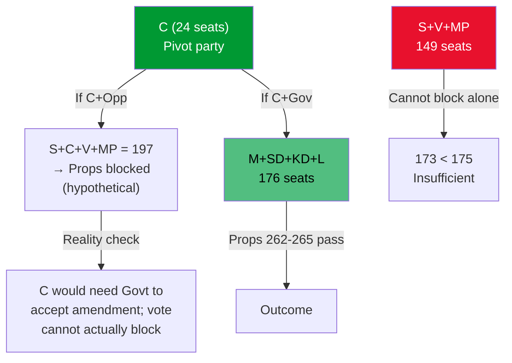

# Coalition Mathematics — Opposition Motions 2026-05-14

**Author**: James Pether Sörling

---

## Current Riksdag Seat Arithmetic (2022 Election Result)

Total seats: 349  
Majority threshold: 175

| Party | Seats | Block |
|-------|-------|-------|
| S | 107 | Opposition |
| M | 68 | Government |
| SD | 73 | Government |
| C | 24 | Opposition |
| V | 24 | Opposition |
| KD | 19 | Government |
| L | 16 | Government |
| MP | 18 | Opposition |

**Government coalition (M+SD+KD+L)**: 176 seats — bare majority of 1  
**Opposition (S+C+V+MP)**: 173 seats

## Voting Arithmetic for Props 262–265

Given the current seat arithmetic, all four propositions will pass if the Tidökoalitionen votes together. The government has 176 seats (majority of 1).

**Key scenario: C defection on prop 265**  
If C (24 seats) votes against prop 265 rather than abstaining, the government loses its majority (176 - 24 = 152 < 175). C has the *mathematical* ability to block a single proposition if they vote with S+V+MP (107+24+24+18 = 173) + C (24) = **not needed** — actually S+C+V+MP = 173 already exceeds 175? 

Let me recalculate:  
S(107) + C(24) + V(24) + MP(18) = 173 — this is **2 seats short** of majority.  
Government: M(68) + SD(73) + KD(19) + L(16) = 176.

**Verdict**: Even unified opposition (S+C+V+MP = 173) cannot outvote the government (176). The government has 3-seat headroom. Opposition cannot mathematically block any proposition unless 2 government MPs rebel.

## Cross-Party Amendment Possibility

The only realistic legislative path for opposition is to *accept the propositions* but negotiate committee amendments:
- If C votes **Yes on 262–265 with amendment** and government accepts the amendment: amendment passes
- If government rejects all C amendments: C votes No but propositions still pass

**C's leverage**: C can threaten to vote against the entire package and use its 24 seats as a blocking signal — but they cannot actually block. C's *real* leverage is the constitutional credibility argument (Lagrådet backing) combined with media/public pressure.

## Post-2026 Coalition Implications

If 2026 election results in S+C+V+MP majority:
- Props 262–265 would be partially reversed
- Permanent permits would likely be restored (S commitment)
- Child safeguards in prop 265 would be enhanced
- Return activities (prop 263) might be retained in modified form

**Key swing**: C is the pivot party. A C rightward move (support Tidökoalitionen renewal) → props maintained. C leftward move (support S-led coalition) → props reversed.

