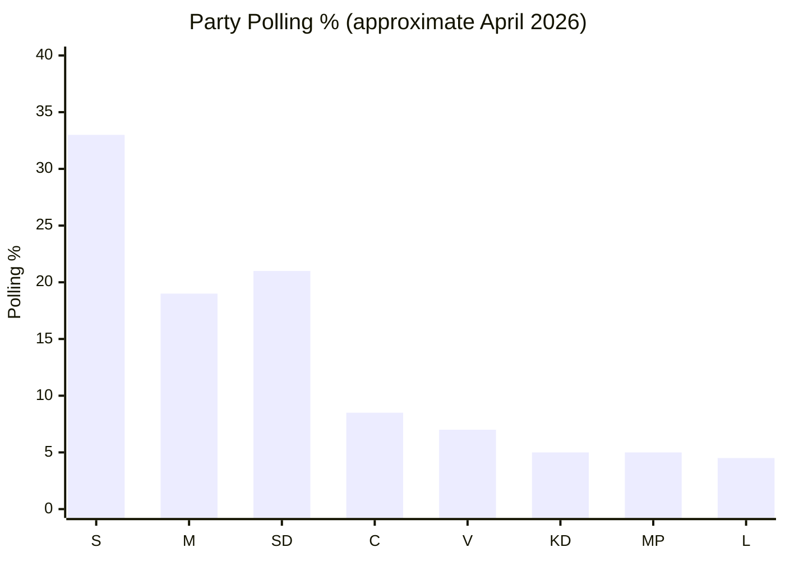

# Election 2026 Analysis — Opposition Motions 2026-05-14

**Author**: James Pether Sörling

---

## Election Calendar Context

**Next Swedish Riksdag election**: 13 September 2026 (T-122 days from article date)

This is a **pre-election window** analysis. All 15 motions filed 2026-05-13 are filed with full awareness that the 2026 election is 16 months away. The filing date places them firmly in the horizon band **T+1460d context / T+7d–T+90d operational** — opposition parties are building their electoral record NOW.

## Party-by-Party Electoral Calculus

### Socialdemokraterna (S)
**2022 result**: 30.3% (Opposition; Magdalena Andersson returned as PM but lost power)  
**2026 target**: ~32–34% (recovery threshold to form government)  
**Motion strategy**: S's migration motions (HD024152, HD024153) are calibrated to position S as *pragmatically tough but rights-respecting* — avoiding the 2015 "open borders" label while distinguishing from the government's "exclusionary" approach.  
**Risk**: S's 2016 reversal (then supported temporary permits) undermines credibility; government will use HD024153 as evidence S has "gone soft again."

### Centerpartiet (C)
**2022 result**: 6.7% (fell to 4th-tier size; barely cleared 4% threshold)  
**2026 target**: 8–10% (recovery to meaningful swing-party role)  
**Motion strategy**: 8 motions across 5 committees = visibility strategy. C is demonstrating legislative activity to contrast with SD's agenda-dominance. The rights-based migration framing (Lagrådet-backed) is targeted at liberal-leaning M voters who are uncomfortable with SD's influence.  
**Risk**: Perceived as blocking necessary migration reform; loses votes from C's rural, traditionalist base.

### Vänsterpartiet (V)
**2022 result**: 6.7%  
**2026 target**: Maintain 6–8%  
**Motion strategy**: Total rejection motions (HD024167–169) are consistent with V's left-flank identity. V is not competing for swing voters on migration — it is consolidating its left base which strongly opposes the entire migration tightening trajectory.  
**Risk**: Minimal — migration hardline is V base-consistent.

## Coalition Scenarios Post-2026 Election (Preview)

| Coalition Path | Current Probability | Migration Impact |
|---------------|--------------------|-----------------| 
| Tidökoalitionen renewed (M+SD+KD+L) | ~35% | Props 262–265 maintained and extended |
| S-led left-centre coalition (S+MP+V+C) | ~30% | Permanent permit abolition reversed; return activities reformed |
| S-led minority with passive C support | ~25% | Partial reversal; child safeguards strengthened |
| Hung parliament, new election | ~10% | Status quo until resolved |

## Electoral Volatility Indicators

- **Migration issue salience**: Currently top-3 issue in Sifo polling; consistently elevated since 2022
- **S recovery signal**: S polling at ~33% (IPSOS, April 2026) — within range for government-formation
- **C trajectory**: C at ~8.5% in latest Novus — recovering from 2022 trough; liberal-rights framing resonating
- **SD plateau**: SD at ~20–22% — no further gain from migration hardening; government facing diminishing returns from SD agenda-setting

