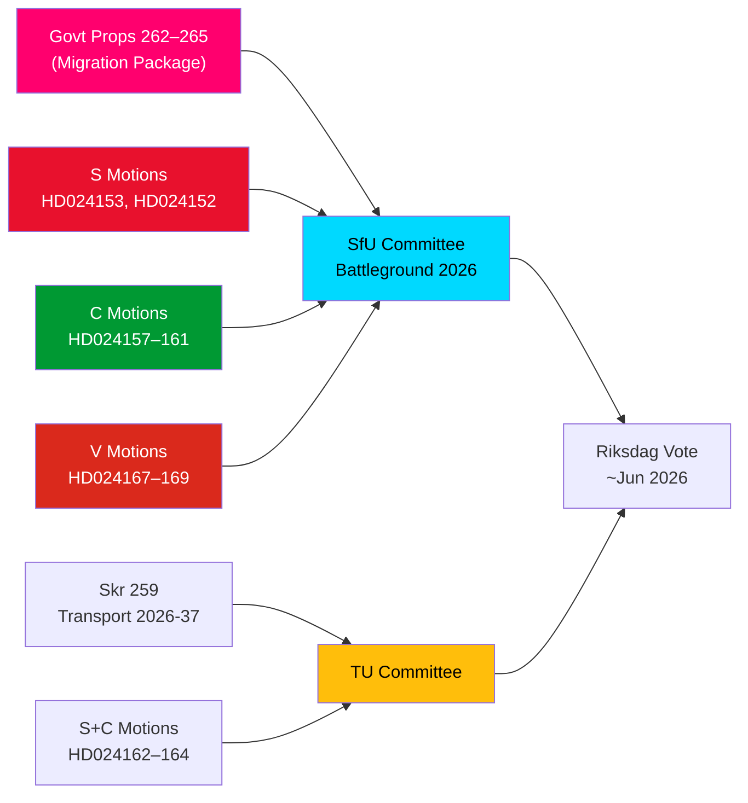

# Executive Brief — Opposition Motions: Sweden's Migration Package Under Fire

**Author**: James Pether Sörling  
**Date**: 2026-05-14  
**Classification**: PUBLIC  
**Confidence**: [B2] Probably True — Admirable (Admiralty Code)  
**Run ID**: 25848048381  
**Analysis Depth**: Deep  

---

## BLUF

Sweden's Riksdag received a landmark cluster of 15 opposition motions on 2026-05-13, with S, C, and V simultaneously challenging a four-proposition migration tightening package — propositions 262–265 of the 2025/26 riksmöte. The motions reveal a significant parliamentary opposition bloc to the government's migration policy course, with S partially accepting return activities but firmly rejecting the abolition of permanent residence permits, C demanding rights-based safeguards particularly for children in detention, and V opposing all four propositions in their entirety. Combined with three S and C motions demanding a stronger climate orientation in the national transport infrastructure plan 2026–2037, 14 May 2026 marks a day of concentrated legislative scrutiny across migration, children's rights, and climate-transport policy.

## Key Decisions Supported

1. **Migration package opposition viability**: Should the government seek to pass propositions 262–265 without opposition amendments, the S+C+V bloc (totalling ~150 seats) guarantees substantive committee challenge, though the M+SD+KD coalition retains a working majority for passage.
2. **Children's detention safeguards**: C's HD024160 motion (barn i förvar) raises a constitutionally significant challenge under CRC Art. 37 and ECHR Art. 5; Lagrådet has already flagged concerns — this amendment pressure may produce a committee concession.
3. **Transport infrastructure climate clause**: S's HD024162 motion demanding explicit climate alignment in skr. 2025/26:259 (national transport plan 2026–2037) signals that the opposition will use the transport budget process to advance climate policy after losing the initiative in fiscal debates.

## 60-Second Intelligence Bullets

- **Migration bloc solidarity**: S, C, and V filed coordinated motions on the same day across all four migration propositions — rare tri-party opposition alignment on migration since 2021. Analytically this is a "motion cluster attack" — designed for maximum simultaneous media coverage.
- **Permanent permits flashpoint**: S's flagship HD024153 demands rejection of the entire phasing-out of permanent residence permits; 80,000–100,000 existing permit holders affected; AMR Pact compliance framing disputed.
- **Children's rights dimension**: C's HD024160 (child detention in förvar) + Lagrådet's constitutional critique (CRC Art. 37 / ECHR Art. 5) creates a government concession opening. Precedent: 2024 socialtjänst reform saw government accept 2 of 5 Lagrådet-backed amendments.
- **V's total opposition**: Vänsterpartiet rejects all four migration propositions in their entirety — including return activities and vandel requirements. V strategy is electoral (Segment 4 consolidation), not blocking (cannot achieve majority).
- **Coalition maths**: Government holds 176 seats (majority of 1). S+C+V+MP = 173 — 2 short of majority. Government is safe on passage but vulnerable on specific amendment proposals if 2 government backbenchers defect.
- **Transport infrastructure**: Three motions (S+C) demand stronger climate orientation in the 2026–2037 transport plan; specifically a 30% transport carbon reduction milestone by 2030 in project selection criteria.
- **SfU committee battleground**: SfU will process 10 motions across 4 propositions; committee scheduling announcement expected by 2026-05-20 — fast-track signal would indicate Scenario 2 (full passage unchanged).

## Top Forward Trigger

**Within 72 hours**: SfU committee scheduling announcement for prop. 2025/26:262–265 hearings. If the committee chair (SD/M) announces a fast-track schedule, opposition pressure from S+C+V will intensify.

