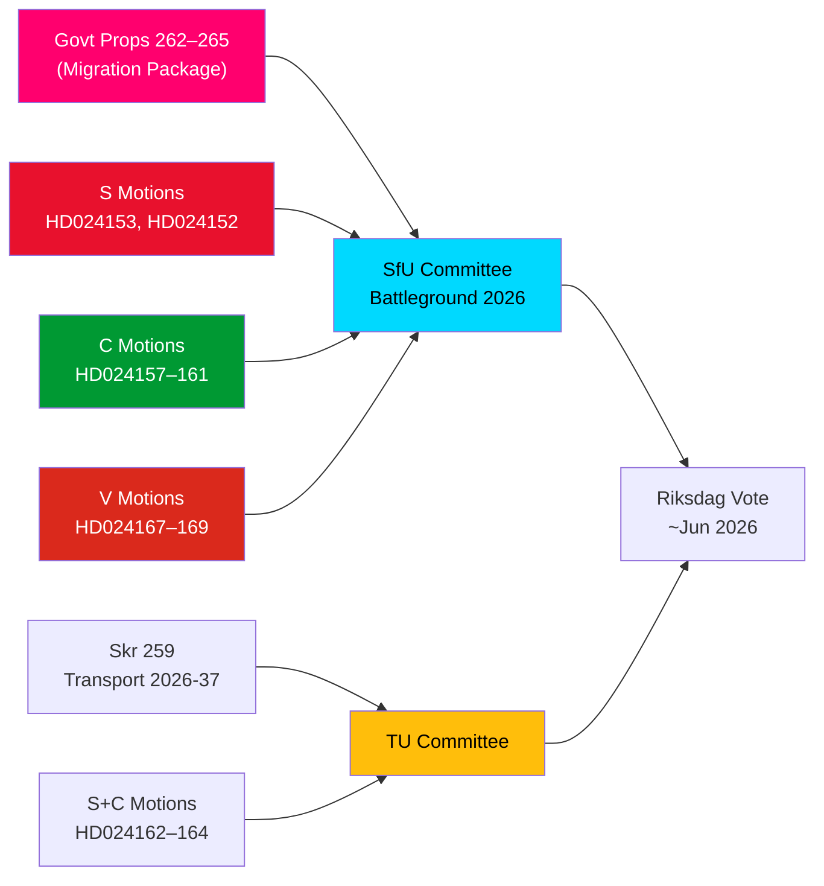

<!-- dir: rtl -->
# موجز استخباراتي — اقتراحات المعارضة: حزمة الهجرة السويدية تحت النار

**المؤلف**: جيمس بيثر سورلينغ  
**التاريخ**: 2026-05-14  
**التصنيف**: عام  
**درجة الثقة**: [B2] على الأرجح صحيح — كود الأميرالية  
**عمق التحليل**: عميق

---

## الخلاصة التنفيذية

استقبل الريكسداغ السويدي في 13 مايو 2026 مجموعة لافتة من 15 اقتراح معارضة، إذ تحدّت أحزاب S وC وV في آنٍ واحد حزمة من أربع مقترحات لتشديد سياسة الهجرة — المقترحات 262–265 في الدورة البرلمانية 2025/26. كشفت الاقتراحات عن كتلة برلمانية معارضة كبيرة في مواجهة مسار حكومة الهجرة، إذ تقبل S جزئياً أنشطة الإعادة لكنها ترفض رفضاً قاطعاً إلغاء تصاريح الإقامة الدائمة، وتطالب C بضمانات قائمة على الحقوق لا سيما للأطفال في مراكز الاحتجاز، وترفض V جميع المقترحات الأربعة كلياً. إلى جانب ثلاثة اقتراحات من S وC تطالب بتوجيه مناخي أقوى في الخطة الوطنية للبنية التحتية للنقل 2026–2037، يُمثّل 14 مايو 2026 يوماً من التدقيق التشريعي المكثّف في الهجرة وحقوق الطفل وسياسة النقل المناخية.

## القرارات الرئيسية المدعومة

1. **جدوى مقاومة المعارضة للهجرة**: إن حاولت الحكومة تمرير المقترحات 262–265 دون تعديلات المعارضة، يضمن تكتل S+C+V (نحو 150 مقعداً مجموع) تحدياً جوهرياً في اللجان، غير أن ائتلاف M+SD+KD يحتفظ بأغلبية عاملة للتمرير.
2. **ضمانات الأطفال في مراكز الاحتجاز**: يُشكّل اقتراح C رقم HD024160 (barn i förvar) تحدياً بالغ الأهمية الدستورية وفق CRC المادة 37 وECHR المادة 5؛ وقد أشار Lagrådet بالفعل إلى مخاوف — قد يُفضي هذا الضغط التعديلي إلى تنازل في اللجنة.
3. **البند المناخي في البنية التحتية للنقل**: يشير اقتراح S رقم HD024162 الداعي إلى تكيّف مناخي صريح في skr. 2025/26:259 (الخطة الوطنية للنقل 2026–2037) إلى أن المعارضة ستستخدم عملية ميزانية النقل لتعزيز السياسة المناخية بعد فقدانها المبادرة في المناقشات المالية.

## نقاط استخباراتية في 60 ثانية

- **تضامن الكتلة الهجرية**: قدّمت S وC وV اقتراحات منسّقة في نفس اليوم ضد جميع المقترحات الأربعة للهجرة — تنسيق ثلاثي نادر للمعارضة في الهجرة منذ 2021. من الناحية التحليلية، هذا "هجوم اقتراحات عنقودية" — مصمَّم لتحقيق تغطية إعلامية متزامنة قصوى.
- **تصريح الإقامة الدائمة كنقطة احتكاك**: يطالب الاقتراح الرئيسي لـ S رقم HD024153 برفض تدريج إلغاء تصاريح الإقامة الدائمة بأكمله؛ يمس 80,000–100,000 حامل تصريح حالي؛ حجة الامتثال لميثاق AMR محل خلاف.
- **البُعد الحقوقي للطفل**: اقتراح C رقم HD024160 (barn i förvar) + نقد Lagrådet الدستوري (CRC المادة 37 / ECHR المادة 5) يفتح نافذة تنازل حكومي. سابقة: إصلاح الخدمة الاجتماعية 2024 حيث قبلت الحكومة 2 من أصل 5 تعديلات مدعومة من Lagrådet.
- **معارضة V الشاملة**: يرفض Vänsterpartiet جميع المقترحات الأربعة كلياً — بما في ذلك أنشطة الإعادة ومتطلبات السلوك. استراتيجية V انتخابية (توحيد الشريحة 4)، وليست حجب (لا تستطيع تحقيق أغلبية).
- **حسابات التحالف**: تمتلك الحكومة 176 مقعداً (أغلبية مقعد واحد). S+C+V+MP = 173 — أقل من الأغلبية بمقعدين. الحكومة آمنة في التمرير لكن عُرضة لمقترحات تعديل محددة إن صوّت ضدها عضوان من الغالبية.
- **البنية التحتية للنقل**: ثلاثة اقتراحات (S+C) تطالب بتوجيه مناخي أقوى في خطة النقل 2026–2037؛ تحديداً هدف خفض 30% من انبعاثات كربون النقل بحلول 2030 كمعيار لاختيار المشاريع.
- **لجنة SfU ساحة معركة**: ستعالج SfU 10 اقتراحات مقابل 4 مقترحات؛ يُتوقع الإعلان عن جدول أعمال اللجنة قبل 2026-05-20 — إشارة المسار السريع ستدل على السيناريو 2 (تمرير كامل دون تعديل).

## المحرك المستقبلي الرئيسي

**في غضون 72 ساعة**: إعلان تخطيط لجنة SfU لجلسات الاستماع للمقترحات prop. 2025/26:262–265. إن أعلن رئيس اللجنة (SD/M) عن جدول مسار سريع، سيتصاعد ضغط المعارضة من S+C+V.

<!-- source-sha: 13fb01dbf19848515cc9696908bf9f099436e97c -->
