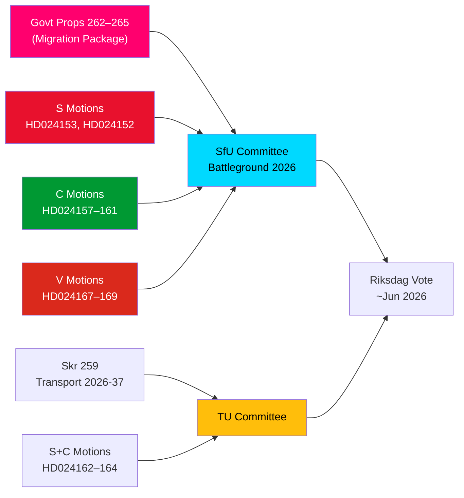

# Efterretningsbrev — Oppositionsmotioner: Sveriges migrationspakke under angreb

**Forfatter**: James Pether Sörling  
**Dato**: 2026-05-14  
**Klassificering**: OFFENTLIG  
**Konfidensgrad**: [B2] Sandsynligvis sandt — Admiralitetskoden  
**Analysedybde**: Dyb

---

## BLUF

Sveriges Riksdag modtog den 13. maj 2026 en bemærkelsesværdig klynge af 15 oppositionsmotioner, hvor S, C og V samtidigt udfordrede et fire propositioner stærkt migrationsstramningspakke — propositionerne 262–265 i riksmødet 2025/26. Motionerne afslører et betydeligt parlamentarisk oppositionsblok mod regeringens migrationspolitiske kurs, hvor S delvist accepterer tilbagevendelsesaktiviteter men fast afviser afskaffelsen af permanente opholdstilladelser, C kræver rettighedsbaserede beskyttelsesforanstaltninger særligt for børn i forvaring, og V modsætter sig alle fire propositioner i deres helhed. Kombineret med tre motioner fra S og C, der kræver stærkere klimatorientering i den nationale transportinfrastrukturplan 2026–2037, markerer den 14. maj 2026 en dag med koncentreret lovgivningsmæssig kontrol inden for migration, børns rettigheder og klima-transportpolitik.

## Understøttede nøglebeslutninger

1. **Levedygtighed af oppositionens migrationsmotstand**: Bør regeringen forsøge at vedtage propositionerne 262–265 uden oppositionsændringer, garanterer S+C+V-blokken (i alt ~150 mandater) substantiel udvalgsudfordring, men M+SD+KD-koalitionen bevarer et virkende flertal for passage.
2. **Beskyttelsesforanstaltninger for børn i forvaring**: C's HD024160-motion (barn i förvar) rejser en konstitutionelt betydelig udfordring i henhold til CRC art. 37 og ECHR art. 5; Lagrådet har allerede markeret betænkeligheder — dette ændringstryk kan medføre en udvalgsindrømmelse.
3. **Klimaklausul i transportinfrastruktur**: S's HD024162-motion, der kræver eksplicit klimatilpasning i skr. 2025/26:259 (national transportplan 2026–2037), signalerer, at oppositionen vil bruge transportbudgetprocessen til at fremme klimapolitik efter at have mistet initiativet i finansdebatterne.

## 60-sekunders efterretningsbullets

- **Migrationsblokundersoli daritet**: S, C og V indsendte koordinerede motioner samme dag mod alle fire migrationsproportioner — sjælden triparts-oppositionskoordination om migration siden 2021. Analytisk er dette et "motionsklusterangreb" — designet til maksimal simultan mediedækning.
- **Permanent opholdstilladelse som stridspunkt**: S's flagskib HD024153 kræver afvisning af hele udfasningen af permanente opholdstilladelser; 80.000–100.000 eksisterende tilladelsesindehavere berørt; AMR-paktens overholdelsesargument bestridt.
- **Børnerettighedsdimension**: C's HD024160 (barn i förvar) + Lagrådets konstitutionelle kritik (CRC art. 37 / ECHR art. 5) skaber et regeringsindrømmelsesrum. Præcedens: 2024-socialtjenestereformen, hvor regeringen accepterede 2 af 5 Lagrådet-støttede ændringer.
- **V's totale modstand**: Vänsterpartiet afviser alle fire migrationsproportioner i deres helhed — inklusive tilbagevendelsesaktiviteter og vandelkrav. V's strategi er valgbetinget (segment 4-konsolidering), ikke blokeringsformål (kan ikke opnå flertal).
- **Koalitionsmatematik**: Regeringen har 176 mandater (1 mandats flertal). S+C+V+MP = 173 — 2 kortere end flertal. Regeringen er sikker på passage, men sårbar over for specifikke ændringsforslag, hvis 2 regeringsbagbencher stemmer imod.
- **Transportinfrastruktur**: Tre motioner (S+C) kræver stærkere klimatorientering i transportplanen 2026–2037; specifikt et 30 % reduktionsmål for transportkuldioxid inden 2030 i udvælgelseskriterier for projekter.
- **SfU som slagmark**: SfU skal behandle 10 motioner mod 4 propositioner; meddelelse om udvalgets tidsplan forventes inden 2026-05-20 — et hurtigspor-signal vil indikere Scenario 2 (fuld vedtagelse uændret).

## Ledende fremtidig udløser

**Inden for 72 timer**: SfU's udvalgsplanlægningsmeddelelse for behandling af prop. 2025/26:262–265. Hvis udvalgsformanden (SD/M) annoncerer et hurtigspor, vil oppositionspresset fra S+C+V intensiveres.

<!-- source-sha: 13fb01dbf19848515cc9696908bf9f099436e97c -->
