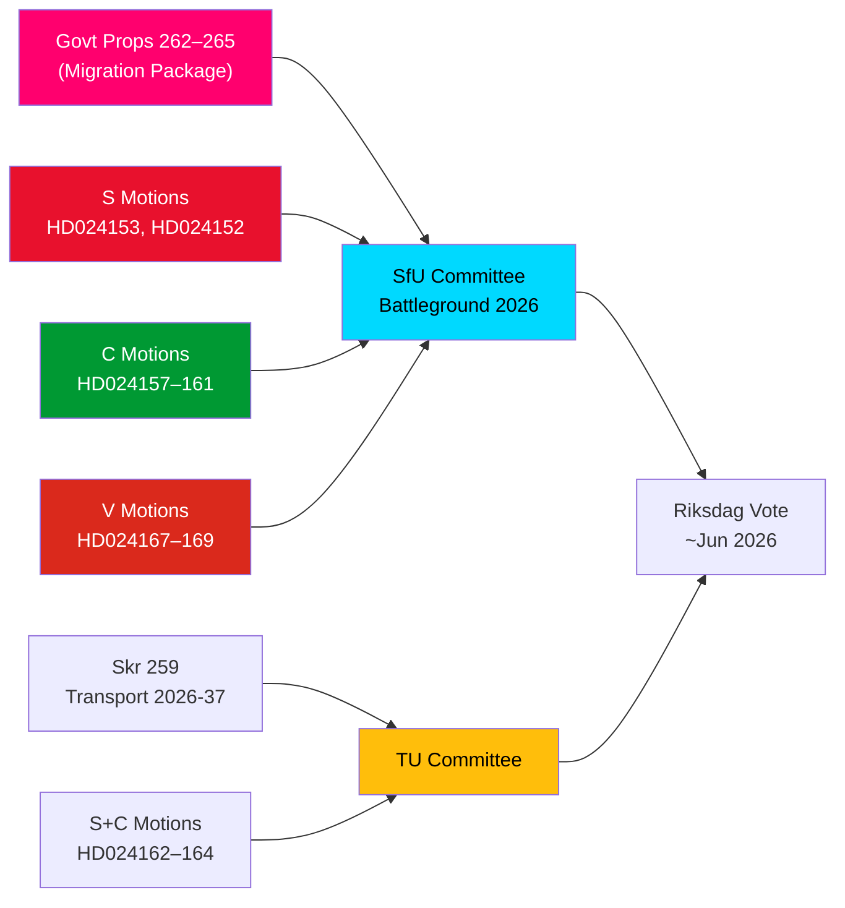

# Nachrichtendienst-Brief — Oppositionsmotionen: Schwedens Migrationspaket unter Beschuss

**Autor**: James Pether Sörling  
**Datum**: 2026-05-14  
**Klassifizierung**: ÖFFENTLICH  
**Konfidenzgrad**: [B2] Wahrscheinlich zutreffend — Admiralitätscode  
**Analysetiefe**: Tief

---

## BLUF

Schwedens Riksdag erhielt am 13. Mai 2026 ein bemerkenswertes Bündel von 15 Oppositionsmotionen, bei denen S, C und V gleichzeitig ein Vierpropositionenpaket zur Migrationsrestriktionierung herausforderten — Propositionen 262–265 des Riksmöte 2025/26. Die Motionen enthüllen einen bedeutenden parlamentarischen Oppositionsblock gegen den Migrationspolitikkurs der Regierung: S akzeptiert teilweise Rückkehraktivitäten, lehnt aber die Abschaffung dauerhafter Aufenthaltserlaubnisse entschieden ab, C fordert rechtsbasierte Schutzmaßnahmen insbesondere für Kinder in Haft, und V lehnt alle vier Propositionen vollständig ab. Kombiniert mit drei Motionen von S und C, die eine stärkere Klimaausrichtung im nationalen Transportinfrastrukturplan 2026–2037 fordern, markiert der 14. Mai 2026 einen Tag konzentrierter Gesetzgebungsprüfung in den Bereichen Migration, Kinderrechte und Klima-Verkehrspolitik.

## Unterstützte Schlüsselentscheidungen

1. **Tragfähigkeit des Oppositionswiderstands gegen Migration**: Sollte die Regierung versuchen, die Propositionen 262–265 ohne Oppositionsänderungen durchzusetzen, garantiert der S+C+V-Block (insgesamt ~150 Mandate) eine substanzielle Ausschussherausforderung, die M+SD+KD-Koalition behält jedoch eine arbeitsfähige Mehrheit für die Verabschiedung.
2. **Schutzmaßnahmen für Kinder in Haft**: Die C-Motion HD024160 (barn i förvar) stellt eine verfassungsrechtlich bedeutsame Herausforderung nach CRC Art. 37 und ECHR Art. 5 dar; Lagrådet hat bereits Bedenken geäußert — dieser Änderungsdruck kann eine Ausschusskonzession herbeiführen.
3. **Klimaklausel in der Transportinfrastruktur**: Die S-Motion HD024162, die eine explizite Klimaanpassung in skr. 2025/26:259 (nationaler Transportplan 2026–2037) fordert, signalisiert, dass die Opposition den Transportbudgetprozess nutzen wird, um Klimapolitik voranzutreiben, nachdem sie die Initiative in den Finanzdebatten verloren hat.

## 60-Sekunden-Nachrichtenpunkte

- **Migrationsblock-Solidarität**: S, C und V reichten am selben Tag koordinierte Motionen gegen alle vier Migrationspropositionen ein — seltene Dreierpartei-Oppositionskoordination bei Migration seit 2021. Analytisch ist dies ein "Motionsklusterangriff" — konzipiert für maximale simultane Medienberichterstattung.
- **Dauerhafte Aufenthaltserlaubnis als Streitpunkt**: S's Flaggschiff HD024153 fordert die Ablehnung der gesamten Abschaffung dauerhafter Aufenthaltserlaubnisse; 80.000–100.000 bestehende Erlaubnisinhaber betroffen; AMR-Pakt-Konformitätsargument umstritten.
- **Kinderrechtsdimension**: C's HD024160 (barn i förvar) + Lagrådets Verfassungskritik (CRC Art. 37 / ECHR Art. 5) schafft einen Regierungskonzessionsraum. Präzedenz: Sozialdienstreform 2024, bei der die Regierung 2 von 5 Lagrådet-unterstützten Änderungen akzeptierte.
- **V's totaler Widerstand**: Vänsterpartiet lehnt alle vier Migrationspropositionen vollständig ab — einschließlich Rückkehraktivitäten und Verhaltensanforderungen. V's Strategie ist wahlbedingt (Segment-4-Konsolidierung), nicht blockierend (kann keine Mehrheit erzielen).
- **Koalitionsarithmetik**: Die Regierung hat 176 Mandate (1 Mandat Mehrheit). S+C+V+MP = 173 — 2 unter Mehrheit. Die Regierung ist bei der Verabschiedung sicher, aber bei spezifischen Änderungsanträgen gefährdet, wenn 2 Regierungsabgeordnete dagegen stimmen.
- **Transportinfrastruktur**: Drei Motionen (S+C) fordern eine stärkere Klimaausrichtung im Transportplan 2026–2037; insbesondere ein 30%-CO₂-Reduktionsziel im Transportbereich bis 2030 als Projektauswahlkriterium.
- **SfU als Schlachtfeld**: SfU wird 10 Motionen gegen 4 Propositionen behandeln; Mitteilung zum Ausschusszeitplan wird bis 2026-05-20 erwartet — ein Schnellspursignal würde Szenario 2 (vollständige Verabschiedung unverändert) anzeigen.

## Führender künftiger Auslöser

**Innerhalb von 72 Stunden**: SfU's Ausschussplanungsmitteilung zur Behandlung von Prop. 2025/26:262–265. Wenn der Ausschussvorsitzende (SD/M) einen Schnellspurplan ankündigt, wird der Oppositionsdruck von S+C+V intensiviert.

<!-- source-sha: 13fb01dbf19848515cc9696908bf9f099436e97c -->
