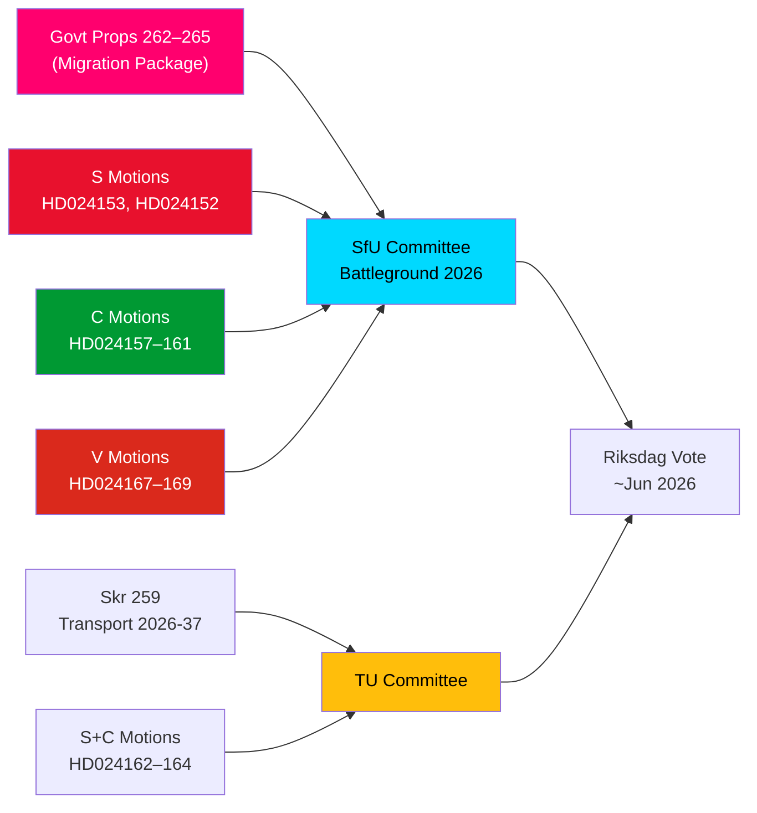

# Informe de Inteligencia — Mociones de la Oposición: El Paquete Migratorio de Suecia Bajo Presión

**Autor**: James Pether Sörling  
**Fecha**: 2026-05-14  
**Clasificación**: PÚBLICO  
**Nivel de confianza**: [B2] Probablemente cierto — Código de almirantazgo  
**Profundidad de análisis**: Profunda

---

## BLUF

El Riksdag sueco recibió el 13 de mayo de 2026 un notable conjunto de 15 mociones de oposición, donde S, C y V desafiaron simultáneamente un paquete de endurecimiento migratorio de cuatro proposiciones — proposiciones 262–265 del riksmöte 2025/26. Las mociones revelan un bloque parlamentario de oposición significativo frente al rumbo de la política migratoria del gobierno, donde S acepta parcialmente las actividades de retorno pero rechaza firmemente la abolición de los permisos de residencia permanente, C exige salvaguardas basadas en derechos especialmente para los niños en detención, y V se opone a las cuatro proposiciones en su totalidad. Junto con tres mociones de S y C que exigen una mayor orientación climática en el plan nacional de infraestructuras de transporte 2026–2037, el 14 de mayo de 2026 marca un día de escrutinio legislativo concentrado en migración, derechos del niño y política climática-transporte.

## Decisiones Clave Apoyadas

1. **Viabilidad de la resistencia migratoria de la oposición**: Si el gobierno intenta aprobar las proposiciones 262–265 sin enmiendas de la oposición, el bloque S+C+V (en total ~150 escaños) garantiza un desafío sustancial en comisión, aunque la coalición M+SD+KD mantiene una mayoría operativa para su aprobación.
2. **Salvaguardas para niños en detención**: La moción C HD024160 (barn i förvar) plantea un desafío constitucionalmente significativo conforme a la CRC art. 37 y el CEDH art. 5; el Lagrådet ya ha señalado preocupaciones — esta presión de enmienda puede generar una concesión en comisión.
3. **Cláusula climática en infraestructura de transporte**: La moción S HD024162 que exige adaptación climática explícita en skr. 2025/26:259 (plan nacional de transporte 2026–2037) señala que la oposición usará el proceso presupuestario de transporte para impulsar la política climática después de haber perdido la iniciativa en los debates fiscales.

## Puntos de Inteligencia en 60 Segundos

- **Solidaridad del bloque migratorio**: S, C y V presentaron mociones coordinadas el mismo día contra las cuatro proposiciones migratorias — rara coordinación de oposición tripartita en migración desde 2021. Analíticamente esto es un "ataque de grupo de mociones" — diseñado para máxima cobertura mediática simultánea.
- **Permiso de residencia permanente como punto de fricción**: El buque insignia de S, HD024153, exige el rechazo completo de la supresión progresiva de los permisos de residencia permanente; 80.000–100.000 titulares de permisos existentes afectados; el argumento de cumplimiento del Pacto AMR está en disputa.
- **Dimensión de derechos del niño**: La moción C HD024160 (barn i förvar) + la crítica constitucional del Lagrådet (CRC art. 37 / CEDH art. 5) crea un espacio de concesión gubernamental. Precedente: la reforma de servicios sociales de 2024 donde el gobierno aceptó 2 de 5 enmiendas respaldadas por el Lagrådet.
- **Oposición total de V**: Vänsterpartiet rechaza las cuatro proposiciones migratorias en su totalidad — incluidas actividades de retorno y requisitos de conducta. La estrategia de V es electoral (consolidación del segmento 4), no de bloqueo (no puede lograr mayoría).
- **Aritmética de la coalición**: El gobierno tiene 176 escaños (1 escaño de mayoría). S+C+V+MP = 173 — 2 por debajo de la mayoría. El gobierno tiene garantizada la aprobación, pero es vulnerable a propuestas de enmienda específicas si 2 parlamentarios del gobierno votan en contra.
- **Infraestructura de transporte**: Tres mociones (S+C) exigen mayor orientación climática en el plan de transporte 2026–2037; concretamente un objetivo de reducción del 30 % del carbono del transporte para 2030 en los criterios de selección de proyectos.
- **SfU como campo de batalla**: SfU procesará 10 mociones contra 4 proposiciones; se espera un anuncio del calendario de la comisión para antes del 2026-05-20 — una señal de vía rápida indicaría el Escenario 2 (aprobación completa sin cambios).

## Principal Desencadenante Futuro

**En 72 horas**: anuncio de programación de la comisión SfU para las audiencias de las prop. 2025/26:262–265. Si el presidente de la comisión (SD/M) anuncia un cronograma de vía rápida, la presión de la oposición de S+C+V se intensificará.

<!-- source-sha: 13fb01dbf19848515cc9696908bf9f099436e97c -->
