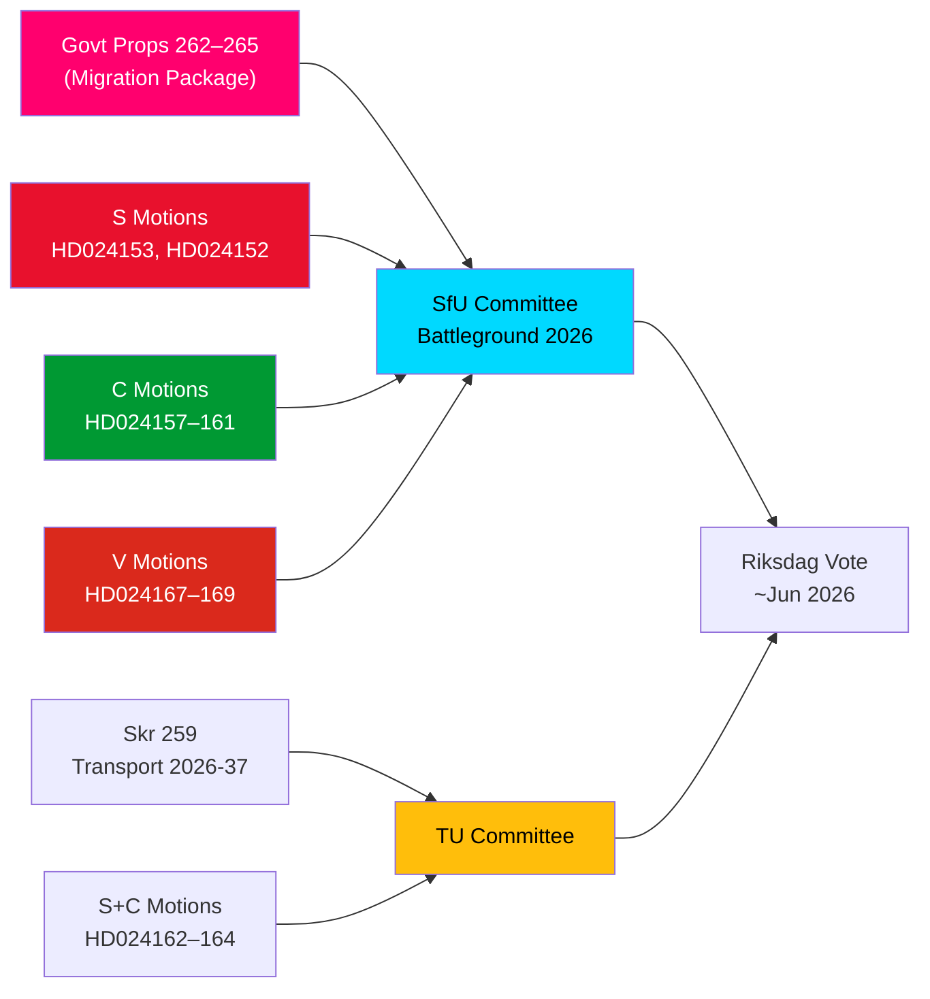

# Tiedustelutiivistelmä — Oppositioaloitteet: Ruotsin maahanmuuttopaketti tulilinjan alla

**Tekijä**: James Pether Sörling  
**Päivämäärä**: 2026-05-14  
**Luokittelu**: JULKINEN  
**Luotettavuusaste**: [B2] Todennäköisesti totta — Admiraliteettikoodisto  
**Analyysisyvyys**: Syvä

---

## BLUF

Ruotsin riksdag vastaanotti 13. toukokuuta 2026 huomattavan kokoelman 15 oppositioaloitetta, joissa S, C ja V haastoivat samanaikaisesti neljän esityksen maahanmuuton tiukentamispaketin — esitykset 262–265 riksmötessä 2025/26. Aloitteet paljastavat merkittävän parlamentaarisen oppositioblokin hallituksen maahanmuuttopoliittista kurssia vastaan: S hyväksyy osittain paluutoiminnot, mutta torjuu jyrkästi pysyvien oleskelulupien poistamisen, C vaatii oikeusperustaisia suojatoimenpiteitä erityisesti säilöön otetuille lapsille, ja V vastustaa kaikkia neljää esitystä kokonaisuudessaan. Yhdistettynä kolmeen S:n ja C:n aloitteeseen, joissa vaaditaan vahvempaa ilmastoorientaatiota kansalliseen liikenneinfrastruktuurisuunnitelmaan 2026–2037, 14. toukokuuta 2026 merkitsee päivää, jona lainsäädäntövalvonta keskittyi muuttoliikkeeseen, lasten oikeuksiin ja ilmasto-liikennepolitiikkaan.

## Tuetut avainpäätökset

1. **Opposition maahanmuuttovastustuksen elinvoimaisuus**: Jos hallitus pyrkii hyväksyttämään esitykset 262–265 ilman oppositiomuutoksia, S+C+V-blokki (yhteensä ~150 mandaattia) takaa merkittävän valiokuntataistelun, mutta M+SD+KD-koalitiolla on toimiva enemmistö hyväksymiseen.
2. **Säilöön otettujen lasten suojatoimenpiteet**: C:n HD024160-aloite (barn i förvar) esittää perustuslaillisesti merkittävän haasteen CRC art. 37:n ja ECHR art. 5:n nojalla; Lagrådet on jo ilmaissut huolensa — tämä muutospaine voi tuottaa valiokunnan myönnytyksen.
3. **Liikenneinfrastruktuurin ilmastoehto**: S:n HD024162-aloite, joka vaatii nimenomaista ilmastosovittamista skr. 2025/26:259:ään (kansallinen liikennesuunnitelma 2026–2037), osoittaa, että oppositio käyttää liikennebudjettiprosessia ilmastopolitiikan edistämiseen menetettyään aloitteen finanssidebaateissa.

## 60 sekunnin tiedusteluluodit

- **Maahanmuuttoblokin solidaarisuus**: S, C ja V toimittivat koordinoituja aloitteita samana päivänä kaikkia neljää maahanmuuttoesitystä vastaan — harvinainen kolmen puolueen oppositiokoordinaatio maahanmuuttoasioissa vuodesta 2021. Analyyttisesti tämä on "aloiteryväshyökkäys" — suunniteltu maksimaalista samanaikaista mediapeitettä varten.
- **Pysyvä oleskelulupa riitakysymyksenä**: S:n lippulaiva HD024153 vaatii koko pysyvien oleskelulupien asteittaisen poiston hylkäämistä; 80 000–100 000 nykyistä luvanhaltijaa on asianomaisia; AMR-sopimuksen noudattamisargumentti kiistetty.
- **Lasten oikeuksien ulottuvuus**: C:n HD024160 (barn i förvar) + Lagrådets perustuslaillinen kritiikki (CRC art. 37 / ECHR art. 5) luo hallitukselle myönnytysmahdollisuuden. Ennakkotapaus: vuoden 2024 sosiaalitoimiuudistus, jossa hallitus hyväksyi 2/5 Lagrådets tukemasta muutoksesta.
- **V:n täydellinen vastustus**: Vänsterpartiet hylkää kaikki neljä maahanmuuttoesitystä kokonaisuudessaan — mukaan lukien paluutoiminnot ja käytösvaatimukset. V:n strategia on vaalipainotteinen (segmentin 4 konsolidointi), ei estävä (ei voida saavuttaa enemmistöä).
- **Koalitioaritmetiikka**: Hallituksella on 176 mandaattia (1 mandaatin enemmistö). S+C+V+MP = 173 — 2 lyhyemmälle enemmistöstä. Hallitus on varma hyväksymisestä, mutta haavoittuva tietyille muutosehdotuksille, jos 2 hallituksen takapenkkiläistä äänestää vastaan.
- **Liikenneinfrastruktuuri**: Kolme aloitetta (S+C) vaatii vahvempaa ilmastoorientaatiota liikennesuunnitelmaan 2026–2037; erityisesti 30 %:n hiilidioksidivähennäystavoite liikenteestä vuoteen 2030 mennessä hankkeiden valintakriteereissä.
- **SfU taistelutantereena**: SfU käsittelee 10 aloitetta 4 esitystä vastaan; valiokunnan aikatauluilmoituksen odotetaan tulevan viimeistään 2026-05-20 — pikakaistan signaali tarkoittaisi Skenaario 2 (täysi hyväksyminen muuttumattomana).

## Johtava tuleva laukaisija

**72 tunnin sisällä**: SfU:n valiokunnan aikatauluilmoitus prop. 2025/26:262–265 käsittelyä varten. Jos valiokunnan puheenjohtaja (SD/M) ilmoittaa pikakaistasta, S+C+V:n oppositiopaine kiihtyy.

<!-- source-sha: 13fb01dbf19848515cc9696908bf9f099436e97c -->
