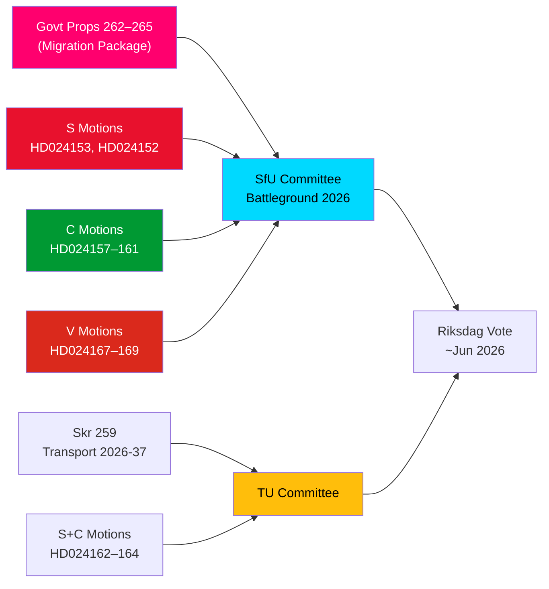

# Briefing de renseignement — Motions d'opposition : Le paquet migratoire suédois sous le feu

**Auteur** : James Pether Sörling  
**Date** : 2026-05-14  
**Classification** : PUBLIC  
**Degré de confiance** : [B2] Probablement vrai — Code des amirautés  
**Profondeur d'analyse** : Approfondie

---

## BLUF

Le Riksdag suédois a reçu le 13 mai 2026 un ensemble remarquable de 15 motions d'opposition, où S, C et V ont simultanément défié un paquet de resserrement migratoire en quatre propositions — propositions 262–265 du riksmöte 2025/26. Les motions révèlent un bloc parlementaire d'opposition significatif face à l'orientation migratoire du gouvernement : S accepte partiellement les activités de retour mais rejette fermement la suppression des permis de séjour permanents, C exige des mesures de protection fondées sur les droits particulièrement pour les enfants en rétention, et V s'oppose à la totalité des quatre propositions. Associées à trois motions de S et C exigeant une orientation climatique renforcée dans le plan national d'infrastructure de transport 2026–2037, le 14 mai 2026 marque une journée de contrôle législatif concentré dans les domaines de la migration, des droits de l'enfant et de la politique climatique-transport.

## Décisions clés soutenues

1. **Viabilité de la résistance migratoire de l'opposition** : Si le gouvernement tente de faire adopter les propositions 262–265 sans amendements de l'opposition, le bloc S+C+V (environ 150 sièges au total) garantit un défi substantiel en commission, mais la coalition M+SD+KD conserve une majorité effective pour l'adoption.
2. **Mesures de protection pour les enfants en rétention** : La motion C HD024160 (barn i förvar) soulève un défi constitutionnellement significatif en vertu de la CRC art. 37 et de la CEDH art. 5 ; le Lagrådet a déjà signalé des préoccupations — cette pression d'amendement peut engendrer une concession en commission.
3. **Clause climatique dans l'infrastructure de transport** : La motion S HD024162 exigeant une adaptation climatique explicite dans la skr. 2025/26:259 (plan national de transport 2026–2037) indique que l'opposition utilisera le processus budgétaire des transports pour faire avancer la politique climatique après avoir perdu l'initiative dans les débats financiers.

## Points de renseignement en 60 secondes

- **Solidarité du bloc migratoire** : S, C et V ont déposé des motions coordonnées le même jour contre l'ensemble des quatre propositions migratoires — une coordination d'opposition tripartite rarement vue sur la migration depuis 2021. Analytiquement, c'est une « attaque groupée de motions » — conçue pour une couverture médiatique simultanée maximale.
- **Permis de séjour permanent comme point de friction** : Le fleuron de S, HD024153, exige le rejet de l'ensemble de la suppression progressive des permis de séjour permanents ; 80 000 à 100 000 détenteurs de permis existants concernés ; l'argument de conformité au Pacte AMR est contesté.
- **Dimension droits de l'enfant** : La motion C HD024160 (barn i förvar) + la critique constitutionnelle du Lagrådet (CRC art. 37 / CEDH art. 5) crée un espace de concession gouvernementale. Précédent : la réforme des services sociaux de 2024 où le gouvernement a accepté 2 des 5 amendements soutenus par le Lagrådet.
- **Opposition totale de V** : Vänsterpartiet rejette l'ensemble des quatre propositions migratoires — y compris les activités de retour et les exigences de bonne conduite. La stratégie de V est électorale (consolidation du segment 4), non bloquante (ne peut pas obtenir la majorité).
- **Arithmétique coalitionnelle** : Le gouvernement détient 176 sièges (1 siège de majorité). S+C+V+MP = 173 — 2 de moins que la majorité. Le gouvernement est sûr d'une adoption, mais vulnérable sur des propositions d'amendement spécifiques si 2 membres de la majorité votent contre.
- **Infrastructure de transport** : Trois motions (S+C) exigent une orientation climatique plus forte dans le plan de transport 2026–2037 ; spécifiquement un objectif de réduction de 30 % des émissions de carbone du transport d'ici 2030 dans les critères de sélection des projets.
- **SfU comme champ de bataille** : SfU traitera 10 motions contre 4 propositions ; une annonce du calendrier de commission est attendue avant le 2026-05-20 — un signal de procédure accélérée indiquerait le Scénario 2 (adoption complète sans modification).

## Principal déclencheur à venir

**Dans les 72 heures** : annonce du calendrier de la commission SfU pour les auditions des prop. 2025/26:262–265. Si le président de commission (SD/M) annonce une procédure accélérée, la pression de l'opposition de S+C+V s'intensifiera.

<!-- source-sha: 13fb01dbf19848515cc9696908bf9f099436e97c -->
