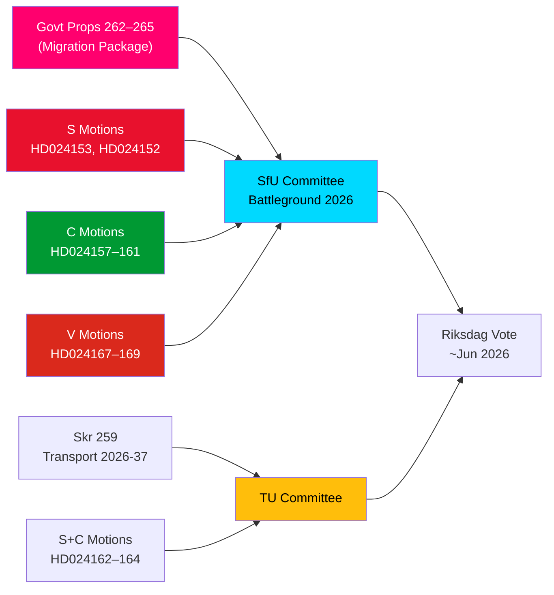

<!-- dir: rtl -->
# תדריך מודיעין — הצעות האופוזיציה: חבילת ההגירה של שוודיה תחת אש

**מחבר**: ג'יימס פת'ר סורלינג  
**תאריך**: 2026-05-14  
**סיווג**: ציבורי  
**רמת אמינות**: [B2] כנראה נכון — קוד האדמירליות  
**עומק הניתוח**: עמוק

---

## תמצית ביצועית

הריקסדאג השוודי קיבל ב-13 במאי 2026 אוסף יוצא דופן של 15 הצעות אופוזיציה, שבהן S, C ו-V ערערו בו-זמנית על חבילת החמרה בת ארבע הצעות חוק בנושא הגירה — הצעות 262–265 של ה-riksmöte 2025/26. ההצעות חושפות בלוק פרלמנטרי אופוזיציוני משמעותי נגד מדיניות ההגירה של הממשלה: S מקבלת חלקית את פעילויות השיבה אך דוחה נחרצות את ביטול היתרי השהייה הקבועים, C דורשת אמצעי הגנה מבוססי זכויות במיוחד לילדים בכליאה, ו-V מתנגדת לכל ארבע ההצעות בשלמותן. בשילוב עם שלוש הצעות של S ו-C הדורשות אוריינטציה אקלימית חזקה יותר בתוכנית התשתיות הלאומית לתחבורה 2026–2037, ה-14 במאי 2026 מסמן יום של ביקורת חקיקתית מרוכזת בתחומי ההגירה, זכויות הילד ומדיניות התחבורה-אקלים.

## החלטות מפתח נתמכות

1. **כדאיות ההתנגדות להגירה של האופוזיציה**: אם הממשלה תנסה לאשר את ההצעות 262–265 ללא תיקוני אופוזיציה, בלוק S+C+V (כ-150 מנדטים בסך הכל) מבטיח אתגר ועדה מהותי, אם כי לקואליציית M+SD+KD נותרת רוב עובד לאישור.
2. **אמצעי הגנה לילדים בכליאה**: ההצעה C HD024160 (barn i förvar) מעלה אתגר משמעותי חוקתית לפי CRC סע' 37 ו-ECHR סע' 5; Lagrådet כבר סמן חששות — לחץ התיקון הזה עשוי לייצר ויתור בוועדה.
3. **סעיף אקלים בתשתיות תחבורה**: ההצעה S HD024162 הדורשת הסתגלות אקלימית מפורשת ב-skr. 2025/26:259 (תוכנית התחבורה הלאומית 2026–2037) מסמנת שהאופוזיציה תשתמש בתהליך תקציב התחבורה לקידום מדיניות אקלים לאחר שאיבדה את היוזמה בוויכוחים הפיסקאליים.

## נקודות מודיעין ב-60 שניות

- **סולידריות בלוק ההגירה**: S, C ו-V הגישו הצעות מתואמות באותו יום נגד כל ארבע הצעות ההגירה — תיאום אופוזיציה שלישי נדיר בנושא הגירה מאז 2021. מבחינה אנליטית זהו "מתקפת אשכול הצעות" — מתוכנן לכיסוי תקשורתי מקסימאלי סימולטני.
- **היתר שהייה קבוע כנקודת חיכוך**: ה-HD024153 הדגל של S דורש דחיית כל הביטול ההדרגתי של היתרי השהייה הקבועים; 80,000–100,000 מחזיקי היתרים קיימים מושפעים; טיעון ציות ל-AMR Pact שנוי במחלוקת.
- **ממד זכויות הילד**: C HD024160 (barn i förvar) + הביקורת החוקתית של Lagrådet (CRC סע' 37 / ECHR סע' 5) יוצר מרחב ויתור ממשלתי. תקדים: רפורמת שירותי הרווחה 2024 שבה הממשלה קיבלה 2 מתוך 5 תיקונים נתמכי Lagrådet.
- **ההתנגדות המוחלטת של V**: Vänsterpartiet דוחה את כל ארבע הצעות ההגירה בשלמותן — כולל פעילויות שיבה ודרישות התנהגות. האסטרטגיה של V היא בחירתית (איחוד פלח 4), לא חסימה (לא יכולה להשיג רוב).
- **אריתמטיקת הקואליציה**: לממשלה יש 176 מנדטים (רוב של 1 מנדט). S+C+V+MP = 173 — 2 מתחת לרוב. הממשלה בטוחה באישור אך חשופה לתיקונים ספציפיים אם 2 חברי קואליציה מהשורה האחורית יצביעו נגד.
- **תשתיות תחבורה**: שלוש הצעות (S+C) דורשות אוריינטציה אקלימית חזקה יותר בתוכנית התחבורה 2026–2037; ספציפית יעד הפחתה של 30% בפחמן מתחבורה עד 2030 בקריטריוני בחירת פרויקטים.
- **SfU כשדה קרב**: SfU יעבד 10 הצעות נגד 4 הצעות חוק; הודעה על לוח הזמנים של הוועדה צפויה לפני 2026-05-20 — אות מסלול מהיר יצביע על תרחיש 2 (אישור מלא ללא שינוי).

## הגורם המרכזי הצפוי

**תוך 72 שעות**: הודעת תזמון ועדת SfU לדיונים על prop. 2025/26:262–265. אם יכריז יו"ר הוועדה (SD/M) על לוח זמנים מסלול מהיר, לחץ האופוזיציה של S+C+V יתחזק.

<!-- source-sha: 13fb01dbf19848515cc9696908bf9f099436e97c -->
