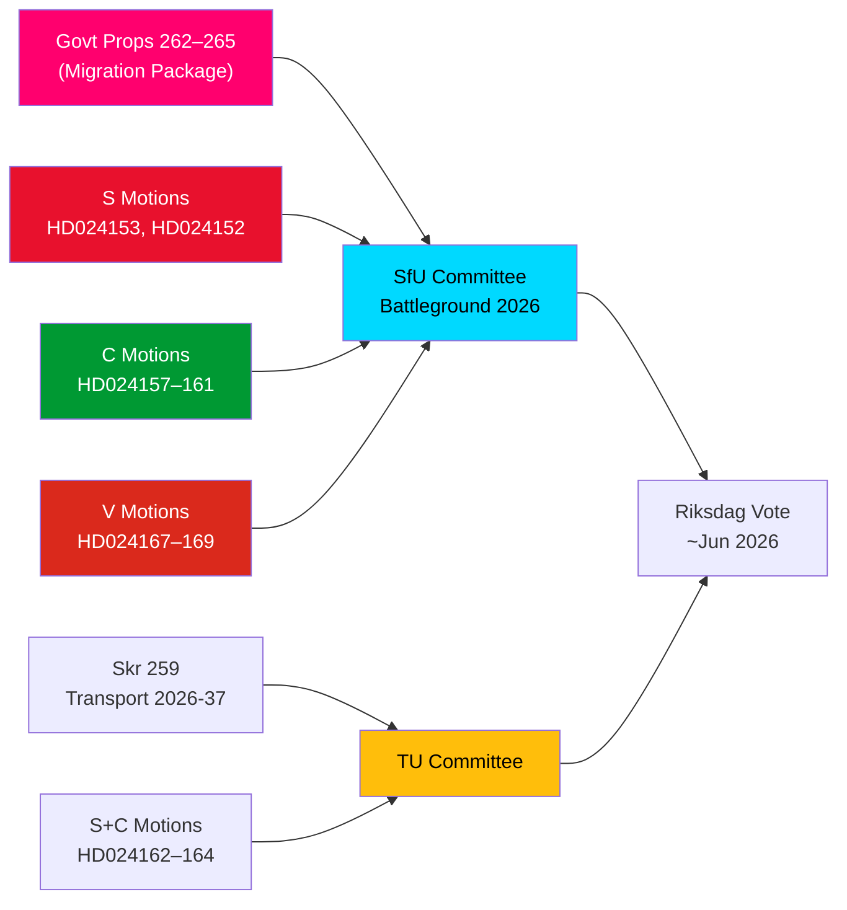

# インテリジェンス・ブリーフ — 野党動議：スウェーデンの移民パッケージに圧力

**著者**：ジェームズ・ペター・ソーリング  
**日付**：2026-05-14  
**分類**：公開  
**信頼度**：[B2] おそらく真実 — 海軍省コード  
**分析深度**：深度分析

---

## BLUF（要旨）

スウェーデン・リクスダーグは2026年5月13日、15件の野党動議という注目すべき集まりを受理した。S、C、Vの三党が同時に4つの移民規制強化法案パッケージ（riksmöte 2025/26の法案262–265）に挑戦した。これらの動議は政府の移民政策方針に対する重大な議会野党ブロックを明らかにしている：Sは帰還活動を部分的に受け入れるが永住許可廃止を強く拒否、Cは特に収容中の子どもに対する権利ベースの保護措置を求め、Vは4法案すべてを全面的に拒否する。加えて、2026-2037年国家交通インフラ計画に強化された気候方針を求めるS・Cの3動議と合わせ、2026年5月14日は移民・子どもの権利・気候交通政策における集中的な立法審査の日となった。

## 支援する主要な意思決定

1. **野党の移民抵抗の実行可能性**: 政府が野党修正案なしで法案262–265の通過を試みた場合、S+C+Vブロック（合計約150議席）は実質的な委員会での挑戦を保証するが、M+SD+KD連立は可決に向けた実効多数を維持する。
2. **収容中の子どもの保護措置**: C動議HD024160（barn i förvar）はCRC第37条とECHR第5条に基づく憲法上重大な課題を提起する；Lagrådもすでに懸念を示している — この修正圧力は委員会の譲歩をもたらしうる。
3. **交通インフラの気候条項**: skr. 2025/26:259（国家交通計画2026-2037）への明示的な気候適合を求めるS動議HD024162は、財政論戦でのイニシアチブを失った後に野党が交通予算プロセスを気候政策推進に利用することを示している。

## 60秒インテリジェンス要点

- **移民ブロック連帯**: S、C、Vが4つの移民法案すべてに対して同日に協調動議を提出 — 2021年以来の移民に関する三党野党協調としては稀。分析的に、これは「動議クラスター攻撃」— 最大限の同時メディア報道を意図している。
- **永住許可を巡る争点**: S旗艦のHD024153は永住許可の段階的廃止全体の拒否を求める；8〜10万人の既存許可保持者に影響；AMR協定遵守論争が続く。
- **子どもの権利次元**: C HD024160（barn i förvar）+ Lagrådの憲法批判（CRC第37条 / ECHR第5条）が政府譲歩空間を生む。先例：2024年社会サービス改革でLagrådet支持の修正案5件中2件を政府が受諾。
- **Vの全面反対**: Vänsterpartietは帰還活動と素行要件を含む4法案すべてを全面拒否。Vの戦略は選挙目的（セグメント4の結集）であり、阻止目的ではない（多数を達成不可）。
- **連立数学**: 政府は176議席（過半数1議席）を持つ。S+C+V+MP = 173 — 多数まで2議席不足。政府は可決が確実だが、政府与党2名が反対投票した場合の特定修正案提案には脆弱。
- **交通インフラ**: 3動議（S+C）が交通計画2026-2037の強化気候方針を求める；特に2030年までのプロジェクト選定基準として交通炭素30%削減目標。
- **SfU委員会の戦場**: SfUは4法案に対する10動議を処理する；委員会スケジュール発表は2026-05-20までに予想 — ファストトラック信号はシナリオ2（修正なし全面可決）を示す。

## 先頭を切る今後のトリガー

**72時間以内**: prop. 2025/26:262–265の公聴会に向けたSfU委員会スケジュール発表。委員会議長（SD/M）がファストトラック日程を発表した場合、S+C+Vからの野党圧力が強まる。

<!-- source-sha: 13fb01dbf19848515cc9696908bf9f099436e97c -->
