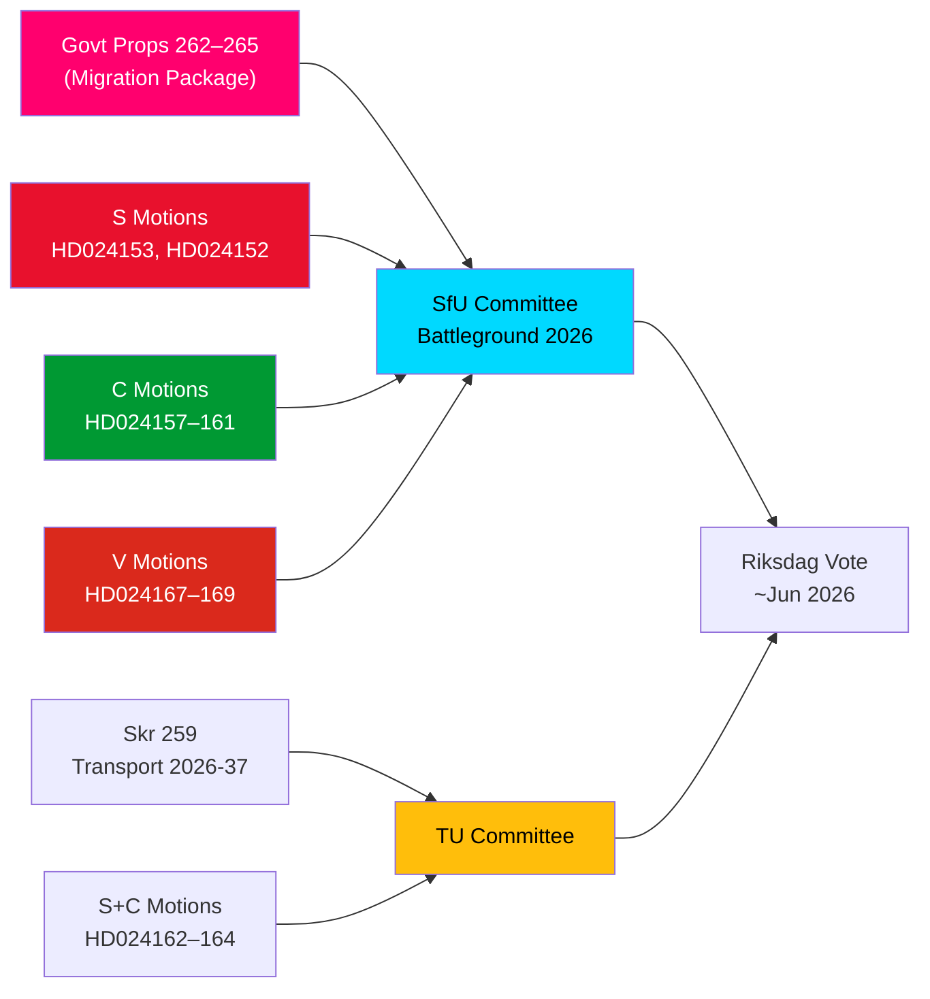

# 정보 브리핑 — 야당 발의안: 스웨덴 이민 패키지에 압박

**저자**: 제임스 페터 쇠를링  
**날짜**: 2026-05-14  
**분류**: 공개  
**신뢰도**: [B2] 아마도 사실 — 해군성 코드  
**분석 깊이**: 심층

---

## BLUF (핵심 요약)

스웨덴 릭스다그는 2026년 5월 13일 15건의 야당 발의안이라는 주목할 만한 집합을 접수했다. S, C, V 세 당이 동시에 4개 이민 강화 법안 패키지를 — riksmöte 2025/26의 법안 262–265 — 도전했다. 이 발의안들은 정부의 이민 정책 노선에 대한 상당한 의회 야당 블록을 드러낸다: S는 귀환 활동을 부분적으로 수용하지만 영구 체류 허가 폐지는 단호히 거부하고, C는 특히 구금 아동에 대한 권리 기반 보호 조치를 요구하며, V는 4개 법안 모두를 전면 반대한다. 2026-2037년 국가 교통 인프라 계획에 강화된 기후 방향을 요구하는 S·C의 3건 발의안과 함께, 2026년 5월 14일은 이민, 아동 권리, 기후-교통 정책에서 집중적인 입법 심사의 날이 됐다.

## 지원하는 핵심 결정

1. **야당의 이민 저항 실현 가능성**: 정부가 야당 수정 없이 법안 262–265 통과를 시도할 경우, S+C+V 블록(총 ~150석)은 실질적인 위원회 도전을 보장하지만, M+SD+KD 연립은 가결을 위한 실효 다수를 유지한다.
2. **구금 아동 보호 조치**: C 발의안 HD024160(barn i förvar)은 CRC 제37조와 ECHR 제5조에 따른 헌법적으로 중요한 도전을 제기한다; Lagrådet도 이미 우려를 표했다 — 이 수정 압박은 위원회 양보를 낳을 수 있다.
3. **교통 인프라의 기후 조항**: skr. 2025/26:259(국가 교통 계획 2026-2037)에 명시적 기후 적응을 요구하는 S 발의안 HD024162는 야당이 재정 논쟁에서 주도권을 잃은 후 교통 예산 과정을 기후 정책 증진에 활용할 것임을 시사한다.

## 60초 인텔리전스 요점

- **이민 블록 연대**: S, C, V가 4개 이민 법안 모두에 대해 같은 날 협조 발의안 제출 — 2021년 이후 이민에서의 드문 삼당 야당 협조. 분석적으로 이는 "발의안 클러스터 공격" — 최대한의 동시 미디어 보도를 위해 설계됐다.
- **영구 체류 허가 쟁점**: S의 기함 HD024153은 영구 체류 허가의 단계적 폐지 전체에 대한 거부를 요구한다; 기존 허가 보유자 8~10만 명 영향; AMR 협약 준수 논거 분쟁 중.
- **아동 권리 차원**: C HD024160(barn i förvar) + Lagrådet의 헌법 비판(CRC 제37조 / ECHR 제5조)이 정부 양보 공간을 만든다. 선례: 2024년 사회서비스 개혁에서 Lagrådet 지지 수정안 5개 중 2개를 정부가 수용.
- **V의 전면 반대**: Vänsterpartiet은 귀환 활동과 품행 요건을 포함한 4개 이민 법안 모두를 전면 거부. V의 전략은 선거 목적(세그먼트 4 결집)이며, 차단 목적이 아니다(다수 달성 불가).
- **연립 산술**: 정부는 176석(과반 1석)을 보유. S+C+V+MP = 173 — 과반에 2석 부족. 정부는 가결이 확실하지만 연립 의원 2명이 반대 투표할 경우 특정 수정 제안에 취약.
- **교통 인프라**: 3개 발의안(S+C)이 교통 계획 2026-2037에서 강화된 기후 방향을 요구한다; 구체적으로 프로젝트 선정 기준으로 2030년까지 교통 탄소 30% 감축 목표.
- **SfU 위원회가 전쟁터**: SfU는 4개 법안에 대한 10개 발의안을 처리한다; 위원회 일정 발표는 2026-05-20 이전 예상 — 패스트트랙 신호는 시나리오 2(수정 없는 전면 가결)를 나타낸다.

## 선도적인 미래 트리거

**72시간 내**: prop. 2025/26:262–265 청문회에 대한 SfU 위원회 일정 발표. 위원회 의장(SD/M)이 패스트트랙 일정을 발표하면 S+C+V의 야당 압박이 강화된다.

<!-- source-sha: 13fb01dbf19848515cc9696908bf9f099436e97c -->
