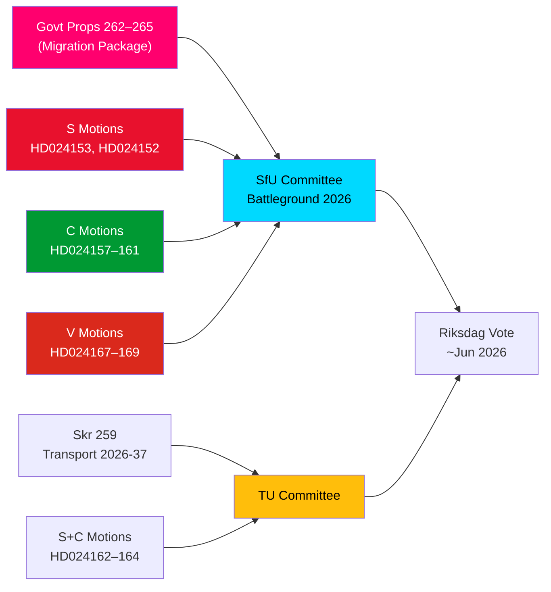

# Inlichtingenbrief — Oppositiemoties: Zweeds Migratiepakket Onder Vuur

**Auteur**: James Pether Sörling  
**Datum**: 2026-05-14  
**Classificatie**: OPENBAAR  
**Betrouwbaarheidsniveau**: [B2] Waarschijnlijk waar — Admiraliteitscode  
**Analysediepte**: Diep

---

## BLUF

Zwedens Riksdag ontving op 13 mei 2026 een opmerkelijk cluster van 15 oppositiemoties, waarbij S, C en V gelijktijdig een vierpropositionenpakket voor migratieaanscherping uitdaagden — proposities 262–265 van het riksmöte 2025/26. De moties onthullen een significant parlementair oppositieblok tegen de migratiepolitieke koers van de regering: S accepteert deels terugkeeractiviteiten maar verwerpt de afschaffing van permanente verblijfsvergunningen resoluut, C eist op rechten gebaseerde beschermingsmaatregelen met name voor kinderen in detentie, en V verzet zich volledig tegen alle vier proposities. Gecombineerd met drie moties van S en C die een sterkere klimaatoriëntatie eisen in het nationaal transportinfrastructuurplan 2026–2037, markeert 14 mei 2026 een dag van geconcentreerde wetgevende controle op het gebied van migratie, kinderrechten en klimaat-transportbeleid.

## Ondersteunde Kernbeslissingen

1. **Levensvatbaarheid van het migratieverzet van de oppositie**: Mocht de regering proberen de proposities 262–265 door te drukken zonder oppositieamendement, dan garandeert het S+C+V-blok (in totaal ~150 zetels) een substantiële commissiestrijd, hoewel de M+SD+KD-coalitie een werkbare meerderheid behoudt voor aanneming.
2. **Beschermingsmaatregelen voor kinderen in detentie**: De C-motie HD024160 (barn i förvar) legt een constitutioneel significante uitdaging neer op grond van CRC art. 37 en EVRM art. 5; de Lagrådet heeft al bezorgdheden geuit — deze amendementsdruk kan een commissieconcessie opleveren.
3. **Klimaatclausule in transportinfrastructuur**: De S-motie HD024162 die expliciete klimaataanpassing eist in skr. 2025/26:259 (nationaal transportplan 2026–2037) geeft aan dat de oppositie het transportbudgetproces zal gebruiken om klimaatbeleid te bevorderen nadat het initiatief in de financiële debatten verloren is gegaan.

## 60-Seconden Inlichtingenpunten

- **Migratiebloklsolidariteit**: S, C en V dienden op dezelfde dag gecoördineerde moties in tegen alle vier migratiepropositionen — zeldzame drieledige oppositiecoördinatie over migratie sinds 2021. Analytisch is dit een "motiesclusteraanval" — ontworpen voor maximale gelijktijdige mediaberichtgeving.
- **Permanente verblijfsvergunning als breekpunt**: S's vlaggenschip HD024153 eist afwijzing van de volledige gefaseerde afschaffing van permanente verblijfsvergunningen; 80.000–100.000 huidige vergunninghouders betrokken; het AMR-pact nalevingsargument wordt betwist.
- **Kinderrechtendimensie**: C's HD024160 (barn i förvar) + de constitutionele kritiek van de Lagrådet (CRC art. 37 / EVRM art. 5) creëert een regeringsconcessieruimte. Precedent: de sociaaldiensthervorming van 2024 waarbij de regering 2 van 5 Lagrådet-gesteunde amendementen accepteerde.
- **V's totale verzet**: Vänsterpartiet verwerpt alle vier migratieproposities volledig — inclusief terugkeeractiviteiten en gedragseisen. V's strategie is electoraal (segment 4-consolidatie), niet blokkerend (kan geen meerderheid bereiken).
- **Coalitie-rekenkunde**: De regering heeft 176 zetels (1 zetel meerderheid). S+C+V+MP = 173 — 2 onder meerderheid. De regering is zeker van aanneming, maar kwetsbaar voor specifieke amendementsvoorstellen als 2 regeringsleden tegenstemmen.
- **Transportinfrastructuur**: Drie moties (S+C) eisen een sterkere klimaatoriëntatie in het transportplan 2026–2037; specifiek een 30% CO₂-reductiedoelstelling voor transport in 2030 als projectselectiecriterium.
- **SfU als slagveld**: SfU verwerkt 10 moties tegen 4 proposities; aankondiging van de commissieplanning wordt vóór 2026-05-20 verwacht — een spoorsignaal zou Scenario 2 aangeven (volledige aanneming ongewijzigd).

## Toonaangevende Toekomstige Trigger

**Binnen 72 uur**: aankondiging van SfU's commissieplanning voor de behandeling van prop. 2025/26:262–265. Als de commissievoorzitter (SD/M) een spoedprocedure aankondigt, zal de oppositiedruk van S+C+V toenemen.

<!-- source-sha: 13fb01dbf19848515cc9696908bf9f099436e97c -->
