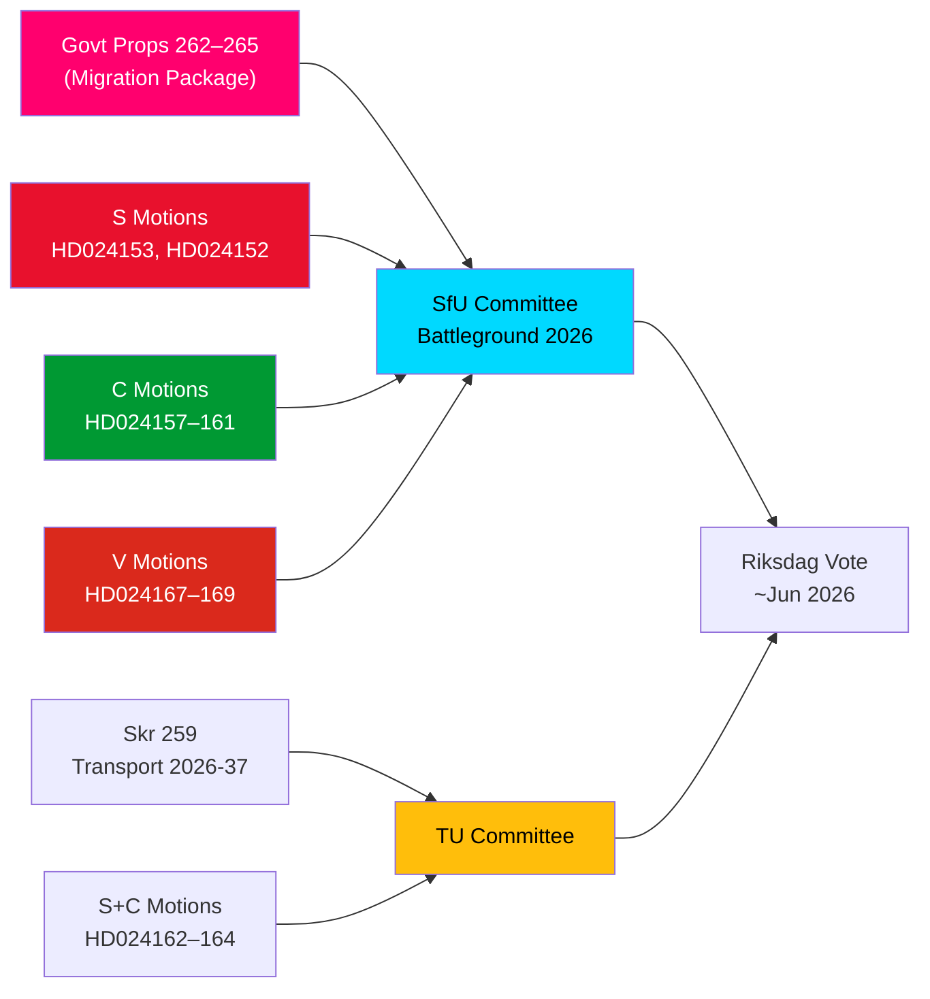

# Etterretningsbrev — Opposisjonsforslag: Sveriges migrasjonspakke under press

**Forfatter**: James Pether Sörling  
**Dato**: 2026-05-14  
**Klassifisering**: OFFENTLIG  
**Konfidensnivå**: [B2] Sannsynligvis sant — Admiralitetskoden  
**Analysedybde**: Dyp

---

## BLUF

Sveriges Riksdag mottok den 13. mai 2026 en bemerkelsesverdig samling av 15 opposisjonsforslag, der S, C og V samtidig utfordret en fire proposisjoners sterk innstrammingspakke for migrasjon — proposisjonene 262–265 i riksmøtet 2025/26. Forslagene avslører en betydelig parlamentarisk opposisjonsblokk mot regjeringens migrasjonspolitiske kurs, der S delvis godtar returaktiviteter men fast avviser avviklingen av permanente oppholdstillatelser, C krever rettighetsbaserte beskyttelsestiltak særlig for barn i forvaring, og V motsetter seg alle fire proposisjoner i sin helhet. Kombinert med tre forslag fra S og C som krever sterkere klimaorientering i den nasjonale transportinfrastrukturplanen 2026–2037, markerer 14. mai 2026 en dag med konsentrert lovgivningsmessig granskning innen migrasjon, barns rettigheter og klima-transportpolitikk.

## Støttede nøkkelbeslutninger

1. **Levedyktigheten av opposisjonens motstand mot migrasjon**: Dersom regjeringen forsøker å gjennomføre proposisjonene 262–265 uten opposisjonstillegg, garanterer S+C+V-blokken (totalt ~150 mandater) vesentlig utvalgsmotstand, men M+SD+KD-koalisjonen beholder et fungerende flertall for gjennomføring.
2. **Beskyttelsestiltak for barn i forvaring**: C's HD024160-forslag (barn i förvar) reiser en konstitusjonelt viktig utfordring etter CRC art. 37 og ECHR art. 5; Lagrådet har allerede flagget bekymringer — dette endringspress kan medføre en utvalgsinnrømmelse.
3. **Klimaklausul i transportinfrastruktur**: S's HD024162-forslag som krever eksplisitt klimatilpasning i skr. 2025/26:259 (nasjonal transportplan 2026–2037) signaliserer at opposisjonen vil bruke transportbudsjettsprosessen til å fremme klimapolitikk etter å ha mistet initiativet i finansdebattene.

## 60-sekunders etterretningspunkter

- **Migrasjonsblokk-solidaritet**: S, C og V leverte koordinerte forslag samme dag mot alle fire migrasjonssproposisjoner — sjelden trepartsopposisjonskoordinering om migrasjon siden 2021. Analytisk er dette et "forslagsklusterangrep" — designet for maksimal simultan mediedekning.
- **Permanent oppholdstillatelse som stridstema**: S's flaggskip HD024153 krever avvisning av hele utfasingen av permanente oppholdstillatelser; 80.000–100.000 eksisterende tillatelsesinnehavere berørt; AMR-paktens overholdelsesargument bestrides.
- **Barnerettighetsdimensjon**: C's HD024160 (barn i förvar) + Lagrådets konstitusjonelle kritikk (CRC art. 37 / ECHR art. 5) skaper et regjeringsinstrømmelsesrom. Presedens: 2024-sosialtjenestereformen der regjeringen aksepterte 2 av 5 Lagrådet-støttede endringer.
- **V's totale motstand**: Vänsterpartiet avviser alle fire migrasjonssproposisjoner i sin helhet — inkludert returaktiviteter og vandelkrav. V's strategi er valgbetinget (segment 4-konsolidering), ikke blokkerende (kan ikke oppnå flertall).
- **Koalisjonsmatematikk**: Regjeringen har 176 mandater (1 mandats flertall). S+C+V+MP = 173 — 2 kortere enn flertall. Regjeringen er sikker på gjennomføring, men sårbar for spesifikke endringsforslag hvis 2 regjeringsrepresentanter stemmer imot.
- **Transportinfrastruktur**: Tre forslag (S+C) krever sterkere klimaorientering i transportplanen 2026–2037; spesifikt et 30% reduksjonsmål for transportkarbondioksid innen 2030 i utvelgelseskriterier for prosjekter.
- **SfU som slagfelt**: SfU skal behandle 10 forslag mot 4 proposisjoner; kunngjøring om utvalgets tidsplan forventes innen 2026-05-20 — et hurtigsporsignal vil indikere Scenario 2 (fullstendig vedtak uendret).

## Ledende fremtidig utløser

**Innen 72 timer**: SfU's utvalgsplanleggingskunngjøring for behandling av prop. 2025/26:262–265. Hvis utvalgsformannen (SD/M) kunngjør et hurtigspor, vil opposisjonspresset fra S+C+V intensiveres.

<!-- source-sha: 13fb01dbf19848515cc9696908bf9f099436e97c -->
