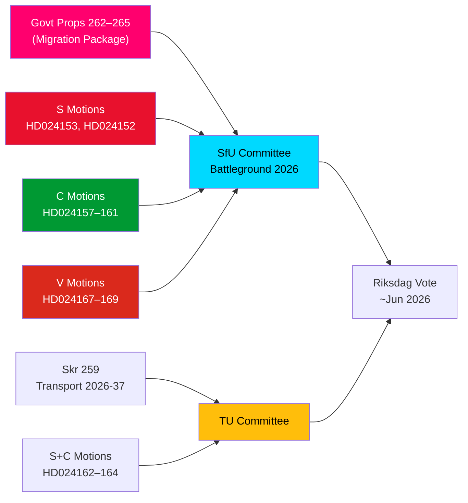

# Underrättelsebrev — Oppositionsmotioner: Sveriges migrationspaket under attack

**Författare**: James Pether Sörling  
**Datum**: 2026-05-14  
**Klassificering**: OFFENTLIG  
**Konfidensgrad**: [B2] Troligen sant — Admiraltitetskoden  
**Analysdjup**: Djupt

---

## BLUF

Sveriges riksdag mottog den 13 maj 2026 ett historiskt kluster av 15 oppositionsmotioner, där S, C och V samtidigt utmanade ett fyra propositioner starkt migrationsåtstramningspaket — propositionerna 262–265 i riksmötet 2025/26. Motionerna avslöjar ett betydande parlamentariskt oppositionsblock mot regeringens migrationspolitiska kurs, där S delvis accepterar återvändandeverksamhet men bestämt avvisar avskaffandet av permanenta uppehållstillstånd, C kräver rättighetsbaserade skyddsåtgärder särskilt för barn i förvar, och V motsätter sig samtliga fyra propositioner i sin helhet. Kombinerat med tre motioner från S och C som kräver starkare klimatinriktning i den nationella transportinfrastrukturplanen 2026–2037 markerar den 14 maj 2026 en dag med koncentrerad lagstiftningsgranskning inom migration, barns rättigheter och klimat-transportpolitik.

## Understödda nyckelBeslut

1. **Viabilitet för oppositionens migrationsmotstånd**: Bör regeringen försöka driva igenom propositionerna 262–265 utan oppositionsändringar, garanterar S+C+V-blocket (totalt ~150 mandat) substantiell utskottsutmaning, men M+SD+KD-koalitionen bibehåller en fungerande majoritet för passage.
2. **Skyddsåtgärder för barn i förvar**: C:s HD024160-motion (barn i förvar) väcker en konstitutionellt betydelsefull utmaning enligt CRC art. 37 och ECHR art. 5; Lagrådet har redan flaggat för betänkligheter — detta ändringstryck kan ge en utskottskoncession.
3. **Klimatklausul i transportinfrastruktur**: S:s HD024162-motion som kräver explicit klimatanpassning i skr. 2025/26:259 (nationell transportplan 2026–2037) signalerar att oppositionen kommer att använda transportbudgetprocessen för att driva klimatpolitik efter att ha förlorat initiativet i finansdebatten.

## 60-sekunders underrättelsekulor

- **Migrationsblockssolidaritet**: S, C och V lämnade koordinerade motioner samma dag mot samtliga fyra migrationsspropositioner — sällsynt treparts-oppositionssamordning i migrationsfrågor sedan 2021. Analytiskt är detta en "motionsklusterattack" — utformad för maximal simultant mediegenomslag.
- **Permanent uppehållstillstånd som stridsfråga**: S:s flaggskepp HD024153 kräver avslag på hela utfasningen av permanenta uppehållstillstånd; 80 000–100 000 befintliga tillståndsinnehavare berörda; AMR-paktens efterlevnadsargument omtvistas.
- **Barnrättsdimension**: C:s HD024160 (barn i förvar) + Lagrådets konstitutionella kritik (CRC art. 37 / ECHR art. 5) skapar ett koncessionsutrymme för regeringen. Prejudikat: socialtjänstreformen 2024 där regeringen accepterade 2 av 5 Lagrådsstödda ändringar.
- **V:s totala motstånd**: Vänsterpartiet avvisar samtliga fyra migrationsspropositioner i sin helhet — inklusive återvändandeverksamhet och vandelvkrav. V:s strategi är valbetonad (segment 4-konsolidering), inte blockerande (kan inte uppnå majoritet).
- **Koalitionsmatematik**: Regeringen har 176 mandat (1 mandats majoritet). S+C+V+MP = 173 — 2 kortare om majoritet. Regeringen är säker på passage men sårbar för specifika ändringsförslag om 2 regeringsledamöter röstar emot.
- **Transportinfrastruktur**: Tre motioner (S+C) kräver starkare klimatinriktning i transportplanen 2026–2037; specifikt ett 30 % minskningsmål för transportkoldioxid till 2030 i urvalskriterier för projekt.
- **SfU som slagfält**: SfU ska behandla 10 motioner mot 4 propositioner; besked om utskottets tidtabell väntas senast 2026-05-20 — en signal om snabbspår indikerar Scenario 2 (oförändrat genomförande).

## Ledande framtida utlösare

**Inom 72 timmar**: SfU:s utskottsbeslut om tidtabell för behandling av prop. 2025/26:262–265. Om utskottsordföranden (SD/M) tillkännager ett snabbspår, kommer oppositionstrycket från S+C+V att intensifieras.

<!-- source-sha: 13fb01dbf19848515cc9696908bf9f099436e97c -->
